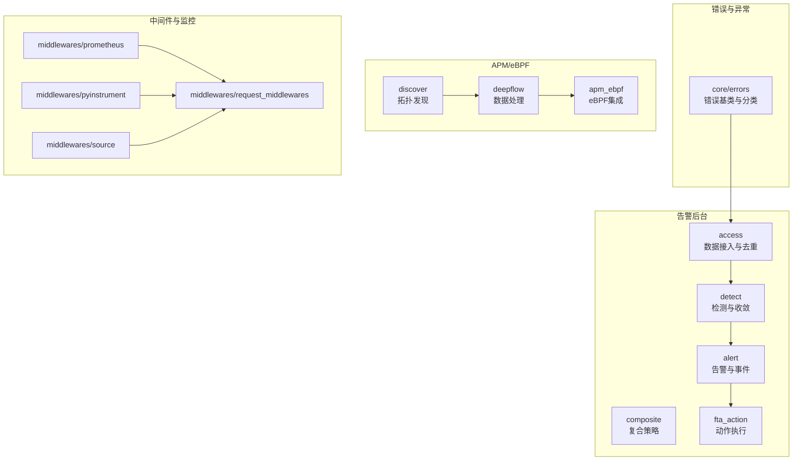
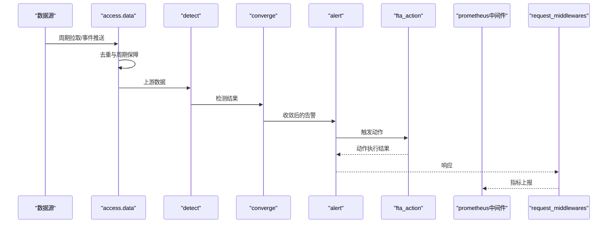
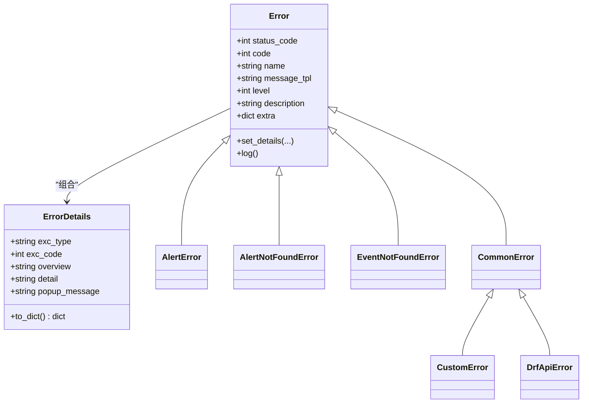
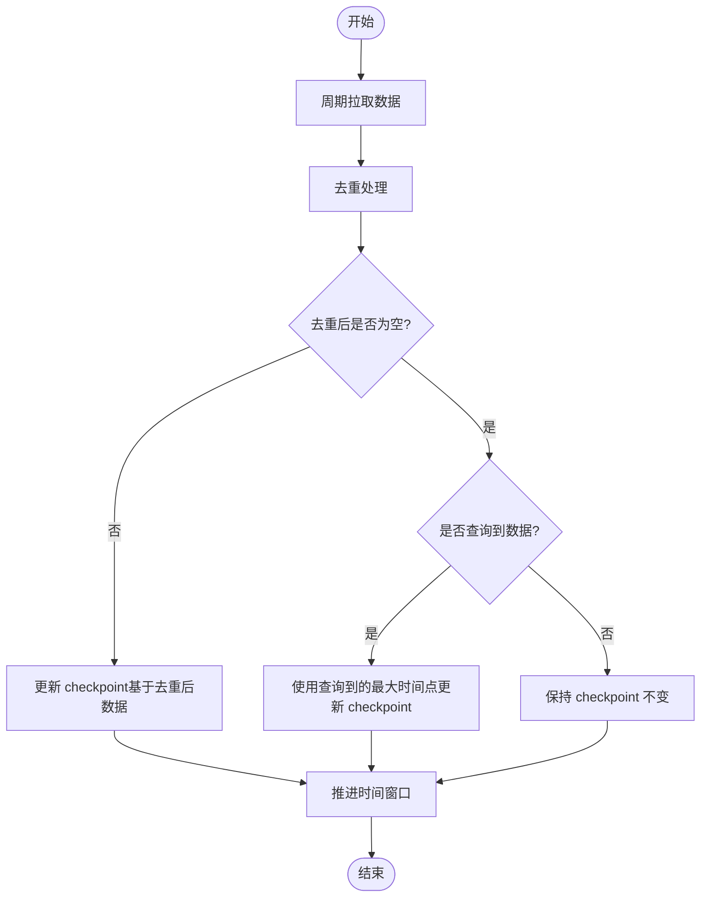
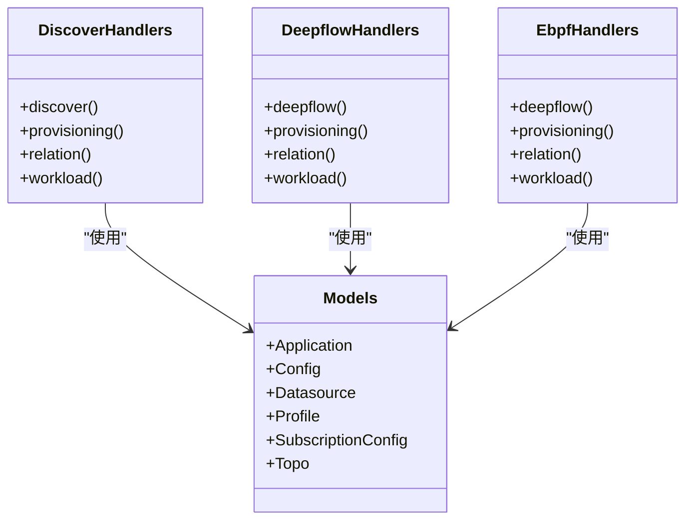
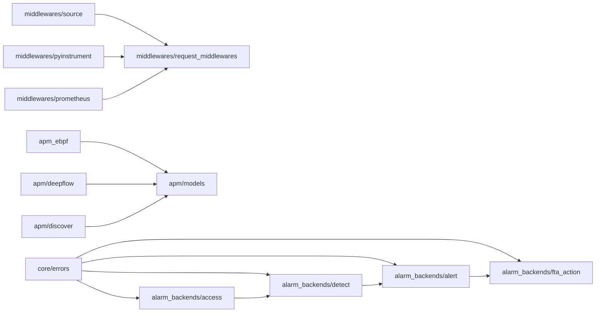

# 故障排查

<cite>
**本文引用的文件**
- [bkmonitor/core/errors/__init__.py](file://bkmonitor/core/errors/__init__.py)
- [bkmonitor/core/errors/alert.py](file://bkmonitor/core/errors/alert.py)
- [bkmonitor/core/errors/common.py](file://bkmonitor/core/errors/common.py)
- [ai-docs/bk-monitor/scenarios/troubleshooting/README.md](file://ai-docs/bk-monitor/scenarios/troubleshooting/README.md)
- [ai-docs/bk-monitor/scenarios/troubleshooting/archives/2026-01-14-告警关闭后仍触发处理问题/README.md](file://ai-docs/bk-monitor/scenarios/troubleshooting/archives/2026-01-14-告警关闭后仍触发处理问题/README.md)
- [ai-docs/bk-monitor/scenarios/troubleshooting/archives/2026-01-15-时间窗口不移动问题/README.md](file://ai-docs/bk-monitor/scenarios/troubleshooting/archives/2026-01-15-时间窗口不移动问题/README.md)
- [ai-docs/bk-monitor/docs/告警后台(alarm_backends)/PROCESS_OVER_FLOW指标说明.md](file://ai-docs/bk-monitor/docs/告警后台(alarm_backends)/PROCESS_OVER_FLOW指标说明.md)
- [ai-docs/bk-monitor/docs/告警后台(alarm_backends)/backend_alert-db迁移操作手册.md](file://ai-docs/bk-monitor/docs/告警后台(alarm_backends)/backend_alert-db迁移操作手册.md)
- [ai-docs/bk-monitor/docs/告警后台(alarm_backends)/modules/access/去重机制详解.md](file://ai-docs/bk-monitor/docs/告警后台(alarm_backends)/modules/access/去重机制详解.md)
- [ai-docs/bk-monitor/docs/告警后台(alarm_backends)/modules/access/周期拉取与数据不遗漏保障机制.md](file://ai-docs/bk-monitor/docs/告警后台(alarm_backends)/modules/access/周期拉取与数据不遗漏保障机制.md)
- [ai-docs/bk-monitor/docs/告警后台(alarm_backends)/modules/access/access.data子任务分发机制.md](file://ai-docs/bk-monitor/docs/告警后台(alarm_backends)/modules/access/access.data子任务分发机制.md)
- [ai-docs/bk-monitor/docs/告警后台(alarm_backends)/modules/access/dimension_fields_vs_dimensions.md](file://ai-docs/bk-monitor/docs/告警后台(alarm_backends)/modules/access/dimension_fields_vs_dimensions.md)
- [ai-docs/bk-monitor/docs/告警后台(alarm_backends)/modules/access/业务逻辑与数据处理流程.md](file://ai-docs/bk-monitor/docs/告警后台(alarm_backends)/modules/access/业务逻辑与数据处理流程.md)
- [ai-docs/bk-monitor/docs/告警后台(alarm_backends)/modules/alert/KubernetesCMDBEnricher处理逻辑详解.md](file://ai-docs/bk-monitor/docs/告警后台(alarm_backends)/modules/alert/KubernetesCMDBEnricher处理逻辑详解.md)
- [ai-docs/bk-monitor/docs/告警后台(alarm_backends)/modules/composite/业务逻辑与数据处理流程.md](file://ai-docs/bk-monitor/docs/告警后台(alarm_backends)/modules/composite/业务逻辑与数据处理流程.md)
- [bkmonitor/bkmonitor/management/commands/create_error_document.py](file://bkmonitor/bkmonitor/management/commands/create_error_document.py)
- [bkmonitor/metadata/health_check.py](file://bkmonitor/metadata/health_check.py)
- [bkmonitor/bkmonitor/middlewares/prometheus.py](file://bkmonitor/bkmonitor/middlewares/prometheus.py)
- [bkmonitor/bkmonitor/middlewares/pyinstrument.py](file://bkmonitor/bkmonitor/middlewares/pyinstrument.py)
- [bkmonitor/bkmonitor/middlewares/request_middlewares.py](file://bkmonitor/bkmonitor/middlewares/request_middlewares.py)
- [bkmonitor/bkmonitor/middlewares/source.py](file://bkmonitor/bkmonitor/middlewares/source.py)
- [bkmonitor/apm/core/discover/handlers/discover.py](file://bkmonitor/apm/core/discover/handlers/discover.py)
- [bkmonitor/apm/core/discover/handlers/provisioning.py](file://bkmonitor/apm/core/discover/handlers/provisioning.py)
- [bkmonitor/apm/core/discover/handlers/relation.py](file://bkmonitor/apm/core/discover/handlers/relation.py)
- [bkmonitor/apm/core/discover/handlers/workload.py](file://bkmonitor/apm/core/discover/handlers/workload.py)
- [bkmonitor/apm/core/deepflow/handlers/deepflow.py](file://bkmonitor/apm/core/deepflow/handlers/deepflow.py)
- [bkmonitor/apm/core/deepflow/handlers/provisioning.py](file://bkmonitor/apm/core/deepflow/handlers/provisioning.py)
- [bkmonitor/apm/core/deepflow/handlers/relation.py](file://bkmonitor/apm/core/deepflow/handlers/relation.py)
- [bkmonitor/apm/core/deepflow/handlers/workload.py](file://bkmonitor/apm/core/deepflow/handlers/workload.py)
- [bkmonitor/apm_ebpf/handlers/deepflow.py](file://bkmonitor/apm_ebpf/handlers/deepflow.py)
- [bkmonitor/apm_ebpf/handlers/provisioning.py](file://bkmonitor/apm_ebpf/handlers/provisioning.py)
- [bkmonitor/apm_ebpf/handlers/relation.py](file://bkmonitor/apm_ebpf/handlers/relation.py)
- [bkmonitor/apm_ebpf/handlers/workload.py](file://bkmonitor/apm_ebpf/handlers/workload.py)
- [bkmonitor/apm/migrations/0001_initial.py](file://bkmonitor/apm/migrations/0001_initial.py)
- [bkmonitor/apm/migrations/0049_subscriptionconfig_bk_tenant_id.py](file://bkmonitor/apm/migrations/0049_subscriptionconfig_bk_tenant_id.py)
- [bkmonitor/apm/migrations/0052_add_profiledatasource_v4.py](file://bkmonitor/apm/migrations/0052_add_profiledatasource_v4.py)
- [bkmonitor/apm/models/application.py](file://bkmonitor/apm/models/application.py)
- [bkmonitor/apm/models/config.py](file://bkmonitor/apm/models/config.py)
- [bkmonitor/apm/models/datasource.py](file://bkmonitor/apm/models/datasource.py)
- [bkmonitor/apm/models/profile.py](file://bkmonitor/apm/models/profile.py)
- [bkmonitor/apm/models/subscription_config.py](file://bkmonitor/apm/models/subscription_config.py)
- [bkmonitor/apm/models/topo.py](file://bkmonitor/apm/models/topo.py)
- [bkmonitor/apm/utils/es_search.py](file://bkmonitor/apm/utils/es_search.py)
- [bkmonitor/apm/utils/report_event.py](file://bkmonitor/apm/utils/report_event.py)
- [bkmonitor/apm/utils/time.py](file://bkmonitor/apm/utils/time.py)
- [bkmonitor/apm/utils/ui_optimizations.py](file://bkmonitor/apm/utils/ui_optimizations.py)
- [bkmonitor/apm/views.py](file://bkmonitor/apm/views.py)
- [bkmonitor/apm/urls.py](file://bkmonitor/apm/urls.py)
- [bkmonitor/apm/constants.py](file://bkmonitor/apm/constants.py)
- [bkmonitor/apm/resources.py](file://bkmonitor/apm/resources.py)
- [bkmonitor/apm/serializers.py](file://bkmonitor/apm/serializers.py)
- [bkmonitor/apm/types.py](file://bkmonitor/apm/types.py)
- [bkmonitor/apm/admin.py](file://bkmonitor/apm/admin.py)
- [bkmonitor/apm/apps.py](file://bkmonitor/apm/apps.py)
- [bkmonitor/apm/task/tasks.py](file://bkmonitor/apm/task/tasks.py)
- [bkmonitor/apm_ebpf/task/tasks.py](file://bkmonitor/apm_ebpf/task/tasks.py)
- [bkmonitor/apm_ebpf/migrations/0001_initial.py](file://bkmonitor/apm_ebpf/migrations/0001_initial.py)
- [bkmonitor/apm_ebpf/migrations/0005_deepflowdashboardrecord.py](file://bkmonitor/apm_ebpf/migrations/0005_deepflowdashboardrecord.py)
- [bkmonitor/apm_ebpf/models/workload.py](file://bkmonitor/apm_ebpf/models/workload.py)
- [bkmonitor/apm_ebpf/constants.py](file://bkmonitor/apm_ebpf/constants.py)
- [bkmonitor/apm_ebpf/resource.py](file://bkmonitor/apm_ebpf/resource.py)
- [bkmonitor/apm_ebpf/apps.py](file://bkmonitor/apm_ebpf/apps.py)
- [bkmonitor/apm_ebpf/admin.py](file://bkmonitor/apm_ebpf/admin.py)
- [bkmonitor/apm_ebpf/utils/base.py](file://bkmonitor/apm_ebpf/utils/base.py)
- [bkmonitor/apm_ebpf/utils/report_event.py](file://bkmonitor/apm_ebpf/utils/report_event.py)
- [bkmonitor/apm_ebpf/utils/time.py](file://bkmonitor/apm_ebpf/utils/time.py)
- [bkmonitor/apm_ebpf/utils/ui_optimizations.py](file://bkmonitor/apm_ebpf/utils/ui_optimizations.py)
- [bkmonitor/apm_ebpf/utils/es_search.py](file://bkmonitor/apm_ebpf/utils/es_search.py)
- [bkmonitor/apm_ebpf/utils/provisioning.py](file://bkmonitor/apm_ebpf/utils/provisioning.py)
- [bkmonitor/apm_ebpf/utils/deepflow.py](file://bkmonitor/apm_ebpf/utils/deepflow.py)
- [bkmonitor/apm_ebpf/utils/relation.py](file://bkmonitor/apm_ebpf/utils/relation.py)
- [bkmonitor/apm_ebpf/utils/workload.py](file://bkmonitor/apm_ebpf/utils/workload.py)
- [bkmonitor/apm_ebpf/utils/report_event.py](file://bkmonitor/apm_ebpf/utils/report_event.py)
- [bkmonitor/apm_ebpf/utils/time.py](file://bkmonitor/apm_ebpf/utils/time.py)
- [bkmonitor/apm_ebpf/utils/ui_optimizations.py](file://bkmonitor/apm_ebpf/utils/ui_optimizations.py)
- [bkmonitor/apm_ebpf/utils/es_search.py](file://bkmonitor/apm_ebpf/utils/es_search.py)
- [bkmonitor/apm_ebpf/utils/provisioning.py](file://bkmonitor/apm_ebpf/utils/provisioning.py)
- [bkmonitor/apm_ebpf/utils/deepflow.py](file://bkmonitor/apm_ebpf/utils/deepflow.py)
- [bkmonitor/apm_ebpf/utils/relation.py](file://bkmonitor/apm_ebpf/utils/relation.py)
- [bkmonitor/apm_ebpf/utils/workload.py](file://bkmonitor/apm_ebpf/utils/workload.py)
- [bkmonitor/apm_ebpf/utils/report_event.py](file://bkmonitor/apm_ebpf/utils/report_event.py)
- [bkmonitor/apm_ebpf/utils/time.py](file://bkmonitor/apm_ebpf/utils/time.py)
- [bkmonitor/apm_ebpf/utils/ui_optimizations.py](file://bkmonitor/apm_ebpf/utils/ui_optimizations.py)
- [bkmonitor/apm_ebpf/utils/es_search.py](file://bkmonitor/apm_ebpf/utils/es_search.py)
- [bkmonitor/apm_ebpf/utils/provisioning.py](file://bkmonitor/apm_ebpf/utils/provisioning.py)
- [bkmonitor/apm_ebpf/utils/deepflow.py](file://bkmonitor/apm_ebpf/utils/deepflow.py)
- [bkmonitor/apm_ebpf/utils/relation.py](file://bkmonitor/apm_ebpf/utils/relation.py)
- [bkmonitor/apm_ebpf/utils/workload.py](file://bkmonitor/apm_ebpf/utils/workload.py)
- [bkmonitor/apm_ebpf/utils/report_event.py](file://bkmonitor/apm_ebpf/utils/report_event.py)
- [bkmonitor/apm_ebpf/utils/time.py](file://bkmonitor/apm_ebpf/utils/time.py)
- [bkmonitor/apm_ebpf/utils/ui_optimizations.py](file://bkmonitor/apm_ebpf/utils/ui_optimizations.py)
- [bkmonitor/apm_ebpf/utils/es_search.py](file://bkmonitor/apm_ebpf/utils/es_search.py)
- [bkmonitor/apm_ebpf/utils/provisioning.py](file://bkmonitor/apm_ebpf/utils/provisioning.py)
- [bkmonitor/apm_ebpf/utils/deepflow.py](file://bkmonitor/apm_ebpf/utils/deepflow.py)
- [bkmonitor/apm_ebpf/utils/relation.py](file://bkmonitor/apm_ebpf/utils/relation.py)
- [bkmonitor/apm_ebpf/utils/workload.py](file://bkmonitor/apm_ebpf/utils/workload.py)
- [bkmonitor/apm_ebpf/utils/report_event.py](file://bkmonitor/apm_ebpf/utils/report_event.py)
- [bkmonitor/apm_ebpf/utils/time.py](file://bkmonitor/apm_ebpf/utils/time.py)
- [bkmonitor/apm_ebpf/utils/ui_optimizations.py](file://bkmonitor/apm_ebpf/utils/ui_optimizations.py)
- [bkmonitor/apm_ebpf/utils/es_search.py](file://bkmonitor/apm_ebpf/utils/es_search.py)
- [bkmonitor/apm_ebpf/utils/provisioning.py](file://bkmonitor/apm_ebpf/utils/provisioning.py)
- [bkmonitor/apm_ebpf/utils/deepflow.py](file://bkmonitor/apm_ebpf/utils/deepflow.py)
- [bkmonitor/apm_ebpf/utils/relation.py](file://bkmonitor/apm_ebpf/utils/relation.py)
- [bkmonitor/apm_ebpf/utils/workload.py](file://bkmonitor/apm_ebpf/utils/workload.py)
- [bkmonitor/apm_ebpf/utils/report_event.py](file://bkmonitor/apm_ebpf/utils/report_event.py)
- [bkmonitor/apm_ebpf/utils/time.py](file://bkmonitor/apm_ebpf/utils/time.py)
- [bkmonitor/apm_ebpf/utils/ui_optimizations.py](file://bkmonitor/apm_ebpf/utils/ui_optimizations.py)
- [bkmonitor/apm_ebpf/utils/es_search.py](file://bkmonitor/apm_ebpf/utils/es_search.py)
- [bkmonitor/apm_ebpf/utils/provisioning.py](file://bkmonitor/apm_ebpf/utils/provisioning.py)
- [bkmonitor/apm_ebpf/utils/deepflow.py](file://bkmonitor/apm_ebpf/utils/deepflow.py)
- [bkmonitor/apm_ebpf/utils/relation.py](file://bkmonitor/apm_ebpf/utils/relation.py)
- [bkmonitor/apm_ebpf/utils/workload.py](file://bkmonitor/apm_ebpf/utils/workload.py)
- [bkmonitor/apm_ebpf/utils/report_event.py](file://bkmonitor/apm_ebpf/utils/report_event.py)
- [bkmonitor/apm_ebpf/utils/time.py](file://bkmonitor/apm_ebpf/utils/time.py)
- [bkmonitor/apm_ebpf/utils/ui_optimizations.py](file://bkmonitor/apm_ebpf/utils/ui_optimizations.py)
- [bkmonitor/apm_ebpf/utils/es_search.py](file://bkmonitor/apm_ebpf/utils/es_search.py)
- [bkmonitor/apm_ebpf/utils/provisioning.py](file://bkmonitor/apm_ebpf/utils/provisioning.py)
- [bkmonitor/apm_ebpf/utils/deepflow.py](file://bkmonitor/apm_ebpf......)
</cite>

## 目录
1. [简介](#简介)
2. [项目结构](#项目结构)
3. [核心组件](#核心组件)
4. [架构总览](#架构总览)
5. [详细组件分析](#详细组件分析)
6. [依赖分析](#依赖分析)
7. [性能考量](#性能考量)
8. [故障排查指南](#故障排查指南)
9. [结论](#结论)
10. [附录](#附录)

## 简介
本指南面向运维与开发人员，聚焦于蓝鲸监控平台（bk-monitor）的故障排查与应急处置。内容涵盖常见问题诊断方法、日志分析技巧、性能优化建议、紧急处理流程、系统监控指标解读、错误码含义说明、异常情况处理与系统恢复方法，并提供调试工具使用、问题定位步骤与解决方案汇总，以及运维最佳实践与预防性维护建议。

## 项目结构
本仓库采用多模块分层组织，核心模块包括：
- 错误体系与统一异常处理：bkmonitor/core/errors
- 告警后台（alarm_backends）：包含数据接入、检测、收敛、告警、FTA动作等模块
- APM 与 eBPF：拓扑发现、数据源、配置、探针等
- 中间件与监控：Prometheus 指标、请求链路追踪、性能分析中间件
- 健康检查与命令：健康检查、错误文档生成命令等

图表来源
- [bkmonitor/core/errors/__init__.py:39-112](file://bkmonitor/core/errors/__init__.py#L39-L112)
- [ai-docs/bk-monitor/docs/告警后台(alarm_backends)/modules/access/业务逻辑与数据处理流程.md](file://ai-docs/bk-monitor/docs/告警后台(alarm_backends)/modules/access/业务逻辑与数据处理流程.md)
- [ai-docs/bk-monitor/docs/告警后台(alarm_backends)/modules/composite/业务逻辑与数据处理流程.md](file://ai-docs/bk-monitor/docs/告警后台(alarm_backends)/modules/composite/业务逻辑与数据处理流程.md)
- [bkmonitor/bkmonitor/middlewares/prometheus.py](file://bkmonitor/bkmonitor/middlewares/prometheus.py)
- [bkmonitor/bkmonitor/middlewares/pyinstrument.py](file://bkmonitor/bkmonitor/middlewares/pyinstrument.py)
- [bkmonitor/bkmonitor/middlewares/request_middlewares.py](file://bkmonitor/bkmonitor/middlewares/request_middlewares.py)
- [bkmonitor/bkmonitor/middlewares/source.py](file://bkmonitor/bkmonitor/middlewares/source.py)

章节来源
- [ai-docs/bk-monitor/scenarios/troubleshooting/README.md:1-29](file://ai-docs/bk-monitor/scenarios/troubleshooting/README.md#L1-L29)

## 核心组件
- 错误体系与日志输出：统一的 Error 基类与 ErrorDetails 结构，支持按级别输出日志、构造前端可读的错误详情。
- 告警后台：数据接入（access）、检测（detect）、收敛（converge）、告警（alert）、FTA 动作（fta_action），形成完整的告警处理闭环。
- APM 与 eBPF：拓扑发现、数据源与配置、DeepFlow 数据处理、eBPF 探针集成。
- 中间件与监控：Prometheus 指标、请求链路追踪、性能分析中间件，辅助定位性能瓶颈与异常路径。

章节来源
- [bkmonitor/core/errors/__init__.py:19-112](file://bkmonitor/core/errors/__init__.py#L19-L112)
- [bkmonitor/core/errors/alert.py:17-79](file://bkmonitor/core/errors/alert.py#L17-L79)
- [bkmonitor/core/errors/common.py:23-84](file://bkmonitor/core/errors/common.py#L23-L84)
- [ai-docs/bk-monitor/docs/告警后台(alarm_backends)/modules/access/业务逻辑与数据处理流程.md](file://ai-docs/bk-monitor/docs/告警后台(alarm_backends)/modules/access/业务逻辑与数据处理流程.md)
- [ai-docs/bk-monitor/docs/告警后台(alarm_backends)/modules/composite/业务逻辑与数据处理流程.md](file://ai-docs/bk-monitor/docs/告警后台(alarm_backends)/modules/composite/业务逻辑与数据处理流程.md)

## 架构总览
下图展示告警后台从数据接入到动作执行的关键路径，以及与中间件、监控的交互关系。

图表来源
- [ai-docs/bk-monitor/docs/告警后台(alarm_backends)/modules/access/周期拉取与数据不遗漏保障机制.md](file://ai-docs/bk-monitor/docs/告警后台(alarm_backends)/modules/access/周期拉取与数据不遗漏保障机制.md)
- [ai-docs/bk-monitor/docs/告警后台(alarm_backends)/modules/access/去重机制详解.md](file://ai-docs/bk-monitor/docs/告警后台(alarm_backends)/modules/access/去重机制详解.md)
- [ai-docs/bk-monitor/docs/告警后台(alarm_backends)/modules/alert/KubernetesCMDBEnricher处理逻辑详解.md](file://ai-docs/bk-monitor/docs/告警后台(alarm_backends)/modules/alert/KubernetesCMDBEnricher处理逻辑详解.md)
- [bkmonitor/bkmonitor/middlewares/prometheus.py](file://bkmonitor/bkmonitor/middlewares/prometheus.py)
- [bkmonitor/bkmonitor/middlewares/request_middlewares.py](file://bkmonitor/bkmonitor/middlewares/request_middlewares.py)

## 详细组件分析

### 组件A：错误体系与日志输出
- 错误基类与错误详情：统一错误封装，支持状态码、错误码、概述、详情与弹窗提示类型；日志输出根据级别选择对应方法。
- 告警模块错误与通用错误：分别覆盖告警查询、事件、AIOps接入等场景的错误码与消息模板。
- 日志分析要点：结合前端错误详情结构，定位错误类型与来源模块；通过日志级别判断严重程度。

图表来源
- [bkmonitor/core/errors/__init__.py:19-112](file://bkmonitor/core/errors/__init__.py#L19-L112)
- [bkmonitor/core/errors/alert.py:17-79](file://bkmonitor/core/errors/alert.py#L17-L79)
- [bkmonitor/core/errors/common.py:23-84](file://bkmonitor/core/errors/common.py#L23-L84)

章节来源
- [bkmonitor/core/errors/__init__.py:19-112](file://bkmonitor/core/errors/__init__.py#L19-L112)
- [bkmonitor/core/errors/alert.py:17-79](file://bkmonitor/core/errors/alert.py#L17-L79)
- [bkmonitor/core/errors/common.py:23-84](file://bkmonitor/core/errors/common.py#L23-L84)

### 组件B：告警后台（access.detect.alert.fta_action）
- 数据接入与去重：周期拉取、去重机制、数据不遗漏保障，防止 checkpoint 不推进导致的时间窗口死循环。
- 告警与事件：Kubernetes CMDB 增强、维度字段与维度映射、事件与告警的生命周期管理。
- FTA 动作：动作创建与容忍时间判断，需严格匹配状态与信号类型，避免状态关闭后仍触发处理。

图表来源
- [ai-docs/bk-monitor/docs/告警后台(alarm_backends)/modules/access/去重机制详解.md](file://ai-docs/bk-monitor/docs/告警后台(alarm_backends)/modules/access/去重机制详解.md)
- [ai-docs/bk-monitor/docs/告警后台(alarm_backends)/modules/access/周期拉取与数据不遗漏保障机制.md](file://ai-docs/bk-monitor/docs/告警后台(alarm_backends)/modules/access/周期拉取与数据不遗漏保障机制.md)
- [ai-docs/bk-monitor/scenarios/troubleshooting/archives/2026-01-15-时间窗口不移动问题/README.md:32-112](file://ai-docs/bk-monitor/scenarios/troubleshooting/archives/2026-01-15-时间窗口不移动问题/README.md#L32-L112)

章节来源
- [ai-docs/bk-monitor/docs/告警后台(alarm_backends)/modules/access/去重机制详解.md](file://ai-docs/bk-monitor/docs/告警后台(alarm_backends)/modules/access/去重机制详解.md)
- [ai-docs/bk-monitor/docs/告警后台(alarm_backends)/modules/access/周期拉取与数据不遗漏保障机制.md](file://ai-docs/bk-monitor/docs/告警后台(alarm_backends)/modules/access/周期拉取与数据不遗漏保障机制.md)
- [ai-docs/bk-monitor/docs/告警后台(alarm_backends)/modules/alert/KubernetesCMDBEnricher处理逻辑详解.md](file://ai-docs/bk-monitor/docs/告警后台(alarm_backends)/modules/alert/KubernetesCMDBEnricher处理逻辑详解.md)
- [ai-docs/bk-monitor/docs/告警后台(alarm_backends)/modules/composite/业务逻辑与数据处理流程.md](file://ai-docs/bk-monitor/docs/告警后台(alarm_backends)/modules/composite/业务逻辑与数据处理流程.md)
- [ai-docs/bk-monitor/scenarios/troubleshooting/archives/2026-01-14-告警关闭后仍触发处理问题/README.md:37-87](file://ai-docs/bk-monitor/scenarios/troubleshooting/archives/2026-01-14-告警关闭后仍触发处理问题/README.md#L37-L87)

### 组件C：APM 与 eBPF
- 拓扑发现与数据源：discover、deepflow、apm_ebpf 的处理器与资源，支持工作负载、关系、配置与探针的动态管理。
- 数据模型与工具：应用、配置、数据源、画像、订阅配置、拓扑模型，以及 ES 查询、事件上报、时间工具等。

图表来源
- [bkmonitor/apm/core/discover/handlers/discover.py](file://bkmonitor/apm/core/discover/handlers/discover.py)
- [bkmonitor/apm/core/discover/handlers/provisioning.py](file://bkmonitor/apm/core/discover/handlers/provisioning.py)
- [bkmonitor/apm/core/discover/handlers/relation.py](file://bkmonitor/apm/core/discover/handlers/relation.py)
- [bkmonitor/apm/core/discover/handlers/workload.py](file://bkmonitor/apm/core/discover/handlers/workload.py)
- [bkmonitor/apm/core/deepflow/handlers/deepflow.py](file://bkmonitor/apm/core/deepflow/handlers/deepflow.py)
- [bkmonitor/apm/core/deepflow/handlers/provisioning.py](file://bkmonitor/apm/core/deepflow/handlers/provisioning.py)
- [bkmonitor/apm/core/deepflow/handlers/relation.py](file://bkmonitor/apm/core/deepflow/handlers/relation.py)
- [bkmonitor/apm/core/deepflow/handlers/workload.py](file://bkmonitor/apm/core/deepflow/handlers/workload.py)
- [bkmonitor/apm_ebpf/handlers/deepflow.py](file://bkmonitor/apm_ebpf/handlers/deepflow.py)
- [bkmonitor/apm_ebpf/handlers/provisioning.py](file://bkmonitor/apm_ebpf/handlers/provisioning.py)
- [bkmonitor/apm_ebpf/handlers/relation.py](file://bkmonitor/apm_ebpf/handlers/relation.py)
- [bkmonitor/apm_ebpf/handlers/workload.py](file://bkmonitor/apm_ebpf/handlers/workload.py)
- [bkmonitor/apm/models/application.py](file://bkmonitor/apm/models/application.py)
- [bkmonitor/apm/models/config.py](file://bkmonitor/apm/models/config.py)
- [bkmonitor/apm/models/datasource.py](file://bkmonitor/apm/models/datasource.py)
- [bkmonitor/apm/models/profile.py](file://bkmonitor/apm/models/profile.py)
- [bkmonitor/apm/models/subscription_config.py](file://bkmonitor/apm/models/subscription_config.py)
- [bkmonitor/apm/models/topo.py](file://bkmonitor/apm/models/topo.py)

章节来源
- [bkmonitor/apm/core/discover/handlers/discover.py](file://bkmonitor/apm/core/discover/handlers/discover.py)
- [bkmonitor/apm/core/discover/handlers/provisioning.py](file://bkmonitor/apm/core/discover/handlers/provisioning.py)
- [bkmonitor/apm/core/discover/handlers/relation.py](file://bkmonitor/apm/core/discover/handlers/relation.py)
- [bkmonitor/apm/core/discover/handlers/workload.py](file://bkmonitor/apm/core/discover/handlers/workload.py)
- [bkmonitor/apm/core/deepflow/handlers/deepflow.py](file://bkmonitor/apm/core/deepflow/handlers/deepflow.py)
- [bkmonitor/apm/core/deepflow/handlers/provisioning.py](file://bkmonitor/apm/core/deepflow/handlers/provisioning.py)
- [bkmonitor/apm/core/deepflow/handlers/relation.py](file://bkmonitor/apm/core/deepflow/handlers/relation.py)
- [bkmonitor/apm/core/deepflow/handlers/workload.py](file://bkmonitor/apm/core/deepflow/handlers/workload.py)
- [bkmonitor/apm_ebpf/handlers/deepflow.py](file://bkmonitor/apm_ebpf/handlers/deepflow.py)
- [bkmonitor/apm_ebpf/handlers/provisioning.py](file://bkmonitor/apm_ebpf/handlers/provisioning.py)
- [bkmonitor/apm_ebpf/handlers/relation.py](file://bkmonitor/apm_ebpf/handlers/relation.py)
- [bkmonitor/apm_ebpf/handlers/workload.py](file://bkmonitor/apm_ebpf/handlers/workload.py)
- [bkmonitor/apm/models/application.py](file://bkmonitor/apm/models/application.py)
- [bkmonitor/apm/models/config.py](file://bkmonitor/apm/models/config.py)
- [bkmonitor/apm/models/datasource.py](file://bkmonitor/apm/models/datasource.py)
- [bkmonitor/apm/models/profile.py](file://bkmonitor/apm/models/profile.py)
- [bkmonitor/apm/models/subscription_config.py](file://bkmonitor/apm/models/subscription_config.py)
- [bkmonitor/apm/models/topo.py](file://bkmonitor/apm/models/topo.py)

## 依赖分析
- 组件内聚与耦合：错误体系作为横切能力被各模块复用；告警后台内部以数据流驱动，模块间通过清晰的输入输出接口耦合；APM/eBPF 与数据模型解耦，通过处理器与资源进行协作。
- 外部依赖与集成：Prometheus 中间件用于指标采集；请求中间件负责链路追踪与性能分析；健康检查模块提供系统可用性探测。

图表来源
- [bkmonitor/core/errors/__init__.py:39-112](file://bkmonitor/core/errors/__init__.py#L39-L112)
- [ai-docs/bk-monitor/docs/告警后台(alarm_backends)/modules/access/业务逻辑与数据处理流程.md](file://ai-docs/bk-monitor/docs/告警后台(alarm_backends)/modules/access/业务逻辑与数据处理流程.md)
- [bkmonitor/bkmonitor/middlewares/prometheus.py](file://bkmonitor/bkmonitor/middlewares/prometheus.py)
- [bkmonitor/bkmonitor/middlewares/pyinstrument.py](file://bkmonitor/bkmonitor/middlewares/pyinstrument.py)
- [bkmonitor/bkmonitor/middlewares/request_middlewares.py](file://bkmonitor/bkmonitor/middlewares/request_middlewares.py)
- [bkmonitor/bkmonitor/middlewares/source.py](file://bkmonitor/bkmonitor/middlewares/source.py)
- [bkmonitor/apm/core/discover/handlers/discover.py](file://bkmonitor/apm/core/discover/handlers/discover.py)
- [bkmonitor/apm/core/deepflow/handlers/deepflow.py](file://bkmonitor/apm/core/deepflow/handlers/deepflow.py)
- [bkmonitor/apm_ebpf/handlers/deepflow.py](file://bkmonitor/apm_ebpf/handlers/deepflow.py)

章节来源
- [bkmonitor/core/errors/__init__.py:39-112](file://bkmonitor/core/errors/__init__.py#L39-L112)
- [bkmonitor/bkmonitor/middlewares/prometheus.py](file://bkmonitor/bkmonitor/middlewares/prometheus.py)
- [bkmonitor/bkmonitor/middlewares/pyinstrument.py](file://bkmonitor/bkmonitor/middlewares/pyinstrument.py)
- [bkmonitor/bkmonitor/middlewares/request_middlewares.py](file://bkmonitor/bkmonitor/middlewares/request_middlewares.py)
- [bkmonitor/bkmonitor/middlewares/source.py](file://bkmonitor/bkmonitor/middlewares/source.py)

## 性能考量
- 指标采集与上报：通过 Prometheus 中间件对关键路径进行指标埋点，便于定位热点与异常。
- 请求链路追踪：结合 pyinstrument 进行性能分析，识别慢调用与阻塞点。
- 数据处理窗口推进：确保去重后“查询到数据但全部被去重”的场景也能推进 checkpoint，避免时间窗口停滞导致的性能退化。

章节来源
- [bkmonitor/bkmonitor/middlewares/prometheus.py](file://bkmonitor/bkmonitor/middlewares/prometheus.py)
- [bkmonitor/bkmonitor/middlewares/pyinstrument.py](file://bkmonitor/bkmonitor/middlewares/pyinstrument.py)
- [ai-docs/bk-monitor/scenarios/troubleshooting/archives/2026-01-15-时间窗口不移动问题/README.md:132-181](file://ai-docs/bk-monitor/scenarios/troubleshooting/archives/2026-01-15-时间窗口不移动问题/README.md#L132-L181)

## 故障排查指南

### 一、常见问题诊断方法
- 告警关闭后仍触发处理
  - 现象：告警状态为 CLOSED 时，FTA 动作仍发送 ABNORMAL 信号并触发通知。
  - 根因：容忍时间判断逻辑缺陷，状态不匹配时仍可能创建动作；CompositeProcessor 在告警失效后再次发送 ABNORMAL 信号。
  - 处理：修复容忍时间判断逻辑；优化 Alert.get() 一致性；完善缓存更新失败处理与监控。
  
  章节来源
  - [ai-docs/bk-monitor/scenarios/troubleshooting/archives/2026-01-14-告警关闭后仍触发处理问题/README.md:37-87](file://ai-docs/bk-monitor/scenarios/troubleshooting/archives/2026-01-14-告警关闭后仍触发处理问题/README.md#L37-L87)

- 时间窗口不移动（死循环）
  - 现象：查询返回数据但全部被去重，checkpoint 不更新，时间窗口固定不动。
  - 根因：checkpoint 更新逻辑未区分“查询到数据但全部被去重”与“查询无数据”。
  - 处理：在去重阶段记录查询到数据的最大时间点；在 push 中基于查询到的最大时间点更新 checkpoint。
  
  章节来源
  - [ai-docs/bk-monitor/scenarios/troubleshooting/archives/2026-01-15-时间窗口不移动问题/README.md:32-112](file://ai-docs/bk-monitor/scenarios/troubleshooting/archives/2026-01-15-时间窗口不移动问题/README.md#L32-L112)

### 二、日志分析技巧
- 错误详情结构：前端展示的错误详情包含类型、错误码、概述、详情与弹窗提示类型，便于快速定位模块与问题等级。
- 日志级别：根据错误对象的日志级别选择对应日志方法，确保异常与错误能被正确记录。
- APM 与 eBPF：结合请求中间件与性能分析中间件，定位慢调用与异常路径。

章节来源
- [bkmonitor/core/errors/__init__.py:19-112](file://bkmonitor/core/errors/__init__.py#L19-L112)
- [bkmonitor/bkmonitor/middlewares/request_middlewares.py](file://bkmonitor/bkmonitor/middlewares/request_middlewares.py)
- [bkmonitor/bkmonitor/middlewares/pyinstrument.py](file://bkmonitor/bkmonitor/middlewares/pyinstrument.py)

### 三、性能优化建议
- 指标先行：在功能实现的同时实施监控，关键逻辑上报指标，异常情况设置告警规则。
- 测试覆盖：绘制数据流图，识别所有可能分支，对“空状态”的多种成因编写测试用例。
- 设计原则：Checkpoint 应记录“数据查询到哪里了”，而非“数据处理到哪里了”。

章节来源
- [ai-docs/bk-monitor/scenarios/troubleshooting/archives/2026-01-15-时间窗口不移动问题/README.md:132-181](file://ai-docs/bk-monitor/scenarios/troubleshooting/archives/2026-01-15-时间窗口不移动问题/README.md#L132-L181)

### 四、紧急处理流程
- 快速隔离：确认问题类型与影响范围，必要时临时关闭相关动作或策略。
- 修复上线：优先修复容忍时间判断与 checkpoint 推进逻辑，提交代码审查并通过测试。
- 验证回滚：在预生产环境验证修复效果，如出现副作用，准备回滚预案。

章节来源
- [ai-docs/bk-monitor/scenarios/troubleshooting/archives/2026-01-14-告警关闭后仍触发处理问题/README.md:69-87](file://ai-docs/bk-monitor/scenarios/troubleshooting/archives/2026-01-14-告警关闭后仍触发处理问题/README.md#L69-L87)
- [ai-docs/bk-monitor/scenarios/troubleshooting/archives/2026-01-15-时间窗口不移动问题/README.md:60-112](file://ai-docs/bk-monitor/scenarios/troubleshooting/archives/2026-01-15-时间窗口不移动问题/README.md#L60-L112)

### 五、系统监控指标解读
- PROCESS_OVER_FLOW 指标：参考告警后台文档中的 PROCESS_OVER_FLOW 指标说明，识别处理队列积压与过载风险。
- Prometheus 指标：结合中间件埋点，观察关键路径耗时、错误率与队列长度等指标。

章节来源
- [ai-docs/bk-monitor/docs/告警后台(alarm_backends)/PROCESS_OVER_FLOW指标说明.md](file://ai-docs/bk-monitor/docs/告警后台(alarm_backends)/PROCESS_OVER_FLOW指标说明.md)
- [bkmonitor/bkmonitor/middlewares/prometheus.py](file://bkmonitor/bkmonitor/middlewares/prometheus.py)

### 六、错误码含义说明
- 告警模块错误：告警模块通用错误，状态码 500，错误码 3324001。
- 告警不存在/事件不存在：状态码 404，错误码 3324002。
- 查询语法错误：状态码 200，错误码 3324003。
- AIOps 结果异常/功能未接入/未开启/接入失败：状态码 200，错误码 3324004~3324008。
- 通用错误：自定义异常、未知错误、REST API 返回错误、HTTP 404、缺少用户信息等。

章节来源
- [bkmonitor/core/errors/alert.py:17-79](file://bkmonitor/core/errors/alert.py#L17-L79)
- [bkmonitor/core/errors/common.py:23-84](file://bkmonitor/core/errors/common.py#L23-L84)

### 七、异常情况处理与系统恢复
- 健康检查：通过健康检查模块确认数据库、缓存、消息队列等依赖可用。
- 数据库迁移：参考告警后台 alert DB 迁移操作手册，确保迁移前后数据一致与可用。
- 缓存一致性：针对 Redis 路由变更与缓存读取延迟，完善降级与重试策略。

章节来源
- [bkmonitor/metadata/health_check.py](file://bkmonitor/metadata/health_check.py)
- [ai-docs/bk-monitor/docs/告警后台(alarm_backends)/backend_alert-db迁移操作手册.md](file://ai-docs/bk-monitor/docs/告警后台(alarm_backends)/backend_alert-db迁移操作手册.md)

### 八、调试工具使用与问题定位步骤
- 请求中间件与性能分析：结合请求中间件与 pyinstrument，定位慢调用与异常路径。
- APM/eBPF：利用拓扑发现与数据源处理器，核对工作负载、关系与配置，排查数据采集与处理异常。
- 命令与文档：使用错误文档生成命令，快速产出标准化错误说明文档。

章节来源
- [bkmonitor/bkmonitor/middlewares/request_middlewares.py](file://bkmonitor/bkmonitor/middlewares/request_middlewares.py)
- [bkmonitor/bkmonitor/middlewares/pyinstrument.py](file://bkmonitor/bkmonitor/middlewares/pyinstrument.py)
- [bkmonitor/apm/core/discover/handlers/discover.py](file://bkmonitor/apm/core/discover/handlers/discover.py)
- [bkmonitor/apm/core/discover/handlers/provisioning.py](file://bkmonitor/apm/core/discover/handlers/provisioning.py)
- [bkmonitor/apm/core/discover/handlers/relation.py](file://bkmonitor/apm/core/discover/handlers/relation.py)
- [bkmonitor/apm/core/discover/handlers/workload.py](file://bkmonitor/apm/core/discover/handlers/workload.py)
- [bkmonitor/apm/core/deepflow/handlers/deepflow.py](file://bkmonitor/apm/core/deepflow/handlers/deepflow.py)
- [bkmonitor/apm/core/deepflow/handlers/provisioning.py](file://bkmonitor/apm/core/deepflow/handlers/provisioning.py)
- [bkmonitor/apm/core/deepflow/handlers/relation.py](file://bkmonitor/apm/core/deepflow/handlers/relation.py)
- [bkmonitor/apm/core/deepflow/handlers/workload.py](file://bkmonitor/apm/core/deepflow/handlers/workload.py)
- [bkmonitor/apm_ebpf/handlers/deepflow.py](file://bkmonitor/apm_ebpf/handlers/deepflow.py)
- [bkmonitor/apm_ebpf/handlers/provisioning.py](file://bkmonitor/apm_ebpf/handlers/provisioning.py)
- [bkmonitor/apm_ebpf/handlers/relation.py](file://bkmonitor/apm_ebpf/handlers/relation.py)
- [bkmonitor/apm_ebpf/handlers/workload.py](file://bkmonitor/apm_ebpf/handlers/workload.py)
- [bkmonitor/bkmonitor/management/commands/create_error_document.py](file://bkmonitor/bkmonitor/management/commands/create_error_document.py)

### 九、解决方案汇总
- P0 优先：修复容忍时间判断逻辑、优化 Alert.get() 一致性、完善缓存更新失败处理与监控。
- P1 优先：补充测试用例、文档化设计原则、添加监控指标、异常处理优化、配置校验。
- P2 优先：任务遗漏点分析与改进建议，补充“查询有数据但全部被去重”的处理。

章节来源
- [ai-docs/bk-monitor/scenarios/troubleshooting/archives/2026-01-14-告警关闭后仍触发处理问题/README.md:69-87](file://ai-docs/bk-monitor/scenarios/troubleshooting/archives/2026-01-14-告警关闭后仍触发处理问题/README.md#L69-L87)
- [ai-docs/bk-monitor/scenarios/troubleshooting/archives/2026-01-15-时间窗口不移动问题/README.md:103-112](file://ai-docs/bk-monitor/scenarios/troubleshooting/archives/2026-01-15-时间窗口不移动问题/README.md#L103-L112)

### 十、运维最佳实践与预防性维护
- 设计原则：Checkpoint 应记录“数据查询到哪里了”，避免处理逻辑影响推进。
- 测试策略：覆盖“正常路径”“无数据路径”“有数据但处理后为空”等多分支。
- 监控告警：功能实现与监控同步，关键逻辑指标化、异常告警化。
- 代码注释：说明“为什么”，记录设计原则与边界情况。

章节来源
- [ai-docs/bk-monitor/scenarios/troubleshooting/archives/2026-01-15-时间窗口不移动问题/README.md:132-181](file://ai-docs/bk-monitor/scenarios/troubleshooting/archives/2026-01-15-时间窗口不移动问题/README.md#L132-L181)

## 结论
本指南基于实际案例与模块文档，提供了从错误体系、告警后台、APM/eBPF 到中间件与监控的全栈排查思路。通过严格的日志分析、指标解读与测试覆盖，能够有效定位并解决告警异常与性能瓶颈问题；同时，遵循设计原则与监控前置的最佳实践，可显著降低故障发生概率并缩短恢复时间。

## 附录
- 场景知识体系入口：troubleshooting 目录下的规则、文档与历史案例，便于快速检索与复用。
- APM/eBPF 资源与处理器：拓扑发现、数据源、配置与探针的动态管理，支撑可观测性闭环。

章节来源
- [ai-docs/bk-monitor/scenarios/troubleshooting/README.md:1-29](file://ai-docs/bk-monitor/scenarios/troubleshooting/README.md#L1-L29)