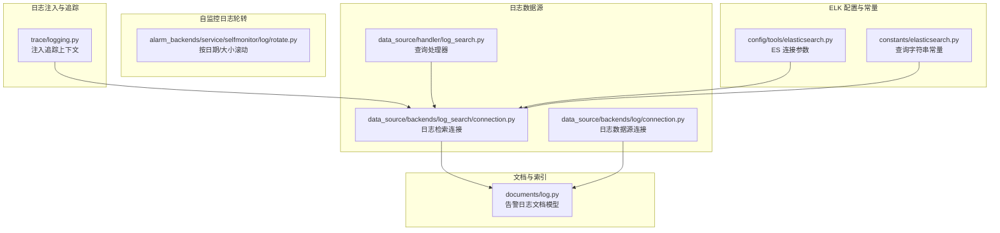
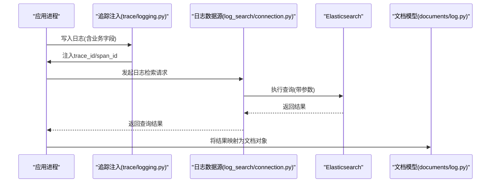
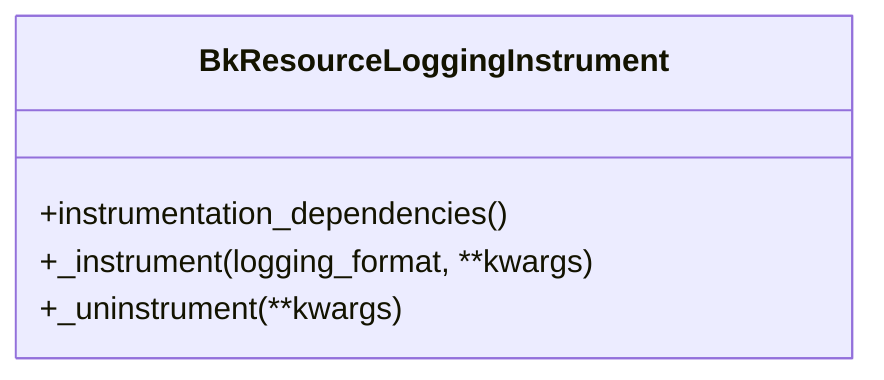
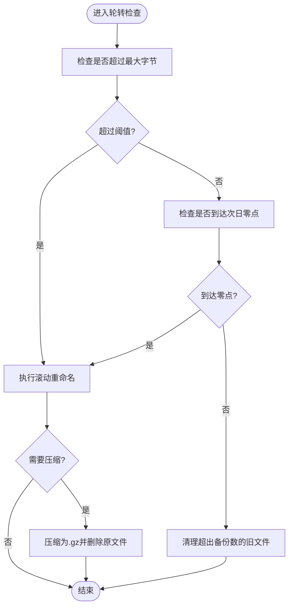
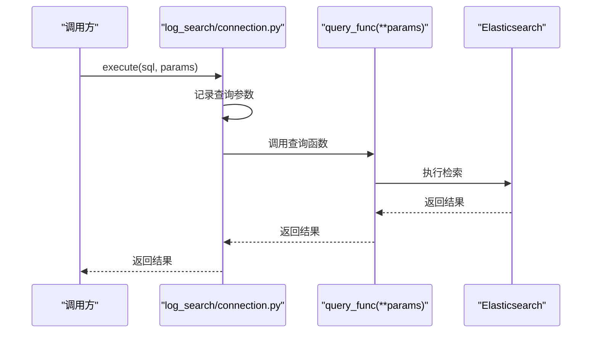
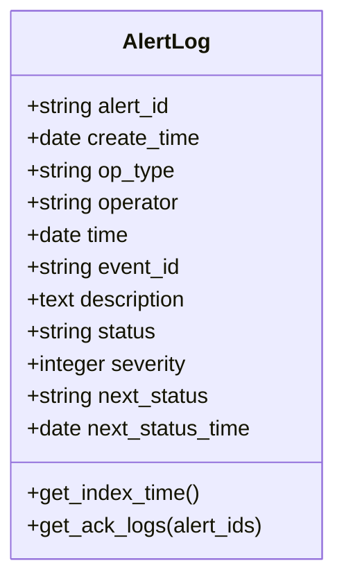
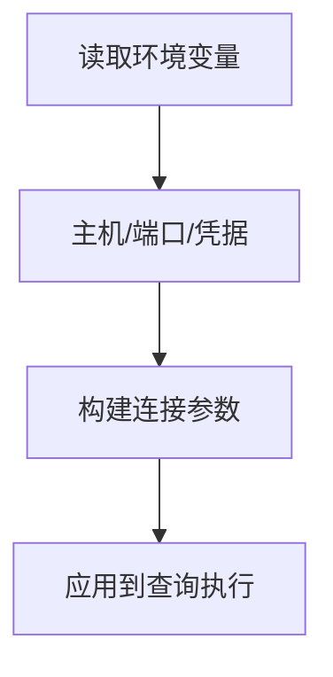
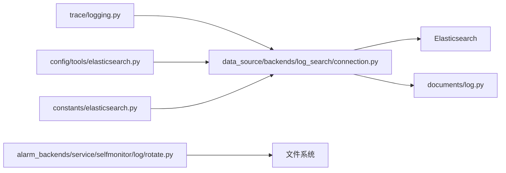

# 日志分析方法

<cite>
**本文引用的文件**
- [bkmonitor\bkmonitor\trace\logging.py](file://bkmonitor/bkmonitor/trace/logging.py)
- [bkmonitor\alarm_backends\service\selfmonitor\log\rotate.py](file://bkmonitor/alarm_backends/service/selfmonitor/log/rotate.py)
- [bkmonitor\bkmonitor\data_source\backends\log\connection.py](file://bkmonitor/bkmonitor/data_source/backends/log/connection.py)
- [bkmonitor\bkmonitor\data_source\backends\log_search\connection.py](file://bkmonitor/bkmonitor/data_source/backends/log_search/connection.py)
- [bkmonitor\bkmonitor\data_source\handler\log_search.py](file://bkmonitor/bkmonitor/data_source/handler/log_search.py)
- [bkmonitor\bkmonitor\documents\log.py](file://bkmonitor/bkmonitor/documents/log.py)
- [bkmonitor\config\tools\elasticsearch.py](file://bkmonitor/config/tools/elasticsearch.py)
- [bkmonitor\constants\elasticsearch.py](file://bkmonitor/constants/elasticsearch.py)
</cite>

## 目录
1. 引言
2. 项目结构
3. 核心组件
4. 架构总览
5. 组件详细分析
6. 依赖关系分析
7. 性能考量
8. 故障排查指南
9. 结论
10. 附录

## 引言
本指南面向监控平台运维与开发人员，系统化阐述日志分析方法与最佳实践。内容覆盖日志结构与级别、关键字段、收集与轮转、过滤与搜索、ELK Stack 使用、聚合与实时监控、以及错误、访问、性能、审计等日志类型的分析要点，并提供常用查询语法与正则匹配思路及可视化工具使用建议。

## 项目结构
围绕日志分析的关键模块主要分布在以下位置：
- 日志注入与追踪：trace 子系统负责在日志中注入链路追踪上下文，便于端到端问题定位。
- 自监控日志轮转：自监控子系统提供基于时间与大小的滚动策略，保障日志文件生命周期管理。
- 数据源与查询：日志数据源后端封装了与存储层交互的连接器与操作集，统一查询入口。
- 文档模型与索引：文档层定义了告警日志的索引结构与字段映射，支撑检索与聚合。
- ELK 配置与常量：ES 连接参数与查询字符串转义规则，为日志检索提供基础能力。

图表来源
- [bkmonitor\bkmonitor\trace\logging.py:1-80](file://bkmonitor/bkmonitor/trace/logging.py#L1-L80)
- [bkmonitor\alarm_backends\service\selfmonitor\log\rotate.py:1-164](file://bkmonitor/alarm_backends/service/selfmonitor/log/rotate.py#L1-L164)
- [bkmonitor\bkmonitor\data_source\backends\log\connection.py:1-24](file://bkmonitor/bkmonitor/data_source/backends/log/connection.py#L1-L24)
- [bkmonitor\bkmonitor\data_source\backends\log_search\connection.py:1-47](file://bkmonitor/bkmonitor/data_source/backends/log_search/connection.py#L1-L47)
- [bkmonitor\bkmonitor\data_source\handler\log_search.py:1-16](file://bkmonitor/bkmonitor/data_source/handler/log_search.py#L1-L16)
- [bkmonitor\bkmonitor\documents\log.py:1-92](file://bkmonitor/bkmonitor/documents/log.py#L1-L92)
- [bkmonitor\config\tools\elasticsearch.py:1-31](file://bkmonitor/config/tools/elasticsearch.py#L1-L31)
- [bkmonitor\constants\elasticsearch.py:1-76](file://bkmonitor/constants/elasticsearch.py#L1-L76)

章节来源
- [bkmonitor\bkmonitor\trace\logging.py:1-80](file://bkmonitor/bkmonitor/trace/logging.py#L1-L80)
- [bkmonitor\alarm_backends\service\selfmonitor\log\rotate.py:1-164](file://bkmonitor/alarm_backends/service/selfmonitor/log/rotate.py#L1-L164)
- [bkmonitor\bkmonitor\data_source\backends\log\connection.py:1-24](file://bkmonitor/bkmonitor/data_source/backends/log/connection.py#L1-L24)
- [bkmonitor\bkmonitor\data_source\backends\log_search\connection.py:1-47](file://bkmonitor/bkmonitor/data_source/backends/log_search/connection.py#L1-L47)
- [bkmonitor\bkmonitor\data_source\handler\log_search.py:1-16](file://bkmonitor/bkmonitor/data_source/handler/log_search.py#L1-L16)
- [bkmonitor\bkmonitor\documents\log.py:1-92](file://bkmonitor/bkmonitor/documents/log.py#L1-L92)
- [bkmonitor\config\tools\elasticsearch.py:1-31](file://bkmonitor/config/tools/elasticsearch.py#L1-L31)
- [bkmonitor\constants\elasticsearch.py:1-76](file://bkmonitor/constants/elasticsearch.py#L1-L76)

## 核心组件
- 日志注入与追踪：通过记录工厂注入追踪上下文，统一在日志格式中输出追踪 ID，便于跨服务串联。
- 自监控日志轮转：实现“按日期+大小”滚动，支持压缩与自动清理历史备份，避免磁盘膨胀。
- 日志数据源连接：封装日志数据源与检索连接，屏蔽底层存储差异，提供统一执行接口。
- 文档模型与索引：定义告警日志索引名称、字段类型与常用操作，支撑检索、排序与聚合。
- ELK 配置与常量：提供 ES 连接参数读取与查询字符串转义规则，确保检索稳定性与安全性。

章节来源
- [bkmonitor\bkmonitor\trace\logging.py:27-80](file://bkmonitor/bkmonitor/trace/logging.py#L27-L80)
- [bkmonitor\alarm_backends\service\selfmonitor\log\rotate.py:22-164](file://bkmonitor/alarm_backends/service/selfmonitor/log/rotate.py#L22-L164)
- [bkmonitor\bkmonitor\data_source\backends\log\connection.py:15-24](file://bkmonitor/bkmonitor/data_source/backends/log/connection.py#L15-L24)
- [bkmonitor\bkmonitor\data_source\backends\log_search\connection.py:25-47](file://bkmonitor/bkmonitor/data_source/backends/log_search/connection.py#L25-L47)
- [bkmonitor\bkmonitor\documents\log.py:18-92](file://bkmonitor/bkmonitor/documents/log.py#L18-L92)
- [bkmonitor\config\tools\elasticsearch.py:15-31](file://bkmonitor/config/tools/elasticsearch.py#L15-L31)
- [bkmonitor\constants\elasticsearch.py:1-76](file://bkmonitor/constants/elasticsearch.py#L1-L76)

## 架构总览
下图展示从日志写入、注入追踪、滚动轮转、到检索与可视化的整体流程。

图表来源
- [bkmonitor\bkmonitor\trace\logging.py:35-74](file://bkmonitor/bkmonitor/trace/logging.py#L35-L74)
- [bkmonitor\bkmonitor\data_source\backends\log_search\connection.py:41-47](file://bkmonitor/bkmonitor/data_source/backends/log_search/connection.py#L41-L47)
- [bkmonitor\bkmonitor\documents\log.py:18-92](file://bkmonitor/bkmonitor/documents/log.py#L18-L92)

## 组件详细分析

### 日志注入与追踪（trace/logging.py）
- 记录工厂增强：重写日志记录工厂，为每条日志注入追踪上下文（如 span_id、trace_id、service_name）。
- 配置注入：通过注入函数将追踪字段写入指定日志格式键位，保证标准输出一致可检索。
- 适用场景：跨服务调用链定位、异常根因分析、性能瓶颈定位。

图表来源
- [bkmonitor\bkmonitor\trace\logging.py:27-80](file://bkmonitor/bkmonitor/trace/logging.py#L27-L80)

章节来源
- [bkmonitor\bkmonitor\trace\logging.py:27-80](file://bkmonitor/bkmonitor/trace/logging.py#L27-L80)

### 自监控日志轮转（alarm_backends/service/selfmonitor/log/rotate.py）
- 滚动策略：按“次日零点”或“达到最大字节”触发滚动；支持压缩备份与自动清理超限文件。
- 文件命名：采用“原名.日期.序号”命名，支持“.gz”扩展；按日期与序号排序删除多余备份。
- 安全性：捕获异常避免轮转过程影响主流程；保留最小必要逻辑以降低开销。

图表来源
- [bkmonitor\alarm_backends\service\selfmonitor\log\rotate.py:77-164](file://bkmonitor/alarm_backends/service/selfmonitor/log/rotate.py#L77-L164)

章节来源
- [bkmonitor\alarm_backends\service\selfmonitor\log\rotate.py:22-164](file://bkmonitor/alarm_backends/service/selfmonitor/log/rotate.py#L22-L164)

### 日志数据源与查询（data_source/backends/log_search/connection.py、handler/log_search.py）
- 连接器职责：声明供应商与偏好存储（ES），定义可用运算符集合，封装执行入口。
- 查询执行：记录查询参数，开启追踪 Span 并传递系统与语句属性，最终调用查询函数返回结果。
- 处理器：定义日志检索数据源类型标识，作为统一查询入口。

图表来源
- [bkmonitor\bkmonitor\data_source\backends\log_search\connection.py:41-47](file://bkmonitor/bkmonitor/data_source/backends/log_search/connection.py#L41-L47)
- [bkmonitor\bkmonitor\data_source\handler\log_search.py:14-16](file://bkmonitor/bkmonitor/data_source/handler/log_search.py#L14-L16)

章节来源
- [bkmonitor\bkmonitor\data_source\backends\log_search\connection.py:25-47](file://bkmonitor/bkmonitor/data_source/backends/log_search/connection.py#L25-L47)
- [bkmonitor\bkmonitor\data_source\handler\log_search.py:14-16](file://bkmonitor/bkmonitor/data_source/handler/log_search.py#L14-L16)

### 文档模型与索引（documents/log.py）
- 索引定义：声明索引名称与设置，用于告警日志归档与检索。
- 操作类型：定义告警生命周期中的多种操作类型（如创建、收敛、恢复、关闭、确认、严重度变化等）。
- 字段映射：关键字段包括告警ID、创建时间、操作类型、操作人、事件ID、描述、状态、严重度、下一状态与时间等。
- 常用查询：提供按告警ID与操作类型检索的示例，支持排序与去重。

图表来源
- [bkmonitor\bkmonitor\documents\log.py:18-92](file://bkmonitor/bkmonitor/documents/log.py#L18-L92)

章节来源
- [bkmonitor\bkmonitor\documents\log.py:18-92](file://bkmonitor/bkmonitor/documents/log.py#L18-L92)

### ELK 配置与查询常量（config/tools/elasticsearch.py、constants/elasticsearch.py）
- 连接参数：通过环境变量读取 ES 主机、REST 端口、传输端口、用户名与密码，区分告警与监控场景。
- 查询常量：定义 ES 查询字符串中的保留字符、逻辑运算符、比较与正则操作符、模板映射与转义规则，确保查询安全与正确性。

图表来源
- [bkmonitor\config\tools\elasticsearch.py:15-31](file://bkmonitor/config/tools/elasticsearch.py#L15-L31)

章节来源
- [bkmonitor\config\tools\elasticsearch.py:15-31](file://bkmonitor/config/tools/elasticsearch.py#L15-L31)
- [bkmonitor\constants\elasticsearch.py:1-76](file://bkmonitor/constants/elasticsearch.py#L1-L76)

## 依赖关系分析
- 日志注入依赖追踪提供者与 Django 日志配置，确保输出格式一致。
- 日志检索连接依赖 ES 存储与查询函数，文档模型依赖索引设置与字段映射。
- ELK 常量为查询提供转义与模板映射，避免特殊字符引发解析错误。

图表来源
- [bkmonitor\bkmonitor\trace\logging.py:35-74](file://bkmonitor/bkmonitor/trace/logging.py#L35-L74)
- [bkmonitor\bkmonitor\data_source\backends\log_search\connection.py:41-47](file://bkmonitor/bkmonitor/data_source/backends/log_search/connection.py#L41-L47)
- [bkmonitor\bkmonitor\documents\log.py:18-92](file://bkmonitor/bkmonitor/documents/log.py#L18-L92)
- [bkmonitor\config\tools\elasticsearch.py:15-31](file://bkmonitor/config/tools/elasticsearch.py#L15-L31)
- [bkmonitor\constants\elasticsearch.py:1-76](file://bkmonitor/constants/elasticsearch.py#L1-L76)
- [bkmonitor\alarm_backends\service\selfmonitor\log\rotate.py:83-117](file://bkmonitor/alarm_backends/service/selfmonitor/log/rotate.py#L83-L117)

章节来源
- [bkmonitor\bkmonitor\trace\logging.py:35-74](file://bkmonitor/bkmonitor/trace/logging.py#L35-L74)
- [bkmonitor\bkmonitor\data_source\backends\log_search\connection.py:41-47](file://bkmonitor/bkmonitor/data_source/backends/log_search/connection.py#L41-L47)
- [bkmonitor\bkmonitor\documents\log.py:18-92](file://bkmonitor/bkmonitor/documents/log.py#L18-L92)
- [bkmonitor\config\tools\elasticsearch.py:15-31](file://bkmonitor/config/tools/elasticsearch.py#L15-L31)
- [bkmonitor\constants\elasticsearch.py:1-76](file://bkmonitor/constants/elasticsearch.py#L1-L76)
- [bkmonitor\alarm_backends\service\selfmonitor\log\rotate.py:83-117](file://bkmonitor/alarm_backends/service/selfmonitor/log/rotate.py#L83-L117)

## 性能考量
- 日志轮转：合理设置最大字节与备份数量，避免频繁滚动造成 IO 抖动；启用压缩减少磁盘占用。
- 查询优化：利用文档模型的字段类型与索引设置，优先使用关键字字段进行过滤；避免在大范围文本字段上做复杂正则匹配。
- 连接与转义：通过常量集中管理查询字符串转义，减少拼接错误与解析开销。
- 追踪注入：仅对关键路径注入追踪上下文，避免过多字段导致日志体积膨胀。

## 故障排查指南
- 日志无法滚动：检查轮转类的阈值与备份数配置，确认目标目录权限与磁盘空间。
- 查询结果异常：核对查询字符串转义规则与模板映射，确保保留字符被正确转义；检查 ES 连接参数与认证信息。
- 文档检索无结果：确认索引名称与字段映射是否匹配；验证时间范围与排序条件。
- 追踪上下文缺失：检查追踪注入是否生效，确认日志格式中包含追踪字段键位。

章节来源
- [bkmonitor\alarm_backends\service\selfmonitor\log\rotate.py:152-164](file://bkmonitor/alarm_backends/service/selfmonitor/log/rotate.py#L152-L164)
- [bkmonitor\constants\elasticsearch.py:1-76](file://bkmonitor/constants/elasticsearch.py#L1-L76)
- [bkmonitor\config\tools\elasticsearch.py:15-31](file://bkmonitor/config/tools/elasticsearch.py#L15-L31)
- [bkmonitor\bkmonitor\documents\log.py:84-92](file://bkmonitor/bkmonitor/documents/log.py#L84-L92)
- [bkmonitor\bkmonitor\trace\logging.py:68-74](file://bkmonitor/bkmonitor/trace/logging.py#L68-L74)

## 结论
通过统一的日志注入、稳健的轮转策略、标准化的数据源与文档模型，以及完善的 ELK 配置与查询常量，监控平台实现了高可用的日志分析能力。建议在生产环境中结合本文提供的方法与最佳实践，持续优化日志结构、查询性能与可视化体验。

## 附录

### 日志级别与关键字段
- 日志级别：按严重程度分为不同等级，便于分级告警与筛选。
- 关键字段：包含业务标识、时间戳、追踪上下文、操作类型、状态与严重度等，支撑快速定位与分析。

### 日志收集与轮转
- 收集：统一通过应用日志输出，结合追踪注入保证可观测性。
- 轮转：按日期与大小滚动，支持压缩与自动清理，避免磁盘压力。

### 过滤、搜索与分析
- 过滤：优先使用关键字字段与精确匹配；对文本字段使用通配符时注意性能。
- 搜索：遵循查询字符串转义规则，避免保留字符引发解析错误。
- 分析：结合文档模型的字段与操作类型，进行趋势分析与根因定位。

### ELK Stack 使用指南
- 连接：通过环境变量配置 ES 主机、端口与认证信息。
- 索引：使用文档模型定义的索引名称与字段映射，确保检索一致性。
- 查询：参考查询常量与模板映射，编写稳定可靠的查询语句。

### 实时监控技巧
- 追踪串联：利用注入的追踪上下文，跨服务串联日志与指标。
- 聚合与可视化：基于关键字字段进行聚合，结合仪表板进行实时监控。

### 常用日志查询与正则
- 查询语法：遵循查询字符串常量中的模板映射与转义规则。
- 正则匹配：在需要时使用正则表达式，注意性能与转义要求。