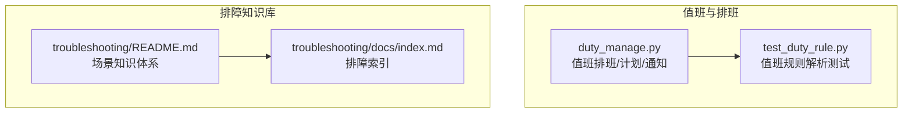
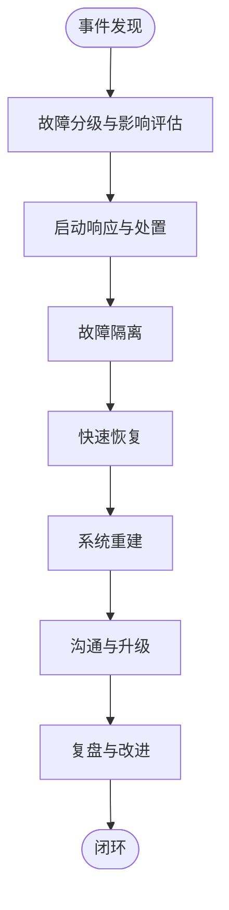
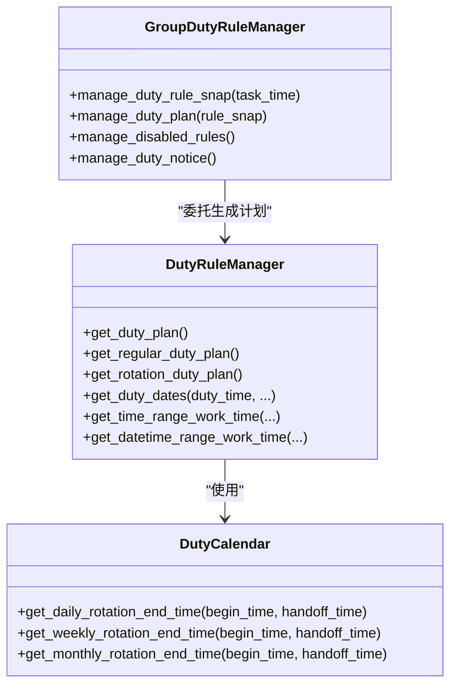
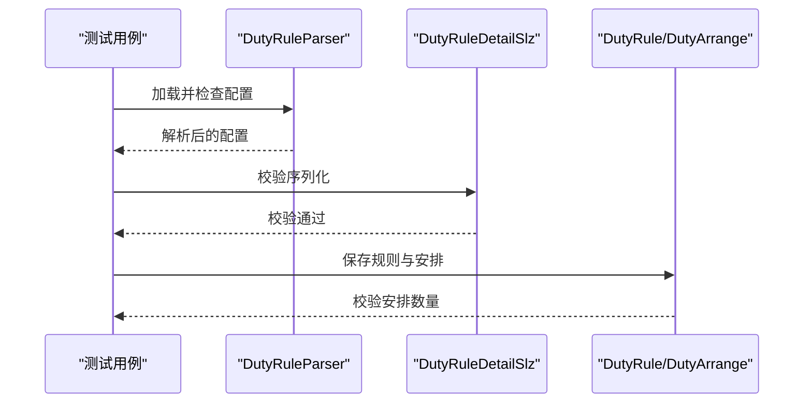
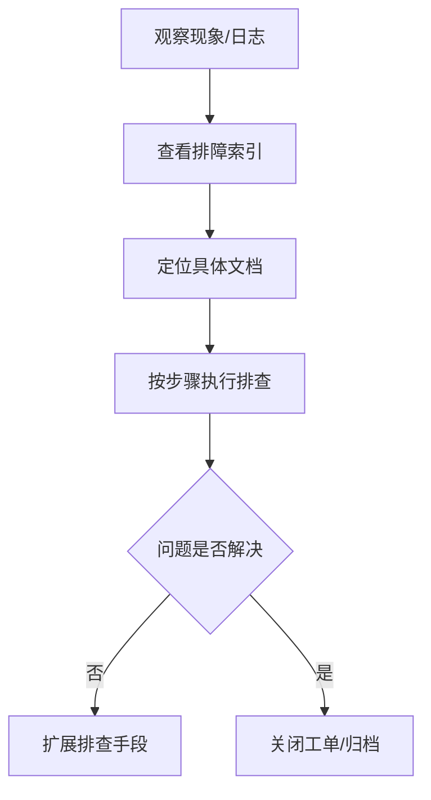
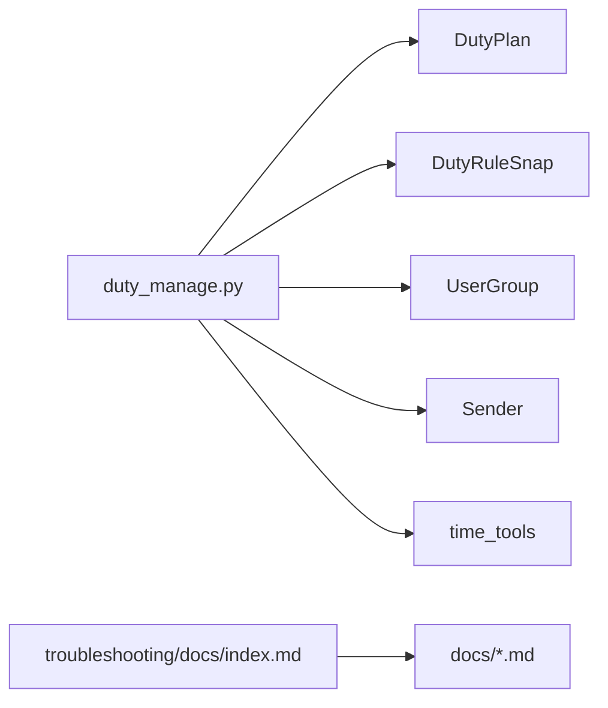

# 紧急处理流程

<cite>
**本文引用的文件**
- [duty_manage.py](file://bkmonitor/bkmonitor/action/duty_manage.py)
- [test_duty_rule.py](file://bkmonitor/bkmonitor/as_code/tests/test_duty_rule.py)
- [troubleshooting/README.md](file://ai-docs/bk-monitor/scenarios/troubleshooting/README.md)
- [troubleshooting/docs/index.md](file://ai-docs/bk-monitor/scenarios/troubleshooting/docs/index.md)
</cite>

## 目录
1. [简介](#简介)
2. [项目结构](#项目结构)
3. [核心组件](#核心组件)
4. [架构总览](#架构总览)
5. [详细组件分析](#详细组件分析)
6. [依赖分析](#依赖分析)
7. [性能考虑](#性能考虑)
8. [故障分级与响应时间](#故障分级与响应时间)
9. [应急处置流程](#应急处置流程)
10. [值班制度与沟通机制](#值班制度与沟通机制)
11. [升级流程与复盘要求](#升级流程与复盘要求)
12. [应急联系人与备用方案](#应急联系人与备用方案)
13. [灾难恢复计划](#灾难恢复计划)
14. [故障隔离与快速恢复](#故障隔离与快速恢复)
15. [系统重建操作步骤](#系统重建操作步骤)
16. [附录：排障索引与参考](#附录排障索引与参考)

## 简介
本文件面向蓝鲸监控平台的紧急处理流程，旨在建立标准化的应急响应SOP，覆盖故障分级、响应时效、处置步骤、值班与沟通、升级与复盘、应急联系人、备用方案与灾备计划。结合仓库内现有的值班排班、告警后端与排障知识库，形成可落地的“从发现到恢复再到复盘”的全流程规范。

## 项目结构
围绕紧急处理的关键目录与文件如下：
- 值班排班与通知：bkmonitor/bkmonitor/action/duty_manage.py
- 值班规则编排测试：bkmonitor/bkmonitor/as_code/tests/test_duty_rule.py
- 故障排查知识库：ai-docs/bk-monitor/scenarios/troubleshooting/*
  - 索引导航：ai-docs/bk-monitor/scenarios/troubleshooting/README.md
  - 排障索引：ai-docs/bk-monitor/scenarios/troubleshooting/docs/index.md

**图表来源**
- [duty_manage.py](file://bkmonitor/bkmonitor/action/duty_manage.py)
- [test_duty_rule.py](file://bkmonitor/bkmonitor/as_code/tests/test_duty_rule.py)
- [troubleshooting/README.md](file://ai-docs/bk-monitor/scenarios/troubleshooting/README.md)
- [troubleshooting/docs/index.md](file://ai-docs/bk-monitor/scenarios/troubleshooting/docs/index.md)

**章节来源**
- [troubleshooting/README.md](file://ai-docs/bk-monitor/scenarios/troubleshooting/README.md)
- [troubleshooting/docs/index.md](file://ai-docs/bk-monitor/scenarios/troubleshooting/docs/index.md)

## 核心组件
- 值班排班与计划生成：负责规则解析、周期计算、计划生成与通知发送。
- 值班规则编排与校验：通过代码即配置解析值班规则，保证规则生效与一致性。
- 故障排查索引与场景化文档：提供快速定位与处置的排障路径与方法。

**章节来源**
- [duty_manage.py](file://bkmonitor/bkmonitor/action/duty_manage.py)
- [test_duty_rule.py](file://bkmonitor/bkmonitor/as_code/tests/test_duty_rule.py)

## 架构总览
紧急处理SOP的总体流程包括：事件发现与分级、响应与处置、隔离与恢复、沟通与升级、复盘与改进。值班排班模块贯穿“响应与处置”环节，排障索引提供“处置”阶段的技术支撑。

## 详细组件分析

### 值班排班与计划生成（duty_manage.py）
- 职责边界
  - 解析值班规则，计算周期与交接时间
  - 生成排班计划（DutyPlan），并维护快照（DutyRuleSnap）
  - 发送排班计划与个人提醒通知
- 关键能力
  - 按日/周/月轮转的结束时间计算
  - 周期性计划生成与过期清理
  - 通知发送（计划通知/个人提醒）

**图表来源**
- [duty_manage.py](file://bkmonitor/bkmonitor/action/duty_manage.py)

**章节来源**
- [duty_manage.py](file://bkmonitor/bkmonitor/action/duty_manage.py)

### 值班规则编排与校验（test_duty_rule.py）
- 作用：验证值班规则解析与入库流程，确保规则生效与一致性。
- 关键点：解析 YAML → 校验序列化 → 保存规则 → 校验安排数量。

**图表来源**
- [test_duty_rule.py](file://bkmonitor/bkmonitor/as_code/tests/test_duty_rule.py)

**章节来源**
- [test_duty_rule.py](file://bkmonitor/bkmonitor/as_code/tests/test_duty_rule.py)

### 故障排查索引与场景化文档（troubleshooting/docs/index.md）
- 价值：提供快速检索的排障索引，覆盖告警、查询、通知、存储、队列等常见问题。
- 使用方式：根据现象关键词快速定位文档，按文档提供的步骤执行。

**图表来源**
- [troubleshooting/docs/index.md](file://ai-docs/bk-monitor/scenarios/troubleshooting/docs/index.md)

**章节来源**
- [troubleshooting/docs/index.md](file://ai-docs/bk-monitor/scenarios/troubleshooting/docs/index.md)

## 依赖分析
- 值班模块依赖模型与工具：DutyPlan、DutyRuleSnap、UserGroup、Sender、时间工具等。
- 排障索引依赖文档目录结构与索引文件维护，确保与实际文档一致。

**图表来源**
- [duty_manage.py](file://bkmonitor/bkmonitor/action/duty_manage.py)
- [troubleshooting/docs/index.md](file://ai-docs/bk-monitor/scenarios/troubleshooting/docs/index.md)

**章节来源**
- [duty_manage.py](file://bkmonitor/bkmonitor/action/duty_manage.py)
- [troubleshooting/docs/index.md](file://ai-docs/bk-monitor/scenarios/troubleshooting/docs/index.md)

## 性能考虑
- 值班计划生成涉及周期计算与批量创建，需关注时间窗口与批量写入的性能。
- 排障索引的检索效率取决于文档数量与索引维护质量，建议定期校验与精简冗余条目。

## 故障分级与响应时间
- 建议分级（示例）
  - 一级（P0）：全局服务中断、数据丢失、安全事件
  - 二级（P1）：核心功能不可用、大面积告警风暴
  - 三级（P2）：局部功能异常、性能退化
  - 四级（P3）：一般性问题、体验类缺陷
- 响应时间（示例）
  - P0：10分钟内响应，1小时内初步处置
  - P1：30分钟内响应，4小时内处置
  - P2：2小时内响应，24小时内处置
  - P3：4小时内响应，72小时内处置

## 应急处置流程
- 服务宕机
  - 快速隔离：停止对外暴露、切换备用实例
  - 核查日志：定位异常点，确认影响范围
  - 快速恢复：回滚变更、重启服务、恢复备份
  - 系统重建：验证数据一致性、恢复监控与告警
- 数据丢失
  - 立即冻结相关实例，避免二次覆盖
  - 从备份恢复，核对时间点与完整性
  - 审计变更与访问日志，定位责任人
  - 修复漏洞并加强巡检
- 告警风暴
  - 临时屏蔽非关键告警，保留关键通道
  - 分析风暴根因（查询超限、规则异常、队列拥堵）
  - 逐步恢复告警，持续监控
- 安全事件
  - 立即封禁可疑账号与IP
  - 全面审计访问与操作日志
  - 修复漏洞，加固认证与授权
  - 通知监管与受影响方

## 值班制度与沟通机制
- 值班排班
  - 采用日/周/月轮转，明确交接时间与周期
  - 自动生成排班计划并维护快照，确保规则生效
- 沟通机制
  - 事件总览与处置进展在统一渠道同步
  - 关键节点（响应、处置、恢复、复盘）必须留痕
  - 跨团队协作时明确接口人与职责

**章节来源**
- [duty_manage.py](file://bkmonitor/bkmonitor/action/duty_manage.py)

## 升级流程与复盘要求
- 升级流程
  - 事件升级阈值与触发条件（如影响扩大、超时未恢复）
  - 明确升级路径与责任人（一线→二线→专家→管理层）
- 复盘要求
  - 事件根因、处置过程、经验教训与改进措施
  - 形成知识库条目，纳入排障索引

**章节来源**
- [troubleshooting/README.md](file://ai-docs/bk-monitor/scenarios/troubleshooting/README.md)

## 应急联系人与备用方案
- 应急联系人
  - 事件总负责人：XXX（电话/邮箱）
  - 技术总协调：XXX（电话/邮箱）
  - 各模块负责人：XXX（电话/邮箱）
- 备用方案
  - 备份实例与切换演练
  - 外部告警通道与通知备用
  - 临时降级策略与限流

## 灾难恢复计划
- RTO/RPO目标：明确恢复时间与数据丢失容忍度
- 恢复步骤
  - 快速评估与隔离
  - 从最近备份恢复
  - 验证数据一致性与业务可用性
  - 恢复监控与告警
- 演练频率：至少每季度一次

## 故障隔离与快速恢复
- 隔离策略
  - 服务降级与熔断
  - 网络隔离与流量控制
  - 临时屏蔽问题模块
- 快速恢复
  - 回滚变更与重启
  - 修复热点问题与瓶颈
  - 逐步放量与监控

## 系统重建操作步骤
- 数据重建
  - 校验备份完整性与时间点
  - 重建索引与缓存
- 服务重建
  - 重启关键服务与依赖
  - 验证接口与监控
- 验证与回归
  - 功能与性能回归测试
  - 监控与告警恢复

## 附录：排障索引与参考
- 排障索引提供了覆盖广泛场景的方法论与实操步骤，建议在处置过程中优先查阅对应文档，减少定位时间。

**章节来源**
- [troubleshooting/docs/index.md](file://ai-docs/bk-monitor/scenarios/troubleshooting/docs/index.md)