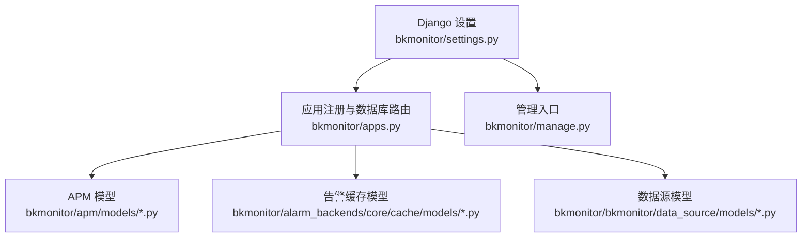
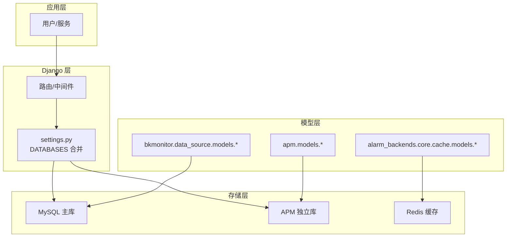
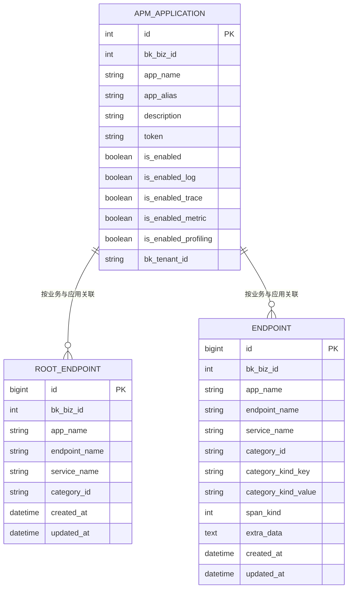
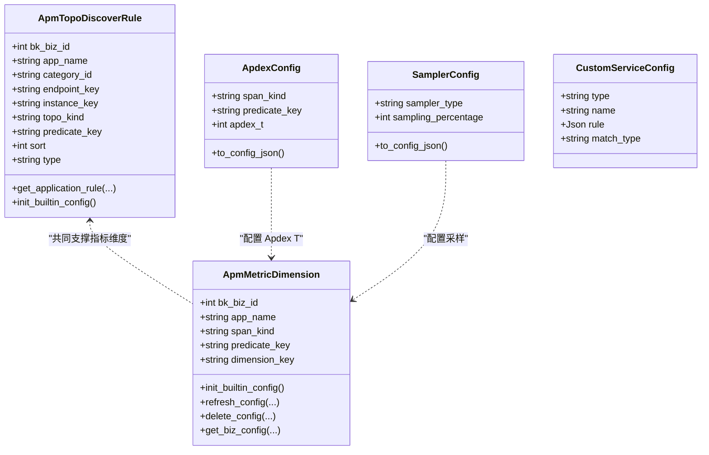
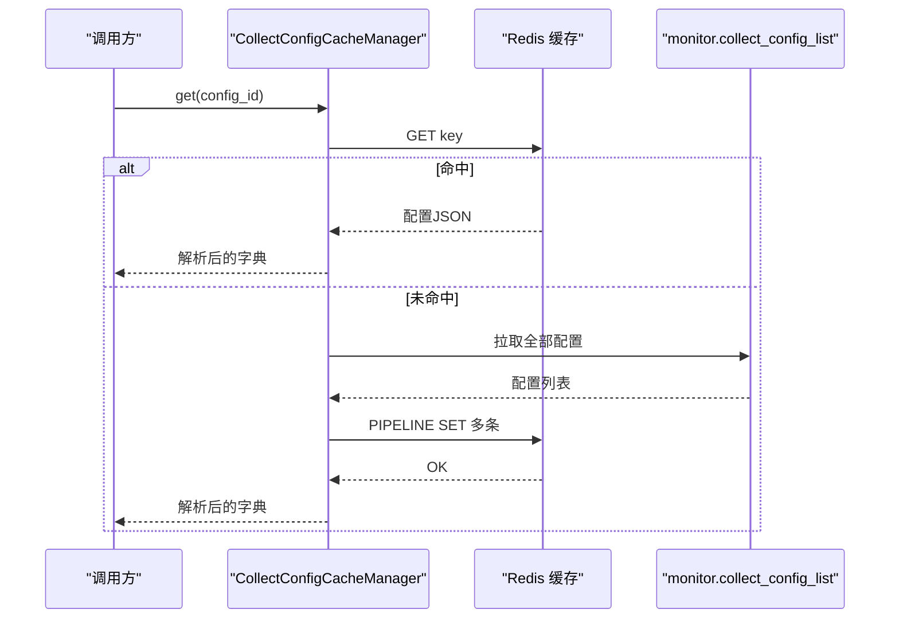
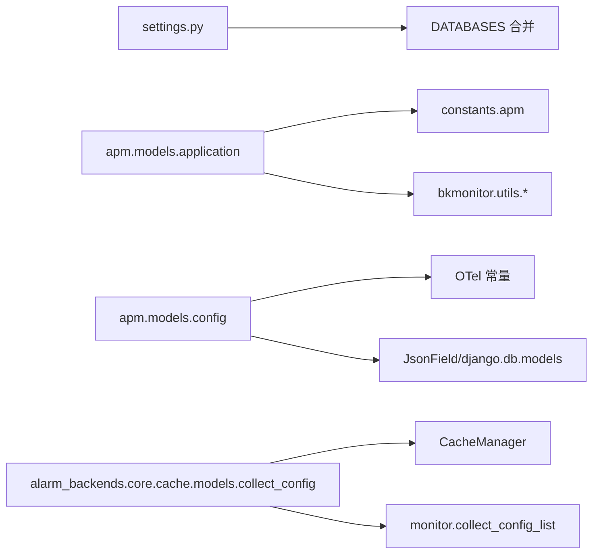

# 数据库设计

<cite>
**本文引用的文件**
- [settings.py](file://bkmonitor/settings.py)
- [manage.py](file://bkmonitor/manage.py)
- [application.py](file://bkmonitor/apm/models/application.py)
- [config.py](file://bkmonitor/apm/models/config.py)
- [collect_config.py](file://bkmonitor/alarm_backends/core/cache/models/collect_config.py)
- [__init__.py（apm/models）](file://bkmonitor/apm/models/__init__.py)
- [__init__.py（bkmonitor/data_source/models）](file://bkmonitor/bkmonitor/data_source/models/__init__.py)
</cite>

## 目录
1. [简介](#简介)
2. [项目结构](#项目结构)
3. [核心组件](#核心组件)
4. [架构总览](#架构总览)
5. [详细组件分析](#详细组件分析)
6. [依赖分析](#依赖分析)
7. [性能考虑](#性能考虑)
8. [故障排查指南](#故障排查指南)
9. [结论](#结论)
10. [附录](#附录)

## 简介
本文件面向数据库设计与运维，围绕监控平台中的数据库模型、索引策略、迁移方案、数据访问与缓存策略、性能优化与一致性保障、数据生命周期与归档备份等主题进行系统化梳理。文档以实际代码为依据，结合模型定义、索引与约束、缓存与访问模式，给出可落地的设计原则与优化建议。

## 项目结构
本项目采用 Django 应用分层组织，数据库相关的核心模型集中在 apm、alarm_backends 等子系统中；数据库连接与多库路由在全局设置中完成初始化与扩展。

图表来源
- [settings.py:100-110](file://bkmonitor/settings.py#L100-L110)
- [manage.py:44-49](file://bkmonitor/manage.py#L44-L49)

章节来源
- [settings.py:100-110](file://bkmonitor/settings.py#L100-L110)
- [manage.py:44-49](file://bkmonitor/manage.py#L44-L49)

## 核心组件
- APM 应用与端点模型：定义业务域内应用、端点、实例等实体及关联关系，支撑 APM 数据采集与查询。
- APM 配置模型：包括拓扑发现规则、指标维度、采样器、Apdex、自定义服务等配置，支持按业务与应用粒度管理。
- 告警采集配置缓存：通过 Redis 缓存采集配置，降低后端压力并提升响应速度。
- 数据源模型：抽象数据源能力，为日志、指标、追踪、剖析等提供统一接入。

章节来源
- [application.py:36-131](file://bkmonitor/apm/models/application.py#L36-L131)
- [config.py:36-278](file://bkmonitor/apm/models/config.py#L36-L278)
- [collect_config.py:19-63](file://bkmonitor/alarm_backends/core/cache/models/collect_config.py#L19-L63)
- [__init__.py（apm/models）](file://bkmonitor/apm/models/__init__.py)
- [__init__.py（bkmonitor/data_source/models）](file://bkmonitor/bkmonitor/data_source/models/__init__.py)

## 架构总览
数据库层由 Django ORM 统一建模，通过 settings 中的 DATABASES 定义默认库与扩展库（如旧监控后端库），并在运行时合并基础配置。APM 子系统使用独立数据库连接名，确保业务隔离与性能可控。

图表来源
- [settings.py:100-110](file://bkmonitor/settings.py#L100-L110)
- [application.py:19-33](file://bkmonitor/apm/models/application.py#L19-L33)
- [collect_config.py:15-16](file://bkmonitor/alarm_backends/core/cache/models/collect_config.py#L15-L16)

## 详细组件分析

### APM 应用与端点模型
- 实体关系
  - ApmApplication：应用主体，包含业务 ID、应用名、别名、描述、Token、功能开关、租户 ID 等。
  - RootEndpoint/Endpoint：端点与服务映射，记录接口名、服务名、分类信息、额外数据、时间戳等。
  - 关系：应用与端点通过业务 ID、应用名建立弱关联，便于按业务域检索与聚合。
- 约束与索引
  - 应用唯一性：应用名与业务 ID 组合唯一。
  - 端点/根端点：按业务 ID 与应用名联合索引，加速按业务域查询。
- 设计要点
  - 使用布尔字段表达功能开关，便于快速过滤与统计。
  - 时间字段使用自动填充，配合 db_index 提升查询效率。
  - Token 与数据源联动，确保上报与鉴权一致。

图表来源
- [application.py:36-131](file://bkmonitor/apm/models/application.py#L36-L131)
- [application.py:291-321](file://bkmonitor/apm/models/application.py#L291-L321)

章节来源
- [application.py:36-131](file://bkmonitor/apm/models/application.py#L36-L131)
- [application.py:291-321](file://bkmonitor/apm/models/application.py#L291-L321)

### APM 配置模型
- 规则与维度
  - 拓扑发现规则：按类别（HTTP/RPC/DB/消息/异步/其他）、框架（TRPC/gRPC）、平台（K8s/节点）、SDK 等维度定义发现规则，支持排序与类型区分。
  - 指标维度：按 Span Kind（服务端/客户端/生产者/消费者）与谓词键（如 HTTP 方法、DB 系统、消息系统等）组合生成维度集合。
  - 采样器与 Apdex：支持按应用/服务/实例级别配置采样策略与 Apdex T 值。
  - 自定义服务：基于规则与匹配组实现远程服务识别。
- 访问模式
  - 内存缓存：拓扑发现规则在进程内缓存，减少数据库访问。
  - 批量写入：内置配置初始化采用批量创建与更新，降低写放大。
- 设计要点
  - 抽象配置基类支持统一刷新与删除逻辑，便于扩展新配置类型。
  - JsonField 存储复杂配置结构，兼顾灵活性与查询限制。

图表来源
- [config.py:36-278](file://bkmonitor/apm/models/config.py#L36-L278)
- [config.py:716-746](file://bkmonitor/apm/models/config.py#L716-L746)
- [config.py:734-746](file://bkmonitor/apm/models/config.py#L734-L746)
- [config.py:748-770](file://bkmonitor/apm/models/config.py#L748-L770)

章节来源
- [config.py:36-278](file://bkmonitor/apm/models/config.py#L36-L278)
- [config.py:716-746](file://bkmonitor/apm/models/config.py#L716-L746)
- [config.py:734-746](file://bkmonitor/apm/models/config.py#L734-L746)
- [config.py:748-770](file://bkmonitor/apm/models/config.py#L748-L770)

### 告警采集配置缓存
- 缓存策略
  - 使用统一缓存键模板，按配置 ID 命中缓存。
  - 批量管道写入，减少网络往返与事务开销。
  - JSON 序列化存储，便于直接解析返回。
- 访问流程
  - 优先从缓存读取；缓存缺失时拉取远端配置并回填缓存。
- 性能收益
  - 显著降低后端 API 调用频率与数据库压力。

图表来源
- [collect_config.py:32-58](file://bkmonitor/alarm_backends/core/cache/models/collect_config.py#L32-L58)

章节来源
- [collect_config.py:19-63](file://bkmonitor/alarm_backends/core/cache/models/collect_config.py#L19-L63)

### 数据源模型与迁移
- 数据源抽象
  - 通过 data_source/models 下的模块抽象日志、指标、追踪、剖析等数据源能力，为上层应用提供统一接入。
- 迁移与演进
  - 迁移文件集中于各应用的 migrations 目录，遵循 Django 迁移规范，支持增量演进与回滚。
- 设计原则
  - 将“数据源”与“业务应用”解耦，便于按需启用/停用不同数据类型。
  - 通过 Token 与数据 ID 关联，确保上报链路一致性。

章节来源
- [__init__.py（bkmonitor/data_source/models）](file://bkmonitor/bkmonitor/data_source/models/__init__.py)
- [application.py:88-111](file://bkmonitor/apm/models/application.py#L88-L111)

## 依赖分析
- 数据库连接
  - settings 合并基础配置，复制 default 与 monitor_api 为旧监控 SaaS 与后端库，确保多库共存。
- 应用与模型
  - APM 模型依赖常量与工具模块，配置模型依赖 JsonField 与翻译、OTel 常量。
- 缓存依赖
  - 告警缓存模型依赖核心缓存管理器与远端 API。

图表来源
- [settings.py:100-110](file://bkmonitor/settings.py#L100-L110)
- [application.py:19-33](file://bkmonitor/apm/models/application.py#L19-L33)
- [config.py:23-31](file://bkmonitor/apm/models/config.py#L23-L31)
- [collect_config.py:15-16](file://bkmonitor/alarm_backends/core/cache/models/collect_config.py#L15-L16)

章节来源
- [settings.py:100-110](file://bkmonitor/settings.py#L100-L110)
- [application.py:19-33](file://bkmonitor/apm/models/application.py#L19-L33)
- [config.py:23-31](file://bkmonitor/apm/models/config.py#L23-L31)
- [collect_config.py:15-16](file://bkmonitor/alarm_backends/core/cache/models/collect_config.py#L15-L16)

## 性能考虑
- 索引与查询
  - 对高频过滤字段（业务 ID、应用名、时间戳）建立单列或联合索引，避免全表扫描。
  - 对唯一性字段（应用名+业务 ID）建立唯一约束，保证数据一致性。
- 写入优化
  - 批量创建/更新（bulk_create/bulk_update）降低事务开销。
  - 缓存预热与失效策略，减少热点数据的后端压力。
- 读写分离与隔离
  - APM 独立数据库连接名，避免与主库竞争。
  - 多库路由与只读副本策略（如适用）提升查询吞吐。
- 缓存策略
  - 内存缓存用于规则类配置，Redis 缓存用于采集配置，分层降低后端压力。
- 数据类型与存储
  - JSON 类配置使用 JsonField，注意查询限制与索引策略。
  - 文本字段（如 extra_data）谨慎使用索引，优先通过业务键过滤。

## 故障排查指南
- 数据不一致
  - 检查唯一约束冲突（应用名+业务 ID），必要时清理重复记录。
  - 核对 Token 与数据 ID 关联，确保上报链路一致。
- 查询慢
  - 确认是否命中索引；对新增过滤条件补充索引。
  - 检查是否存在 N+1 查询，使用 select_related/ prefetch_related 优化。
- 缓存异常
  - 校验缓存键格式与过期时间；确认批量写入管道执行成功。
  - 若 Redis 不可用，检查连接参数与网络策略。
- 迁移失败
  - 查看迁移日志与依赖顺序；必要时手动修复约束或索引。
  - 对大表变更采用分批策略，避免长事务锁表。

## 结论
本项目的数据库设计以 Django ORM 为核心，围绕 APM 业务域构建清晰的模型与配置体系，辅以缓存与批量写入策略，兼顾性能与可维护性。通过多库路由与索引优化，满足高并发与低延迟的监控场景需求。建议持续完善生命周期管理与归档策略，确保长期稳定运行。

## 附录
- 数据库连接与多库路由
  - 默认库与旧监控库的复制与合并，确保业务隔离与兼容性。
- 模型与迁移
  - 迁移文件按应用分发，遵循 Django 迁移规范，支持增量演进。
- 缓存与访问
  - 内存缓存与 Redis 缓存分层，分别用于规则与采集配置，降低后端压力。

章节来源
- [settings.py:100-110](file://bkmonitor/settings.py#L100-L110)
- [__init__.py（apm/models）](file://bkmonitor/apm/models/__init__.py)