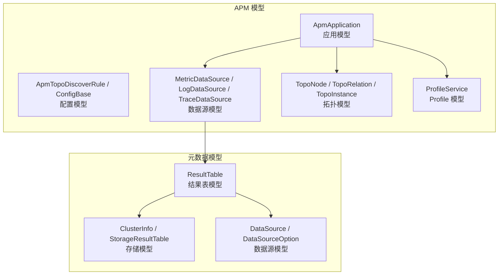
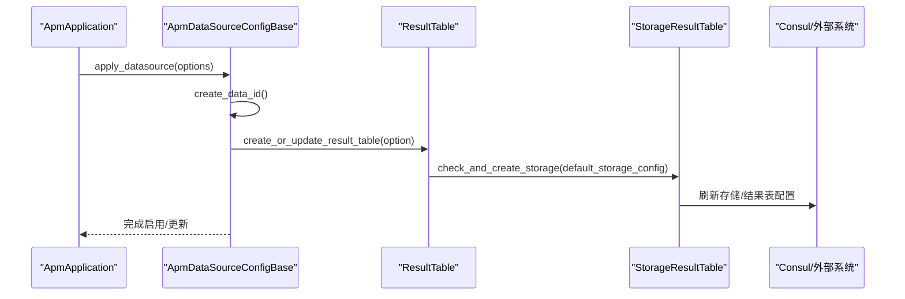
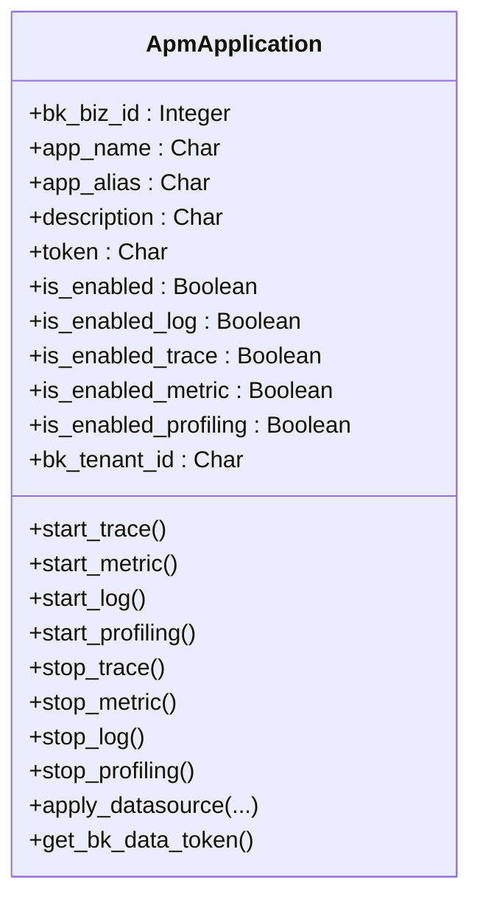
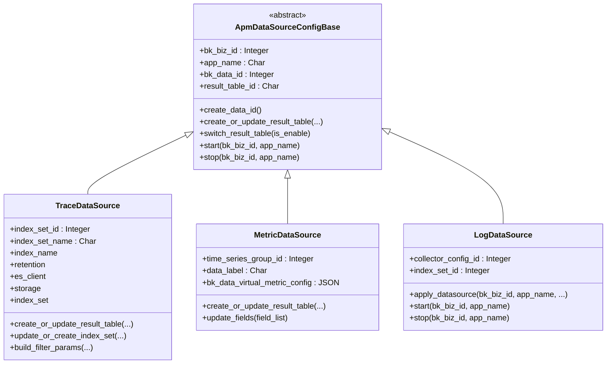
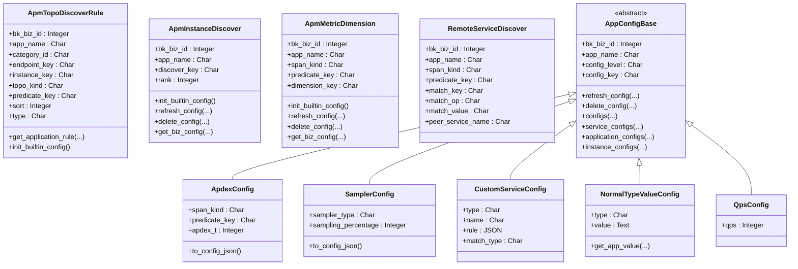
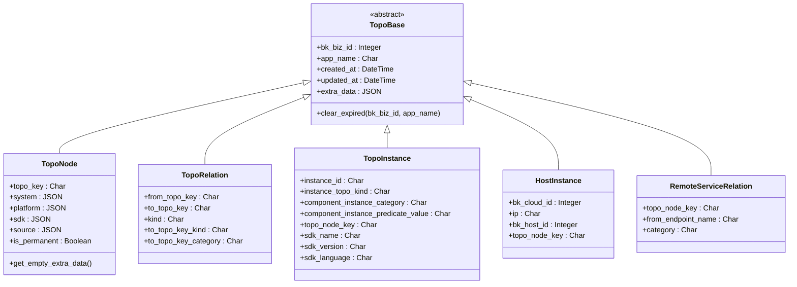
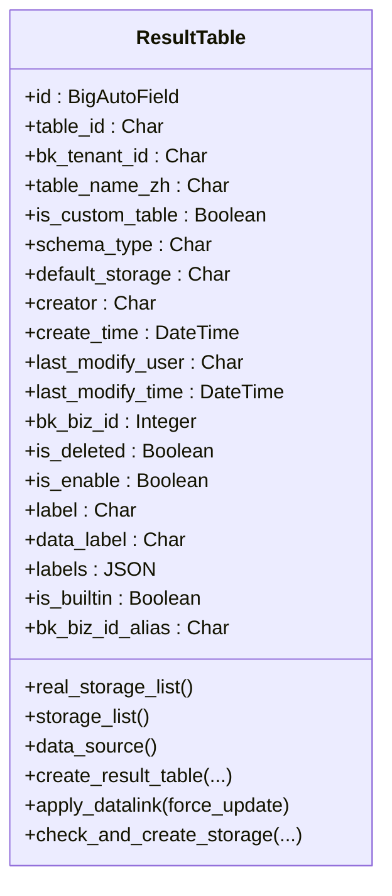
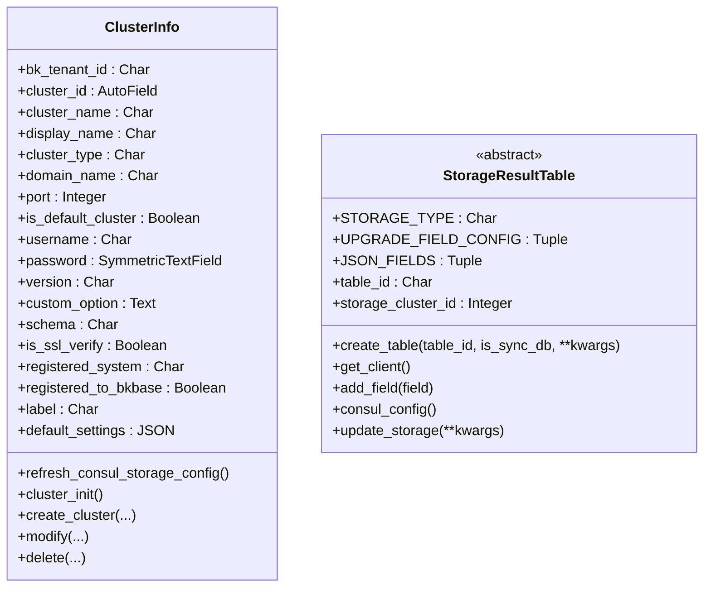
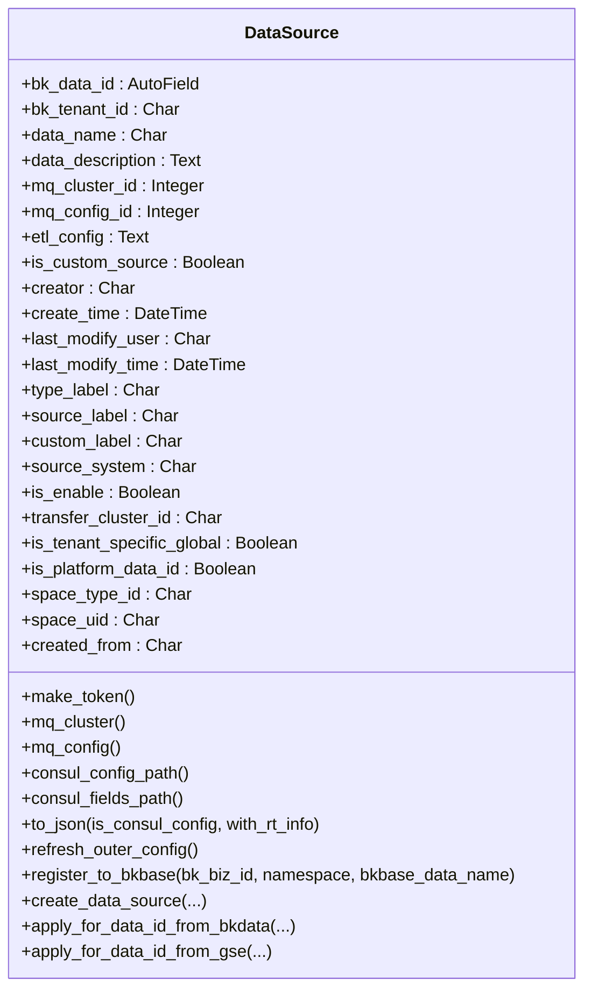
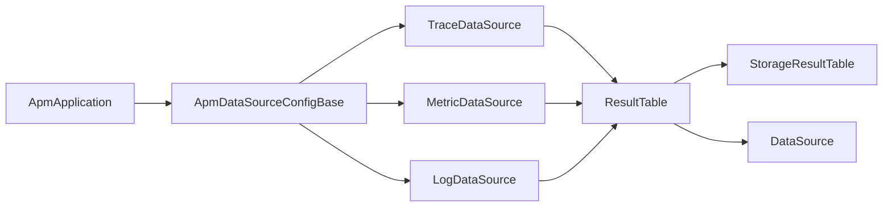

# 数据模型设计

<cite>
**本文引用的文件**
- [bkmonitor/apm/models/application.py](file://bkmonitor/apm/models/application.py)
- [bkmonitor/apm/models/config.py](file://bkmonitor/apm/models/config.py)
- [bkmonitor/apm/models/datasource.py](file://bkmonitor/apm/models/datasource.py)
- [bkmonitor/apm/models/profile.py](file://bkmonitor/apm/models/profile.py)
- [bkmonitor/apm/models/topo.py](file://bkmonitor/apm/models/topo.py)
- [bkmonitor/metadata/models/result_table.py](file://bkmonitor/metadata/models/result_table.py)
- [bkmonitor/metadata/models/storage.py](file://bkmonitor/metadata/models/storage.py)
- [bkmonitor/metadata/models/data_source.py](file://bkmonitor/metadata/models/data_source.py)
- [bkmonitor/apm/models/__init__.py](file://bkmonitor/apm/models/__init__.py)
- [bkmonitor/metadata/models/__init__.py](file://bkmonitor/metadata/models/__init__.py)
</cite>

## 目录
1. [简介](#简介)
2. [项目结构](#项目结构)
3. [核心组件](#核心组件)
4. [架构总览](#架构总览)
5. [详细组件分析](#详细组件分析)
6. [依赖分析](#依赖分析)
7. [性能考量](#性能考量)
8. [故障排查指南](#故障排查指南)
9. [结论](#结论)
10. [附录](#附录)

## 简介
本文件聚焦于蓝鲸监控平台的数据模型设计，系统性梳理监控指标、告警、APM（应用性能管理）、元数据等领域的数据模型定义与实现。内容涵盖字段定义、数据类型选择、关系映射、业务逻辑、继承与抽象基类、外键与级联策略、以及使用示例与最佳实践建议。旨在帮助开发者与运维人员快速理解与高效使用平台数据模型。

## 项目结构
围绕数据模型的关键目录与文件如下：
- APM 模型：apm/models 下包含应用、配置、数据源、拓扑、Profile 等模型
- 元数据模型：metadata/models 下包含结果表、存储、数据源等模型
- 模型导出：各子模块通过 __init__.py 汇总导出，便于统一引用

图表来源
- [bkmonitor/apm/models/application.py:36-343](file://bkmonitor/apm/models/application.py#L36-L343)
- [bkmonitor/apm/models/config.py:36-800](file://bkmonitor/apm/models/config.py#L36-L800)
- [bkmonitor/apm/models/datasource.py:56-800](file://bkmonitor/apm/models/datasource.py#L56-L800)
- [bkmonitor/apm/models/topo.py:23-143](file://bkmonitor/apm/models/topo.py#L23-L143)
- [bkmonitor/apm/models/profile.py:14-30](file://bkmonitor/apm/models/profile.py#L14-L30)
- [bkmonitor/metadata/models/result_table.py:55-800](file://bkmonitor/metadata/models/result_table.py#L55-L800)
- [bkmonitor/metadata/models/storage.py:95-800](file://bkmonitor/metadata/models/storage.py#L95-L800)
- [bkmonitor/metadata/models/data_source.py:66-800](file://bkmonitor/metadata/models/data_source.py#L66-L800)

章节来源
- [bkmonitor/apm/models/__init__.py:11-17](file://bkmonitor/apm/models/__init__.py#L11-L17)
- [bkmonitor/metadata/models/__init__.py:97-172](file://bkmonitor/metadata/models/__init__.py#L97-L172)

## 核心组件
- APM 应用与数据源模型：负责应用生命周期、功能开关、数据源创建与启停、Token 生成与兼容逻辑
- APM 配置模型：拓扑发现规则、实例发现顺序、指标维度配置、采样器与Apdex配置等
- APM 拓扑模型：服务节点、关系、实例、主机实例、远程服务关系等
- APM Profile 模型：Profile 服务实例信息
- 元数据结果表模型：逻辑结果表、字段、选项、存储绑定、数据链路应用
- 元数据存储模型：集群信息、各类存储实现、存储迁移记录
- 元数据数据源模型：数据源、选项、消息队列配置、consul 配置刷新、跨链路注册

章节来源
- [bkmonitor/apm/models/application.py:36-343](file://bkmonitor/apm/models/application.py#L36-L343)
- [bkmonitor/apm/models/config.py:36-800](file://bkmonitor/apm/models/config.py#L36-L800)
- [bkmonitor/apm/models/datasource.py:56-800](file://bkmonitor/apm/models/datasource.py#L56-L800)
- [bkmonitor/apm/models/topo.py:23-143](file://bkmonitor/apm/models/topo.py#L23-L143)
- [bkmonitor/apm/models/profile.py:14-30](file://bkmonitor/apm/models/profile.py#L14-L30)
- [bkmonitor/metadata/models/result_table.py:55-800](file://bkmonitor/metadata/models/result_table.py#L55-L800)
- [bkmonitor/metadata/models/storage.py:95-800](file://bkmonitor/metadata/models/storage.py#L95-L800)
- [bkmonitor/metadata/models/data_source.py:66-800](file://bkmonitor/metadata/models/data_source.py#L66-L800)

## 架构总览
APM 与元数据模型通过“数据源—结果表—存储”的链路协同工作：
- APM 应用创建时联动创建/启用数据源（Trace/Metric/Log/Profile）
- 数据源通过元数据层创建/更新结果表与存储配置
- 结果表与存储通过 Consul/外部系统进行路由与查询配置
- 拓扑与指标维度配置驱动 APM 可观测性分析

图表来源
- [bkmonitor/apm/models/application.py:140-210](file://bkmonitor/apm/models/application.py#L140-L210)
- [bkmonitor/apm/models/datasource.py:175-191](file://bkmonitor/apm/models/datasource.py#L175-L191)
- [bkmonitor/metadata/models/result_table.py:315-564](file://bkmonitor/metadata/models/result_table.py#L315-L564)
- [bkmonitor/metadata/models/storage.py:661-683](file://bkmonitor/metadata/models/storage.py#L661-L683)

## 详细组件分析

### APM 应用模型（ApmApplication）
- 字段与类型
  - 业务ID、应用名、别名、描述、Token、启用状态、功能开关（Trace/Metric/Log/Profiling）、租户ID
- 关系与业务逻辑
  - 唯一约束：业务ID+应用名
  - 提供启停功能：start_* / stop_* 方法分别控制对应数据源
  - Token 生成：优先使用模型内 token，否则基于数据源 data_id 动态生成
  - 异步创建：创建应用后异步创建数据源
- 使用示例
  - 创建应用并配置数据源：见 [create_application(...):224-250](file://bkmonitor/apm/models/application.py#L224-L250)
  - 启用/禁用某类数据源：见 [start_trace / start_metric / start_log / start_profiling:57-131](file://bkmonitor/apm/models/application.py#L57-L131)

图表来源
- [bkmonitor/apm/models/application.py:36-343](file://bkmonitor/apm/models/application.py#L36-L343)

章节来源
- [bkmonitor/apm/models/application.py:36-343](file://bkmonitor/apm/models/application.py#L36-L343)

### APM 数据源模型（Metric/Log/Trace）
- 抽象基类（ApmDataSourceConfigBase）
  - 字段：业务ID、应用名、data_id、结果表ID
  - 行为：创建 data_id、创建/更新结果表、启停结果表、表名/结果表ID生成
- Trace 数据源（TraceDataSource）
  - 特性：ES 存储、动态映射、索引集管理、索引名筛选、保留期、冷热集群配置
  - 过滤参数：基于类别（HTTP/RPC/DB/消息/异步）与 SpanKind
- Metric 数据源（MetricDataSource）
  - 特性：时序分组、默认测量名、字段列表更新
- Log 数据源（LogDataSource）
  - 特性：自定义上报采集器创建/更新、索引集启停

图表来源
- [bkmonitor/apm/models/datasource.py:56-800](file://bkmonitor/apm/models/datasource.py#L56-L800)

章节来源
- [bkmonitor/apm/models/datasource.py:56-800](file://bkmonitor/apm/models/datasource.py#L56-L800)

### APM 配置模型（拓扑/维度/采样/Apdex）
- 拓扑发现规则（ApmTopoDiscoverRule）
  - 字段：业务ID、应用名、分类ID、接口键、实例键、拓扑类型、谓词键、排序、规则类型
  - 缓存：内存缓存规则，支持全局与应用级合并
- 实例发现顺序（ApmInstanceDiscover）
  - 字段：业务ID、应用名、发现键、rank
  - 行为：初始化内置顺序、刷新配置、删除配置
- 指标维度（ApmMetricDimension）
  - 字段：业务ID、应用名、SpanKind、谓词键、维度键
  - 行为：初始化内置维度、刷新配置、删除配置
- 远程服务发现（RemoteServiceDiscover）
  - 字段：业务ID、应用名、SpanKind、谓词键、匹配键、匹配操作、匹配值、远端服务名
- 配置基类（AppConfigBase）
  - 抽象类，提供统一的刷新/删除/查询配置能力
- Apdex 与采样器（ApdexConfig / SamplerConfig）
  - 字段：Apdex T、采样类型与百分比
- 自定义服务配置（CustomServiceConfig）
  - 字段：类型、名称、规则、匹配类型
- 常量值配置（NormalTypeValueConfig）
  - 字段：类型、值
- QPS 配置（QpsConfig）

图表来源
- [bkmonitor/apm/models/config.py:36-800](file://bkmonitor/apm/models/config.py#L36-L800)

章节来源
- [bkmonitor/apm/models/config.py:36-800](file://bkmonitor/apm/models/config.py#L36-L800)

### APM 拓扑模型（TopoNode/TopoRelation/TopoInstance/HostInstance/RemoteServiceRelation）
- 抽象基类（TopoBase）
  - 字段：业务ID、应用名、创建/更新时间、额外数据（JSON）
  - 行为：按应用清理过期数据
- 节点（TopoNode）
  - 字段：节点 key、系统/平台/sdk 信息、来源（telemetry 数据源）、是否永久保存、额外数据
  - 行为：提供空额外数据默认值
- 关系（TopoRelation）
  - 字段：起始/目标节点 key、关系类型（同步/异步）、目标节点类型与分类
- 实例（TopoInstance）
  - 字段：实例 ID、实例类型、组件实例分类/谓词值、所属节点 key、SDK 信息
- 主机实例（HostInstance）
  - 字段：云区域、IP、主机 ID、所属节点 key
- 远程服务关系（RemoteServiceRelation）
  - 字段：所属节点 key、接口名、分类

图表来源
- [bkmonitor/apm/models/topo.py:23-143](file://bkmonitor/apm/models/topo.py#L23-L143)

章节来源
- [bkmonitor/apm/models/topo.py:23-143](file://bkmonitor/apm/models/topo.py#L23-L143)

### APM Profile 模型（ProfileService）
- 字段：业务ID、应用名、服务名、周期/频率、数据类型、采样类型、最近检查时间、是否大数据量、创建/更新时间
- 用途：记录 Profile 服务实例的采样配置与状态

章节来源
- [bkmonitor/apm/models/profile.py:14-30](file://bkmonitor/apm/models/profile.py#L14-L30)

### 元数据结果表模型（ResultTable）
- 字段：主键、结果表ID、租户ID、中文名、是否自定义、schema 类型、默认存储、创建者/时间、启用状态、标签、业务ID、内置标记、别名等
- 关系：与存储实体（ES/InfluxDB/Doris/Kafka/Redis/BkData/Argus）映射
- 行为：创建结果表、刷新 Consul 配置、获取存储列表、应用数据链路（VM/日志/事件组）、清理过期数据链路
- 外键/索引：唯一索引（table_id, bk_tenant_id），常用索引（bk_biz_id, table_id）

图表来源
- [bkmonitor/metadata/models/result_table.py:55-800](file://bkmonitor/metadata/models/result_table.py#L55-L800)

章节来源
- [bkmonitor/metadata/models/result_table.py:55-800](file://bkmonitor/metadata/models/result_table.py#L55-L800)

### 元数据存储模型（ClusterInfo / StorageResultTable）
- 集群信息（ClusterInfo）
  - 字段：租户ID、集群ID、集群名、显示名、类型、域名/端口、默认集群、认证信息、标签、版本、自定义选项、注册系统等
  - 行为：刷新 Consul 存储配置、集群初始化、创建/修改/删除集群
- 存储结果表（StorageResultTable）
  - 抽象类：提供创建表、获取客户端、新增字段、升级字段、存储更新（含 ES 集群迁移记录）
- 实际存储类：ESStorage、InfluxDBStorage、DorisStorage、KafkaStorage、RedisStorage、BkDataStorage、ArgusStorage

图表来源
- [bkmonitor/metadata/models/storage.py:95-800](file://bkmonitor/metadata/models/storage.py#L95-L800)

章节来源
- [bkmonitor/metadata/models/storage.py:95-800](file://bkmonitor/metadata/models/storage.py#L95-L800)

### 元数据数据源模型（DataSource / DataSourceOption）
- 数据源（DataSource）
  - 字段：数据源ID、租户ID、名称、描述、消息队列集群ID、消息队列配置ID、ETL 配置、标签、来源系统、启用状态、transfer 集群ID、平台级标识、空间类型/UID、来源系统
  - 行为：生成 token、获取 MQ 集群/配置、consul 路径、刷新外部配置、注册到 BKDATA、创建数据源（支持 GSE/BKDATA）、空间关系维护、时间单位选项
- 数据源选项（DataSourceOption）
  - 字段：数据源ID、名称、值、创建者/时间
  - 行为：创建/批量创建选项、获取选项

图表来源
- [bkmonitor/metadata/models/data_source.py:66-800](file://bkmonitor/metadata/models/data_source.py#L66-L800)

章节来源
- [bkmonitor/metadata/models/data_source.py:66-800](file://bkmonitor/metadata/models/data_source.py#L66-L800)

## 依赖分析
- APM 应用与数据源
  - ApmApplication 依赖 ApmDataSourceConfigBase 及其子类（Trace/Metric/Log/Profile）
  - 数据源创建/更新依赖元数据层 ResultTable 与存储层 StorageResultTable
- 元数据层
  - ResultTable 与多种存储实体（ES/InfluxDB/Doris/Kafka/Redis/BkData/Argus）建立映射
  - DataSource 与 ResultTable 通过 DataSourceResultTable 建立一对多关系
- 拓扑与指标
  - 拓扑模型（TopoNode/TopoRelation/TopoInstance）与 APM 应用、数据源、配置模型共同支撑 APM 可观测性

图表来源
- [bkmonitor/apm/models/application.py:36-343](file://bkmonitor/apm/models/application.py#L36-L343)
- [bkmonitor/apm/models/datasource.py:56-800](file://bkmonitor/apm/models/datasource.py#L56-L800)
- [bkmonitor/metadata/models/result_table.py:55-800](file://bkmonitor/metadata/models/result_table.py#L55-L800)
- [bkmonitor/metadata/models/storage.py:663-800](file://bkmonitor/metadata/models/storage.py#L663-L800)
- [bkmonitor/metadata/models/data_source.py:66-800](file://bkmonitor/metadata/models/data_source.py#L66-L800)

章节来源
- [bkmonitor/apm/models/application.py:36-343](file://bkmonitor/apm/models/application.py#L36-L343)
- [bkmonitor/apm/models/datasource.py:56-800](file://bkmonitor/apm/models/datasource.py#L56-L800)
- [bkmonitor/metadata/models/result_table.py:55-800](file://bkmonitor/metadata/models/result_table.py#L55-L800)
- [bkmonitor/metadata/models/storage.py:663-800](file://bkmonitor/metadata/models/storage.py#L663-L800)
- [bkmonitor/metadata/models/data_source.py:66-800](file://bkmonitor/metadata/models/data_source.py#L66-L800)

## 性能考量
- 缓存策略
  - APM 配置模型使用内存缓存（locmem）缓存拓扑发现规则，减少 DB 访问
  - 拓扑节点提供缓存装饰器，降低查询开销
- 索引优化
  - 多处模型使用复合索引（如 index_together），提升查询效率
  - 结果表与存储实体通过唯一索引保证全局唯一性与一致性
- 存储与查询
  - Trace 数据源支持冷热集群与索引切片，结合 Retention 控制存储成本
  - Consul 配置刷新集中化，减少重复 IO

章节来源
- [bkmonitor/apm/models/config.py:233-251](file://bkmonitor/apm/models/config.py#L233-L251)
- [bkmonitor/apm/models/topo.py:74-99](file://bkmonitor/apm/models/topo.py#L74-L99)
- [bkmonitor/metadata/models/result_table.py:109-112](file://bkmonitor/metadata/models/result_table.py#L109-L112)
- [bkmonitor/metadata/models/storage.py:210-249](file://bkmonitor/metadata/models/storage.py#L210-L249)
- [bkmonitor/apm/models/datasource.py:628-651](file://bkmonitor/apm/models/datasource.py#L628-L651)

## 故障排查指南
- 数据源创建失败
  - 检查数据源名称与租户唯一性、ETL 配置合法性、MQ 集群可用性
  - 参考：[create_data_source:502-790](file://bkmonitor/metadata/models/data_source.py#L502-L790)
- 结果表创建异常
  - 校验标签存在性、table_id 唯一性、业务 ID 规范、默认存储配置
  - 参考：[create_result_table:315-564](file://bkmonitor/metadata/models/result_table.py#L315-L564)
- 存储迁移与路由
  - ES 集群迁移后需更新存储记录并刷新路由
  - 参考：[update_storage:703-794](file://bkmonitor/metadata/models/storage.py#L703-L794)
- APM 数据源启停
  - 确认数据源存在、启用状态与结果表状态一致
  - 参考：[start/stop 方法族:113-131](file://bkmonitor/apm/models/application.py#L113-L131)

章节来源
- [bkmonitor/metadata/models/data_source.py:502-790](file://bkmonitor/metadata/models/data_source.py#L502-L790)
- [bkmonitor/metadata/models/result_table.py:315-564](file://bkmonitor/metadata/models/result_table.py#L315-L564)
- [bkmonitor/metadata/models/storage.py:703-794](file://bkmonitor/metadata/models/storage.py#L703-L794)
- [bkmonitor/apm/models/application.py:113-131](file://bkmonitor/apm/models/application.py#L113-L131)

## 结论
本数据模型设计以“应用—数据源—结果表—存储—拓扑/指标配置”为主线，实现了可观测性数据的全链路闭环。通过抽象基类与统一接口，提升了扩展性与复用性；通过缓存、索引与 Consul 配置刷新，保障了性能与一致性。建议在实际使用中遵循模型职责边界、关注外键与唯一约束、合理利用缓存与索引，并在变更时同步更新外部配置。

## 附录
- 最佳实践
  - 应用创建后异步创建数据源，避免阻塞主流程
  - 合理设置 Retention 与冷热策略，平衡成本与性能
  - 使用内存缓存承载热点配置，定期校验缓存一致性
  - 严格遵守唯一约束与标签规范，确保结果表与数据源可追溯
- 常用路径
  - APM 应用与数据源：[application.py:36-343](file://bkmonitor/apm/models/application.py#L36-L343)、[datasource.py:56-800](file://bkmonitor/apm/models/datasource.py#L56-L800)
  - APM 配置与拓扑：[config.py:36-800](file://bkmonitor/apm/models/config.py#L36-L800)、[topo.py:23-143](file://bkmonitor/apm/models/topo.py#L23-L143)
  - 元数据结果表与存储：[result_table.py:55-800](file://bkmonitor/metadata/models/result_table.py#L55-L800)、[storage.py:95-800](file://bkmonitor/metadata/models/storage.py#L95-L800)
  - 元数据数据源：[data_source.py:66-800](file://bkmonitor/metadata/models/data_source.py#L66-L800)