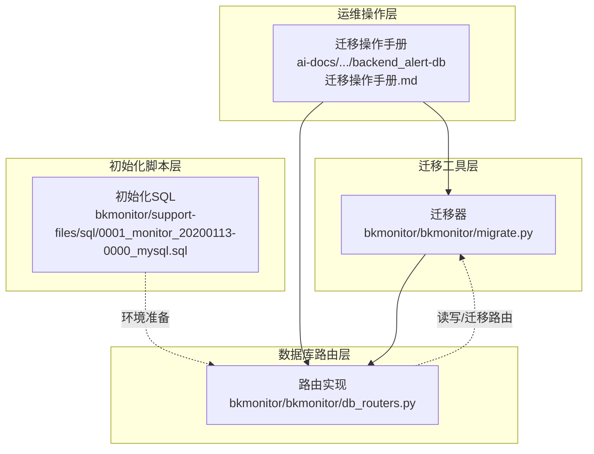
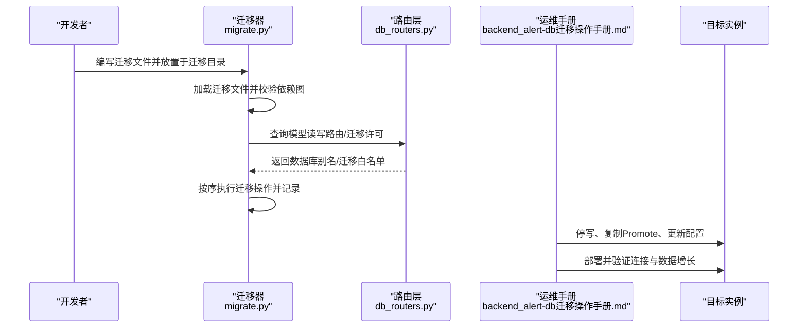
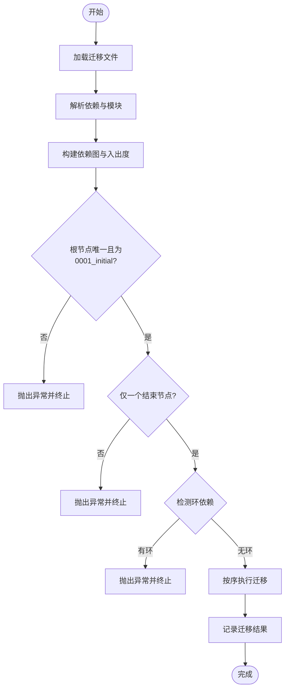
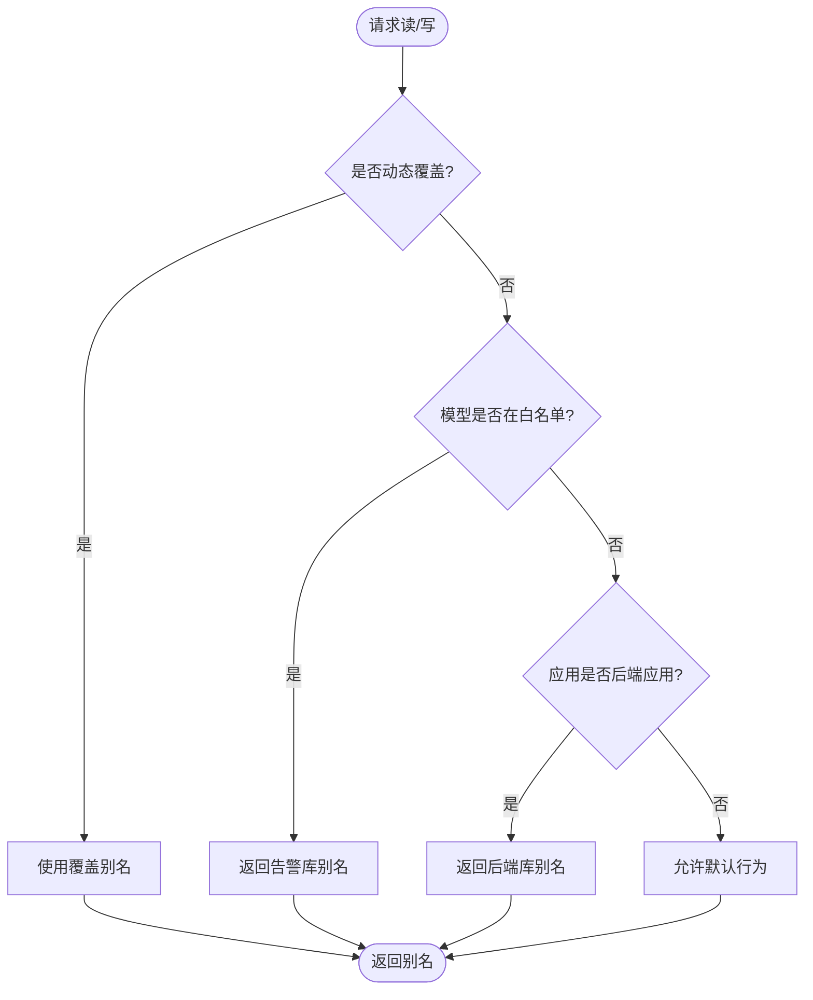
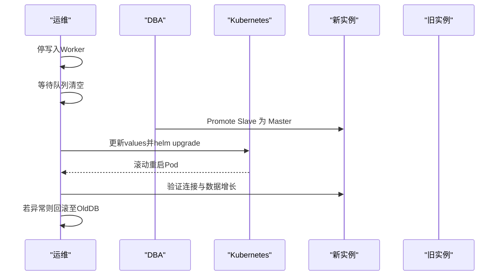
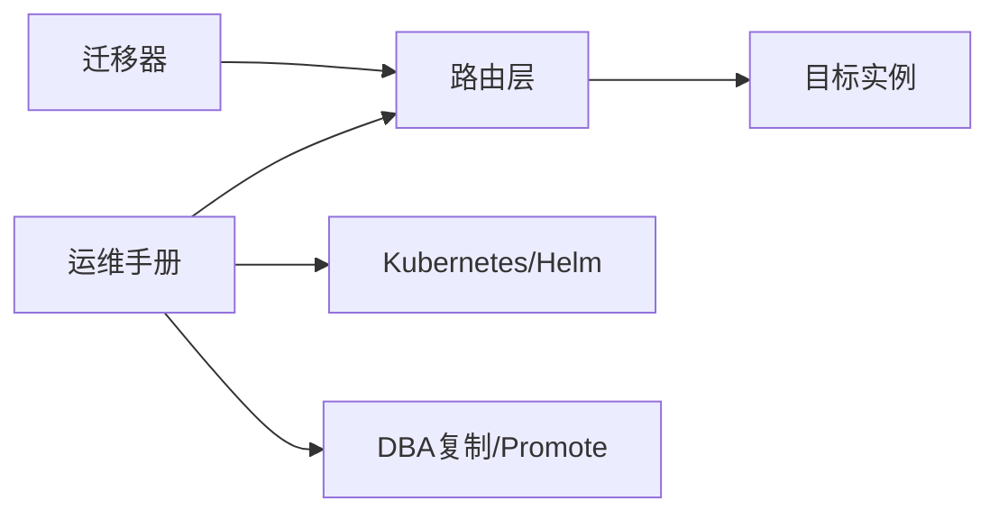

# 数据迁移方案

<cite>
**本文引用的文件**
- [bkmonitor\bkmonitor\migrate.py](file://bkmonitor/bkmonitor/migrate.py)
- [bkmonitor\bkmonitor\db_routers.py](file://bkmonitor/bkmonitor/db_routers.py)
- [ai-docs\bk-monitor\docs\告警后台(alarm_backends)\backend_alert-db迁移操作手册.md](file://ai-docs/bk-monitor/docs/告警后台(alarm_backends)/backend_alert-db迁移操作手册.md)
- [bkmonitor\support-files\sql\0001_monitor_20200113-0000_mysql.sql](file://bkmonitor/support-files/sql/0001_monitor_20200113-0000_mysql.sql)
</cite>

## 目录
1. [简介](#简介)
2. [项目结构](#项目结构)
3. [核心组件](#核心组件)
4. [架构总览](#架构总览)
5. [详细组件分析](#详细组件分析)
6. [依赖分析](#依赖分析)
7. [性能考虑](#性能考虑)
8. [故障排查指南](#故障排查指南)
9. [结论](#结论)
10. [附录](#附录)

## 简介
本方案围绕监控系统的数据库迁移设计与实施，系统性阐述迁移设计模式、版本控制策略、自动化流程与回滚机制；明确增量迁移、批量迁移与零停机迁移的实施方案；给出迁移测试策略、数据验证方法与性能影响评估；并提供风险控制、监控告警与应急处理建议，以及迁移工具的使用与维护策略。本文以仓库内现有迁移实现与运维手册为基础，结合数据库路由与迁移工具，形成可落地的迁移蓝图。

## 项目结构
- 迁移工具层：提供通用迁移加载、依赖校验与执行能力，确保迁移顺序与完整性。
- 数据库路由层：根据模型与应用标签动态选择数据库别名，支撑多实例分离与零侵入迁移。
- 运维操作层：提供针对特定业务库（如告警后台）的迁移操作手册，定义停写、复制、Promote、部署与验证流程。
- 初始化脚本层：提供数据库初始化 SQL，保障基础环境准备。

**图表来源**
- [bkmonitor\bkmonitor\migrate.py:1-164](file://bkmonitor/bkmonitor/migrate.py#L1-L164)
- [bkmonitor\bkmonitor\db_routers.py:1-168](file://bkmonitor/bkmonitor/db_routers.py#L1-L168)
- [ai-docs\bk-monitor\docs\告警后台(alarm_backends)\backend_alert-db迁移操作手册.md](file://ai-docs/bk-monitor/docs/告警后台(alarm_backends)/backend_alert-db迁移操作手册.md#L1-L237)
- [bkmonitor\support-files\sql\0001_monitor_20200113-0000_mysql.sql:1-3](file://bkmonitor/support-files/sql/0001_monitor_20200113-0000_mysql.sql#L1-L3)

**章节来源**
- [bkmonitor\bkmonitor\migrate.py:1-164](file://bkmonitor/bkmonitor/migrate.py#L1-L164)
- [bkmonitor\bkmonitor\db_routers.py:1-168](file://bkmonitor/bkmonitor/db_routers.py#L1-L168)
- [ai-docs\bk-monitor\docs\告警后台(alarm_backends)\backend_alert-db迁移操作手册.md](file://ai-docs/bk-monitor/docs/告警后台(alarm_backends)/backend_alert-db迁移操作手册.md#L1-L237)
- [bkmonitor\support-files\sql\0001_monitor_20200113-0000_mysql.sql:1-3](file://bkmonitor/support-files/sql/0001_monitor_20200113-0000_mysql.sql#L1-L3)

## 核心组件
- 迁移器与迁移基类
  - 提供迁移文件命名规范、依赖解析、有向无环图校验与执行顺序推演。
  - 支持按序执行迁移操作，并记录已执行迁移，避免重复执行。
- 数据库路由
  - 基于模型对象名与应用标签动态选择数据库别名，支持告警后台专用库的白名单路由。
  - 提供迁移阶段的白名单守卫，限制迁移目标库与模型范围。
- 运维操作手册
  - 针对告警后台三张表的迁移，提供停写、复制延迟归零、Slave Promote、配置更新与部署验证的完整流程。
- 初始化脚本
  - 提供数据库初始化 SQL，确保目标实例具备必要的数据库与字符集设置。

**章节来源**
- [bkmonitor\bkmonitor\migrate.py:18-164](file://bkmonitor/bkmonitor/migrate.py#L18-L164)
- [bkmonitor\bkmonitor\db_routers.py:23-97](file://bkmonitor/bkmonitor/db_routers.py#L23-L97)
- [ai-docs\bk-monitor\docs\告警后台(alarm_backends)\backend_alert-db迁移操作手册.md](file://ai-docs/bk-monitor/docs/告警后台(alarm_backends)/backend_alert-db迁移操作手册.md#L1-L237)
- [bkmonitor\support-files\sql\0001_monitor_20200113-0000_mysql.sql:1-3](file://bkmonitor/support-files/sql/0001_monitor_20200113-0000_mysql.sql#L1-L3)

## 架构总览
下图展示迁移生命周期：从迁移器加载与校验，到路由层决定读写与迁移目标，再到运维流程驱动配置变更与部署验证。

**图表来源**
- [bkmonitor\bkmonitor\migrate.py:37-161](file://bkmonitor/bkmonitor/migrate.py#L37-L161)
- [bkmonitor\bkmonitor\db_routers.py:45-97](file://bkmonitor/bkmonitor/db_routers.py#L45-L97)
- [ai-docs\bk-monitor\docs\告警后台(alarm_backends)\backend_alert-db迁移操作手册.md](file://ai-docs/bk-monitor/docs/告警后台(alarm_backends)/backend_alert-db迁移操作手册.md#L76-L170)

## 详细组件分析

### 迁移器与迁移基类
- 设计要点
  - 迁移文件命名规范与模块导入策略，确保可发现性与可执行性。
  - 依赖图构建与拓扑校验：根节点唯一、结束节点唯一、无环、覆盖完整。
  - 迁移执行：按依赖顺序遍历，跳过已执行项，逐个调用迁移操作并落库记录。
- 关键流程
  - 加载与依赖校验：扫描迁移目录、解析依赖、构建邻接关系与入出度。
  - 执行与记录：从根迁移开始，遍历执行，写入迁移记录表。
- 错误处理
  - 缺失根迁移、非根入度异常、多结束节点、环依赖、无迁移记录表等均抛出异常并终止。

**图表来源**
- [bkmonitor\bkmonitor\migrate.py:37-161](file://bkmonitor/bkmonitor/migrate.py#L37-L161)

**章节来源**
- [bkmonitor\bkmonitor\migrate.py:18-164](file://bkmonitor/bkmonitor/migrate.py#L18-L164)

### 数据库路由与迁移白名单
- 设计要点
  - 通过模型对象名白名单将特定模型路由至专用数据库别名，实现“逻辑分库”。
  - 在迁移阶段启用 allow_migrate 白名单守卫，限定迁移目标库与模型集合。
  - 提供动态覆盖能力，便于测试与特殊场景强制指定数据库。
- 关键流程
  - 读写路由：优先命中白名单模型，其次按应用标签路由至后端库或默认库。
  - 迁移路由：仅允许白名单模型在专用库迁移，禁止在其他库迁移。
- 风险控制
  - 通过白名单守卫避免误迁，降低 schema 污染风险。

**图表来源**
- [bkmonitor\bkmonitor\db_routers.py:45-97](file://bkmonitor/bkmonitor/db_routers.py#L45-L97)

**章节来源**
- [bkmonitor\bkmonitor\db_routers.py:23-97](file://bkmonitor/bkmonitor/db_routers.py#L23-L97)

### 运维迁移流程（零停机示例）
- 前提条件
  - 新实例已建立并开启实时复制，复制延迟归零。
  - 已制定回滚方案与验证清单。
- 流程步骤
  - 停写入侧 Worker，确保无新增写入。
  - 等待队列清空，确认无积压。
  - DBA 将 Slave 提升为新 Master，断开旧主。
  - 更新 Helm values 中的连接配置，指向新实例。
  - 部署并验证：Pod 重启后连接新库，读写路由生效，数据持续增长。
- 回滚
  - 快速回滚至旧库配置，重启 Worker；新库期间写入数据可评估是否同步回旧库。

**图表来源**
- [ai-docs\bk-monitor\docs\告警后台(alarm_backends)\backend_alert-db迁移操作手册.md](file://ai-docs/bk-monitor/docs/告警后台(alarm_backends)/backend_alert-db迁移操作手册.md#L76-L213)

**章节来源**
- [ai-docs\bk-monitor\docs\告警后台(alarm_backends)\backend_alert-db迁移操作手册.md](file://ai-docs/bk-monitor/docs/告警后台(alarm_backends)/backend_alert-db迁移操作手册.md#L67-L213)

### 初始化脚本与环境准备
- 作用
  - 提供数据库初始化 SQL，确保目标实例具备所需数据库与字符集。
- 使用建议
  - 在部署前执行，确保迁移与业务启动时具备正确的数据库环境。

**章节来源**
- [bkmonitor\support-files\sql\0001_monitor_20200113-0000_mysql.sql:1-3](file://bkmonitor/support-files/sql/0001_monitor_20200113-0000_mysql.sql#L1-L3)

## 依赖分析
- 组件耦合
  - 迁移器依赖路由层提供的读写与迁移许可决策。
  - 运维手册依赖路由层的白名单与别名配置，确保迁移目标与范围可控。
- 外部依赖
  - Kubernetes/Helm 用于滚动更新与配置下发。
  - DBA 复制与 Promote 流程确保数据一致性与切换点确定。
- 潜在风险
  - 路由白名单大小写不一致可能导致 allow_migrate 守卫失效，引发误迁。
  - 迁移依赖图存在环或非唯一结束节点会导致执行失败。

**图表来源**
- [bkmonitor\bkmonitor\migrate.py:123-161](file://bkmonitor/bkmonitor/migrate.py#L123-L161)
- [bkmonitor\bkmonitor\db_routers.py:75-97](file://bkmonitor/bkmonitor/db_routers.py#L75-L97)
- [ai-docs\bk-monitor\docs\告警后台(alarm_backends)\backend_alert-db迁移操作手册.md](file://ai-docs/bk-monitor/docs/告警后台(alarm_backends)/backend_alert-db迁移操作手册.md#L76-L152)

**章节来源**
- [bkmonitor\bkmonitor\migrate.py:67-122](file://bkmonitor/bkmonitor/migrate.py#L67-L122)
- [bkmonitor\bkmonitor\db_routers.py:75-97](file://bkmonitor/bkmonitor/db_routers.py#L75-L97)
- [ai-docs\bk-monitor\docs\告警后台(alarm_backends)\backend_alert-db迁移操作手册.md](file://ai-docs/bk-monitor/docs/告警后台(alarm_backends)/backend_alert-db迁移操作手册.md#L50-L63)

## 性能考虑
- 迁移窗口与资源占用
  - 停写入窗口越短，迁移对业务的影响越小；需配合复制延迟归零与队列清空。
- 连接超时与阻塞
  - 配置合理的连接超时参数，避免因网络波动导致的长时间阻塞。
- 部署滚动更新
  - 采用滚动重启降低对在线服务的影响，确保读写路由即时生效。

[本节为通用指导，无需具体文件分析]

## 故障排查指南
- 迁移器报错
  - 缺失根迁移：检查迁移目录是否存在根迁移文件。
  - 非根入度异常：检查依赖声明是否遗漏前置迁移。
  - 多结束节点：确保仅存在一个最终迁移。
  - 环依赖：修正迁移依赖，消除循环引用。
- 路由白名单问题
  - 模型名称大小写不一致导致 allow_migrate 守卫失效，应统一为小写。
- 迁移后验证
  - 确认读写路由已指向新库，连接可用，数据持续增长。
  - 观察 Worker CPU/内存与队列长度，确保无异常积压。

**章节来源**
- [bkmonitor\bkmonitor\migrate.py:70-122](file://bkmonitor/bkmonitor/migrate.py#L70-L122)
- [bkmonitor\bkmonitor\db_routers.py:75-97](file://bkmonitor/bkmonitor/db_routers.py#L75-L97)
- [ai-docs\bk-monitor\docs\告警后台(alarm_backends)\backend_alert-db迁移操作手册.md](file://ai-docs/bk-monitor/docs/告警后台(alarm_backends)/backend_alert-db迁移操作手册.md#L173-L213)

## 结论
本方案以“路由隔离 + 迁移器校验 + 运维手册流程”的组合实现数据库迁移的可控、可回滚与低风险。通过白名单守卫与严格的依赖图校验，确保迁移目标与顺序正确；通过停写、复制 Promote 与滚动部署，达成零停机迁移目标；通过完善的验证与监控，保障迁移质量与稳定性。

[本节为总结，无需具体文件分析]

## 附录

### 迁移设计模式与版本控制策略
- 设计模式
  - 路由隔离：通过模型白名单与应用标签实现逻辑分库。
  - 迁移器：集中式加载、依赖校验与顺序执行。
  - 运维编排：以手册化流程固化停写、Promote、部署与验证。
- 版本控制
  - 迁移文件命名与依赖声明构成线性演进序列，确保可追溯与可回滚。
  - 迁移记录表用于幂等执行，避免重复迁移。

**章节来源**
- [bkmonitor\bkmonitor\migrate.py:23-164](file://bkmonitor/bkmonitor/migrate.py#L23-L164)
- [bkmonitor\bkmonitor\db_routers.py:23-97](file://bkmonitor/bkmonitor/db_routers.py#L23-L97)

### 自动化流程与回滚机制
- 自动化
  - 迁移器自动加载与执行，路由层自动决策读写与迁移许可。
  - Helm 升级自动下发新配置并滚动重启。
- 回滚
  - 快速回滚至旧库配置，重启 Worker；新库期间写入数据可评估同步。

**章节来源**
- [bkmonitor\bkmonitor\migrate.py:123-164](file://bkmonitor/bkmonitor/migrate.py#L123-L164)
- [ai-docs\bk-monitor\docs\告警后台(alarm_backends)\backend_alert-db迁移操作手册.md](file://ai-docs/bk-monitor/docs/告警后台(alarm_backends)/backend_alert-db迁移操作手册.md#L202-L213)

### 增量迁移、批量迁移与零停机迁移
- 增量迁移
  - 通过路由白名单将新增模型定向至新库，逐步替换旧库。
- 批量迁移
  - 以运维手册为蓝本，停写入侧 Worker，Promote 新实例，滚动部署。
- 零停机迁移
  - 基于复制延迟归零与滚动更新，确保业务连续性。

**章节来源**
- [ai-docs\bk-monitor\docs\告警后台(alarm_backends)\backend_alert-db迁移操作手册.md](file://ai-docs/bk-monitor/docs/告警后台(alarm_backends)/backend_alert-db迁移操作手册.md#L76-L170)

### 迁移测试策略与数据验证
- 测试策略
  - 在预生产环境复现迁移流程，验证路由与迁移器行为。
  - 对比迁移前后数据一致性与路由别名。
- 数据验证
  - 验证读写路由指向新库，连接可用，数据持续增长。
  - 观察 Worker 指标与队列长度，确保无异常。

**章节来源**
- [ai-docs\bk-monitor\docs\告警后台(alarm_backends)\backend_alert-db迁移操作手册.md](file://ai-docs/bk-monitor/docs/告警后台(alarm_backends)/backend_alert-db迁移操作手册.md#L173-L200)

### 性能影响评估与监控告警
- 影响评估
  - 停写入窗口、复制延迟、连接超时与滚动更新节奏共同决定迁移窗口与资源占用。
- 监控告警
  - 关注 Worker CPU/内存、队列长度与处理延迟指标，确保迁移后系统稳定。

**章节来源**
- [ai-docs\bk-monitor\docs\告警后台(alarm_backends)\backend_alert-db迁移操作手册.md](file://ai-docs/bk-monitor/docs/告警后台(alarm_backends)/backend_alert-db迁移操作手册.md#L189-L199)

### 迁移工具使用与维护策略
- 使用
  - 迁移器自动加载与执行，无需手工干预；路由层自动决策。
- 维护
  - 定期校验路由白名单大小写一致性，避免 allow_migrate 守卫失效。
  - 保持迁移文件命名与依赖声明规范，确保依赖图健康。

**章节来源**
- [bkmonitor\bkmonitor\migrate.py:23-164](file://bkmonitor/bkmonitor/migrate.py#L23-L164)
- [bkmonitor\bkmonitor\db_routers.py:75-97](file://bkmonitor/bkmonitor/db_routers.py#L75-L97)
- [ai-docs\bk-monitor\docs\告警后台(alarm_backends)\backend_alert-db迁移操作手册.md](file://ai-docs/bk-monitor/docs/告警后台(alarm_backends)/backend_alert-db迁移操作手册.md#L50-L63)