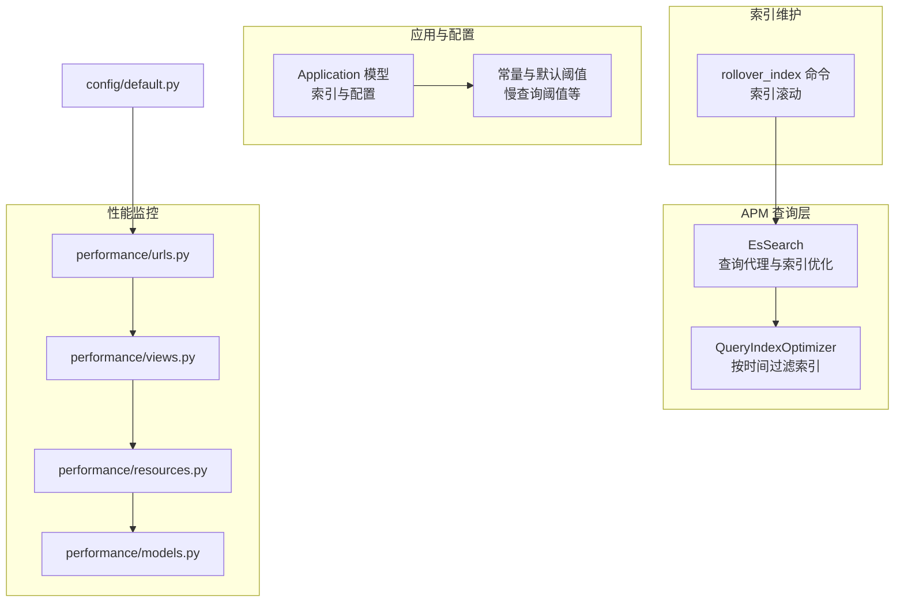
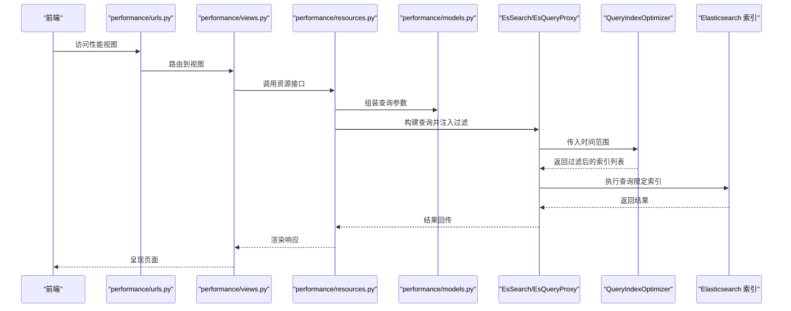
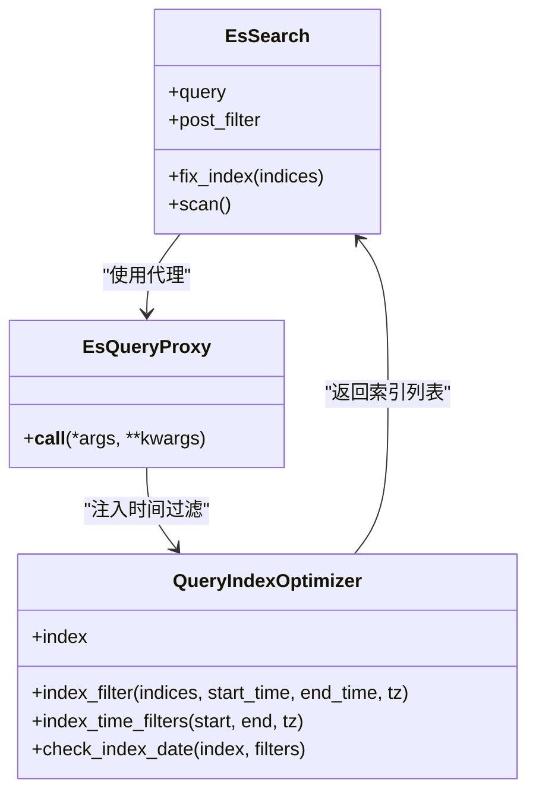
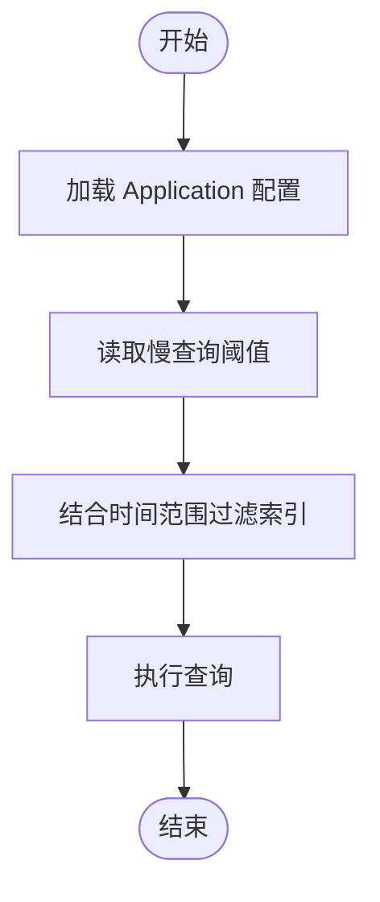
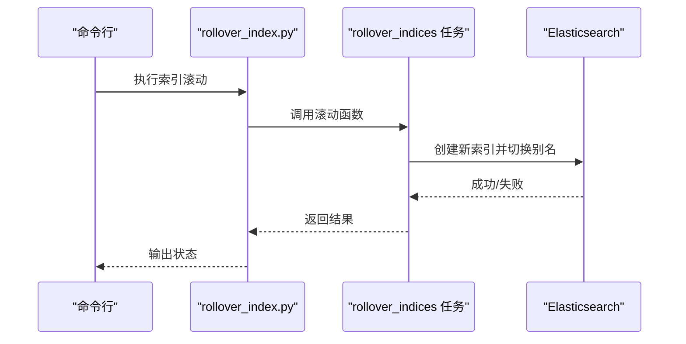
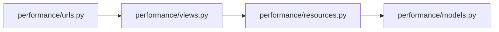
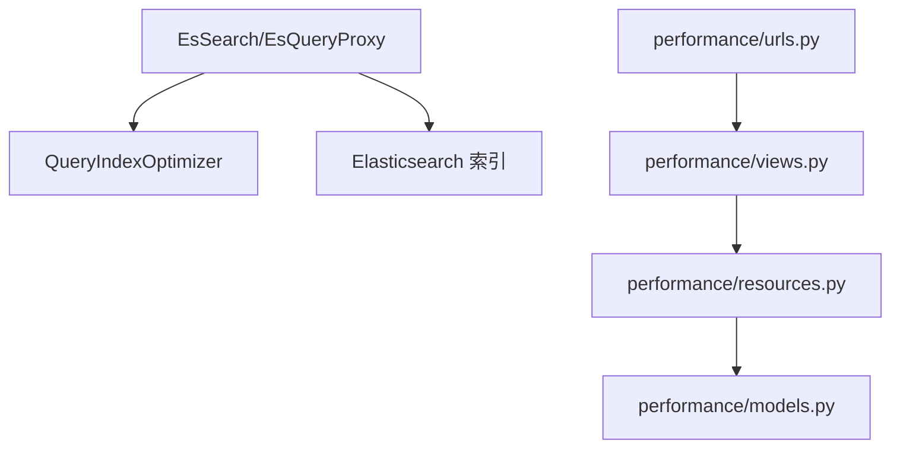

# 索引优化策略

<cite>
**本文引用的文件**
- [es_search.py](file://bkmonitor/apm/utils/es_search.py)
- [application.py](file://bkmonitor/packages/apm_web/models/application.py)
- [constants.py](file://bkmonitor/packages/apm_web/constants.py)
- [rollover_index.py](file://bkmonitor/bkmonitor/management/commands/rollover_index.py)
- [default.py](file://bkmonitor/config/default.py)
- [performance/views.py](file://bkmonitor/packages/monitor_web/performance/views.py)
- [performance/urls.py](file://bkmonitor/packages/monitor_web/performance/urls.py)
- [performance/resources.py](file://bkmonitor/packages/monitor_web/performance/resources.py)
- [performance/models.py](file://bkmonitor/packages/monitor_web/performance/models.py)
</cite>

## 目录
1. [简介](#简介)
2. [项目结构](#项目结构)
3. [核心组件](#核心组件)
4. [架构总览](#架构总览)
5. [详细组件分析](#详细组件分析)
6. [依赖分析](#依赖分析)
7. [性能考量](#性能考量)
8. [故障排查指南](#故障排查指南)
9. [结论](#结论)
10. [附录](#附录)

## 简介
本文件面向数据库索引优化策略，结合仓库中现有的 Elasticsearch 查询索引优化、慢查询阈值配置与索引滚动管理等实现，系统阐述索引设计原则、查询性能分析方法、慢查询优化技巧、索引使用监控、索引维护策略（重建与统计更新）以及不同查询类型的索引设计方案与对比。文档同时提供最佳实践与常见陷阱，帮助读者在实际工程中制定可落地的索引优化方案。

## 项目结构
围绕索引优化的相关代码主要分布在以下模块：
- APM 查询层：基于 Elasticsearch DSL 的查询代理与索引选择优化
- 应用模型与常量：定义慢查询阈值、默认配置等
- 索引滚动管理：索引滚动与清理的运维命令
- 性能监控页面：前端性能视图与资源定义
- 配置入口：URL 路由与默认配置

**图表来源**
- [es_search.py:88-136](file://bkmonitor/apm/utils/es_search.py#L88-L136)
- [es_search.py:168-282](file://bkmonitor/apm/utils/es_search.py#L168-L282)
- [application.py:64-214](file://bkmonitor/packages/apm_web/models/application.py#L64-L214)
- [constants.py:935-946](file://bkmonitor/packages/apm_web/constants.py#L935-L946)
- [rollover_index.py:17-20](file://bkmonitor/bkmonitor/management/commands/rollover_index.py#L17-L20)
- [performance/urls.py:14-14](file://bkmonitor/packages/monitor_web/performance/urls.py#L14-L14)
- [performance/views.py:1-50](file://bkmonitor/packages/monitor_web/performance/views.py#L1-L50)
- [performance/resources.py:1-50](file://bkmonitor/packages/monitor_web/performance/resources.py#L1-L50)
- [performance/models.py:1-50](file://bkmonitor/packages/monitor_web/performance/models.py#L1-L50)
- [default.py:318-318](file://bkmonitor/config/default.py#L318-L318)

**章节来源**
- [es_search.py:88-136](file://bkmonitor/apm/utils/es_search.py#L88-L136)
- [es_search.py:168-282](file://bkmonitor/apm/utils/es_search.py#L168-L282)
- [application.py:64-214](file://bkmonitor/packages/apm_web/models/application.py#L64-L214)
- [constants.py:935-946](file://bkmonitor/packages/apm_web/constants.py#L935-L946)
- [rollover_index.py:17-20](file://bkmonitor/bkmonitor/management/commands/rollover_index.py#L17-L20)
- [performance/urls.py:14-14](file://bkmonitor/packages/monitor_web/performance/urls.py#L14-L14)
- [performance/views.py:1-50](file://bkmonitor/packages/monitor_web/performance/views.py#L1-L50)
- [performance/resources.py:1-50](file://bkmonitor/packages/monitor_web/performance/resources.py#L1-L50)
- [performance/models.py:1-50](file://bkmonitor/packages/monitor_web/performance/models.py#L1-L50)
- [default.py:318-318](file://bkmonitor/config/default.py#L318-L318)

## 核心组件
- 查询代理与索引优化
  - EsSearch/EsQueryProxy：在查询构建阶段注入时间范围过滤，动态缩小目标索引集合，减少扫描范围
  - QueryIndexOptimizer：根据起止时间生成“日”或“月”粒度的索引过滤模板，匹配符合时间范围的索引集合
- 应用模型与慢查询阈值
  - Application 模型：承载应用配置，包含数据库慢查询阈值等配置项
  - constants：定义默认慢查询阈值、DB 配置键等
- 索引滚动管理
  - rollover_index 命令：触发索引滚动任务，配合时间序列索引生命周期管理
- 性能监控页面
  - performance 模块：提供性能视图与资源接口，便于观测查询与索引使用情况

**章节来源**
- [es_search.py:88-136](file://bkmonitor/apm/utils/es_search.py#L88-L136)
- [es_search.py:168-282](file://bkmonitor/apm/utils/es_search.py#L168-L282)
- [application.py:64-214](file://bkmonitor/packages/apm_web/models/application.py#L64-L214)
- [constants.py:935-946](file://bkmonitor/packages/apm_web/constants.py#L935-L946)
- [rollover_index.py:17-20](file://bkmonitor/bkmonitor/management/commands/rollover_index.py#L17-L20)

## 架构总览
下图展示了查询优化的关键流程：前端请求经由性能视图路由到后端资源，资源层构造查询并利用 EsSearch 的代理能力，按时间范围筛选索引，最终命中最小化的索引集合执行查询。

**图表来源**
- [performance/urls.py:14-14](file://bkmonitor/packages/monitor_web/performance/urls.py#L14-L14)
- [performance/views.py:1-50](file://bkmonitor/packages/monitor_web/performance/views.py#L1-L50)
- [performance/resources.py:1-50](file://bkmonitor/packages/monitor_web/performance/resources.py#L1-L50)
- [performance/models.py:1-50](file://bkmonitor/packages/monitor_web/performance/models.py#L1-L50)
- [es_search.py:88-136](file://bkmonitor/apm/utils/es_search.py#L88-L136)
- [es_search.py:168-282](file://bkmonitor/apm/utils/es_search.py#L168-L282)

## 详细组件分析

### 组件一：查询代理与索引优化（EsSearch/EsQueryProxy/QueryIndexOptimizer）
- 设计要点
  - 在查询构建阶段注入时间范围过滤，避免扫描全量索引
  - 根据查询时间跨度智能选择“日”或“月”粒度的索引过滤模板，提升匹配效率
  - 支持对索引列表进行二次过滤，确保最终命中索引集合最小化
- 复杂度与性能
  - 时间复杂度主要受索引数量与过滤模板匹配影响；通过模板预编译与集合去重降低开销
  - 减少扫描范围可显著降低查询延迟与集群负载
- 错误处理
  - 当索引过滤结果为空时，查询将不会命中任何索引，需确保时间范围与索引命名规范一致

**图表来源**
- [es_search.py:88-136](file://bkmonitor/apm/utils/es_search.py#L88-L136)
- [es_search.py:168-282](file://bkmonitor/apm/utils/es_search.py#L168-L282)

**章节来源**
- [es_search.py:88-136](file://bkmonitor/apm/utils/es_search.py#L88-L136)
- [es_search.py:168-282](file://bkmonitor/apm/utils/es_search.py#L168-L282)

### 组件二：应用模型与慢查询阈值（Application/Constants）
- 设计要点
  - Application 模型中包含数据库慢查询阈值配置项，用于识别慢 SQL
  - constants 中定义默认阈值与相关键名，作为系统默认行为
- 使用建议
  - 不同业务场景可按需调整阈值，避免误报或漏报
  - 结合 QueryIndexOptimizer 的索引过滤，可在更小索引范围内定位慢查询

**图表来源**
- [application.py:64-214](file://bkmonitor/packages/apm_web/models/application.py#L64-L214)
- [constants.py:935-946](file://bkmonitor/packages/apm_web/constants.py#L935-L946)

**章节来源**
- [application.py:64-214](file://bkmonitor/packages/apm_web/models/application.py#L64-L214)
- [constants.py:935-946](file://bkmonitor/packages/apm_web/constants.py#L935-L946)

### 组件三：索引滚动管理（rollover_index）
- 设计要点
  - rollover_index 命令触发索引滚动任务，配合时间序列索引生命周期管理策略
  - 通过滚动新索引，可实现热/温/冷数据分层与容量管理
- 维护建议
  - 定期执行滚动，避免单索引过大导致查询与备份压力
  - 结合 QueryIndexOptimizer 的索引过滤，滚动后的新索引可更快被命中

**图表来源**
- [rollover_index.py:17-20](file://bkmonitor/bkmonitor/management/commands/rollover_index.py#L17-L20)

**章节来源**
- [rollover_index.py:17-20](file://bkmonitor/bkmonitor/management/commands/rollover_index.py#L17-L20)

### 组件四：性能监控页面（performance 模块）
- 设计要点
  - performance/urls.py 将性能视图路由到 views.py
  - views.py 通过 resources.py 调用底层资源，resources.py 再访问 models.py 的具体实现
  - 该链路可用于观测查询与索引使用情况，辅助性能分析
- 集成建议
  - 在资源层增加查询耗时与命中索引数量的埋点，形成闭环监控

**图表来源**
- [performance/urls.py:14-14](file://bkmonitor/packages/monitor_web/performance/urls.py#L14-L14)
- [performance/views.py:1-50](file://bkmonitor/packages/monitor_web/performance/views.py#L1-L50)
- [performance/resources.py:1-50](file://bkmonitor/packages/monitor_web/performance/resources.py#L1-L50)
- [performance/models.py:1-50](file://bkmonitor/packages/monitor_web/performance/models.py#L1-L50)

**章节来源**
- [performance/urls.py:14-14](file://bkmonitor/packages/monitor_web/performance/urls.py#L14-L14)
- [performance/views.py:1-50](file://bkmonitor/packages/monitor_web/performance/views.py#L1-L50)
- [performance/resources.py:1-50](file://bkmonitor/packages/monitor_web/performance/resources.py#L1-L50)
- [performance/models.py:1-50](file://bkmonitor/packages/monitor_web/performance/models.py#L1-L50)

## 依赖分析
- 组件耦合
  - EsSearch/EsQueryProxy 与 QueryIndexOptimizer 强耦合，前者负责注入过滤，后者负责索引选择
  - performance 模块通过 URL 路由与视图层连接，间接依赖资源与模型层
- 外部依赖
  - Elasticsearch：查询代理与索引过滤的核心运行环境
  - Django 路由与资源层：提供性能视图与查询入口

**图表来源**
- [es_search.py:88-136](file://bkmonitor/apm/utils/es_search.py#L88-L136)
- [es_search.py:168-282](file://bkmonitor/apm/utils/es_search.py#L168-L282)
- [performance/urls.py:14-14](file://bkmonitor/packages/monitor_web/performance/urls.py#L14-L14)
- [performance/views.py:1-50](file://bkmonitor/packages/monitor_web/performance/views.py#L1-L50)
- [performance/resources.py:1-50](file://bkmonitor/packages/monitor_web/performance/resources.py#L1-L50)
- [performance/models.py:1-50](file://bkmonitor/packages/monitor_web/performance/models.py#L1-L50)

**章节来源**
- [es_search.py:88-136](file://bkmonitor/apm/utils/es_search.py#L88-L136)
- [es_search.py:168-282](file://bkmonitor/apm/utils/es_search.py#L168-L282)
- [performance/urls.py:14-14](file://bkmonitor/packages/monitor_web/performance/urls.py#L14-L14)
- [performance/views.py:1-50](file://bkmonitor/packages/monitor_web/performance/views.py#L1-L50)
- [performance/resources.py:1-50](file://bkmonitor/packages/monitor_web/performance/resources.py#L1-L50)
- [performance/models.py:1-50](file://bkmonitor/packages/monitor_web/performance/models.py#L1-L50)

## 性能考量
- 索引选择策略
  - 优先使用时间范围过滤，缩小索引集合，降低扫描成本
  - 日内查询精确到日索引，跨月但短期查询可混合日索引，长期跨月查询采用月索引模板
- 查询优化技巧
  - 将时间字段置于查询条件首位，便于 QueryIndexOptimizer 快速匹配
  - 避免在大索引集合上执行全表扫描，尽量结合时间与业务维度过滤
- 监控与告警
  - 结合 Application 的慢查询阈值配置，对慢查询进行识别与告警
  - 在资源层埋点记录查询耗时与命中索引数量，形成闭环监控

[本节为通用性能指导，不直接分析具体文件]

## 故障排查指南
- 现象：查询无结果或耗时异常
  - 排查步骤
    - 确认时间范围是否与索引命名规范一致
    - 检查 QueryIndexOptimizer 是否正确生成过滤模板
    - 核对 rollover_index 是否按时执行，新索引是否已切换
- 现象：慢查询频繁
  - 排查步骤
    - 检查 Application 的慢查询阈值配置是否合理
    - 结合性能视图与资源层埋点，定位慢查询热点
    - 调整索引过滤策略，确保查询在最小索引集合上执行

**章节来源**
- [es_search.py:168-282](file://bkmonitor/apm/utils/es_search.py#L168-L282)
- [application.py:64-214](file://bkmonitor/packages/apm_web/models/application.py#L64-L214)
- [constants.py:935-946](file://bkmonitor/packages/apm_web/constants.py#L935-L946)
- [rollover_index.py:17-20](file://bkmonitor/bkmonitor/management/commands/rollover_index.py#L17-L20)

## 结论
通过在查询层引入时间范围驱动的索引过滤、在应用层配置合理的慢查询阈值，并结合索引滚动管理与性能监控页面，可以有效降低查询成本、提升系统稳定性。建议在实际工程中遵循“先过滤、再扫描”的原则，持续优化索引设计与查询路径，形成可量化、可追溯的索引优化闭环。

[本节为总结性内容，不直接分析具体文件]

## 附录
- 索引设计最佳实践
  - 单列索引：适用于高选择性的过滤字段（如业务 ID、状态）
  - 复合索引：适用于多字段联合过滤，注意最左前缀原则
  - 唯一索引：保证业务唯一约束，避免重复数据
  - 全文索引：适用于自由文本检索，需平衡查询性能与存储开销
- 常见陷阱
  - 过度索引导致写入性能下降
  - 忽略时间字段过滤，导致全量扫描
  - 索引命名不规范，影响 QueryIndexOptimizer 匹配
  - 缺乏慢查询监控与阈值调优

[本节为通用指导，不直接分析具体文件]