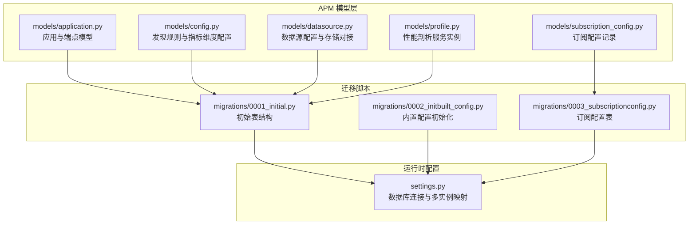
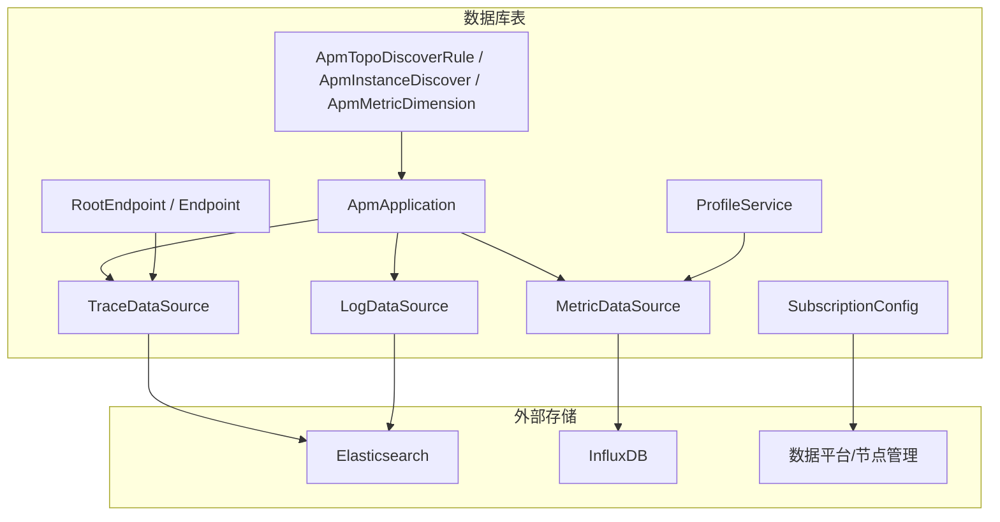
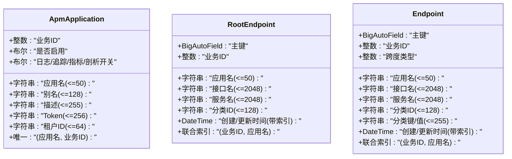
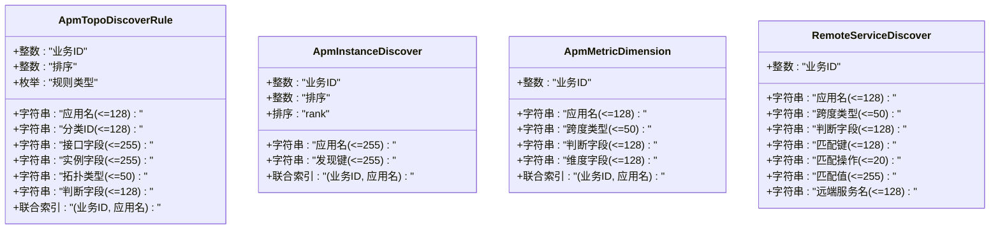
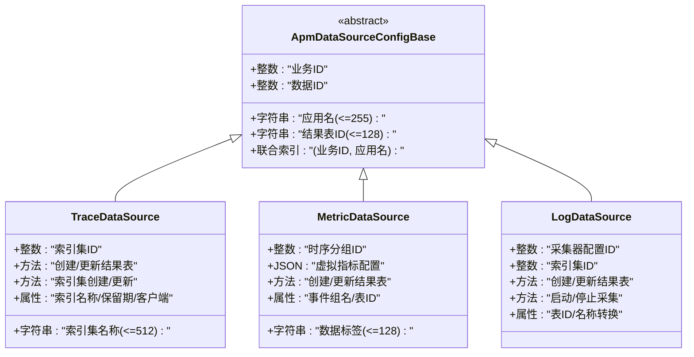
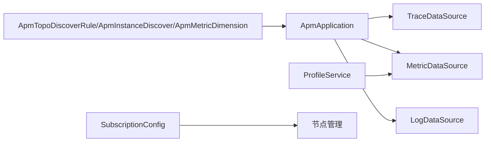

# 表结构设计

<cite>
**本文引用的文件**
- [bkmonitor/apm/models/application.py](file://bkmonitor/apm/models/application.py)
- [bkmonitor/apm/models/config.py](file://bkmonitor/apm/models/config.py)
- [bkmonitor/apm/models/datasource.py](file://bkmonitor/apm/models/datasource.py)
- [bkmonitor/apm/models/profile.py](file://bkmonitor/apm/models/profile.py)
- [bkmonitor/apm/models/subscription_config.py](file://bkmonitor/apm/models/subscription_config.py)
- [bkmonitor/apm/migrations/0001_initial.py](file://bkmonitor/apm/migrations/0001_initial.py)
- [bkmonitor/apm/migrations/0002_initbuilt_config.py](file://bkmonitor/apm/migrations/0002_initbuilt_config.py)
- [bkmonitor/apm/migrations/0003_subscriptionconfig.py](file://bkmonitor/apm/migrations/0003_subscriptionconfig.py)
- [bkmonitor/settings.py](file://bkmonitor/settings.py)
</cite>

## 目录
1. [简介](#简介)
2. [项目结构](#项目结构)
3. [核心组件](#核心组件)
4. [架构总览](#架构总览)
5. [详细组件分析](#详细组件分析)
6. [依赖分析](#依赖分析)
7. [性能考量](#性能考量)
8. [故障排查指南](#故障排查指南)
9. [结论](#结论)
10. [附录](#附录)

## 简介
本文件面向数据库表结构设计，结合监控系统中的 APM 子模块，系统性梳理表的物理结构、主键与唯一约束、索引策略、数据类型与长度限制、以及与外部存储（如 Elasticsearch、InfluxDB）的衔接方式。同时给出索引优化建议、查询性能考虑、表结构演进与版本管理策略，帮助在高并发与海量时序/日志数据场景下实现稳定、可维护、可扩展的数据库设计。

## 项目结构
围绕 APM 的表结构主要分布在 apm 子模块的 models 与 migrations 中，并通过 settings.py 配置数据库连接与多实例映射。下图展示与表结构设计直接相关的文件与职责：

**图表来源**
- [bkmonitor/apm/models/application.py:36-343](file://bkmonitor/apm/models/application.py#L36-L343)
- [bkmonitor/apm/models/config.py:36-800](file://bkmonitor/apm/models/config.py#L36-L800)
- [bkmonitor/apm/models/datasource.py:56-800](file://bkmonitor/apm/models/datasource.py#L56-L800)
- [bkmonitor/apm/models/profile.py:14-30](file://bkmonitor/apm/models/profile.py#L14-L30)
- [bkmonitor/apm/models/subscription_config.py:21-37](file://bkmonitor/apm/models/subscription_config.py#L21-L37)
- [bkmonitor/apm/migrations/0001_initial.py:25-230](file://bkmonitor/apm/migrations/0001_initial.py#L25-L230)
- [bkmonitor/apm/migrations/0002_initbuilt_config.py:20-31](file://bkmonitor/apm/migrations/0002_initbuilt_config.py#L20-L31)
- [bkmonitor/apm/migrations/0003_subscriptionconfig.py:26-36](file://bkmonitor/apm/migrations/0003_subscriptionconfig.py#L26-L36)
- [bkmonitor/settings.py:105-110](file://bkmonitor/settings.py#L105-L110)

**章节来源**
- [bkmonitor/apm/migrations/0001_initial.py:25-230](file://bkmonitor/apm/migrations/0001_initial.py#L25-L230)
- [bkmonitor/apm/migrations/0002_initbuilt_config.py:20-31](file://bkmonitor/apm/migrations/0002_initbuilt_config.py#L20-L31)
- [bkmonitor/apm/migrations/0003_subscriptionconfig.py:26-36](file://bkmonitor/apm/migrations/0003_subscriptionconfig.py#L26-L36)
- [bkmonitor/settings.py:105-110](file://bkmonitor/settings.py#L105-L110)

## 核心组件
本节聚焦 APM 模块中与表结构设计直接相关的核心模型及其字段语义、数据类型与长度限制、主键与唯一约束、索引策略等。

- 应用与端点模型
  - ApmApplication：业务应用元数据，含业务标识、应用名、别名、描述、Token、功能开关、租户标识；复合唯一约束（应用名+业务ID）。
  - RootEndpoint、Endpoint：端点与根端点，包含业务ID、应用名、接口/服务名称、分类信息、跨度类型、时间戳（带索引）。
- 发现规则与指标维度配置
  - ApmTopoDiscoverRule：拓扑发现规则，包含分类、接口字段、实例字段、拓扑类型、判断字段、排序与规则类型；支持全局与应用级配置。
  - ApmInstanceDiscover：实例发现键位配置，支持排序与全局默认。
  - ApmMetricDimension：指标维度配置，按跨度类型与谓词组合生成维度映射。
  - RemoteServiceDiscover：远程服务发现规则。
- 数据源配置与存储对接
  - ApmDataSourceConfigBase：抽象基类，统一业务ID、应用名、数据ID、结果表ID等；复合索引（业务ID+应用名）。
  - MetricDataSource：时序数据源，含时序分组ID、数据标签、虚拟指标配置；结果表ID命名遵循特定规则。
  - TraceDataSource：追踪数据源，含索引集ID/名称、ES存储配置、动态映射模板、索引切分与保留策略；结果表ID命名遵循特定规则。
  - LogDataSource：日志数据源，含采集器配置ID、索引集ID、日志存储参数；结果表ID命名遵循特定规则。
- 性能剖析服务实例
  - ProfileService：剖析服务实例，含业务ID、应用名、服务名、采样周期/频率/类型、是否大流量、时间戳等；多字段建立索引。
- 订阅配置
  - SubscriptionConfig：订阅ID记录，含租户ID、业务ID、应用名、节点管理订阅ID、JSON配置。

**章节来源**
- [bkmonitor/apm/models/application.py:36-343](file://bkmonitor/apm/models/application.py#L36-L343)
- [bkmonitor/apm/models/config.py:36-800](file://bkmonitor/apm/models/config.py#L36-L800)
- [bkmonitor/apm/models/datasource.py:56-800](file://bkmonitor/apm/models/datasource.py#L56-L800)
- [bkmonitor/apm/models/profile.py:14-30](file://bkmonitor/apm/models/profile.py#L14-L30)
- [bkmonitor/apm/models/subscription_config.py:21-37](file://bkmonitor/apm/models/subscription_config.py#L21-L37)

## 架构总览
下图展示 APM 表结构与外部存储的交互关系，强调数据源配置如何映射到结果表与索引集，以及时间序列与日志存储的差异化设计。

**图表来源**
- [bkmonitor/apm/models/datasource.py:192-800](file://bkmonitor/apm/models/datasource.py#L192-L800)
- [bkmonitor/apm/models/application.py:36-343](file://bkmonitor/apm/models/application.py#L36-L343)
- [bkmonitor/apm/models/config.py:36-800](file://bkmonitor/apm/models/config.py#L36-L800)
- [bkmonitor/apm/models/profile.py:14-30](file://bkmonitor/apm/models/profile.py#L14-L30)
- [bkmonitor/apm/models/subscription_config.py:21-37](file://bkmonitor/apm/models/subscription_config.py#L21-L37)

## 详细组件分析

### 应用与端点模型（ApmApplication、RootEndpoint、Endpoint）
- 主键与唯一约束
  - 自增主键用于大多数模型；ApmApplication 使用复合唯一约束（应用名+业务ID），确保同一业务下应用名唯一。
- 字段与长度
  - 应用名、别名、描述、Token、分类ID、服务名、接口名等采用 CharField，长度从几十到几千不等；时间戳字段使用 DateTimeField。
- 索引策略
  - RootEndpoint、Endpoint、ProfileService 等模型在业务ID、应用名、时间戳等关键字段上建立索引，提升查询效率。
- 设计要点
  - 将 Token 与功能开关（日志/追踪/指标/剖析）集中管理，便于统一启停与鉴权。
  - 端点模型支持超长接口/服务名，需关注索引长度与查询成本。

**图表来源**
- [bkmonitor/apm/models/application.py:36-343](file://bkmonitor/apm/models/application.py#L36-L343)
- [bkmonitor/apm/migrations/0001_initial.py:26-110](file://bkmonitor/apm/migrations/0001_initial.py#L26-L110)

**章节来源**
- [bkmonitor/apm/models/application.py:36-343](file://bkmonitor/apm/models/application.py#L36-L343)
- [bkmonitor/apm/migrations/0001_initial.py:26-110](file://bkmonitor/apm/migrations/0001_initial.py#L26-L110)

### 发现规则与指标维度配置（ApmTopoDiscoverRule、ApmInstanceDiscover、ApmMetricDimension、RemoteServiceDiscover）
- 规则与维度
  - 通过分类（HTTP/RPC/DB/Messaging/Async/Other）、框架（TRPC/gRPC）、平台（K8s/Node）、SDK 等维度定义拓扑发现规则与指标维度映射。
  - 支持全局默认与应用级覆盖，内置初始化流程保证一致性。
- 字段与长度
  - 分类ID、接口字段、实例字段、判断字段、匹配键/值等采用 CharField，长度从百到千级；排序字段为整数。
- 索引策略
  - 通过业务ID+应用名的联合索引支撑快速检索与聚合。

**图表来源**
- [bkmonitor/apm/models/config.py:36-800](file://bkmonitor/apm/models/config.py#L36-L800)
- [bkmonitor/apm/migrations/0001_initial.py:67-78](file://bkmonitor/apm/migrations/0001_initial.py#L67-L78)

**章节来源**
- [bkmonitor/apm/models/config.py:36-800](file://bkmonitor/apm/models/config.py#L36-L800)
- [bkmonitor/apm/migrations/0001_initial.py:67-78](file://bkmonitor/apm/migrations/0001_initial.py#L67-L78)

### 数据源配置与存储对接（ApmDataSourceConfigBase、MetricDataSource、TraceDataSource、LogDataSource）
- 抽象基类
  - 统一字段：业务ID、应用名、数据ID、结果表ID；复合索引（业务ID+应用名）。
- 追踪数据源（TraceDataSource）
  - 结果表ID命名规则明确；默认存储为 Elasticsearch，支持动态映射模板、索引切分与保留策略；支持冷热分层配置。
  - 提供索引集创建/更新、索引名称解析、保留期与客户端访问等能力。
- 指标数据源（MetricDataSource）
  - 默认存储为 InfluxDB，支持时序分组、字段定义与单位；结果表ID命名规则明确。
- 日志数据源（LogDataSource）
  - 结果表ID命名规则明确；支持采集器配置、索引集管理与存储参数配置。

**图表来源**
- [bkmonitor/apm/models/datasource.py:56-800](file://bkmonitor/apm/models/datasource.py#L56-L800)
- [bkmonitor/apm/migrations/0001_initial.py:112-125](file://bkmonitor/apm/migrations/0001_initial.py#L112-L125)

**章节来源**
- [bkmonitor/apm/models/datasource.py:56-800](file://bkmonitor/apm/models/datasource.py#L56-L800)
- [bkmonitor/apm/migrations/0001_initial.py:112-125](file://bkmonitor/apm/migrations/0001_initial.py#L112-L125)

### 性能剖析服务实例（ProfileService）
- 字段与索引
  - 包含业务ID、应用名、服务名、采样周期/频率/类型、是否大流量、时间戳等；多字段建立索引，便于按业务/应用/服务维度查询与统计。
- 设计要点
  - 通过布尔标志区分大流量服务，便于针对性优化存储与查询策略。

**章节来源**
- [bkmonitor/apm/models/profile.py:14-30](file://bkmonitor/apm/models/profile.py#L14-L30)
- [bkmonitor/apm/migrations/0001_initial.py:1-231](file://bkmonitor/apm/migrations/0001_initial.py#L1-L231)

### 订阅配置（SubscriptionConfig）
- 字段与用途
  - 记录节点管理订阅ID与配置，支持平台级与应用级配置；通过业务ID与应用名进行区分。
- 设计要点
  - JSON 字段承载灵活配置，便于与外部系统（节点管理）解耦。

**章节来源**
- [bkmonitor/apm/models/subscription_config.py:21-37](file://bkmonitor/apm/models/subscription_config.py#L21-L37)
- [bkmonitor/apm/migrations/0003_subscriptionconfig.py:26-36](file://bkmonitor/apm/migrations/0003_subscriptionconfig.py#L26-L36)

## 依赖分析
- 模型间依赖
  - ApmApplication 与各数据源模型（Trace/Metric/Log）存在一对多关系，用于统一管理应用的数据源启停与配置。
  - 发现规则与指标维度配置服务于拓扑与指标计算，依赖业务ID与应用名进行隔离与检索。
- 外部依赖
  - TraceDataSource 依赖 Elasticsearch 存储与索引集管理；MetricDataSource 依赖 InfluxDB 存储与时序分组；LogDataSource 依赖日志采集与索引集管理。
- 数据库连接与多实例
  - settings.py 中对数据库连接进行统一管理，并支持多实例映射，便于在不同环境与角色下复用配置。

**图表来源**
- [bkmonitor/apm/models/application.py:36-343](file://bkmonitor/apm/models/application.py#L36-L343)
- [bkmonitor/apm/models/datasource.py:56-800](file://bkmonitor/apm/models/datasource.py#L56-L800)
- [bkmonitor/apm/models/config.py:36-800](file://bkmonitor/apm/models/config.py#L36-L800)
- [bkmonitor/apm/models/profile.py:14-30](file://bkmonitor/apm/models/profile.py#L14-L30)
- [bkmonitor/apm/models/subscription_config.py:21-37](file://bkmonitor/apm/models/subscription_config.py#L21-L37)
- [bkmonitor/settings.py:105-110](file://bkmonitor/settings.py#L105-L110)

**章节来源**
- [bkmonitor/apm/models/application.py:36-343](file://bkmonitor/apm/models/application.py#L36-L343)
- [bkmonitor/apm/models/datasource.py:56-800](file://bkmonitor/apm/models/datasource.py#L56-L800)
- [bkmonitor/apm/models/config.py:36-800](file://bkmonitor/apm/models/config.py#L36-L800)
- [bkmonitor/apm/models/profile.py:14-30](file://bkmonitor/apm/models/profile.py#L14-L30)
- [bkmonitor/apm/models/subscription_config.py:21-37](file://bkmonitor/apm/models/subscription_config.py#L21-L37)
- [bkmonitor/settings.py:105-110](file://bkmonitor/settings.py#L105-L110)

## 性能考量
- 索引设计
  - 在业务ID、应用名等高频过滤字段上建立联合索引，降低查询扫描范围。
  - 时间戳字段（创建/更新时间）建立索引，便于按时间范围检索与归档。
- 查询优化
  - 对超长字段（如接口名、服务名）建立前缀索引或使用规范化字段，减少索引长度与IO开销。
  - 对 JSON 字段尽量避免在 WHERE 条件中使用，必要时考虑物化派生字段。
- 存储与分片
  - 追踪数据源采用 Elasticsearch，建议结合冷热分层与索引切分策略，平衡写入与查询性能。
  - 指标数据源采用 InfluxDB，合理设置分片与保留期，避免热点与碎片。
- 迁移与版本
  - 通过迁移脚本统一管理表结构变更，确保多环境一致性；内置配置初始化脚本保障规则与维度的稳定性。

[本节为通用性能指导，无需列出具体文件来源]

## 故障排查指南
- 数据源启停异常
  - 检查数据源模型的启停方法与结果表状态，确认外部存储（ES/InfluxDB）可用性与权限。
- 索引与查询慢
  - 核查联合索引是否命中，确认查询条件是否包含业务ID与应用名；对超长字段进行截断或前缀匹配。
- 配置不生效
  - 核查内置配置初始化流程与缓存策略，确认全局与应用级配置的优先级与覆盖逻辑。
- 订阅配置问题
  - 核查订阅ID与配置字段，确认节点管理接口返回状态与错误日志。

**章节来源**
- [bkmonitor/apm/models/datasource.py:113-190](file://bkmonitor/apm/models/datasource.py#L113-L190)
- [bkmonitor/apm/migrations/0002_initbuilt_config.py:20-31](file://bkmonitor/apm/migrations/0002_initbuilt_config.py#L20-L31)
- [bkmonitor/apm/models/subscription_config.py:21-37](file://bkmonitor/apm/models/subscription_config.py#L21-L37)

## 结论
本设计以“业务ID+应用名”作为关键隔离维度，配合复合索引与合理的字段长度限制，在保证查询效率的同时兼顾可维护性。通过抽象数据源基类与统一的存储对接流程，实现追踪、指标、日志三类数据的一致化管理。内置配置初始化与迁移脚本确保规则与表结构的稳定性与可演进性。

[本节为总结性内容，无需列出具体文件来源]

## 附录

### 表结构演进与版本管理策略
- 迁移脚本
  - 使用 Django 迁移脚本管理表结构变更，确保开发、测试、生产环境一致。
  - 内置配置初始化脚本在首次迁移后自动填充默认规则与维度，避免手工配置遗漏。
- 版本管理
  - 通过迁移编号递增管理版本，变更前先在测试环境验证；对破坏性变更提供回滚策略。
- 最佳实践
  - 新增字段建议非必填并提供默认值；对超长文本字段考虑分表或外部存储；对 JSON 字段建立物化派生字段以提升查询性能。

**章节来源**
- [bkmonitor/apm/migrations/0001_initial.py:25-230](file://bkmonitor/apm/migrations/0001_initial.py#L25-L230)
- [bkmonitor/apm/migrations/0002_initbuilt_config.py:20-31](file://bkmonitor/apm/migrations/0002_initbuilt_config.py#L20-L31)
- [bkmonitor/apm/migrations/0003_subscriptionconfig.py:26-36](file://bkmonitor/apm/migrations/0003_subscriptionconfig.py#L26-L36)