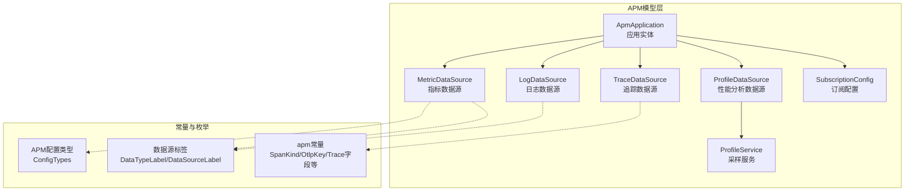
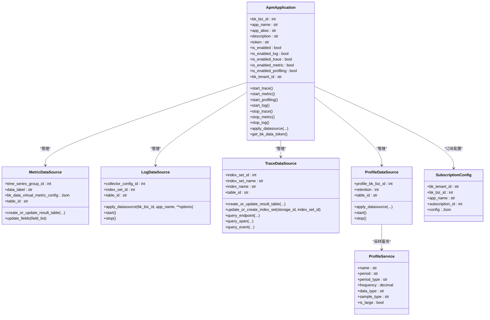
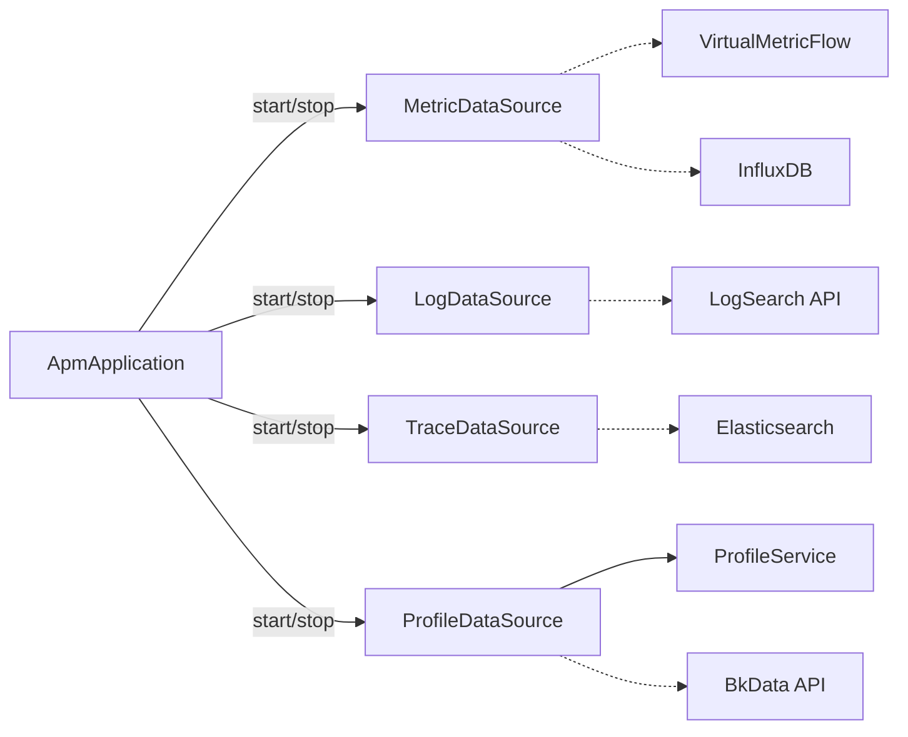

# APM模型

<cite>
**本文引用的文件**
- [application.py](file://bkmonitor/apm/models/application.py)
- [datasource.py](file://bkmonitor/apm/models/datasource.py)
- [profile.py](file://bkmonitor/apm/models/profile.py)
- [constants.py](file://bkmonitor/apm/constants.py)
- [apm.py](file://bkmonitor/constants/apm.py)
- [data_source.py](file://bkmonitor/constants/data_source.py)
- [subscription_config.py](file://bkmonitor/apm/models/subscription_config.py)
- [virtual_metric.py](file://bkmonitor/apm/core/handlers/bk_data/virtual_metric.py)
- [0014_metricdatasource_bk_data_virtual_metric_config.py](file://bkmonitor/apm/migrations/0014_metricdatasource_bk_data_virtual_metric_config.py)
</cite>

## 目录
1. [简介](#简介)
2. [项目结构](#项目结构)
3. [核心组件](#核心组件)
4. [架构总览](#架构总览)
5. [详细组件分析](#详细组件分析)
6. [依赖分析](#依赖分析)
7. [性能考量](#性能考量)
8. [故障排查指南](#故障排查指南)
9. [结论](#结论)
10. [附录](#附录)

## 简介
本文件聚焦于APM数据模型，系统性解析以下内容：
- 应用实体（ApmApplication）的配置、状态与业务关联
- 指标数据源（MetricDataSource）与虚拟指标配置（VirtualMetricConfig）结构
- 性能分析数据源（ProfileDataSource）与采样服务（ProfileService）设计
- APM特有状态码与配置类型（来自常量定义）
- 模型关系图：应用、数据源、订阅配置的层次关系
- 时序数据与性能数据的存储方案

## 项目结构
围绕APM模型的核心文件分布如下：
- 应用与拓扑：application.py
- 数据源与存储：datasource.py（含Metric/Log/Trace/Profile数据源）
- 性能分析：profile.py
- 常量与枚举：constants.py、constants/apm.py、constants/data_source.py
- 订阅配置：subscription_config.py
- 虚拟指标：core/handlers/bk_data/virtual_metric.py 与迁移脚本

图表来源
- [application.py](file://bkmonitor/apm/models/application.py#L36-L343)
- [datasource.py](file://bkmonitor/apm/models/datasource.py#L56-L1257)
- [profile.py](file://bkmonitor/apm/models/profile.py#L1-L30)
- [constants.py](file://bkmonitor/apm/constants.py#L534-L678)
- [apm.py](file://bkmonitor/constants/apm.py#L224-L310)
- [data_source.py](file://bkmonitor/constants/data_source.py#L14-L154)

章节来源
- [application.py](file://bkmonitor/apm/models/application.py#L36-L343)
- [datasource.py](file://bkmonitor/apm/models/datasource.py#L56-L1257)
- [profile.py](file://bkmonitor/apm/models/profile.py#L1-L30)
- [constants.py](file://bkmonitor/apm/constants.py#L534-L678)
- [apm.py](file://bkmonitor/constants/apm.py#L224-L310)
- [data_source.py](file://bkmonitor/constants/data_source.py#L14-L154)

## 核心组件
- 应用实体（ApmApplication）
  - 字段：业务ID、应用名、别名、描述、Token、功能开关（Trace/Metric/Log/Profiling）、租户ID
  - 方法：启动/停止各数据源、创建应用、获取数据源、生成Token
- 指标数据源（MetricDataSource）
  - 类型：时序数据（time_series）
  - 字段：时序分组ID、数据标签、虚拟指标配置（Json）
  - 行为：创建/更新结果表、字段更新、表ID生成
- 日志数据源（LogDataSource）
  - 类型：日志（log），通过日志平台自定义上报
  - 字段：索引集ID、采集配置ID
  - 行为：创建/更新采集配置、启动/停止采集
- 追踪数据源（TraceDataSource）
  - 类型：日志（log），但Schema面向OTLP Span
  - 字段：索引集ID/名称、过滤与分类规则、索引设置
  - 行为：创建/更新结果表、索引集管理、查询封装（端点、Span、事件）
- 性能分析数据源（ProfileDataSource）
  - 类型：Profile
  - 字段：Profile业务ID、保留期、创建/更新时间
  - 行为：接入计算平台Doris、启动/停止清洗
- 采样服务（ProfileService）
  - 字段：周期、频率、数据类型、采样类型、是否大数据量
  - 行为：记录采样配置与状态
- 订阅配置（SubscriptionConfig）
  - 字段：租户ID、业务ID、应用名、订阅ID、配置JSON
  - 行为：记录平台/应用级订阅配置

章节来源
- [application.py](file://bkmonitor/apm/models/application.py#L36-L343)
- [datasource.py](file://bkmonitor/apm/models/datasource.py#L192-L1257)
- [profile.py](file://bkmonitor/apm/models/profile.py#L1-L30)
- [subscription_config.py](file://bkmonitor/apm/models/subscription_config.py#L21-L37)

## 架构总览
APM模型围绕“应用”为中心，向下管理四类数据源；同时通过订阅配置与虚拟指标扩展能力。

图表来源
- [application.py](file://bkmonitor/apm/models/application.py#L36-L343)
- [datasource.py](file://bkmonitor/apm/models/datasource.py#L192-L1257)
- [profile.py](file://bkmonitor/apm/models/profile.py#L1-L30)
- [subscription_config.py](file://bkmonitor/apm/models/subscription_config.py#L21-L37)

## 详细组件分析

### 应用实体（ApmApplication）
- 配置与状态
  - 功能开关：is_enabled_log/is_enabled_trace/is_enabled_metric/is_enabled_profiling
  - 租户ID：用于跨业务隔离
  - Token：兼容历史与新版Token生成逻辑
- 生命周期
  - start_* / stop_*：分别控制各数据源的启用/停用
  - apply_datasource：批量创建/更新数据源（Trace/Metric/Log/Profile）
  - create_application：创建应用并异步触发数据源创建
- 与其他模型的关系
  - 通过缓存属性提供各数据源实例（trace_datasource/metric_datasource/profile_datasource/log_datasource）
  - get_bk_data_token：综合各数据源的bk_data_id生成Token

章节来源
- [application.py](file://bkmonitor/apm/models/application.py#L36-L343)

### 指标数据源（MetricDataSource）
- 数据类型与表结构
  - 类型：time_series（时序）
  - 默认测量名：__default__
  - 字段：time_series_group_id、data_label、bk_data_virtual_metric_config（Json）
- 存储与结果表
  - create_or_update_result_table：创建时序分组与结果表，支持InfluxDB代理集群
  - update_fields：动态更新字段定义
  - table_id：基于业务ID、应用名与测量名生成
- 虚拟指标
  - 通过Json字段记录虚拟指标接入配置（raw_data_id、清洗配置、dataflow等）
  - 由虚拟指标处理器创建/更新清洗与Dataflow

章节来源
- [datasource.py](file://bkmonitor/apm/models/datasource.py#L192-L283)
- [0014_metricdatasource_bk_data_virtual_metric_config.py](file://bkmonitor/apm/migrations/0014_metricdatasource_bk_data_virtual_metric_config.py#L1-L32)
- [virtual_metric.py](file://bkmonitor/apm/core/handlers/bk_data/virtual_metric.py#L1-L222)

### 日志数据源（LogDataSource）
- 数据类型与接入
  - 类型：log
  - 通过日志平台自定义上报（collector_config），支持ES存储参数（shards、replicas、retention）
- 生命周期
  - apply_datasource：创建或更新采集配置，写入collector_config_id/index_set_id/result_table_id/bk_data_id
  - start/stop：启动/停止采集器
- 表ID生成
  - app_name_to_log_config_name：兼容日志平台命名规则（替换连字符、长度校验）

章节来源
- [datasource.py](file://bkmonitor/apm/models/datasource.py#L296-L404)

### 追踪数据源（TraceDataSource）
- 数据类型与Schema
  - 类型：log（OTLP Span）
  - 字段清单：attributes/resource/events/links/status/时间戳等，详见常量定义
- 存储与索引
  - create_or_update_result_table：创建/更新结果表，支持ES冷热集群路由
  - update_or_create_index_set：维护索引集，支持slice_size、retention、shards/replicas
  - index_name：动态解析有效索引名，支持按日期排序
- 查询封装
  - query_endpoint/query_span/query_event：封装端点、Span、事件查询
  - build_filter_params：基于过滤参数与服务分类构建Q条件
  - fields：解析ES Mapping，提取字段类型

章节来源
- [datasource.py](file://bkmonitor/apm/models/datasource.py#L406-L1088)
- [apm.py](file://bkmonitor/constants/apm.py#L77-L222)

### 性能分析数据源（ProfileDataSource）与采样服务（ProfileService）
- ProfileDataSource
  - 类型：profile
  - apply_datasource：接入计算平台Doris，创建/更新清洗与Dataflow
  - start/stop：启动/停止清洗任务
  - 表ID：基于业务ID与应用名生成
- ProfileService
  - 记录采样周期、频率、数据类型、采样类型、是否大数据量等
  - 与ProfileDataSource配合实现采样与存储

章节来源
- [datasource.py](file://bkmonitor/apm/models/datasource.py#L1090-L1180)
- [profile.py](file://bkmonitor/apm/models/profile.py#L1-L30)

### 订阅配置（SubscriptionConfig）
- 用途：记录平台配置与应用配置的订阅ID与配置JSON
- 特性：支持全局默认配置（bk_biz_id=0, app_name=""）

章节来源
- [subscription_config.py](file://bkmonitor/apm/models/subscription_config.py#L21-L37)

### APM特有状态码与配置类型
- 配置类型（ConfigTypes）
  - 指标/追踪/日志/性能采样的批大小
  - DB慢命令配置、DB配置
  - attributes配置（logs）、返回码重定义配置
- 其他常量
  - SpanKind：Span类型枚举
  - OtlpKey：OTLP字段键名映射
  - 数据源标签：DataTypeLabel/DataSourceLabel
  - Trace字段清单：TraceDataSourceConfig.TRACE_FIELD_LIST

章节来源
- [constants.py](file://bkmonitor/apm/constants.py#L534-L678)
- [apm.py](file://bkmonitor/constants/apm.py#L224-L310)
- [data_source.py](file://bkmonitor/constants/data_source.py#L14-L154)

## 依赖分析
- 应用对数据源的依赖
  - ApmApplication通过start_*方法驱动各数据源的启用流程
  - 通过apply_datasource统一创建/更新数据源，确保一致性
- 数据源对平台API的依赖
  - Trace/Metric/Log/Profile均通过metadata、log_search、bkdata等API创建/更新结果表、清洗与存储
- 虚拟指标对计算平台的依赖
  - 通过VirtualMetricFlow创建raw data、清洗配置、Dataflow并授权项目

图表来源
- [application.py](file://bkmonitor/apm/models/application.py#L57-L131)
- [datasource.py](file://bkmonitor/apm/models/datasource.py#L192-L1180)
- [virtual_metric.py](file://bkmonitor/apm/core/handlers/bk_data/virtual_metric.py#L1-L222)

## 性能考量
- Trace查询
  - 使用UnifyQuery与QueryConfigBuilder，限定字段与时间范围，避免全量扫描
  - 端点/事件查询默认限制数量，防止高基数导致的性能问题
- 并发与批处理
  - 聚合统计采用线程池并发计算多种聚合方法，减少单次请求压力
- 存储与索引
  - ES冷热集群配置按保留期比例路由，降低热数据写入成本
  - InfluxDB代理集群可选，提升时序写入与查询性能

[本节为通用指导，无需列出具体文件来源]

## 故障排查指南
- 数据源创建失败
  - 检查apply_datasource异常路径，关注EventReportHelper告警
  - 查看对应API返回错误（metadata/log_search/bkdata）
- Trace索引异常
  - 检查index_name解析逻辑与有效索引匹配正则
  - 确认ES集群冷热配置与slice设置
- Profile清洗未生效
  - 检查Databus清洗状态与Dataflow启动状态
  - 确认项目授权与operator权限
- Token生成异常
  - 检查应用Token与各数据源bk_data_id是否存在

章节来源
- [application.py](file://bkmonitor/apm/models/application.py#L113-L131)
- [datasource.py](file://bkmonitor/apm/models/datasource.py#L1181-L1257)
- [virtual_metric.py](file://bkmonitor/apm/core/handlers/bk_data/virtual_metric.py#L1-L222)

## 结论
APM数据模型以应用为核心，围绕四类数据源构建完整的可观测能力闭环。通过统一的生命周期管理、平台API对接与虚拟指标扩展，实现了从追踪、指标到日志与性能分析的全栈覆盖。订阅配置与采样服务进一步增强了平台级与应用级的可配置性与可运维性。

[本节为总结性内容，无需列出具体文件来源]

## 附录

### 时序数据与性能数据存储方案
- 时序数据（Metric）
  - 存储：InfluxDB（可选代理集群）
  - 结果表：按业务ID+应用名+测量名组织
  - 字段：通过modify_time_series_group动态更新
- 性能数据（Profile）
  - 存储：计算平台Doris
  - 清洗：通过Databus清洗与Dataflow产出结果表
  - 采样：ProfileService记录采样周期、频率与类型

章节来源
- [datasource.py](file://bkmonitor/apm/models/datasource.py#L236-L283)
- [datasource.py](file://bkmonitor/apm/models/datasource.py#L1090-L1180)