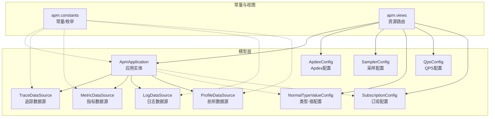
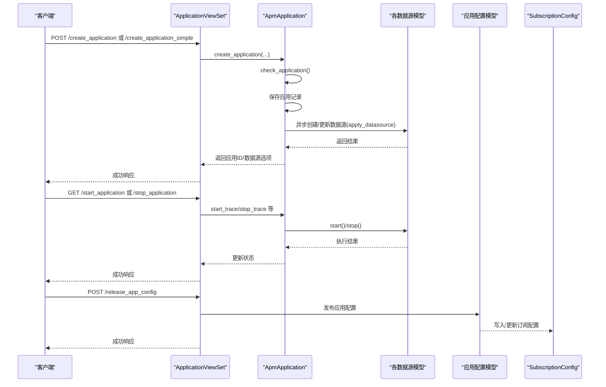
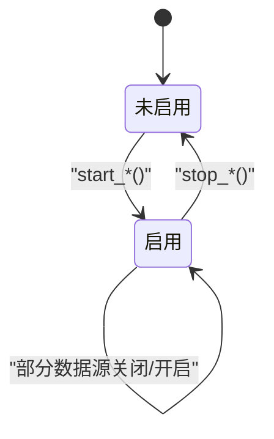
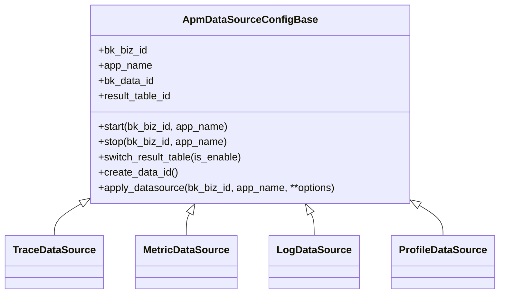
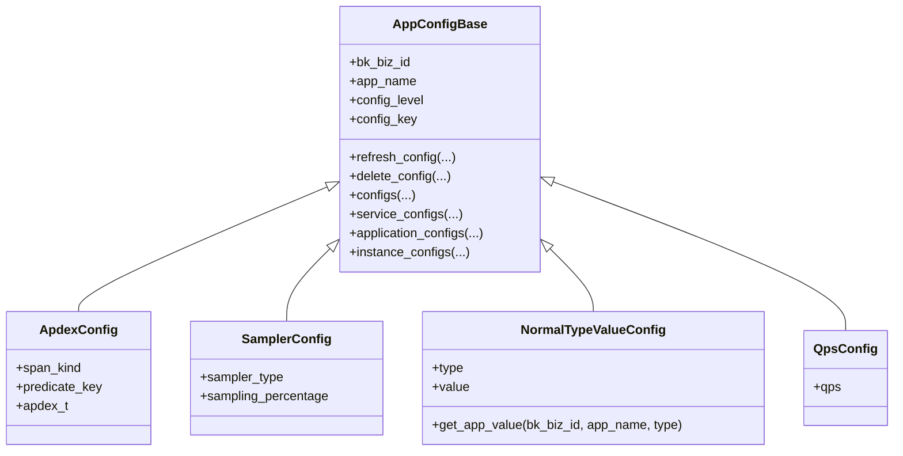
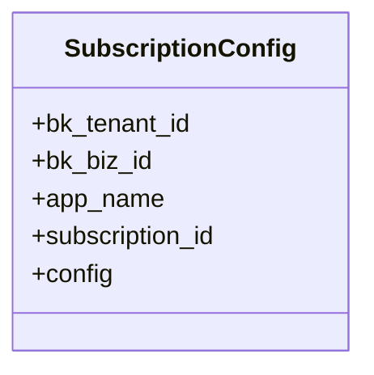
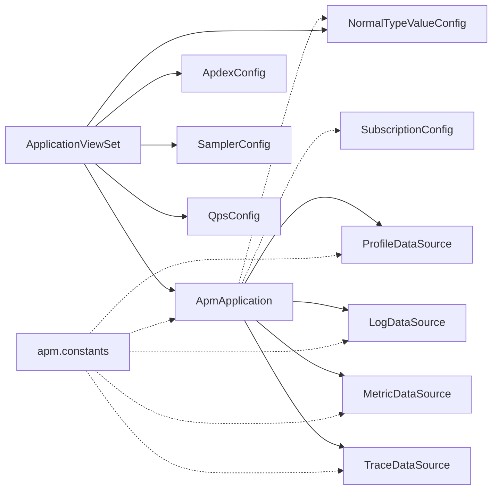
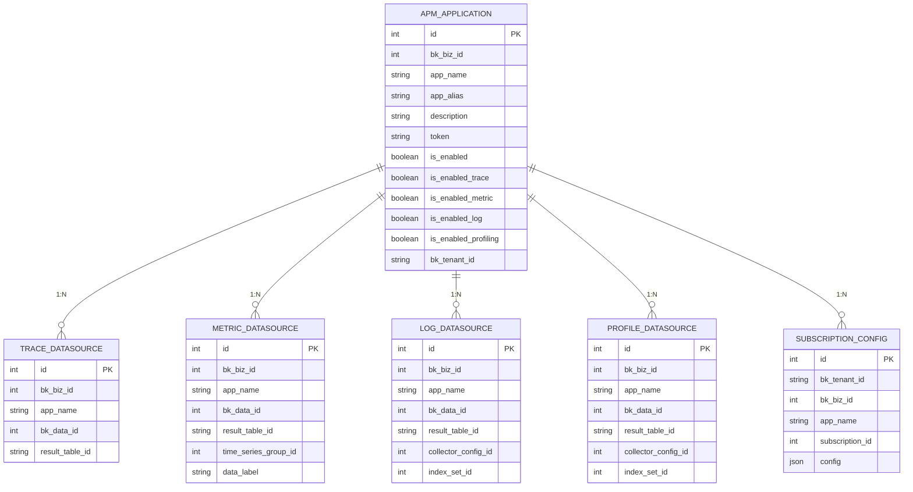

# 应用模型

<cite>
**本文引用的文件**
- [application.py](file://bkmonitor/apm/models/application.py)
- [config.py](file://bkmonitor/apm/models/config.py)
- [datasource.py](file://bkmonitor/apm/models/datasource.py)
- [subscription_config.py](file://bkmonitor/apm/models/subscription_config.py)
- [constants.py](file://bkmonitor/apm/constants.py)
- [views.py](file://bkmonitor/apm/views.py)
- [0037_apmapplication_is_enabled_profiling.py](file://bkmonitor/apm/migrations/0037_apmapplication_is_enabled_profiling.py)
- [0042_add_application_token_and_log_datasource.py](file://bkmonitor/apm/migrations/0042_add_application_token_and_log_datasource.py)
</cite>

## 目录
1. [简介](#简介)
2. [项目结构](#项目结构)
3. [核心组件](#核心组件)
4. [架构总览](#架构总览)
5. [详细组件分析](#详细组件分析)
6. [依赖分析](#依赖分析)
7. [性能考虑](#性能考虑)
8. [故障排查指南](#故障排查指南)
9. [结论](#结论)
10. [附录](#附录)

## 简介
本文件围绕 APM 应用模型进行系统性梳理，重点解析 Application 实体及其字段、与 ApplicationConfig/SubscriptionConfig 的关系、数据源配置与探针行为控制、状态机与环境类型含义，并给出数据库 ER 图与常见 API/命令使用方式，帮助读者快速理解与落地应用的创建、启停与管理。

## 项目结构
与应用模型直接相关的核心模块与文件：
- models 层：Application、数据源模型（Trace/Metric/Log/Profile）、应用配置模型（Apdex/Sampler/NormalTypeValue/Qps 等）、订阅配置模型
- constants 层：常量与枚举（如查询模式、统计维度、配置类型等）
- 视图层：对外暴露的资源路由，包含应用创建、启停、配置发布等接口
- 迁移层：补充字段（如 is_enabled_profiling、token、is_enabled_log 等）

图表来源
- [application.py](file://bkmonitor/apm/models/application.py#L36-L131)
- [datasource.py](file://bkmonitor/apm/models/datasource.py#L56-L191)
- [config.py](file://bkmonitor/apm/models/config.py#L614-L800)
- [subscription_config.py](file://bkmonitor/apm/models/subscription_config.py#L21-L37)
- [constants.py](file://bkmonitor/apm/constants.py#L534-L678)
- [views.py](file://bkmonitor/apm/views.py#L76-L123)

章节来源
- [application.py](file://bkmonitor/apm/models/application.py#L36-L131)
- [datasource.py](file://bkmonitor/apm/models/datasource.py#L56-L191)
- [config.py](file://bkmonitor/apm/models/config.py#L614-L800)
- [subscription_config.py](file://bkmonitor/apm/models/subscription_config.py#L21-L37)
- [constants.py](file://bkmonitor/apm/constants.py#L534-L678)
- [views.py](file://bkmonitor/apm/views.py#L76-L123)

## 核心组件
- Application 实体（ApmApplication）
  - 关键字段：业务ID、应用名称、别名、描述、Token、启用状态、各数据源开关（Trace/Metric/Log/Profiling）、租户ID
  - 关键方法：启停各数据源、创建应用、申请数据源、生成 BK 数据平台 Token
- 数据源模型
  - TraceDataSource/MetricDataSource/LogDataSource/ProfileDataSource：封装数据源生命周期（创建/启用/停用/切换结果表）
- 应用配置模型
  - ApdexConfig、SamplerConfig、NormalTypeValueConfig、QpsConfig：用于控制探针行为与指标维度
- 订阅配置模型
  - SubscriptionConfig：记录平台/应用维度的订阅ID与配置
- 常量与枚举
  - 配置类型、查询模式、统计维度等

章节来源
- [application.py](file://bkmonitor/apm/models/application.py#L36-L131)
- [datasource.py](file://bkmonitor/apm/models/datasource.py#L56-L191)
- [config.py](file://bkmonitor/apm/models/config.py#L614-L800)
- [subscription_config.py](file://bkmonitor/apm/models/subscription_config.py#L21-L37)
- [constants.py](file://bkmonitor/apm/constants.py#L534-L678)

## 架构总览
应用模型围绕“应用实体 + 数据源 + 配置 + 订阅”的组合展开，形成如下交互关系：
- Application 通过 apply_datasource/启停方法驱动各数据源的创建与启用
- 配置模型（Apdex/Sampler/NormalTypeValue/Qps）影响探针采集策略与指标维度
- SubscriptionConfig 作为平台/应用配置的统一存储载体，与应用绑定
- 视图层提供创建、启停、配置发布、查询等 API

图表来源
- [views.py](file://bkmonitor/apm/views.py#L76-L123)
- [application.py](file://bkmonitor/apm/models/application.py#L133-L215)
- [datasource.py](file://bkmonitor/apm/models/datasource.py#L176-L191)
- [config.py](file://bkmonitor/apm/models/config.py#L614-L800)
- [subscription_config.py](file://bkmonitor/apm/models/subscription_config.py#L21-L37)

## 详细组件分析

### Application 实体（ApmApplication）
- 字段与语义
  - 业务ID、应用名称、别名、描述：标识应用归属与基本信息
  - Token：用于 BK 数据平台鉴权
  - 启用状态与数据源开关：is_enabled、is_enabled_trace、is_enabled_metric、is_enabled_log、is_enabled_profiling
  - 租户ID：多租户隔离
- 关键方法
  - start_trace/start_metric/start_profiling/start_log：分别开启对应数据源；若缺失则同步创建数据源
  - stop_trace/stop_metric/stop_profiling/stop_log：关闭对应数据源
  - apply_datasource：批量创建/更新数据源，支持传入各数据源存储配置
  - get_bk_data_token：兼容历史 Token 生成逻辑，优先使用应用内 token，否则基于数据源生成
  - create_application/check_application：创建应用并校验重名，异步创建数据源
- 状态机
  - 应用整体启用/禁用由 is_enabled 控制
  - 各数据源独立启用/禁用由 is_enabled_* 控制
  - 启动/停止方法会同时更新应用与数据源状态

图表来源
- [application.py](file://bkmonitor/apm/models/application.py#L57-L131)

章节来源
- [application.py](file://bkmonitor/apm/models/application.py#L36-L131)
- [0037_apmapplication_is_enabled_profiling.py](file://bkmonitor/apm/migrations/0037_apmapplication_is_enabled_profiling.py#L1-L18)
- [0042_add_application_token_and_log_datasource.py](file://bkmonitor/apm/migrations/0042_add_application_token_and_log_datasource.py#L1-L48)

### 数据源模型（Trace/Metric/Log/Profile）
- 抽象基类 ApmDataSourceConfigBase
  - 统一字段：业务ID、应用名、bk_data_id、result_table_id
  - 生命周期：start/stop/switch_result_table、create_data_id、apply_datasource
- TraceDataSource
  - ES 存储、索引集管理、冷热集群适配、过滤参数构建
- MetricDataSource
  - 时间序列组创建与字段更新、默认测量名
- LogDataSource
  - 日志采集器创建/更新、索引集与结果表
- ProfileDataSource
  - 剖析数据源创建与启用

图表来源
- [datasource.py](file://bkmonitor/apm/models/datasource.py#L56-L191)
- [datasource.py](file://bkmonitor/apm/models/datasource.py#L192-L294)
- [datasource.py](file://bkmonitor/apm/models/datasource.py#L296-L404)
- [datasource.py](file://bkmonitor/apm/models/datasource.py#L406-L710)

章节来源
- [datasource.py](file://bkmonitor/apm/models/datasource.py#L56-L191)
- [datasource.py](file://bkmonitor/apm/models/datasource.py#L192-L294)
- [datasource.py](file://bkmonitor/apm/models/datasource.py#L296-L404)
- [datasource.py](file://bkmonitor/apm/models/datasource.py#L406-L710)

### 应用配置模型（Apdex/Sampler/NormalTypeValue/Qps）
- ApdexConfig：按 span_kind/predicate_key 设置 apdex_t
- SamplerConfig：采样类型与采样百分比
- NormalTypeValueConfig：按类型读取应用级配置值
- QpsConfig：应用 QPS 配置
- 配置刷新机制：统一的 AppConfigBase.refresh_config/delete_config/configs/service_configs/application_configs/instance_configs

图表来源
- [config.py](file://bkmonitor/apm/models/config.py#L614-L714)
- [config.py](file://bkmonitor/apm/models/config.py#L716-L732)
- [config.py](file://bkmonitor/apm/models/config.py#L734-L746)
- [config.py](file://bkmonitor/apm/models/config.py#L772-L795)
- [config.py](file://bkmonitor/apm/models/config.py#L796-L800)

章节来源
- [config.py](file://bkmonitor/apm/models/config.py#L614-L800)

### 订阅配置模型（SubscriptionConfig）
- 记录平台/应用维度的订阅ID与配置 JSON
- 通过 bk_tenant_id/bk_biz_id/app_name 组合区分层级

图表来源
- [subscription_config.py](file://bkmonitor/apm/models/subscription_config.py#L21-L37)

章节来源
- [subscription_config.py](file://bkmonitor/apm/models/subscription_config.py#L21-L37)

### 常量与枚举（ConfigTypes/QueryMode/EnabledStatisticsDimension 等）
- ConfigTypes：定义可配置项类型（如队列批次大小、慢SQL配置、属性过滤等）
- QueryMode：查询视角（Trace/ span）
- EnabledStatisticsDimension：统计维度类型（映射到 ES 类型）
- 其他：Apdex/ApmBmwTaskStatus/DiscoverRuleType 等

章节来源
- [constants.py](file://bkmonitor/apm/constants.py#L534-L678)

### API 与管理命令（使用示例）
- 视图路由（ApplicationViewSet）
  - 创建应用：POST /create_application 或 /create_application_simple
  - 删除应用：POST /delete_application 或 /delete_application_simple
  - 应用启停：GET /start_application、/stop_application、/start_application_simple、/stop_application_simple
  - 应用配置：GET /application_config、POST /release_app_config、POST /delete_app_config
  - 数据源应用：POST /apply_datasource
  - 查询：/query_trace_list、/query_span_list、/query_span_statistics、/query_service_statistics 等
- 管理命令（示例）
  - 可通过 management/commands 下的命令进行内置配置初始化、数据源创建等（具体命令名请参考目录内容）

章节来源
- [views.py](file://bkmonitor/apm/views.py#L76-L123)

## 依赖分析
- Application 与数据源
  - Application 通过 apply_datasource/启停方法间接依赖各数据源模型的 apply_datasource/start/stop
- Application 与配置
  - 通过 NormalTypeValueConfig.get_app_value 获取应用级配置值
- Application 与订阅
  - 配置发布后写入 SubscriptionConfig，供平台/应用侧消费
- 常量与配置
  - ConfigTypes/QueryMode/EnabledStatisticsDimension 等为配置与查询提供约束

图表来源
- [application.py](file://bkmonitor/apm/models/application.py#L133-L215)
- [datasource.py](file://bkmonitor/apm/models/datasource.py#L176-L191)
- [config.py](file://bkmonitor/apm/models/config.py#L614-L800)
- [subscription_config.py](file://bkmonitor/apm/models/subscription_config.py#L21-L37)
- [views.py](file://bkmonitor/apm/views.py#L76-L123)
- [constants.py](file://bkmonitor/apm/constants.py#L534-L678)

## 性能考虑
- 数据源创建采用异步任务（create_application_async），降低阻塞
- 配置规则与维度初始化使用内存缓存（locmem），减少 DB 访问
- Trace 数据源支持冷热集群与索引切片，优化查询与存储成本
- Token 生成兼容历史逻辑，避免重复计算

[本节为通用建议，无需特定文件引用]

## 故障排查指南
- 数据源创建失败告警
  - Application.apply_datasource/send_datasource_apply_alert 在创建/更新数据源失败时上报事件
- Token 生成异常
  - get_bk_data_token 会回退到历史生成逻辑，若仍失败需检查各数据源是否存在
- 启停异常
  - start_*()/stop_*() 方法会调用对应数据源的 start/stop，若失败需检查数据源状态与外部服务可用性

章节来源
- [application.py](file://bkmonitor/apm/models/application.py#L140-L215)
- [application.py](file://bkmonitor/apm/models/application.py#L268-L289)

## 结论
应用模型通过 Application 实体统一管理应用生命周期与数据源开关，配合应用配置模型与订阅配置实现灵活的探针行为控制。借助视图层提供的 API，用户可以完成应用的创建、启停与配置发布。迁移层逐步补齐字段，确保功能演进的平滑过渡。

[本节为总结，无需特定文件引用]

## 附录

### 数据库 ER 图（Application 与 Config、SubscriptionConfig 的 1:N 关系）

图表来源
- [application.py](file://bkmonitor/apm/models/application.py#L36-L131)
- [datasource.py](file://bkmonitor/apm/models/datasource.py#L56-L191)
- [subscription_config.py](file://bkmonitor/apm/models/subscription_config.py#L21-L37)

### 字段定义与业务含义（摘录）
- 应用名称与业务ID：唯一标识应用归属
- 应用别名与描述：便于识别与说明
- Token：用于数据平台鉴权
- 启用状态与数据源开关：控制是否启用性能分析与各类数据源
- 租户ID：多租户隔离标识

章节来源
- [application.py](file://bkmonitor/apm/models/application.py#L36-L53)

### 环境类型与状态机（结合常量）
- 环境类型：通过业务ID与租户ID体现多租户隔离，不同业务/租户可独立配置
- 状态机：应用整体启用/禁用与各数据源独立启用/禁用共同构成状态机，启停方法负责同步更新

章节来源
- [application.py](file://bkmonitor/apm/models/application.py#L57-L131)
- [constants.py](file://bkmonitor/apm/constants.py#L534-L678)

### 实际场景：通过 API/命令创建与管理应用
- 创建应用
  - 使用 /create_application 或 /create_application_simple，传入业务ID、应用名称、别名、描述、ES 存储配置与可选 options
- 启停应用
  - 使用 /start_application 或 /stop_application，或对应简化版本
- 配置发布
  - 使用 /release_app_config 发布应用配置，写入 SubscriptionConfig
- 查询与诊断
  - 使用 /query_trace_list、/query_span_list 等接口进行查询与诊断

章节来源
- [views.py](file://bkmonitor/apm/views.py#L76-L123)