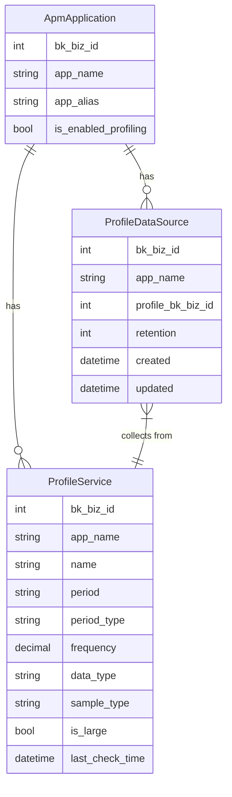

# 性能分析模型

<cite>
**本文档引用的文件**   
- [profile.py](file://bkmonitor/apm/models/profile.py)
- [datasource.py](file://bkmonitor/apm/models/datasource.py)
- [application.py](file://bkmonitor/apm/models/application.py)
- [constants.py](file://bkmonitor/apm/constants.py)
- [service.py](file://bkmonitor/apm/core/discover/profile/service.py)
</cite>

## 目录
1. [简介](#简介)
2. [性能分析数据源（ProfileDataSource）](#性能分析数据源profiledatasource)
3. [性能分析服务（ProfileService）](#性能分析服务profileservice)
4. [采样类型常量与配置](#采样类型常量与配置)
5. [模型关系图](#模型关系图)
6. [数据采集频率与存储优化](#数据采集频率与存储优化)
7. [结论](#结论)

## 简介
本文档详细解析了蓝鲸监控平台（BlueKing - Monitor）中性能分析模块的模型设计。重点分析了`ProfileDataSource`（性能分析数据源）的结构、存储位置和保留周期，以及`ProfileService`（性能分析服务）的字段定义和业务关联。结合`constants.py`中的采样类型常量，解释了不同采样类型的用途和配置方法。通过模型关系图展示了`ProfileDataSource`与`Application`、`ProfileService`之间的层次关系，并说明了性能数据的采集频率和存储优化策略。

## 性能分析数据源（ProfileDataSource）

`ProfileDataSource`是性能分析模块的核心数据源模型，继承自`ApmDataSourceConfigBase`，用于管理性能分析数据的存储和生命周期。

### 存储位置与业务关联
`ProfileDataSource`的存储位置由`profile_bk_biz_id`字段决定，该字段表示数据源在数据平台（bkbase）中的业务ID。当应用创建在非业务环境下时，`profile_bk_biz_id`可能与`bk_biz_id`不一致，此时数据源将创建在公共业务下（由`settings.BK_DATA_BK_BIZ_ID`配置）。这种设计实现了跨业务的统一数据管理。

### 保留周期
`ProfileDataSource`通过`retention`字段定义数据的过期时间（单位：天）。该值在数据源创建时由`BkDataDorisProvider`提供，并存储在数据库中。数据保留策略支持冷热集群配置，通过`DEFAULT_APM_ES_WARM_RETENTION_RATIO`（默认值0.3）计算热数据保留天数，实现存储成本优化。

### 数据源创建与管理
`ProfileDataSource`的创建和管理通过`apply_datasource`类方法实现。该方法首先检查是否存在已配置的数据源，若不存在且`option`为True，则创建新的数据源实例。数据源的启用和停用通过`start`和`stop`类方法控制，分别调用`api.bkdata.start_databus_cleans`和`api.bkdata.stop_databus_cleans`接口来管理数据清洗流程。

**Section sources**
- [datasource.py](file://bkmonitor/apm/models/datasource.py#L1089-L1180)

## 性能分析服务（ProfileService）

`ProfileService`模型用于存储和管理性能分析服务的元数据，包括服务名称、采样类型和是否为大服务标记等关键信息。

### 字段定义
- `bk_biz_id`: 业务ID，用于标识服务所属的业务。
- `app_name`: 应用名称，标识服务所属的应用。
- `name`: 服务名称，唯一标识一个性能分析服务。
- `period`: 采样周期，表示采样的时间间隔。
- `period_type`: 周期类型，定义了`period`的时间单位（如纳秒、微秒等）。
- `frequency`: 采样频率，通过`_calculate_frequency`方法计算得出。
- `data_type`: 数据类型，标识性能数据的类别。
- `sample_type`: 采样类型，如CPU、内存、堆栈等，具体值见`constants.py`。
- `is_large`: 是否是大数据量服务标记，用于标识高负载服务。
- `last_check_time`: 最近检查时间，记录服务信息的最后更新时间。

### 大服务标记逻辑
`is_large`字段的值由`is_large_service`方法决定。该方法通过查询过去10分钟内指定服务的性能数据条数，若超过`LARGE_SERVICE_SIZE`（默认10000条），则标记为大数据量服务。此标记用于后续的性能分析和告警策略。

**Section sources**
- [profile.py](file://bkmonitor/apm/models/profile.py#L14-L29)
- [service.py](file://bkmonitor/apm/core/discover/profile/service.py#L176-L206)

## 采样类型常量与配置

`constants.py`文件中定义了性能分析相关的常量，特别是`ProfileQueryType`枚举类，用于规范采样类型。

### 采样类型常量
```python
class ProfileQueryType:
    """Profile查询中api_params.type参数枚举值"""

    # cpu查询
    CPU = "cpu"
```

### 采样类型用途
- `CPU`: 用于CPU性能分析，采样频率计算基于周期类型（如`cpu/nanoseconds`、`cpu/microseconds`等）转换为纳秒后，用10^9除以周期值得到每秒采样次数。

### 配置方法
采样类型在`ProfileService`模型中通过`sample_type`字段存储。在服务发现过程中，系统会自动从性能数据中提取`sample_type`值，并与`ProfileQueryType`中的常量进行匹配，确保数据的一致性和准确性。

**Section sources**
- [constants.py](file://bkmonitor/apm/constants.py#L595-L600)
- [service.py](file://bkmonitor/apm/core/discover/profile/service.py#L151-L167)

## 模型关系图



**Diagram sources **
- [application.py](file://bkmonitor/apm/models/application.py#L36-L56)
- [datasource.py](file://bkmonitor/apm/models/datasource.py#L1089-L1105)
- [profile.py](file://bkmonitor/apm/models/profile.py#L14-L29)

## 数据采集频率与存储优化

### 采集频率计算
采集频率的计算逻辑在`_calculate_frequency`方法中实现，根据不同采样类型采用不同的计算公式：
- **CPU采样**: 将周期转换为纳秒后，用10^9除以周期值。
- **其他类型**: 对于`xxx/count`类型的采样，频率计算为`value / (period * duration(s))`。

### 存储优化策略
系统采用冷热集群存储策略优化性能数据存储：
1. **热数据存储**: 最新数据存储在高性能的热节点，便于快速查询。
2. **冷数据存储**: 超过`allocation_min_days`（基于`retention`和`DEFAULT_APM_ES_WARM_RETENTION_RATIO`计算）的数据自动迁移到成本较低的冷节点。
3. **索引管理**: 通过`index_settings`配置分片和副本数量，优化查询性能和数据可靠性。

**Section sources**
- [service.py](file://bkmonitor/apm/core/discover/profile/service.py#L139-L174)
- [datasource.py](file://bkmonitor/apm/models/datasource.py#L626-L649)

## 结论
本文档详细解析了蓝鲸监控平台性能分析模块的模型设计。`ProfileDataSource`作为数据源管理的核心，通过`profile_bk_biz_id`实现了跨业务的数据统一管理，并通过`retention`字段和冷热集群策略优化存储成本。`ProfileService`模型完整记录了性能分析服务的元数据，特别是通过`is_large`标记识别高负载服务。采样类型常量确保了数据的一致性，而复杂的频率计算逻辑和存储优化策略则保证了系统的高性能和可扩展性。这些设计共同构成了一个高效、可靠的性能分析系统。