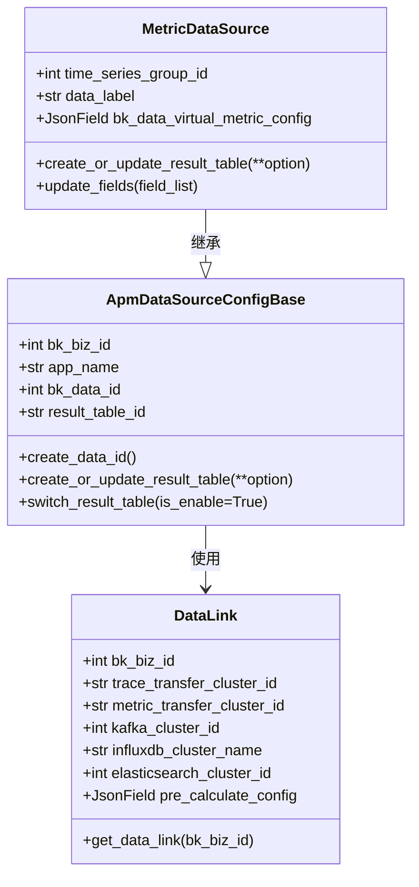
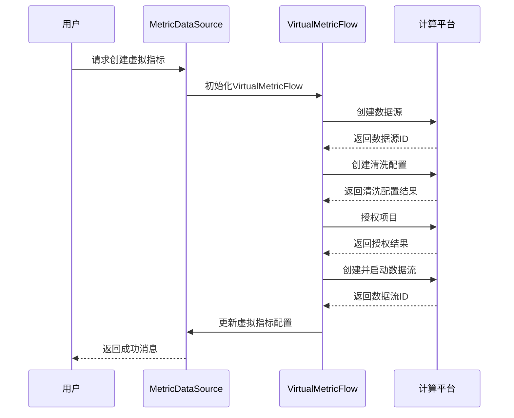
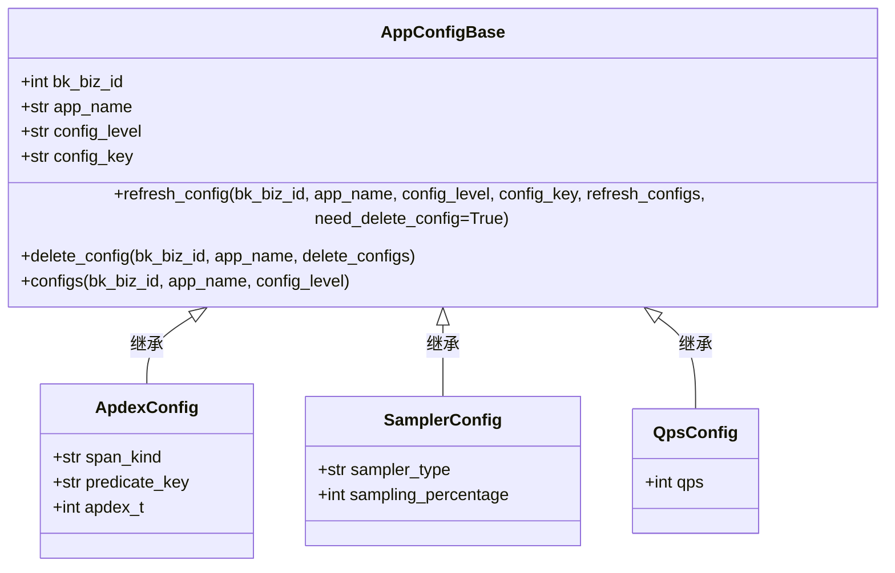
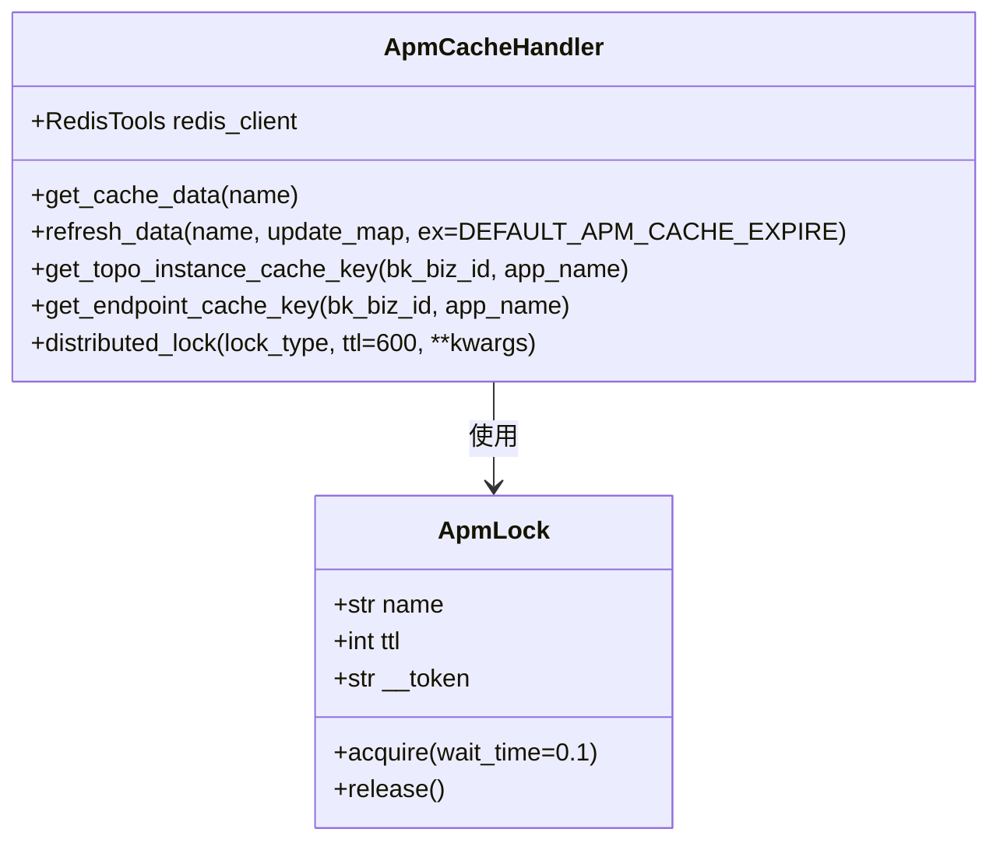

# 数据源模型

<cite>
**本文档引用的文件**   
- [datasource.py](file://bkmonitor/apm/models/datasource.py)
- [apm_cache_handler.py](file://bkmonitor/apm/core/handlers/apm_cache_handler.py)
- [virtual_metric.py](file://bkmonitor/apm/core/handlers/bk_data/virtual_metric.py)
- [config.py](file://bkmonitor/apm/models/config.py)
</cite>

## 目录
1. [引言](#引言)
2. [指标数据源结构](#指标数据源结构)
3. [虚拟指标配置](#虚拟指标配置)
4. [数据源与应用关联](#数据源与应用关联)
5. [缓存与动态加载](#缓存与动态加载)
6. [配置示例](#配置示例)
7. [数据生命周期管理](#数据生命周期管理)
8. [总结](#总结)

## 引言
本文档详细解析了蓝鲸监控平台（BlueKing - Monitor）中APM模块的数据源模型。重点分析了`MetricDataSource`的结构，包括其与InfluxDB集群的绑定关系、保留策略和预计算配置。同时，文档解释了虚拟指标配置如何支持自定义指标计算，以及数据源与应用的关联方式。通过`apm_cache_handler.py`实现的数据源配置缓存和动态加载机制也被详细说明。最后，提供了配置示例，展示如何为不同应用设置不同的数据采集和存储策略，并说明了数据生命周期管理机制。

## 指标数据源结构
`MetricDataSource`是APM模块中用于存储和管理指标数据的核心模型。它继承自`ApmDataSourceConfigBase`，并实现了特定于指标数据的功能。

### 与InfluxDB集群的绑定
`MetricDataSource`通过`DataLink`模型与InfluxDB集群进行绑定。`DataLink`模型中的`influxdb_cluster_name`字段存储了时序数据存储的InfluxDB集群名称。当创建或更新`MetricDataSource`时，如果`DataLink`存在且`influxdb_cluster_name`不为空，系统会将该集群名称作为默认存储配置。



**图源**
- [datasource.py](file://bkmonitor/apm/models/datasource.py#L192-L283)
- [datasource.py](file://bkmonitor/apm/models/datasource.py#L1181-L1216)

### 保留策略
`MetricDataSource`的保留策略通过`DataLink`模型中的`pre_calculate_config`字段进行配置。该字段是一个JSON字段，用于存储预计算数据的存储配置。配置中可以指定不同的集群和表名，以实现数据的分布式存储。

### 预计算配置
预计算配置允许将计算密集型任务的结果预先计算并存储，以提高查询性能。`DataLink`模型中的`pre_calculate_config`字段支持配置多个集群，每个集群可以有不同的表名。这种配置方式使得预计算数据可以存储在不同的集群中，从而实现负载均衡和高可用性。

**节源**
- [datasource.py](file://bkmonitor/apm/models/datasource.py#L192-L283)
- [datasource.py](file://bkmonitor/apm/models/datasource.py#L1181-L1216)

## 虚拟指标配置
虚拟指标配置（VirtualMetricConfig）允许用户定义自定义的指标计算逻辑。这些配置通过`bk_data_virtual_metric_config`字段存储在`MetricDataSource`模型中。

### 虚拟指标配置的实现
虚拟指标配置的实现主要依赖于`VirtualMetricFlow`类。该类负责创建和管理虚拟指标的计算流程。`VirtualMetricFlow`通过调用计算平台的API来创建数据源、清洗配置和数据流。



**图源**
- [virtual_metric.py](file://bkmonitor/apm/core/handlers/bk_data/virtual_metric.py#L42-L222)

### 虚拟指标配置的管理
虚拟指标配置的管理包括创建、更新和删除操作。`VirtualMetricFlow`类提供了`update_or_create`方法来处理这些操作。当配置发生变化时，系统会自动更新相关的数据源和数据流。

**节源**
- [virtual_metric.py](file://bkmonitor/apm/core/handlers/bk_data/virtual_metric.py#L42-L222)

## 数据源与应用关联
数据源与应用的关联通过`bk_biz_id`和`app_name`字段实现。每个`MetricDataSource`实例都与一个特定的业务和应用相关联。这种关联方式使得不同应用可以使用不同的数据采集和存储策略。

### 应用级别的配置
应用级别的配置通过`AppConfigBase`类实现。该类提供了`refresh_config`方法，用于更新应用的配置。配置可以包括采样率、QPS限制等。



**图源**
- [config.py](file://bkmonitor/apm/models/config.py#L614-L800)

### 配置的继承与覆盖
配置支持继承和覆盖机制。全局配置可以被应用级别的配置覆盖。这种机制使得系统可以提供默认配置，同时允许用户根据需要进行自定义。

**节源**
- [config.py](file://bkmonitor/apm/models/config.py#L614-L800)

## 缓存与动态加载
数据源配置的缓存和动态加载通过`apm_cache_handler.py`中的`ApmCacheHandler`类实现。该类使用Redis作为缓存后端，提供了高效的缓存和加载机制。

### 缓存机制
`ApmCacheHandler`类提供了`get_cache_data`和`refresh_data`方法，用于获取和更新缓存数据。缓存数据包括应用的拓扑实例和端点信息。



**图源**
- [apm_cache_handler.py](file://bkmonitor/apm/core/handlers/apm_cache_handler.py#L19-L153)

### 动态加载
动态加载机制通过`get_cache_data`方法实现。当请求数据时，系统首先检查缓存中是否存在数据。如果存在，则直接返回缓存数据；如果不存在，则从数据库中加载数据并更新缓存。

**节源**
- [apm_cache_handler.py](file://bkmonitor/apm/core/handlers/apm_cache_handler.py#L19-L153)

## 配置示例
以下是一个配置示例，展示如何为不同应用设置不同的数据采集和存储策略。

### 配置文件示例
```json
{
  "bk_biz_id": 1,
  "app_name": "example_app",
  "metric_transfer_cluster_id": "cluster1",
  "influxdb_cluster_name": "influxdb_cluster",
  "pre_calculate_config": {
    "cluster": [
      {
        "cluster_id": 1,
        "table_name": "pre_calculated_metrics"
      },
      {
        "cluster_id": 2,
        "table_name": "pre_calculated_metrics"
      }
    ]
  },
  "qps": 1000,
  "sampling_percentage": 50
}
```

### 配置说明
- `bk_biz_id`：业务ID，用于标识应用所属的业务。
- `app_name`：应用名称，用于标识应用。
- `metric_transfer_cluster_id`：指标传输集群ID，用于指定指标数据的传输集群。
- `influxdb_cluster_name`：InfluxDB集群名称，用于指定时序数据的存储集群。
- `pre_calculate_config`：预计算配置，用于指定预计算数据的存储集群和表名。
- `qps`：QPS限制，用于限制应用的请求速率。
- `sampling_percentage`：采样率，用于控制数据采集的采样比例。

**节源**
- [datasource.py](file://bkmonitor/apm/models/datasource.py#L192-L283)
- [config.py](file://bkmonitor/apm/models/config.py#L614-L800)

## 数据生命周期管理
数据生命周期管理通过保留策略和预计算配置实现。保留策略决定了数据在存储中的保留时间，而预计算配置则决定了预计算数据的存储位置和方式。

### 保留策略
保留策略通过`DataLink`模型中的`pre_calculate_config`字段进行配置。该字段支持配置多个集群，每个集群可以有不同的保留时间。

### 预计算数据的生命周期
预计算数据的生命周期由预计算配置中的`cluster`字段决定。每个集群可以有不同的保留时间，从而实现数据的分级存储。

**节源**
- [datasource.py](file://bkmonitor/apm/models/datasource.py#L1181-L1216)

## 总结
本文档详细解析了蓝鲸监控平台中APM模块的数据源模型。通过`MetricDataSource`模型，系统实现了与InfluxDB集群的绑定、保留策略和预计算配置。虚拟指标配置支持自定义指标计算，而数据源与应用的关联方式使得不同应用可以使用不同的数据采集和存储策略。通过`apm_cache_handler.py`实现的缓存和动态加载机制，系统提供了高效的配置管理。最后，通过配置示例和数据生命周期管理机制，系统实现了灵活的数据管理。