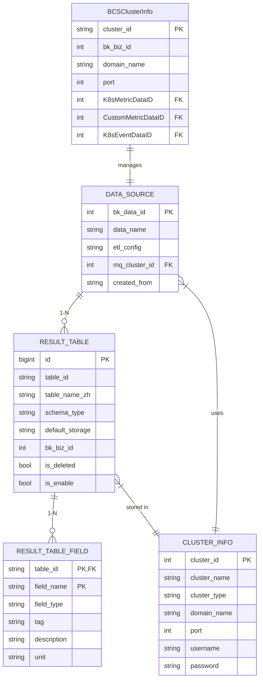

# 元数据模型

<cite>
**本文档引用的文件**
- [result_table.py](file://bkmonitor/metadata/models/result_table.py)
- [data_source.py](file://bkmonitor/metadata/models/data_source.py)
- [storage.py](file://bkmonitor/metadata/models/storage.py)
- [cluster.py](file://bkmonitor/metadata/models/bcs/cluster.py)
- [result_table.py](file://bkmonitor/constants/result_table.py)
- [data_source.py](file://bkmonitor/constants/data_source.py)
- [elasticsearch.py](file://bkmonitor/constants/elasticsearch.py)
</cite>

## 目录
1. [结果表与字段实体](#结果表与字段实体)
2. [数据源配置与生命周期](#数据源配置与生命周期)
3. [存储集群模型设计](#存储集群模型设计)
4. [BCS集群元数据结构](#bcs集群元数据结构)
5. [枚举类型定义](#枚举类型定义)
6. [元数据映射关系与同步机制](#元数据映射关系与同步机制)

## 结果表与字段实体

`ResultTable`（结果表）是统一查询的基础实体，代表一个逻辑上的数据表。它通过`table_id`唯一标识，包含表名、中文名、所属业务、标签、存储配置等核心信息。每个结果表必须关联一个数据源（`DataSource`），并通过`DataSourceResultTable`模型建立多对多关系。

`ResultTableField`（结果表字段）定义了结果表中的具体字段，包含字段名、类型、标签、单位、描述等属性。字段标签（`tag`）用于区分字段角色，如`metric`（指标）、`dimension`（维度）、`timestamp`（时间戳）等。系统在创建结果表时会自动添加`time`、`bk_biz_id`、`ip`等默认字段。

**Section sources**
- [result_table.py](file://bkmonitor/metadata/models/result_table.py#L53-L789)
- [result_table.py](file://bkmonitor/constants/result_table.py#L13-L32)

## 数据源配置与生命周期

`DataSource`（数据源）实体管理数据的来源配置，包括数据源ID（`bk_data_id`）、名称、描述、消息队列（MQ）集群、ETL清洗配置等。数据源的生命周期由创建、启用/禁用、配置更新和删除等操作组成。

数据源通过`create_data_source`类方法创建，该方法会初始化数据源记录、创建MQ配置（如KafkaTopicInfo）、设置默认选项（`DataSourceOption`），并建立与空间（`Space`）的关联。数据源的配置信息（如MQ地址、ETL规则）会通过Consul等配置中心同步给数据采集和处理组件。

**Section sources**
- [data_source.py](file://bkmonitor/metadata/models/data_source.py#L66-L840)

## 存储集群模型设计

`ClusterInfo`（集群信息）模型定义了InfluxDB、Elasticsearch、Kafka等存储集群的配置，包括集群类型、域名、端口、认证信息等。`StorageResultTable`是所有实际存储结果表的基类，其具体实现包括`InfluxDBStorage`、`ESStorage`、`KafkaStorage`等。

每个存储类型通过`STORAGE_TYPE`常量标识，并提供`create_table`、`get_client`、`add_field`等抽象方法。当结果表创建时，会调用`check_and_create_storage`方法，在对应的存储集群中创建物理表或索引。

**Section sources**
- [storage.py](file://bkmonitor/metadata/models/storage.py#L94-L800)

## BCS集群元数据结构

`BCSClusterInfo`（BCS集群信息）模型存储了Kubernetes集群的元数据，包括集群ID、业务ID、API访问信息（域名、端口、认证令牌）以及关联的数据源ID（如`K8sMetricDataID`、`CustomMetricDataID`）。

该模型通过`register_cluster`方法注册新集群，会自动创建所需的6个数据源（Data ID）和自定义上报组（Custom Group），并下发相应的Kubernetes资源配置（如DataID资源）。`api_client`属性提供了一个缓存的Kubernetes API客户端，用于与集群交互。

**Section sources**
- [cluster.py](file://bkmonitor/metadata/models/bcs/cluster.py#L24-L536)

## 枚举类型定义

系统通过`constants`模块定义了核心枚举类型：

- **数据源类型 (`DataSourceLabel`)**: `bk_monitor` (监控采集器), `bk_data` (计算平台), `custom` (自定义), `prometheus` 等。
- **数据类型 (`DataTypeLabel`)**: `time_series` (时序数据), `event` (事件数据), `log` (日志数据)。
- **结果表字段类型 (`FIELD_TYPE_*`)**: `int`, `float`, `string`, `boolean`, `timestamp` 等。
- **结果表字段标签 (`FIELD_TAG_*`)**: `metric`, `dimension`, `timestamp`, `group`。

这些枚举确保了系统内数据分类和类型的统一。

**Section sources**
- [data_source.py](file://bkmonitor/constants/data_source.py#L21-L246)
- [result_table.py](file://bkmonitor/constants/result_table.py#L13-L32)
- [elasticsearch.py](file://bkmonitor/constants/elasticsearch.py#L1-L76)

## 元数据映射关系与同步机制

**Diagram sources**
- [data_source.py](file://bkmonitor/metadata/models/data_source.py#L66-L840)
- [result_table.py](file://bkmonitor/metadata/models/result_table.py#L53-L789)
- [storage.py](file://bkmonitor/metadata/models/storage.py#L94-L800)
- [cluster.py](file://bkmonitor/metadata/models/bcs/cluster.py#L24-L536)

元数据的同步主要通过以下机制实现：
1.  **Consul配置中心**: `ResultTable`和`DataSource`的配置信息会定期刷新到Consul，供数据采集器（如GSE Transfer）读取。
2.  **数据库事务**: 实体的创建和更新操作通常在数据库事务中完成，确保数据一致性。
3.  **异步任务**: 复杂的同步操作（如向计算平台申请Data ID）通过Celery异步任务执行，避免阻塞主流程。
4.  **Kubernetes资源**: BCS集群的元数据通过创建自定义Kubernetes资源（如DataID资源）的方式同步到集群内部。