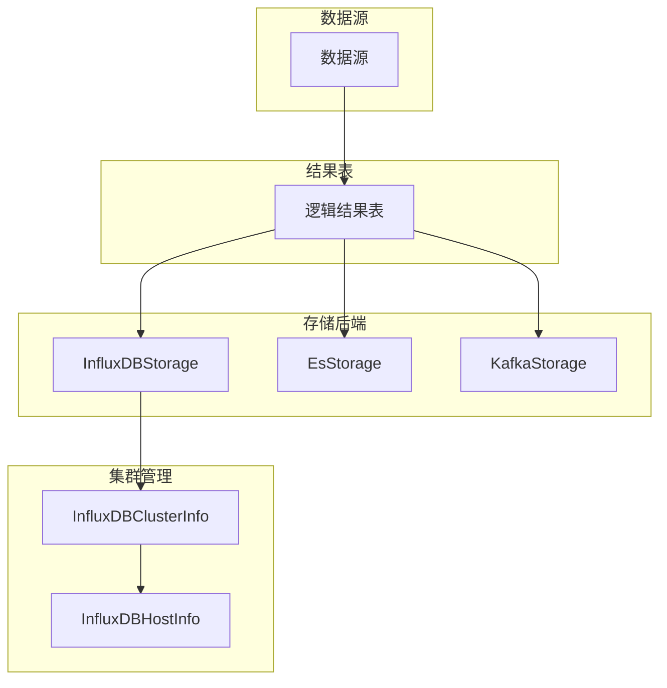

# 存储模型

<cite>
**本文档引用的文件**   
- [storage.py](file://bkmonitor/metadata/models/storage.py)
- [influxdb_cluster.py](file://bkmonitor/metadata/models/influxdb_cluster.py)
- [result_table.py](file://bkmonitor/metadata/models/bkdata/result_table.py)
- [constants.py](file://bkmonitor/metadata/models/constants.py)
</cite>

## 目录
1. [存储后端配置](#存储后端配置)
2. [InfluxDB集群元数据管理](#influxdb集群元数据管理)
3. [结果表与蓝鲸数据平台的映射](#结果表与蓝鲸数据平台的映射)
4. [存储类型与集群注册系统枚举](#存储类型与集群注册系统枚举)
5. [存储模型架构](#存储模型架构)

## 存储后端配置

本文档详细描述了`storage.py`文件中定义的多种存储后端的配置，包括InfluxDBStorage、EsStorage和KafkaStorage。

`InfluxDBStorage`类用于配置TSDB物理表，其核心配置包括：
- `table_id`: 结果表名，作为主键。
- `storage_cluster_id`: 存储集群ID，指向`ClusterInfo`记录。
- `database`: 数据库名。
- `source_duration_time`: 原始数据保留时间，格式如"30d"。
- `proxy_cluster_name`: 实际存储集群名字，用于influxdb-proxy路由。
- `use_default_rp`: 是否使用默认的保留策略（retention policy）。

`KafkaStorage`类用于配置Kafka存储方案，其核心配置包括：
- `table_id`: 结果表名。
- `topic`: Kafka topic名称。
- `partition`: topic分区数量。
- `storage_cluster_id`: 存储集群ID，指向`ClusterInfo`记录。
- `retention`: 保存数据超时时间。

`EsStorage`类用于配置Elasticsearch存储，其核心配置包括：
- `table_id`: 结果表名。
- `date_format`: 日期格式化配置，用于索引创建。
- `slice_size`: index大小切分阈值，单位GB。
- `slice_gap`: index分片时间间隔，单位分钟。
- `retention`: index保存时间，单位天。
- `storage_cluster_id`: 存储集群ID，指向`ClusterInfo`记录。

**Section sources**
- [storage.py](file://bkmonitor/metadata/models/storage.py#L833-L1599)

## InfluxDB集群元数据管理

`influxdb_cluster.py`文件中的`InfluxDBClusterInfo`类负责管理InfluxDB集群的元数据。该类继承自Django的`models.Model`，并定义了以下字段：
- `host_name`: 主机名。
- `cluster_name`: 归属集群名。
- `host_readable`: 是否在该集群中可读。

该类提供了多种方法来管理集群信息，包括：
- `export_data`: 导出所有集群信息。
- `import_data`: 导入集群信息。
- `refresh_consul_cluster_config`: 将集群配置刷新到Consul中。
- `clean_consul_config`: 清理不存在的Consul key。

此外，`InfluxDBHostInfo`类用于管理InfluxDB存储集群的主机信息，包括域名、端口、用户名、密码等。`InfluxDBTagInfo`类则用于管理InfluxDB集群的tag分区配置。

**Section sources**
- [influxdb_cluster.py](file://bkmonitor/metadata/models/influxdb_cluster.py#L347-L477)

## 结果表与蓝鲸数据平台的映射

`bkdata/result_table.py`文件中的`BkBaseResultTable`类用于将结果表映射到蓝鲸数据平台。该类定义了以下字段：
- `data_link_name`: 链路名称，作为主键。
- `bkbase_data_name`: 计算平台数据源名称。
- `storage_type`: 存储类型，使用`ClusterInfo.CLUSTER_TYPE_CHOICES`进行选择。
- `monitor_table_id`: 监控平台结果表ID。
- `storage_cluster_id`: 存储集群ID。
- `bkbase_table_id`: 计算平台结果表ID。
- `bkbase_rt_name`: 计算平台结果表名称。

该类还定义了`STATUS_CHOICES`，用于表示链路的状态，包括"初始化中"、"创建中"、"等待中"和"已就绪"。

**Section sources**
- [result_table.py](file://bkmonitor/metadata/models/bkdata/result_table.py#L26-L85)

## 存储类型与集群注册系统枚举

`constants.py`文件中定义了多个枚举和常量，用于描述存储类型和集群注册系统。

`ClusterInfo`类中定义了`CLUSTER_TYPE_CHOICES`，包括：
- `TYPE_INFLUXDB`: InfluxDB
- `TYPE_KAFKA`: Kafka
- `TYPE_REDIS`: Redis
- `TYPE_ES`: Elasticsearch
- `TYPE_ARGUS`: Argus
- `TYPE_VM`: Victoria Metrics
- `TYPE_DORIS`: Doris
- `TYPE_BKDATA`: Bkdata

`registered_system`字段用于描述该存储集群被何系统使用，包括：
- `DEFAULT_REGISTERED_SYSTEM`: 默认注册系统名
- `LOG_PLATFORM_REGISTERED_SYSTEM`: 日志平台注册系统
- `BKDATA_REGISTERED_SYSTEM`: Bkdata注册系统

这些枚举和常量为存储模型的配置提供了标准化的选项。

**Section sources**
- [constants.py](file://bkmonitor/metadata/models/constants.py#L107-L131)

## 存储模型架构

**Diagram sources**
- [storage.py](file://bkmonitor/metadata/models/storage.py#L833-L1599)
- [influxdb_cluster.py](file://bkmonitor/metadata/models/influxdb_cluster.py#L347-L477)

该架构图展示了数据如何从结果表路由到不同的物理存储，并说明了存储配置的继承和覆盖机制。数据源首先映射到逻辑结果表，然后根据配置路由到不同的存储后端。InfluxDBStorage通过InfluxDBClusterInfo和InfluxDBHostInfo管理集群元数据，确保数据的正确存储和访问。