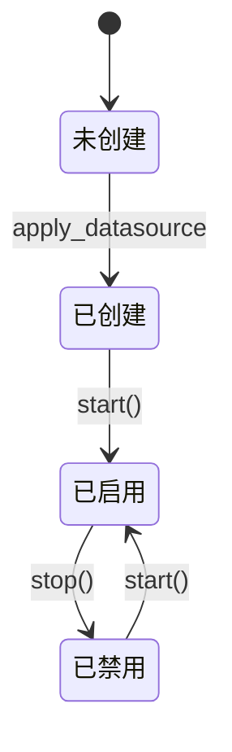
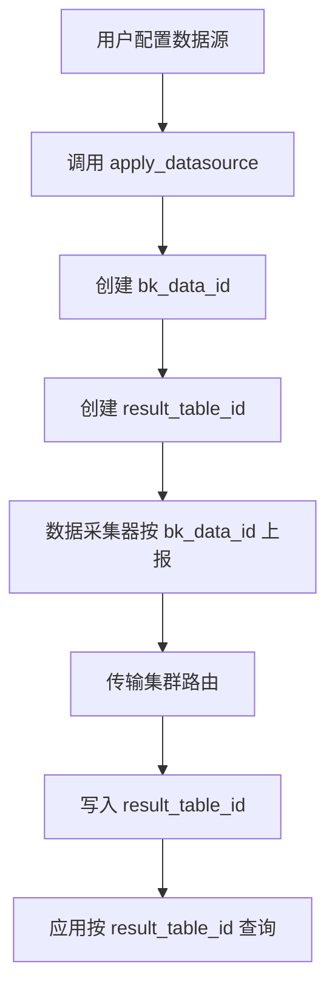

# 数据源模型

<cite>
**本文档引用的文件**   
- [datasource.py](file://bkmonitor/apm/models/datasource.py)
- [subscription_config.py](file://bkmonitor/apm/models/subscription_config.py)
- [data_source.py](file://bkmonitor/constants/data_source.py)
- [constants.py](file://bkmonitor/apm/constants.py)
</cite>

## 目录
1. [引言](#引言)
2. [数据源核心配置参数](#数据源核心配置参数)
3. [数据源生命周期管理](#数据源生命周期管理)
4. [自定义上报场景配置](#自定义上报场景配置)
5. [数据源类型、场景与标签枚举](#数据源类型场景与标签枚举)
6. [数据源与结果表关系](#数据源与结果表关系)
7. [数据接入与路由](#数据接入与路由)

## 引言
数据源（DataSource）是蓝鲸监控平台（BlueKing - Monitor）中用于定义和管理不同类型监控数据接入的核心实体。它作为数据接入的入口，负责配置数据的来源、类型、传输协议等关键信息，并与结果表（ResultTable）建立关联，实现数据的存储和查询。本文档将深入解析`data_source.py`中DataSource实体的配置参数，包括数据类型（data_type_label）、传输协议（transfer_cluster）、数据源标签（source_label）和采集场景（bk_data_scenario），并阐述其生命周期管理、与结果表的一对多关系，以及在数据接入和路由中的关键作用。

## 数据源核心配置参数

数据源模型通过一系列核心配置参数来定义其行为和属性。这些参数主要分布在`ApmDataSourceConfigBase`及其子类中，如`MetricDataSource`、`LogDataSource`和`TraceDataSource`。

### 数据类型 (data_type_label)
数据类型标签（`type_label`）用于标识数据源所采集数据的类别。在`constants/data_source.py`中定义了`DataTypeLabel`类，其主要枚举值包括：
- `TIME_SERIES`: 时序数据，如性能指标。
- `EVENT`: 事件数据，如系统事件。
- `LOG`: 日志数据，如应用日志。
- `TRACE`: Trace数据，用于分布式链路追踪。

在`datasource.py`中，`ApmDataSourceConfigBase.DATA_ID_PARAM`字典的`type_label`字段会根据具体的数据源类型（如`METRIC_DATASOURCE`）被设置为相应的`DataTypeLabel`值。例如，`MetricDataSource`的`DATA_ID_PARAM`中`type_label`被设置为`DataTypeLabel.TIME_SERIES`。

### 传输协议 (transfer_cluster)
传输协议（或传输集群）决定了数据从采集端到存储端的传输路径。在`datasource.py`的`DataLink`模型中，定义了不同数据类型的传输集群ID：
- `trace_transfer_cluster_id`: 用于Trace数据的Es Transfer集群ID。
- `metric_transfer_cluster_id`: 用于Metric数据的Transfer集群ID。

当创建数据源时，系统会检查`DataLink`配置，如果存在相应的传输集群ID，则会将其作为参数传递给`create_data_id`接口，从而将数据路由到指定的传输集群。

### 数据源标签 (source_label)
数据源标签（`source_label`）用于标识数据的来源。在`constants/data_source.py`中定义了`DataSourceLabel`类，其主要枚举值包括：
- `BK_MONITOR_COLLECTOR`: 监控采集器，表示数据由蓝鲸监控的采集器产生。
- `BK_DATA`: 计算平台，表示数据来自计算平台。
- `CUSTOM`: 自定义，表示数据为用户自定义上报。
- `BK_APM`: APM，表示数据来自应用性能监控模块。

在`datasource.py`中，`ApmDataSourceConfigBase.DATA_ID_PARAM`字典的`source_label`字段通常被设置为`DataSourceLabel.BK_MONITOR_COLLECTOR`，表明这些数据是由监控采集器采集的。

### 采集场景 (bk_data_scenario)
采集场景（`bk_data_scenario`）定义了数据的使用场景。虽然在提供的代码片段中没有直接出现`bk_data_scenario`字段，但`DataLink`模型中的`pre_calculate_config`字段可以理解为一种高级的场景配置，它允许将预计算数据存储在不同的集群中，从而支持不同的数据处理和分析场景。

**Section sources**
- [datasource.py](file://bkmonitor/apm/models/datasource.py#L56-L1257)
- [data_source.py](file://bkmonitor/constants/data_source.py#L1-L246)

## 数据源生命周期管理

数据源的生命周期主要通过启用/禁用（`is_enable`）状态来管理。`ApmDataSourceConfigBase`类提供了`start`和`stop`类方法来控制数据源的启停。

### 启用 (start)
当调用`start`方法时，系统会获取对应的数据源实例，并调用其`switch_result_table(True)`方法。该方法通过`metadata.modify_result_table` API将结果表的`is_enable`状态设置为`True`，从而激活该数据源，使其开始接收和处理数据。

### 禁用 (stop)
当调用`stop`方法时，系统同样会获取数据源实例，并调用`switch_result_table(False)`方法。这会将结果表的`is_enable`状态设置为`False`，停止数据的接收和处理。对于`TraceDataSource`，`stop`方法还会额外调用`api.log_search.delete_index_set`来删除关联的索引集，以释放资源。

**Diagram sources **
- [datasource.py](file://bkmonitor/apm/models/datasource.py#L113-L134)
- [datasource.py](file://bkmonitor/apm/models/datasource.py#L1078-L1088)

**Section sources**
- [datasource.py](file://bkmonitor/apm/models/datasource.py#L113-L134)
- [datasource.py](file://bkmonitor/apm/models/datasource.py#L1078-L1088)

## 自定义上报场景配置

`CustomReportSubscriptionConfig`模型（位于`metadata/models/custom_report/subscription_config.py`）用于为自定义上报场景配置数据源。它与`SubscriptionConfig`（位于`apm/models/subscription_config.py`）是两个不同的模型，前者是已废弃的旧模型，后者是当前使用的模型。

`CustomReportSubscriptionConfig`的核心功能是通过节点管理（NodeMan）创建和管理订阅任务，将自定义上报的配置（如数据ID、Token、QPS限制等）下发到指定的代理主机（Proxy）上。其主要流程如下：
1.  **获取配置**：通过`get_custom_event_config`或`get_custom_time_series_config`方法，从数据库中查询出业务下所有启用的自定义事件或指标组的配置。
2.  **生成订阅参数**：根据获取的配置，构建节点管理的订阅参数，其中包含了`bk-collector`插件的配置模板和上下文（context）。
3.  **创建或更新订阅**：调用`create_or_update_config`方法，使用节点管理API创建或更新订阅任务，将配置下发到目标主机。

尽管`CustomReportSubscriptionConfig`已被标记为“已废弃”，但其设计模式清晰地展示了如何通过订阅机制来管理自定义数据源的配置。

**Section sources**
- [subscription_config.py](file://bkmonitor/metadata/models/custom_report/subscription_config.py#L43-L717)
- [subscription_config.py](file://bkmonitor/apm/models/subscription_config.py#L21-L37)

## 数据源类型、场景与标签枚举

`constants/data_source.py`文件是定义数据源相关枚举值的核心文件。

### 数据源类型 (DataSourceLabel)
`DataSourceLabel`类定义了数据的来源，是`source_label`字段的取值范围。其主要值及其别名（`DATA_SOURCE_LABEL_ALIAS`）如下：
- `BK_MONITOR_COLLECTOR`: 监控采集指标
- `BK_DATA`: 计算平台指标
- `CUSTOM`: 自定义指标
- `BK_APM`: Trace明细指标

### 数据类型 (DataTypeLabel)
`DataTypeLabel`类定义了数据的类别，是`type_label`字段的取值范围。其主要值及其别名（`DATA_TYPE_LABEL_ALIAS`）如下：
- `TIME_SERIES`: 时序数据
- `EVENT`: 事件数据
- `LOG`: 日志数据
- `TRACE`: Trace数据

### 结果表标签 (ResultTableLabel)
`ApplicationsResultTableLabel`等类定义了结果表的分类标签，用于对结果表进行分组和管理。例如，`application_check`标签用于标识应用性能监控相关的结果表。

这些枚举值确保了系统内数据源配置的一致性和可维护性。

**Section sources**
- [data_source.py](file://bkmonitor/constants/data_source.py#L1-L246)

## 数据源与结果表关系

数据源（DataSource）与结果表（ResultTable）之间存在明确的一对多关系。一个数据源（由`bk_data_id`唯一标识）可以对应多个结果表（由`result_table_id`唯一标识）。

在`ApmDataSourceConfigBase`模型中，`bk_data_id`和`result_table_id`是两个核心字段。`bk_data_id`是数据源的唯一标识，而`result_table_id`是数据最终存储的逻辑表名。当数据源被创建时，系统会先创建一个`bk_data_id`，然后根据不同的数据类型（如Metric、Log、Trace）创建一个或多个`result_table_id`。

例如，`MetricDataSource`在`create_or_update_result_table`方法中，会调用`create_time_series_group` API来创建一个时序分组，该API会返回一个`table_id`（即`result_table_id`）和一个`time_series_group_id`。这表明一个`MetricDataSource`实例最终会关联到一个特定的结果表。

这种设计使得数据源可以作为数据接入的统一入口，而结果表则负责数据的结构化存储和查询，实现了接入与存储的解耦。

**Section sources**
- [datasource.py](file://bkmonitor/apm/models/datasource.py#L86-L88)
- [datasource.py](file://bkmonitor/apm/models/datasource.py#L236-L282)

## 数据接入与路由

数据源在数据接入和路由中扮演着至关重要的角色。其工作流程可以概括为：

1.  **配置定义**：用户通过API或UI定义一个数据源，指定其`data_type_label`、`source_label`等参数。
2.  **资源创建**：系统调用`apply_datasource`方法，首先创建`bk_data_id`（数据源ID），然后根据数据类型创建相应的结果表（`result_table_id`）。
3.  **数据路由**：数据采集器（如`bk-collector`）根据`bk_data_id`将采集到的原始数据发送到指定的传输集群（由`DataLink`配置决定）。
4.  **数据处理与存储**：传输集群将数据清洗、处理后，写入到由`result_table_id`指定的结果表中。
5.  **数据查询**：上层应用通过`result_table_id`从存储系统（如ES、InfluxDB）中查询数据。

在整个流程中，数据源模型通过`create_data_id`和`create_or_update_result_table`等方法，将高层的配置意图转化为底层的资源（`bk_data_id`和`result_table_id`），并确保数据能够被正确地路由和存储。

**Diagram sources **
- [datasource.py](file://bkmonitor/apm/models/datasource.py#L135-L167)
- [datasource.py](file://bkmonitor/apm/models/datasource.py#L236-L282)

**Section sources**
- [datasource.py](file://bkmonitor/apm/models/datasource.py#L135-L167)
- [datasource.py](file://bkmonitor/apm/models/datasource.py#L236-L282)