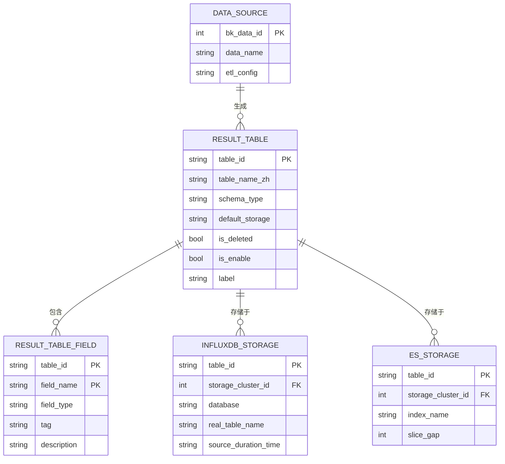

# 结果表模型

<cite>
**本文档引用的文件**   
- [result_table.py](file://bkmonitor/metadata/models/result_table.py)
- [constants/result_table.py](file://bkmonitor/constants/result_table.py)
- [storage.py](file://bkmonitor/metadata/models/storage.py)
</cite>

## 目录
1. [引言](#引言)
2. [结果表核心实体](#结果表核心实体)
3. [结果表字段实体](#结果表字段实体)
4. [关键枚举与常量](#关键枚举与常量)
5. [结果表生命周期管理](#结果表生命周期管理)
6. [关联关系与数据模型](#关联关系与数据模型)
7. [元数据同步与查询路由](#元数据同步与查询路由)

## 引言
本文档旨在全面阐述监控平台中的“结果表”（ResultTable）数据模型。结果表是统一查询功能的核心元数据，它抽象了来自不同数据源的原始数据，并将其映射到一个逻辑上的数据表。该模型定义了数据的结构、存储方式、生命周期以及与其他系统（如数据源、存储集群）的关联关系。通过本模型，系统能够实现对异构数据的统一访问和查询。

## 结果表核心实体

`ResultTable` 实体是整个数据模型的核心，它代表了一个逻辑上的数据表。一个结果表可以由一个数据源（DataSource）生成，并可以存储在多种物理存储（如InfluxDB, ES）中。

**实体字段定义**

| 字段名 | 数据类型 | 约束/默认值 | 业务含义 |
| :--- | :--- | :--- | :--- |
| `id` | BigAutoField | 主键 | 数据库自增主键 |
| `table_id` | CharField(128) | 唯一索引 | 结果表ID，命名规则为`数据库名.表名`，例如 `system.cpu`。 |
| `bk_tenant_id` | CharField(256) | 默认值: "system" | 租户ID，用于多租户环境下的数据隔离。 |
| `table_name_zh` | CharField(128) | - | 结果表的中文名称，用于在UI上展示。 |
| `is_custom_table` | BooleanField | - | 标记该结果表是否为用户自定义创建。 |
| `schema_type` | CharField(64) | 选择项: `free`, `dynamic`, `fixed` | 定义表的Schema配置方案。`free`表示无固定字段，`dynamic`表示动态字段，`fixed`表示固定字段。 |
| `default_storage` | CharField(32) | 选择项: `influxdb`, `kafka`, `redis`, `elasticsearch`, `argus`, `victoria_metrics`, `doris`, `bkdata` | 指定该结果表的默认存储方案。 |
| `creator` | CharField(32) | - | 创建者用户名。 |
| `create_time` | DateTimeField | 自动添加 | 记录创建时间。 |
| `last_modify_user` | CharField(32) | - | 最后修改者用户名。 |
| `last_modify_time` | DateTimeField | 自动更新 | 记录最后修改时间。 |
| `bk_biz_id` | IntegerField | 默认值: 0 | 结果表所属的业务ID。0表示全业务共享。 |
| `is_deleted` | BooleanField | 默认值: False | **软删除标记**。当值为`True`时，表示该结果表已被禁用或删除，但元数据仍保留在数据库中。这是生命周期管理的关键机制。 |
| `is_enable` | BooleanField | 默认值: True | 标记该结果表是否处于启用状态。禁用的结果表将不会被查询或写入。 |
| `label` | CharField(128) | 默认值: "other" | 结果表标签，用于分类，如`os`, `component`, `application`等。 |
| `data_label` | CharField(128) | 可为空 | 数据标签，用于更细粒度的数据分类。 |
| `is_builtin` | BooleanField | 默认值: False | 标记该结果表是否为系统内置。 |

**业务含义与作用**
`ResultTable` 作为统一查询的元数据核心，其主要作用是：
1.  **数据抽象**：将来自不同数据源（如GSE Agent、Kafka、自定义上报）的数据，抽象为一个具有统一结构（字段）的逻辑表。
2.  **存储路由**：通过`default_storage`和`storage_list`属性，明确数据最终存储在哪个物理集群（如InfluxDB集群、ES集群）。
3.  **元数据管理**：集中管理表的名称、描述、标签、生命周期状态等信息，为上层应用提供统一的元数据视图。

**Section sources**
- [result_table.py](file://bkmonitor/metadata/models/result_table.py#L53-L104)

## 结果表字段实体

`ResultTableField` 实体定义了`ResultTable`中具体的字段信息。每个结果表可以包含多个字段，每个字段都有其特定的类型和用途。

**实体字段定义**

| 字段名 | 数据类型 | 约束/默认值 | 业务含义 |
| :--- | :--- | :--- | :--- |
| `table_id` | CharField(128) | 外键引用 `ResultTable.table_id` | 关联的逻辑结果表ID。 |
| `bk_tenant_id` | CharField(256) | 默认值: "system" | 租户ID，与结果表保持一致。 |
| `field_name` | CharField(255) | 唯一索引 (table_id, field_name, bk_tenant_id) | 字段名称。 |
| `field_type` | CharField(32) | 选择项: `int`, `long`, `float`, `string`, `boolean`, `object`, `nested`, `timestamp` | 字段的数据类型。 |
| `description` | TextField | 默认值: "" | 字段的详细描述。 |
| `unit` | CharField(32) | 默认值: "" | 字段的单位，如`%`, `ms`, `KB`等。 |
| `tag` | CharField(16) | 选择项: `unknown`, `dimension`, `metric`, `timestamp`, `group`, `const` | 字段标签，用于区分字段的语义。`dimension`为维度字段，`metric`为指标字段，`timestamp`为时间戳字段。 |
| `is_config_by_user` | BooleanField | - | 标记该字段是否已被用户确认并配置。对于自动发现的字段，此值可能为`False`。 |
| `default_value` | CharField(128) | 可为空 | 字段的默认值。 |
| `creator` | CharField(32) | - | 字段创建者。 |
| `create_time` | DateTimeField | 自动添加 | 字段创建时间。 |
| `last_modify_user` | CharField(32) | - | 字段最后修改者。 |
| `last_modify_time` | DateTimeField | 自动更新 | 字段最后修改时间。 |
| `alias_name` | CharField(64) | 默认值: "" | 字段别名，用于解决字段名冲突或映射原始上报字段名。 |
| `is_disabled` | BooleanField | 默认值: False | 标记该字段是否被禁用。 |

**业务含义与作用**
`ResultTableField` 的核心作用是定义数据的结构和语义：
1.  **结构定义**：明确每个字段的名称、类型和单位，确保数据的一致性。
2.  **语义区分**：通过`tag`字段，系统可以区分哪些字段是用于分组和过滤的维度（`dimension`），哪些是用于计算和聚合的指标（`metric`），以及时间戳（`timestamp`）。
3.  **数据兼容**：`alias_name`字段允许系统在内部使用一个字段名，而对外暴露另一个名称，提高了模型的灵活性。

**Section sources**
- [result_table.py](file://bkmonitor/metadata/models/result_table.py#L1783-L1880)

## 关键枚举与常量

`constants/result_table.py` 文件中定义了与结果表相关的枚举值和常量，这些值在代码中被广泛引用，确保了数据的一致性和可维护性。

**关键属性解释**

*   **结果表类型 (`result_table_type`)**:
    虽然在提供的代码中未直接找到`result_table_type`的枚举，但`schema_type`字段起到了类似的作用，其值定义在`ResultTable`类中：
    *   `SCHEMA_TYPE_FREE` (`free`): 无固定字段，适用于字段动态变化的场景。
    *   `SCHEMA_TYPE_DYNAMIC` (`dynamic`): 动态字段，允许在运行时添加新字段。
    *   `SCHEMA_TYPE_FIXED` (`fixed`): 固定字段，表结构一旦创建便不可更改。

*   **数据分类 (`data_category`)**:
    在提供的代码中，`label`字段承担了数据分类的职责。其具体值（如`os`, `component`）可能在`Label`类或其他配置文件中定义，但`ResultTable`模型通过`label`字段引用这些分类，用于对结果表进行归类。

*   **字段类型 (`field_type`)**:
    定义在`ResultTableField`类中，是字段数据类型的核心枚举。
    *   `FIELD_TYPE_INT` (`int`): 整型
    *   `FIELD_TYPE_FLOAT` (`float`): 浮点型
    *   `FIELD_TYPE_STRING` (`string`): 字符型
    *   `FIELD_TYPE_BOOLEAN` (`boolean`): 布尔型
    *   `FIELD_TYPE_TIMESTAMP` (`timestamp`): 时间字段

*   **字段标签 (`field_tag`)**:
    定义在`ResultTableField`类中，用于标识字段的业务角色。
    *   `FIELD_TAG_METRIC` (`metric`): 指标字段，通常为数值，用于计算。
    *   `FIELD_TAG_DIMENSION` (`dimension`): 维度字段，通常为字符串，用于分组和过滤。
    *   `FIELD_TAG_TIMESTAMP` (`timestamp`): 时间戳字段，标识数据的时间点。

*   **保留字**:
    `constants/result_table.py` 文件中定义了`RT_RESERVED_WORD_EXACT`和`RT_RESERVED_WORD_FUZZY`列表，这些是结果表名和字段名的保留字（如`SELECT`, `FROM`, `TIME`等），在创建时会进行校验以避免冲突。

**Section sources**
- [constants/result_table.py](file://bkmonitor/constants/result_table.py#L13-L248)
- [result_table.py](file://bkmonitor/metadata/models/result_table.py#L1787-L1821)

## 结果表生命周期管理

结果表的生命周期通过一系列状态字段和管理方法进行控制，确保了数据的稳定性和操作的可追溯性。

**生命周期阶段**

1.  **创建 (`create`)**:
    通过`ResultTable.create_result_table`类方法创建一个新的结果表。该方法会校验参数、创建元数据记录、关联数据源，并根据配置创建相应的物理存储（如InfluxDB中的measurement）。

2.  **启用/禁用 (`enable/disable`)**:
    *   `is_enable` 字段控制结果表的启用状态。当`is_enable=True`时，数据可以正常写入和查询。
    *   当`is_enable=False`时，系统会停止向该表写入新数据，并且查询也会被阻止。这通常通过`modify`方法来实现。

3.  **更新 (`update`)**:
    通过`ResultTable.modify`实例方法可以修改结果表的大部分配置，如中文名、默认存储、字段列表、标签等。该方法会进行严格的校验，并在事务中执行，确保数据一致性。

4.  **软删除 (`soft delete`)**:
    *   这是结果表生命周期管理的核心机制。通过将`is_deleted`字段设置为`True`来实现。
    *   与硬删除不同，软删除不会从数据库中物理移除记录，而是将其标记为“已删除”。这使得系统可以保留历史元数据，便于审计和恢复。
    *   在查询时，大部分接口会自动过滤掉`is_deleted=True`的结果表。

5.  **删除 (物理删除)**:
    虽然`ResultTable`模型本身没有直接的删除方法，但其关联的物理存储（如`InfluxDBStorage`）在被删除时，会级联清理相关记录。真正的物理删除通常发生在数据归档或系统清理时。

**Section sources**
- [result_table.py](file://bkmonitor/metadata/models/result_table.py#L311-L357)
- [result_table.py](file://bkmonitor/metadata/models/result_table.py#L1123-L1474)

## 关联关系与数据模型

`ResultTable`模型通过外键和关联关系，与数据源、存储集群等核心组件紧密相连，构成了完整的数据链路。

**Diagram sources**
- [result_table.py](file://bkmonitor/metadata/models/result_table.py#L53-L104)
- [result_table.py](file://bkmonitor/metadata/models/result_table.py#L1783-L1880)
- [storage.py](file://bkmonitor/metadata/models/storage.py#L833-L934)
- [storage.py](file://bkmonitor/metadata/models/storage.py#L1599-L1795)

**关联关系说明**

*   **与数据源 (DataSource) 的关系**:
    一个`DataSource`可以生成多个`ResultTable`。这种关系通过`DataSourceResultTable`中间表（在`result_table.py`中通过`get_related_datasource`方法体现）进行关联。`ResultTable`通过`data_source`属性可以访问其来源数据源，从而获取数据接入的配置。

*   **与存储集群 (Storage) 的关系**:
    一个`ResultTable`可以存储在一个或多个物理存储中。代码中通过`REAL_STORAGE_DICT`字典定义了不同存储类型（如`influxdb`, `elasticsearch`）与具体存储模型（如`InfluxDBStorage`, `ESStorage`）的映射。
    *   `InfluxDBStorage`: 代表在InfluxDB集群中的物理表，包含`database`（数据库名）、`real_table_name`（实际表名）和`source_duration_time`（数据保留时间）等关键配置。
    *   `ESStorage`: 代表在Elasticsearch集群中的索引，包含`index_name`（索引名）、`slice_gap`（分片间隔）等配置。
    通过`real_storage_list`和`storage_list`属性，`ResultTable`可以获取其所有关联的物理存储实例和存储类型列表。

## 元数据同步与查询路由

结果表模型是实现元数据同步和查询路由的基础，它确保了查询服务能够准确地定位到数据。

**元数据同步**
当`ResultTable`或其关联的`ResultTableField`发生变更时，系统会通过`refresh_etl_config`等方法，将最新的元数据（如字段列表、存储配置）推送到配置中心（Consul）或缓存（Redis）。例如，`InfluxDBStorage`模型中的`push_redis_data`方法会将路由信息写入Redis，供查询服务使用。

**查询路由**
统一查询服务在收到查询请求时，会根据请求中的`table_id`，首先查询`ResultTable`元数据。通过元数据，服务可以确定：
1.  该表是否`is_deleted`或`is_enable`，以决定是否允许查询。
2.  该表的`default_storage`和`storage_list`，从而确定应该向哪个存储集群（如InfluxDB或ES）发起查询。
3.  该表的`field_list`，以验证查询中引用的字段是否存在，并进行必要的字段名映射（通过`alias_name`）。

通过这一系列的元数据查询和路由决策，系统实现了对异构数据源的透明访问。

**Section sources**
- [result_table.py](file://bkmonitor/metadata/models/result_table.py#L110-L179)
- [result_table.py](file://bkmonitor/metadata/models/result_table.py#L182-L208)
- [storage.py](file://bkmonitor/metadata/models/storage.py#L1100-L1132)