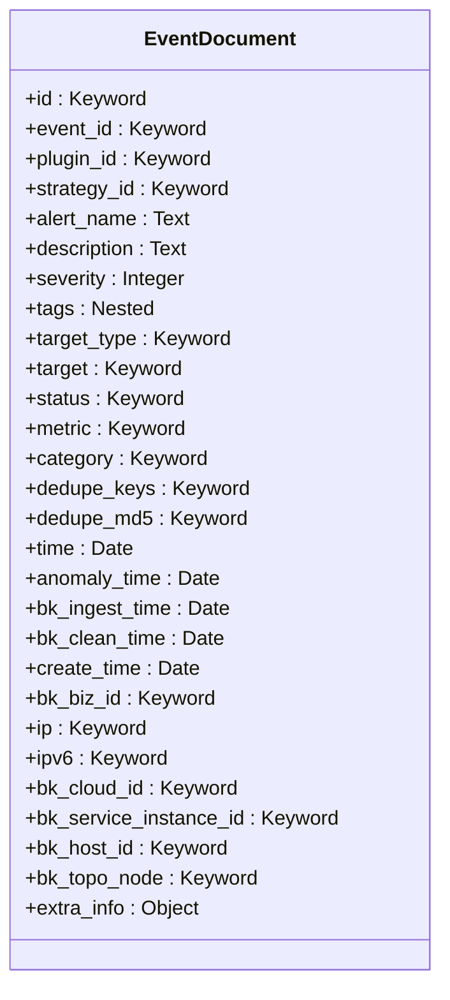
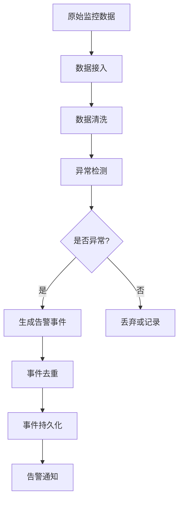
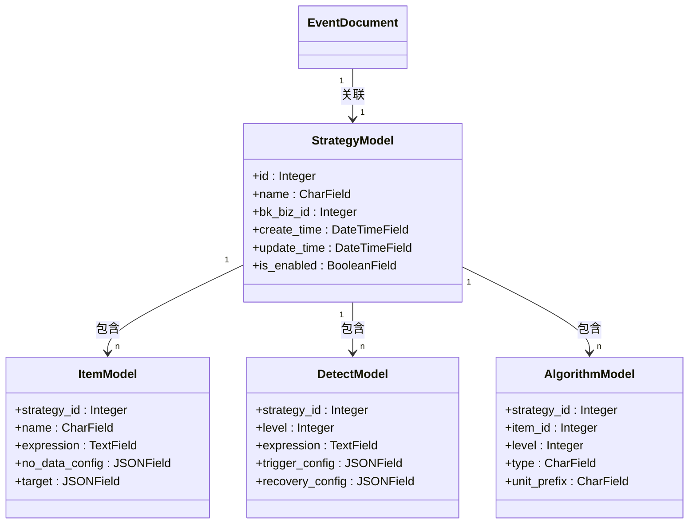
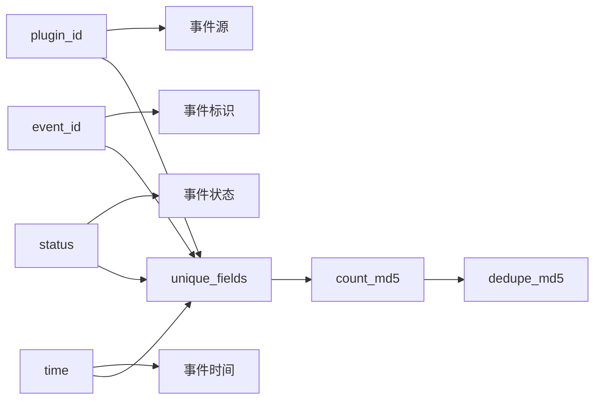
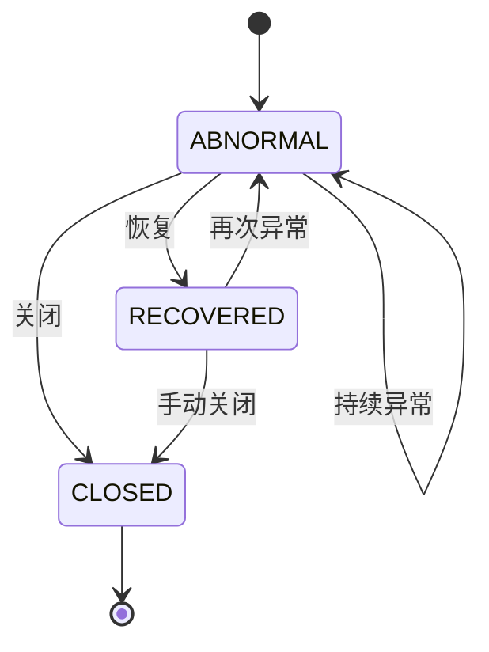

# 告警事件

<cite>
**本文档引用的文件**
- [event.py](file://bkmonitor\bkmonitor\documents\event.py)
- [alert.py](file://bkmonitor\bkmonitor\documents\alert.py)
- [event.py](file://bkmonitor\alarm_backends\core\alert\event.py)
- [event.py](file://bkmonitor\constants\event.py)
- [alert.py](file://bkmonitor\constants\alert.py)
- [strategy.py](file://bkmonitor\bkmonitor\models\strategy.py)
- [event_target.py](file://bkmonitor\bkmonitor\utils\event_target.py)
- [event_notify_status.py](file://bkmonitor\bkmonitor\utils\event_notify_status.py)
- [event_related_info.py](file://bkmonitor\bkmonitor\utils\event_related_info.py)
</cite>

## 目录
1. [告警事件数据结构](#告警事件数据结构)
2. [核心属性字段详解](#核心属性字段详解)
3. [告警事件生成机制](#告警事件生成机制)
4. [与监控策略的关联关系](#与监控策略的关联关系)
5. [事件唯一性标识机制](#事件唯一性标识机制)
6. [告警事件状态机](#告警事件状态机)
7. [查询接口与性能优化](#查询接口与性能优化)

## 告警事件数据结构

告警事件是监控系统中的核心数据实体，用于记录和表示系统中发生的异常情况。其数据结构设计遵循高可用、易扩展的原则，主要分为事件标识、事件内容、事件分类、控制字段和时间信息等几个部分。



**图表来源**
- [event.py](file://bkmonitor\bkmonitor\documents\event.py)

**本节来源**
- [event.py](file://bkmonitor\bkmonitor\documents\event.py)

## 核心属性字段详解

### 事件标识字段
事件标识字段是告警事件的唯一身份凭证，确保了事件的可追溯性和唯一性。

- **event_id**: 事件的唯一标识符，由系统生成，用于跨系统追踪同一事件。
- **plugin_id**: 事件来源插件的ID，标识了产生该事件的监控插件。
- **strategy_id**: 关联的监控策略ID，建立了事件与监控策略的关联关系。

### 事件内容字段
事件内容字段描述了告警事件的具体信息，是用户最关心的部分。

- **alert_name**: 告警名称，以文本形式存储，支持全文检索和精确匹配。
- **description**: 事件描述，提供关于事件的详细说明。
- **severity**: 严重程度等级，整数类型，数值越大表示严重程度越高。
- **tags**: 事件标签，以嵌套对象形式存储，包含键值对，用于多维度分类和过滤。

### 事件分类字段
事件分类字段用于对事件进行逻辑分组和管理。

- **metric**: 指标列表，标识了事件关联的监控指标。
- **category**: 事件类别，用于对事件进行大类划分。
- **data_type**: 数据类型，标识了事件的数据来源类型。

### 控制字段
控制字段用于实现事件的去重和幂等性处理。

- **dedupe_keys**: 去重键列表，定义了用于计算去重指纹的字段集合。
- **dedupe_md5**: 去重指纹，通过MD5算法计算得出的唯一哈希值，用于快速判断事件是否重复。

### 时间信息字段
时间信息字段记录了事件生命周期中的关键时间点。

- **time**: 事件产生时间，即事件在源系统中发生的时间。
- **anomaly_time**: 异常时间，标识了检测到异常的具体时间。
- **bk_ingest_time**: 数据接入时间，即事件数据进入监控系统的时刻。
- **bk_clean_time**: 数据清洗时间，即事件数据完成预处理的时间。
- **create_time**: 事件创建时间，服务器记录该事件的时间戳。

**本节来源**
- [event.py](file://bkmonitor\bkmonitor\documents\event.py)
- [alert.py](file://bkmonitor\bkmonitor\documents\alert.py)

## 告警事件生成机制

告警事件的生成是一个从原始监控数据到最终告警的复杂处理过程。该过程始于数据采集，经过数据清洗、异常检测，最终生成告警事件。



**图表来源**
- [event.py](file://bkmonitor\alarm_backends\core\alert\event.py)

**本节来源**
- [event.py](file://bkmonitor\alarm_backends\core\alert\event.py)

告警事件的生成由 `Event` 类负责处理。当系统接收到原始监控数据后，会创建一个 `Event` 实例，并调用其 `clean()` 方法进行数据清洗。该方法会标准化和验证所有字段，确保数据的一致性和完整性。例如，`_clean_severity()` 方法会将严重程度限制在1到3的范围内，而 `_clean_status()` 方法会将状态值转换为预定义的常量。

事件去重是生成机制中的关键环节。系统通过 `cal_dedupe_md5()` 方法计算事件的去重指纹。该方法首先根据 `dedupe_keys` 字段获取所有去重值，然后使用MD5算法计算这些值的哈希值。这个指纹被存储在 `dedupe_md5` 字段中，用于后续的重复事件检测。

## 与监控策略的关联关系

告警事件与监控策略之间存在着紧密的关联关系。每个告警事件都必须关联到一个具体的监控策略，该策略定义了如何检测和处理此类事件。



**图表来源**
- [strategy.py](file://bkmonitor\bkmonitor\models\strategy.py)

**本节来源**
- [strategy.py](file://bkmonitor\bkmonitor\models\strategy.py)

在 `StrategyModel` 中，策略ID是核心字段，它作为外键被 `ItemModel`、`DetectModel` 和 `AlgorithmModel` 等多个模型引用。这种设计实现了策略的模块化，使得一个策略可以包含多个监控项、多种检测算法和不同的触发条件。

告警事件通过 `strategy_id` 字段与 `StrategyModel` 建立关联。当一个事件被创建时，系统会根据其 `plugin_id` 和 `event_id` 查找匹配的监控策略，并将策略ID填充到事件的 `strategy_id` 字段中。这种关联关系使得系统能够根据策略配置来处理事件，例如应用特定的通知规则或执行自动化操作。

## 事件唯一性标识机制

事件的唯一性标识是确保系统稳定性和数据一致性的关键。系统采用多层标识机制来保证事件的全局唯一性。



**图表来源**
- [event.py](file://bkmonitor\alarm_backends\core\alert\event.py)

**本节来源**
- [event.py](file://bkmonitor\alarm_backends\core\alert\event.py)

事件的唯一性由 `dedupe_md5` 字段保证。该字段的值是通过 `count_md5()` 函数计算得出的。计算过程分为两步：首先，系统根据 `dedupe_keys` 字段确定用于去重的字段集合；然后，将这些字段的值组合成一个列表，并计算其MD5哈希值。

`dedupe_keys` 字段的值是动态生成的。如果事件关联了监控策略，则使用策略ID作为去重键之一；否则，使用告警名称。这种设计确保了在不同场景下都能有效去重。例如，对于由同一策略产生的事件，即使告警名称略有不同，只要其他关键字段相同，系统也能识别为重复事件。

此外，`_clean_uid()` 方法还实现了另一种唯一性标识，它基于 `plugin_id`、`event_id`、`status` 和 `time` 四个字段计算MD5值。这种标识主要用于事件的快速查找和索引。

## 告警事件状态机

告警事件的状态机定义了事件在其生命周期中可能经历的各种状态及其转换规则。状态机的设计直接影响到告警的处理流程和用户体验。



**图表来源**
- [alert.py](file://bkmonitor\constants\alert.py)

**本节来源**
- [alert.py](file://bkmonitor\constants\alert.py)

根据 `EventStatus` 枚举类的定义，告警事件主要有三种状态：
- **ABNORMAL (异常)**: 事件处于异常状态，需要被关注和处理。
- **RECOVERED (恢复)**: 事件已从异常状态恢复正常。
- **CLOSED (关闭)**: 事件已被关闭，不再需要处理。

状态转换由特定的触发条件驱动。例如，当系统检测到监控指标恢复正常时，会自动将事件状态从 `ABNORMAL` 转换为 `RECOVERED`。管理员也可以手动将事件状态从 `ABNORMAL` 或 `RECOVERED` 转换为 `CLOSED`。

状态机的实现还包含了丰富的状态标志位，如 `is_ack` (是否已确认)、`is_shielded` (是否被屏蔽) 和 `is_handled` (是否已处理)。这些标志位为事件的精细化管理提供了支持。例如，`is_ack` 标志位可以用来跟踪事件的确认情况，帮助团队了解哪些事件已被关注。

## 查询接口与性能优化

为了高效地查询和管理海量的告警事件，系统提供了丰富的查询接口，并在底层进行了多项性能优化。

### 查询接口使用示例

```python
# 根据 event_id 查询事件
event = EventDocument.get_by_event_id("event_12345")

# 根据 metric_id 和 target 查询最近的事件
event = EventDocument.get_by_metric_id_and_target("cpu_usage", "host_01", start_time=1609430400)
```

### 性能优化建议

1. **利用索引时间**: 查询时尽量指定时间范围，利用 `create_time` 字段的索引提高查询效率。
2. **避免全表扫描**: 使用 `filter()` 方法添加精确的过滤条件，避免不必要的数据加载。
3. **分页查询**: 对于大量数据的查询，使用分页功能，减少单次请求的数据量。
4. **选择性加载**: 只查询需要的字段，避免加载整个文档。

**本节来源**
- [event.py](file://bkmonitor\bkmonitor\documents\event.py)
- [event.py](file://bkmonitor\alarm_backends\core\alert\event.py)