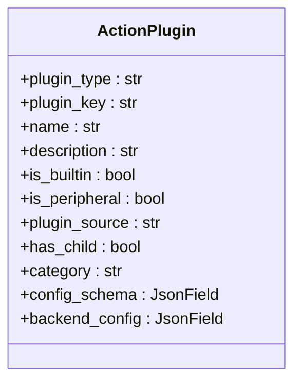
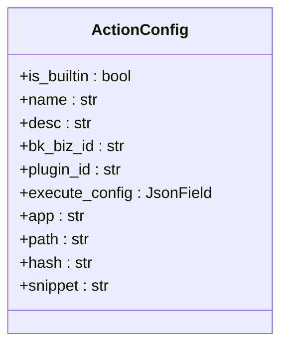
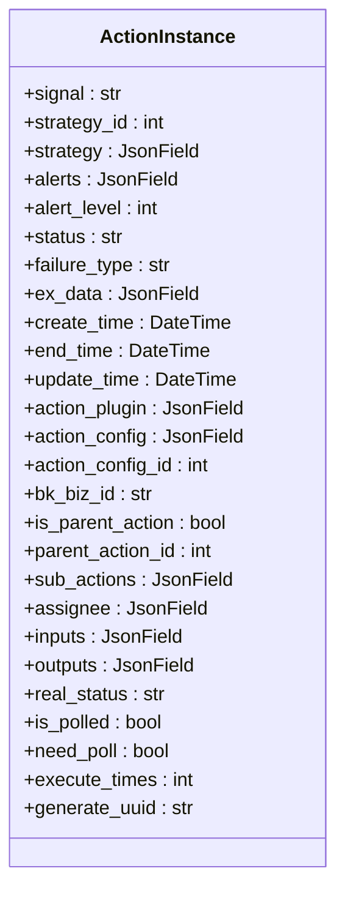
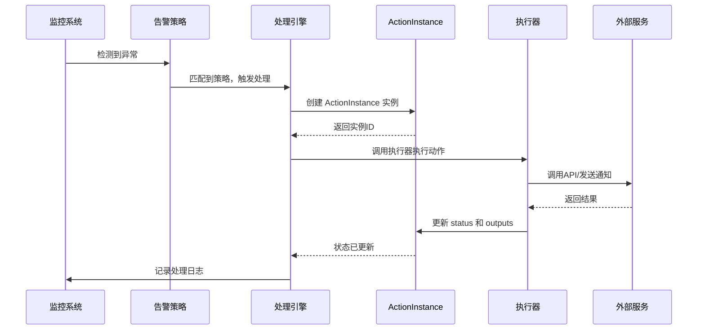
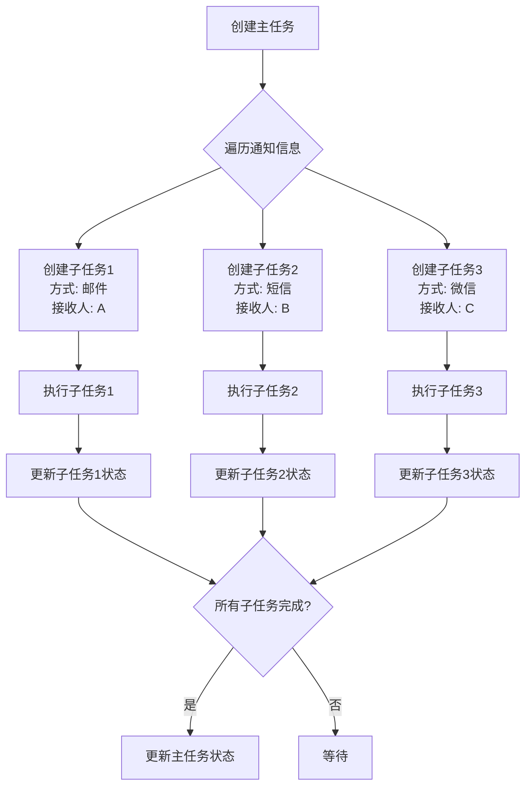

# 告警处理

<cite>
**本文档引用的文件**   
- [action.py](file://bkmonitor/bkmonitor/models/fta/action.py)
</cite>

## 目录
1. [引言](#引言)
2. [核心数据模型](#核心数据模型)
3. [告警处理流程](#告警处理流程)
4. [处理动作类型与配置](#处理动作类型与配置)
5. [通知子任务处理机制](#通知子任务处理机制)
6. [执行状态与结果反馈](#执行状态与结果反馈)
7. [日志与审计](#日志与审计)

## 引言
本文档旨在全面阐述蓝鲸监控平台中的告警处理机制。告警处理是监控系统的核心功能之一，负责在检测到异常时自动或手动触发一系列响应动作，如通知、脚本执行、工单创建等。文档将深入解析告警处理的核心概念、数据结构、执行流程及最佳实践，为开发者和运维人员提供详尽的指导。

## 核心数据模型

告警处理系统的核心由几个关键的数据模型构成，它们定义了处理动作的配置、实例化和执行过程。

### ActionPlugin 模型
`ActionPlugin` 模型定义了告警处理动作的插件类型及其配置。每个插件代表一种可执行的动作类别。

**关键字段**:
- **plugin_type**: 插件类型，包括 "通知"、"HTTP回调"、"作业平台"、"标准运维"、"流程服务" 和 "通用插件"。
- **plugin_key**: 插件的唯一标识符，与 `plugin_type` 一致。
- **name**: 插件的名称。
- **config_schema**: 前端参数配置格式，定义了用户在配置处理动作时看到的表单。
- **backend_config**: 后台执行格式，定义了插件如何与后端服务交互，例如API调用的URL、方法和数据模板。

**Diagram sources**
- [action.py](file://bkmonitor/bkmonitor/models/fta/action.py#L100-L150)

### ActionConfig 模型
`ActionConfig` 模型表示一个具体的告警处理套餐（或称处理方案）。它是 `ActionPlugin` 的实例化配置，定义了在特定业务场景下如何执行某个动作。

**关键字段**:
- **is_builtin**: 是否为内置套餐。
- **name**: 套餐名称。
- **bk_biz_id**: 关联的业务ID。
- **plugin_id**: 关联的 `ActionPlugin` ID。
- **execute_config**: 执行任务的具体参数配置，例如通知内容、作业脚本路径等。

**Diagram sources**
- [action.py](file://bkmonitor/bkmonitor/models/fta/action.py#L180-L210)

### ActionInstance 模型
`ActionInstance` 模型是告警处理的核心，它代表了一个具体的、正在或已经执行的处理动作实例。当告警触发时，系统会根据匹配的 `ActionConfig` 创建一个 `ActionInstance`。

**关键字段**:
- **signal**: 触发信号，如 "ABNORMAL"（异常）、"RECOVERED"（恢复）、"CLOSED"（关闭）等。
- **strategy_id**: 触发此动作的告警策略ID。
- **alerts**: 关联的告警列表。
- **status**: 执行状态，如 "RECEIVED"（已接收）、"SUCCESS"（成功）、"FAILURE"（失败）等。
- **action_config_id**: 关联的 `ActionConfig` ID。
- **inputs**: 任务的输入参数，包含动态变量，如告警详情、负责人信息等。
- **outputs**: 任务的输出参数，包含执行结果，如工单ID、API返回值等。
- **is_parent_action**: 是否为主任务，用于处理需要拆分的复杂任务（如批量通知）。
- **parent_action_id**: 父任务ID，用于构建任务的父子关系。

**Diagram sources**
- [action.py](file://bkmonitor/bkmonitor/models/fta/action.py#L279-L641)

## 告警处理流程

告警处理流程是一个从告警触发到动作执行的完整生命周期。

1.  **告警触发**: 监控系统检测到指标异常，生成一个告警事件。
2.  **策略匹配**: 系统根据告警的维度（如业务、主机、指标）匹配预定义的告警策略。
3.  **处理动作选择**: 匹配的策略中包含了关联的 `ActionConfig` ID。
4.  **创建处理实例**: 系统创建一个 `ActionInstance` 实例，其 `action_config_id` 指向匹配的配置，并填充 `inputs` 字段（如告警详情、负责人列表）。
5.  **执行动作**: 根据 `ActionInstance` 中 `action_plugin` 的 `plugin_type`，调用相应的执行器（Executor）来执行具体动作。
6.  **状态更新**: 执行器在执行过程中会更新 `ActionInstance` 的 `status` 和 `outputs` 字段。
7.  **结果反馈**: 执行完成后，系统根据结果生成日志并通知相关人员。

**Diagram sources**
- [action.py](file://bkmonitor/bkmonitor/models/fta/action.py#L279-L641)

## 处理动作类型与配置

系统支持多种处理动作类型，通过 `ActionPlugin.plugin_type` 进行区分。

### 通知 (Notice)
这是最常见的处理动作。系统会根据配置的通知方式（如邮件、短信、微信、蓝信）和接收人列表发送告警信息。`ActionInstance` 的 `inputs` 字段会包含 `notify_info`，定义了不同通知方式的接收人。

### 脚本执行 (Job/SOPS)
通过集成作业平台（Job）或标准运维（SOPS），可以自动执行预定义的脚本或流程来修复问题。`backend_config` 会定义调用Job/SOPS API的详细参数。

### 工单创建 (ITSM)
当问题需要人工介入时，可以自动创建一个流程服务（ITSM）工单。`backend_config` 定义了工单的模板和初始内容。

### HTTP回调 (Webhook)
允许将告警信息推送到第三方系统。`backend_config` 中的 `execute` 字段定义了目标URL和请求体。

### 自定义插件 (Common/BK Plugin)
支持通过蓝鲸插件或其他方式扩展更复杂的处理逻辑。

**Section sources**
- [action.py](file://bkmonitor/bkmonitor/models/fta/action.py#L100-L150)

## 通知子任务处理机制

当一个通知动作需要发送给多个接收人或使用多种通知方式时，系统会采用“主-子任务”模式来处理。

1.  **创建主任务**: 首先创建一个 `is_parent_action=True` 的 `ActionInstance` 作为主任务。
2.  **拆分子任务**: 主任务的 `create_sub_actions` 方法会根据 `inputs` 中的 `notify_info` 拆分出多个子任务。
3.  **创建子任务**: 每个子任务都是一个 `is_parent_action=False` 的 `ActionInstance`，其 `parent_action_id` 指向主任务。子任务包含了单一的通知方式和接收人。
4.  **并行执行**: 所有子任务可以并行执行，互不影响。
5.  **状态聚合**: 主任务的状态通常由其所有子任务的状态决定。当所有子任务都完成后，主任务的状态才会被更新。

此机制确保了通知的灵活性和可靠性，即使某个接收人或通知方式失败，也不会影响其他通知的发送。

**Diagram sources**
- [action.py](file://bkmonitor/bkmonitor/models/fta/action.py#L350-L450)

## 执行状态与结果反馈

`ActionInstance` 的 `status` 字段记录了处理动作的当前状态，是监控和排查问题的关键。

### 状态流转
- **RECEIVED**: 任务已创建，等待执行。
- **RUNNING**: 任务正在执行中。
- **SUCCESS**: 任务成功执行。
- **FAILURE**: 任务执行失败，`ex_data` 字段会包含错误信息。
- **SKIPPED**: 任务被跳过（例如，因条件不满足）。
- **WAITING**: 任务等待外部条件（如审批）。

### 结果反馈
执行结果通过 `outputs` 字段返回。例如：
- 对于ITSM工单，`outputs` 可能包含 `approve_info`，其中 `id` 是工单ID。
- 对于Webhook，`ex_data` 可能包含API的返回内容。

`get_content` 方法会根据 `status` 和 `outputs` 生成最终的反馈内容，该内容可用于日志记录或发送给用户。

**Section sources**
- [action.py](file://bkmonitor/bkmonitor/models/fta/action.py#L550-L600)

## 日志与审计

为了保证操作的可追溯性，系统提供了完善的日志记录功能。

### ActionInstanceLog 模型
该模型用于记录 `ActionInstance` 执行过程中的详细步骤。

**关键字段**:
- **action_instance_id**: 关联的 `ActionInstance` ID。
- **content**: 步骤记录的详细内容。
- **time**: 记录时间。
- **level**: 信息等级（DEBUG, INFO, WARNING, ERROR）。

### 告警日志集成
`ActionInstance` 的 `insert_alert_log` 方法会将关键的处理结果（如成功、失败）写入 `AlertLog` 文档，这些日志会直接关联到原始告警上，方便用户在告警详情页查看完整的处理历史。

**Section sources**
- [action.py](file://bkmonitor/bkmonitor/models/fta/action.py#L650-L680)