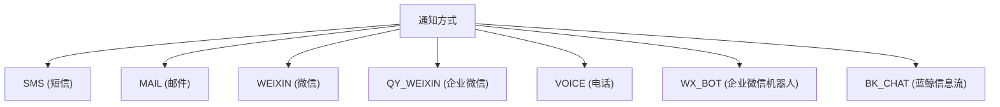
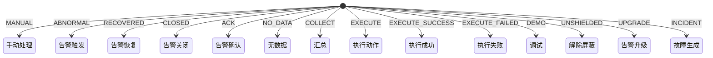
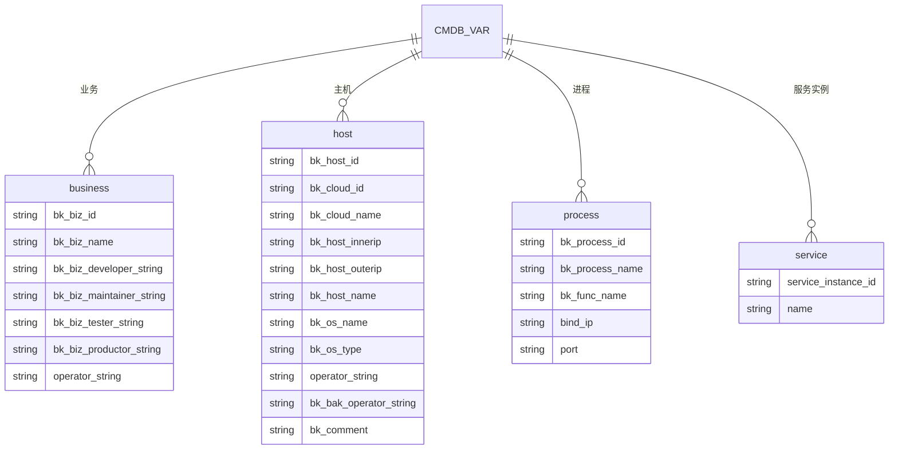
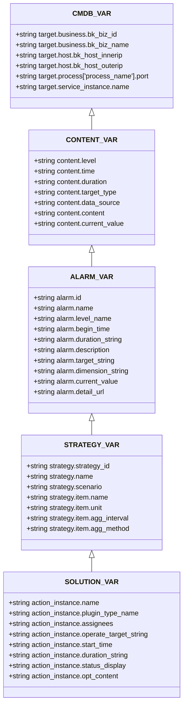
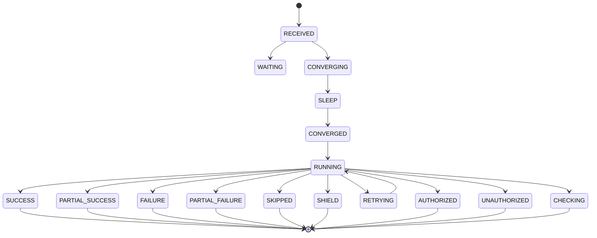

# 处理动作

<cite>
**本文档引用的文件**  
- [action.py](file://bkmonitor\constants\action.py)
</cite>

## 目录
1. [引言](#引言)
2. [处理动作类型](#处理动作类型)
3. [通知机制](#通知机制)
4. [变量系统](#变量系统)
5. [执行流程与状态管理](#执行流程与状态管理)
6. [配置与最佳实践](#配置与最佳实践)

## 引言

处理动作是监控系统中用于响应告警事件的核心机制，它定义了在特定条件下应采取的自动化或半自动化操作。本文档全面阐述了处理动作的类型、配置、执行机制及上下文环境，旨在为开发者和运维人员提供详尽的指导。

**Section sources**
- [action.py](file://bkmonitor\constants\action.py#L1-L50)

## 处理动作类型

处理动作主要分为以下几类：

### 通知
通知是最常见的处理动作，用于将告警信息推送给相关人员。支持多种通知方式，如短信、邮件、微信、企业微信、电话、企业微信机器人和蓝鲸信息流等。

### 脚本执行
在告警触发时，自动执行预定义的脚本，用于自动化修复或诊断问题。

### 工单创建
将告警事件转化为工单，通过ITSM系统进行跟踪和处理。

### 智能异常检测
利用AI算法对告警进行分析，识别异常模式并提供处理建议。

### 收敛与屏蔽
对重复或相关的告警进行收敛处理，避免告警风暴；或对已知问题进行屏蔽，减少干扰。

**Section sources**
- [action.py](file://bkmonitor\constants\action.py#L700-L899)

## 通知机制

### 通知方式
通知方式定义了消息的发送渠道，具体包括：
- **SMS**: 短信
- **MAIL**: 邮件
- **WEIXIN**: 微信
- **QY_WEIXIN**: 企业微信
- **VOICE**: 电话
- **WX_BOT**: 企业微信机器人
- **BK_CHAT**: 蓝鲸信息流

**Diagram sources**
- [action.py](file://bkmonitor\constants\action.py#L600-L650)

### 通知渠道
通知渠道定义了消息的接收端：
- **USER**: 内部用户
- **WX_BOT**: 企业微信机器人
- **BK_CHAT**: 蓝鲸信息流

### 通知类型
- **ALERT_NOTICE**: 告警通知
- **ACTION_NOTICE**: 处理的通知

### 动作信号
动作信号表示触发处理动作的事件类型：
- **MANUAL**: 手动处理
- **ABNORMAL**: 告警触发
- **RECOVERED**: 告警恢复
- **CLOSED**: 告警关闭
- **ACK**: 告警确认
- **NO_DATA**: 无数据
- **COLLECT**: 汇总
- **EXECUTE**: 执行动作
- **EXECUTE_SUCCESS**: 执行成功
- **EXECUTE_FAILED**: 执行失败
- **DEMO**: 调试
- **UNSHIELDED**: 解除屏蔽
- **UPGRADE**: 告警升级
- **INCIDENT**: 故障生成

**Diagram sources**
- [action.py](file://bkmonitor\constants\action.py#L700-L899)

**Section sources**
- [action.py](file://bkmonitor\constants\action.py#L600-L899)

## 变量系统

处理动作支持丰富的变量替换机制，允许在通知内容、脚本参数等中动态引用上下文信息。

### CMDB变量
引用CMDB中的配置信息，如业务、主机、进程、服务实例等。

**Diagram sources**
- [action.py](file://bkmonitor\constants\action.py#L200-L300)

### 内容变量
引用告警内容相关的动态信息。

### 告警变量
引用告警事件的详细信息，如告警ID、名称、级别、开始时间、持续时间、描述、目标、维度、当前值等。

### 策略变量
引用触发告警的策略信息，如策略ID、名称、场景、数据来源、业务ID、结果表、指标名称、单位、周期、聚合方法等。

### 套餐变量
引用处理动作实例的信息，如套餐名称、类型、负责人、执行对象、开始时间、执行耗时、执行状态、具体内容等。

**Diagram sources**
- [action.py](file://bkmonitor\constants\action.py#L200-L599)

**Section sources**
- [action.py](file://bkmonitor\constants\action.py#L200-L599)

## 执行流程与状态管理

### 动作状态
处理动作的执行状态定义了其生命周期中的各个阶段。

#### 状态常量
- **RECEIVED**: 已收到
- **WAITING**: 审批中
- **CONVERGING**: 收敛中
- **SLEEP**: 收敛处理等待
- **CONVERGED**: 收敛结束
- **RUNNING**: 处理中
- **SUCCESS**: 成功
- **PARTIAL_SUCCESS**: 部分成功
- **FAILURE**: 失败
- **PARTIAL_FAILURE**: 部分失败
- **SKIPPED**: 跳过
- **SHIELD**: 已屏蔽
- **RETRYING**: 重试中
- **AUTHORIZED**: 已授权
- **UNAUTHORIZED**: 未授权
- **CHECKING**: 检查中

#### 状态分组
- **PROCEED_STATUS**: 执行中状态集合
- **END_STATUS**: 最终状态集合
- **CAN_EXECUTE_STATUS**: 可执行状态集合
- **IGNORE_STATUS**: 忽略状态集合
- **CAN_SYNC_STATUS**: 可同步状态集合
- **COLLECT_SYNC_STATUS**: 采集同步状态集合

**Diagram sources**
- [action.py](file://bkmonitor\constants\action.py#L500-L699)

### 通知步骤
通知的执行步骤包括：
- **BEGIN**: 开始
- **SUCCESS**: 成功
- **FAILURE**: 失败
- **APPROVAL**: 等待审批
- **SKIPPED**: 跳过
- **FINISHED**: 结束

**Section sources**
- [action.py](file://bkmonitor\constants\action.py#L500-L699)

## 配置与最佳实践

### 条件表达式编写
使用清晰的条件表达式来匹配触发动作的场景，例如基于告警级别、策略ID、维度等。

### 变量引用
在模板中正确引用变量，确保信息的准确性和完整性。推荐使用`{{variable.name}}`格式。

### 失败重试策略
为关键动作配置合理的重试策略，如固定间隔或递增间隔重试，以提高系统的可靠性。

### 收敛配置
合理设置收敛规则，避免告警风暴。例如，基于策略ID、维度、告警级别等条件进行收敛。

### 日志级别
根据需要设置合适的日志级别（DEBUG, INFO, WARNING, ERROR, CRITICAL），便于问题排查。

**Section sources**
- [action.py](file://bkmonitor\constants\action.py#L1-L899)