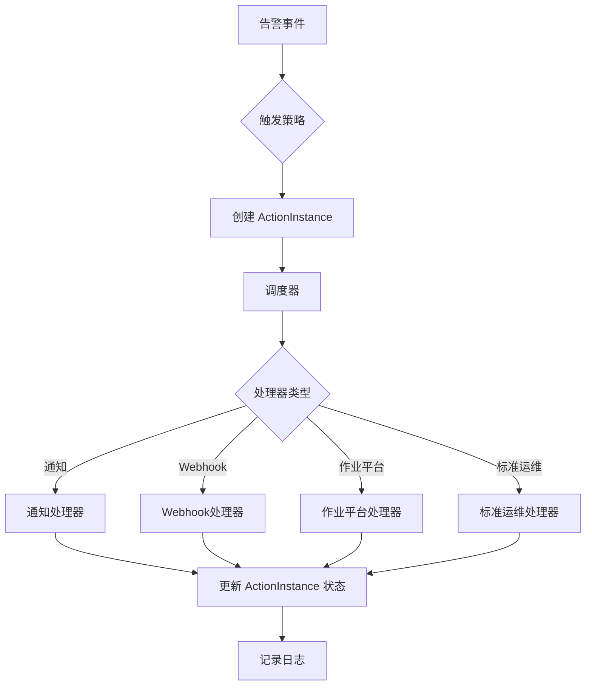
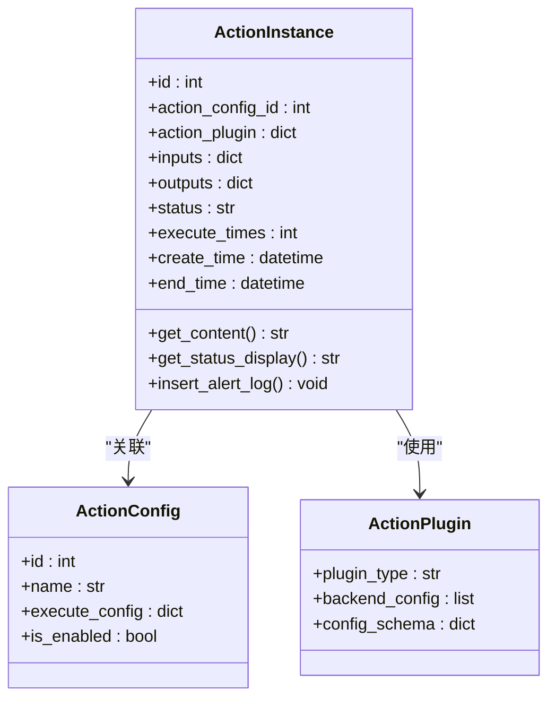
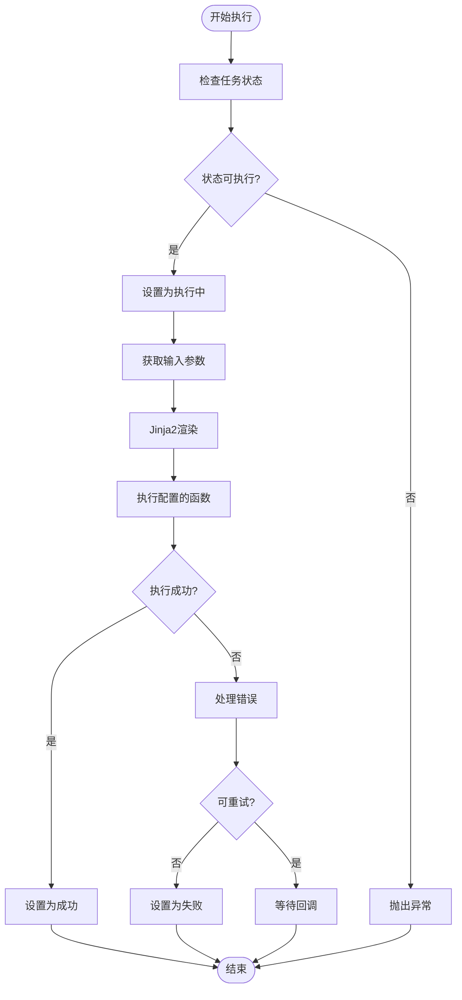
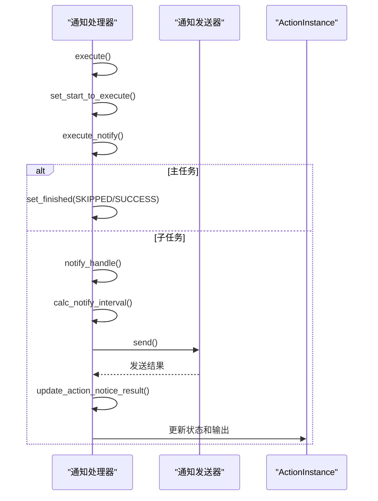
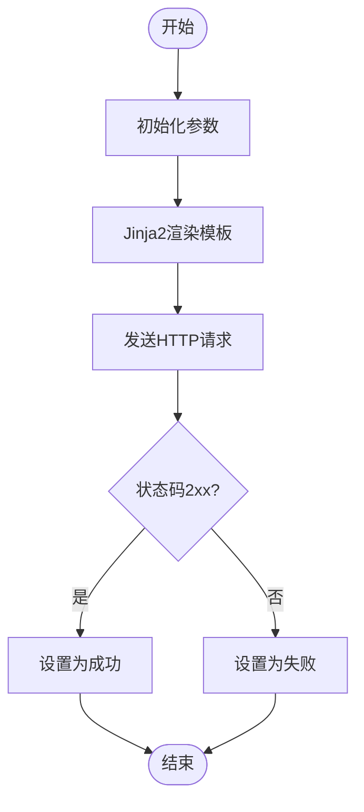
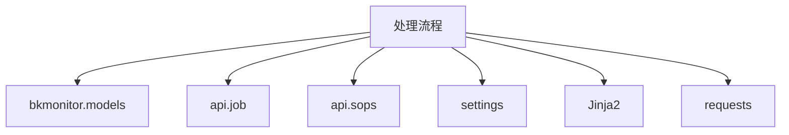

# 处理流程

<cite>
**本文档引用的文件**   
- [action.py](file://bkmonitor\bkmonitor\models\fta\action.py)
- [processor.py](file://bkmonitor\alarm_backends\service\fta_action\common\processor.py)
- [notice\processor.py](file://bkmonitor\alarm_backends\service\fta_action\notice\processor.py)
- [webhook\processor.py](file://bkmonitor\alarm_backends\service\fta_action\webhook\processor.py)
- [job\processor.py](file://bkmonitor\alarm_backends\service\fta_action\job\processor.py)
- [sops\processor.py](file://bkmonitor\alarm_backends\service\fta_action\sops\processor.py)
- [collect\processor.py](file://bkmonitor\alarm_backends\service\fta_action\collect\processor.py)
- [message_queue\processor.py](file://bkmonitor\alarm_backends\service\fta_action\message_queue\processor.py)
</cite>

## 目录
1. [引言](#引言)
2. [项目结构](#项目结构)
3. [核心组件](#核心组件)
4. [架构概述](#架构概述)
5. [详细组件分析](#详细组件分析)
6. [依赖分析](#依赖分析)
7. [性能考虑](#性能考虑)
8. [故障排除指南](#故障排除指南)
9. [结论](#结论)

## 引言
本文档全面阐述了告警处理链的构建和执行机制。深入解释了如何根据告警级别、业务场景、时间条件等触发不同的处理流程。说明了处理流程的配置方式，包括顺序执行、并行执行、条件分支等流程控制逻辑。详细描述了流程执行过程中的状态管理、异常处理和超时机制。提供了处理流程设计的最佳实践，包括流程优化、性能考虑和错误恢复策略。为开发者提供了复杂处理流程的构建指南和调试方法。

## 项目结构
该项目是一个复杂的监控系统，其核心功能之一是处理告警。处理流程相关的代码主要分布在 `bkmonitor` 模块下的 `models\fta\action.py` 文件中，该文件定义了处理流程的数据模型。执行逻辑则分散在 `alarm_backends\service\fta_action` 目录下的多个处理器（processor）中，每个处理器负责一种特定类型的处理动作，如通知、Webhook、作业平台等。

**Section sources**
- [action.py](file://bkmonitor\bkmonitor\models\fta\action.py)
- [processor.py](file://bkmonitor\alarm_backends\service\fta_action\common\processor.py)

## 核心组件
处理流程的核心组件包括 `ActionInstance` 模型和 `ActionProcessor` 处理器。`ActionInstance` 模型定义了处理流程的实例，包含了流程的配置、状态、输入输出等信息。`ActionProcessor` 是一个抽象基类，具体的处理器（如 `notice\processor.py` 中的 `ActionProcessor`）继承自它，实现了具体的执行逻辑。

**Section sources**
- [action.py](file://bkmonitor\bkmonitor\models\fta\action.py#L1-L100)
- [processor.py](file://bkmonitor\alarm_backends\service\fta_action\common\processor.py#L1-L50)

## 架构概述
处理流程的架构遵循了典型的命令模式。当一个告警事件触发时，系统会根据策略创建一个或多个 `ActionInstance` 实例。然后，一个调度器会根据实例的类型选择相应的 `ActionProcessor` 来执行。处理器会根据配置调用外部系统（如发送邮件、调用API、执行脚本等），并更新 `ActionInstance` 的状态。

**Diagram sources **
- [action.py](file://bkmonitor\bkmonitor\models\fta\action.py)
- [processor.py](file://bkmonitor\alarm_backends\service\fta_action\common\processor.py)

## 详细组件分析
### 处理流程模型分析
`ActionInstance` 模型是处理流程的核心数据结构。它包含了处理流程的所有必要信息。

**Diagram sources **
- [action.py](file://bkmonitor\bkmonitor\models\fta\action.py#L1-L300)

**Section sources**
- [action.py](file://bkmonitor\bkmonitor\models\fta\action.py#L1-L888)

### 处理流程执行器分析
`ActionProcessor` 及其子类负责执行具体的处理动作。它们通过 `execute` 方法启动执行流程。

#### 通用处理器分析
通用处理器（`common\processor.py`）提供了一个执行框架，包括输入数据准备、状态更新和错误处理。

**Diagram sources **
- [processor.py](file://bkmonitor\alarm_backends\service\fta_action\common\processor.py#L35-L266)

**Section sources**
- [processor.py](file://bkmonitor\alarm_backends\service\fta_action\common\processor.py#L1-L300)

#### 通知处理器分析
通知处理器（`notice\processor.py`）专门负责发送各种通知，如邮件、短信、语音等。

**Diagram sources **
- [notice\processor.py](file://bkmonitor\alarm_backends\service\fta_action\notice\processor.py#L42-L336)

**Section sources**
- [notice\processor.py](file://bkmonitor\alarm_backends\service\fta_action\notice\processor.py#L1-L400)

#### Webhook处理器分析
Webhook处理器（`webhook\processor.py`）负责向外部系统发送HTTP请求。

**Diagram sources **
- [webhook\processor.py](file://bkmonitor\alarm_backends\service\fta_action\webhook\processor.py#L24-L101)

**Section sources**
- [webhook\processor.py](file://bkmonitor\alarm_backends\service\fta_action\webhook\processor.py#L1-L150)

## 依赖分析
处理流程模块依赖于多个其他模块和外部服务。它依赖于 `bkmonitor` 的核心模型，依赖于 `api` 模块来调用外部系统（如作业平台、标准运维），并依赖于配置文件中的 `settings` 来获取系统配置。

**Diagram sources **
- [processor.py](file://bkmonitor\alarm_backends\service\fta_action\common\processor.py)
- [action.py](file://bkmonitor\bkmonitor\models\fta\action.py)

**Section sources**
- [processor.py](file://bkmonitor\alarm_backends\service\fta_action\common\processor.py#L1-L50)
- [action.py](file://bkmonitor\bkmonitor\models\fta\action.py#L1-L50)

## 性能考虑
处理流程的性能主要受外部系统调用的影响。为了提高性能，系统采用了异步执行和回调机制。对于需要轮询的任务（如作业平台任务），处理器会设置一个定时回调，而不是阻塞等待。此外，对于通知类任务，系统支持汇总发送，以减少对通知服务的调用次数。

## 故障排除指南
常见的问题包括配置错误、权限不足和网络超时。调试时，应首先检查 `ActionInstance` 的 `ex_data` 字段，其中包含了错误信息。其次，检查处理器的日志，通常会记录详细的执行过程。对于Webhook调用失败，应检查URL、请求方法和认证信息是否正确。

**Section sources**
- [processor.py](file://bkmonitor\alarm_backends\service\fta_action\common\processor.py#L200-L266)
- [action.py](file://bkmonitor\bkmonitor\models\fta\action.py#L500-L550)

## 结论
本文档详细介绍了监控系统中处理流程的实现机制。通过分析数据模型和执行逻辑，我们了解了如何构建和执行复杂的处理链。该设计具有良好的扩展性，通过添加新的处理器即可支持新的处理类型。同时，其状态管理和错误处理机制确保了流程的可靠执行。