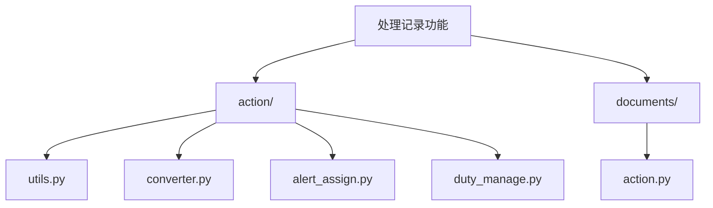
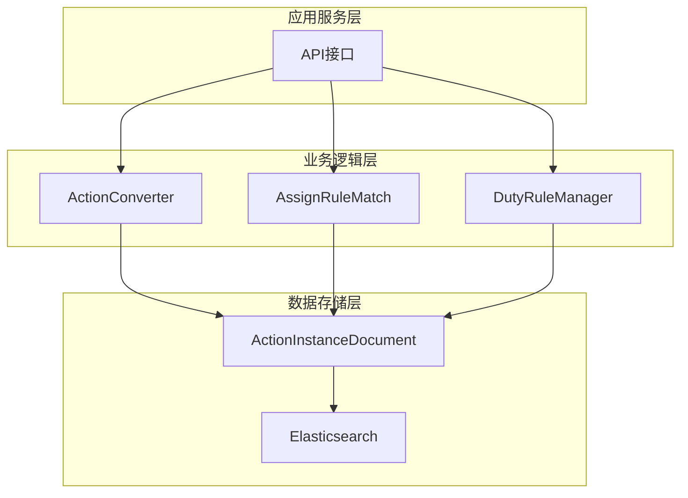
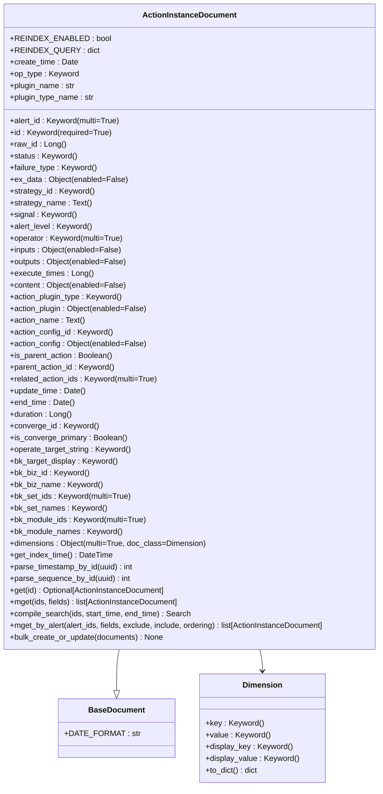
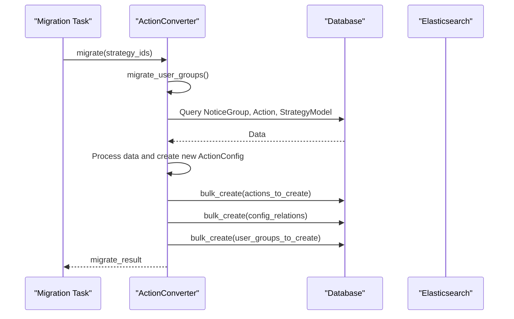
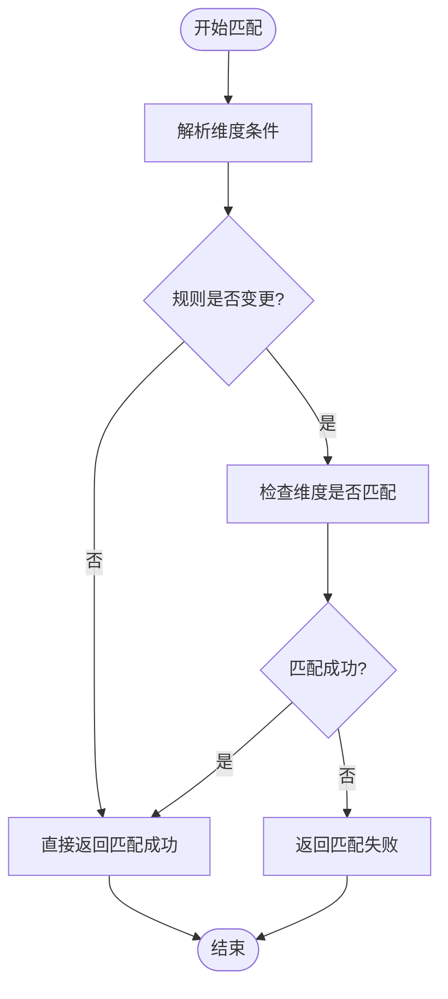
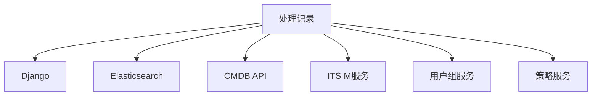

# 处理记录

<cite>
**本文档引用的文件**
- [action.py](file://bkmonitor\bkmonitor\documents\action.py)
- [utils.py](file://bkmonitor\bkmonitor\action\utils.py)
- [converter.py](file://bkmonitor\bkmonitor\action\converter.py)
- [alert_assign.py](file://bkmonitor\bkmonitor\action\alert_assign.py)
- [duty_manage.py](file://bkmonitor\bkmonitor\action\duty_manage.py)
</cite>

## 目录
1. [引言](#引言)
2. [项目结构](#项目结构)
3. [核心组件](#核心组件)
4. [架构概述](#架构概述)
5. [详细组件分析](#详细组件分析)
6. [依赖分析](#依赖分析)
7. [性能考量](#性能考量)
8. [故障排除指南](#故障排除指南)
9. [结论](#结论)

## 引言
本技术文档旨在全面阐述蓝鲸监控平台中告警处理记录的生成、存储、查询及生命周期管理机制。文档深入解析了处理记录所包含的关键信息，如处理人、处理时间、处理意见和执行结果等，并详细描述了处理记录的查询接口与过滤条件。同时，文档提供了处理记录分析的最佳实践，包括处理效率评估、处理质量分析和审计追踪，并为开发者提供了扩展与集成的开发指南。

## 项目结构
根据提供的项目结构，`处理记录`功能的核心实现位于 `bkmonitor/bkmonitor/action/` 和 `bkmonitor/bkmonitor/documents/` 目录下。主要文件包括：
- `action/` 目录：包含处理逻辑、转换器和分派规则的核心业务代码。
- `documents/` 目录：包含用于Elasticsearch存储的文档模型定义。

**图示来源**
- [action.py](file://bkmonitor\bkmonitor\documents\action.py)
- [utils.py](file://bkmonitor\bkmonitor\action\utils.py)
- [converter.py](file://bkmonitor\bkmonitor\action\converter.py)
- [alert_assign.py](file://bkmonitor\bkmonitor\action\alert_assign.py)
- [duty_manage.py](file://bkmonitor\bkmonitor\action\duty_manage.py)

## 核心组件
处理记录功能的核心组件包括：
1.  **ActionInstanceDocument**: 定义了存储在Elasticsearch中的处理实例数据模型。
2.  **ActionConverter**: 负责处理套餐的迁移和转换。
3.  **AssignRuleMatch**: 实现告警分派规则的匹配逻辑。
4.  **DutyRuleManager**: 管理轮值规则的排班计划。

**组件来源**
- [action.py](file://bkmonitor\bkmonitor\documents\action.py#L25-L271)
- [converter.py](file://bkmonitor\bkmonitor\action\converter.py#L25-L318)
- [alert_assign.py](file://bkmonitor\bkmonitor\action\alert_assign.py#L25-L763)
- [duty_manage.py](file://bkmonitor\bkmonitor\action\duty_manage.py#L25-L799)

## 架构概述
处理记录的架构遵循典型的分层模式，包括数据存储层、业务逻辑层和应用服务层。数据存储在Elasticsearch中，通过Django Elasticsearch DSL进行操作。业务逻辑层处理记录的创建、更新和查询，而应用服务层则提供API接口供上层调用。

**图示来源**
- [action.py](file://bkmonitor\bkmonitor\documents\action.py)
- [converter.py](file://bkmonitor\bkmonitor\action\converter.py)
- [alert_assign.py](file://bkmonitor\bkmonitor\action\alert_assign.py)
- [duty_manage.py](file://bkmonitor\bkmonitor\action\duty_manage.py)

## 详细组件分析

### ActionInstanceDocument 分析
`ActionInstanceDocument` 类是处理记录在Elasticsearch中的数据模型，继承自 `BaseDocument`。

#### 类图

**图示来源**
- [action.py](file://bkmonitor\bkmonitor\documents\action.py#L25-L271)

**组件来源**
- [action.py](file://bkmonitor\bkmonitor\documents\action.py#L25-L271)

### ActionConverter 分析
`ActionConverter` 类负责将旧版的告警动作配置迁移到新版的处理套餐。

#### 序列图

**图示来源**
- [converter.py](file://bkmonitor\bkmonitor\action\converter.py#L25-L318)

**组件来源**
- [converter.py](file://bkmonitor\bkmonitor\action\converter.py#L25-L318)

### AssignRuleMatch 分析
`AssignRuleMatch` 类用于匹配告警与分派规则。

#### 流程图

**图示来源**
- [alert_assign.py](file://bkmonitor\bkmonitor\action\alert_assign.py#L25-L763)

**组件来源**
- [alert_assign.py](file://bkmonitor\bkmonitor\action\alert_assign.py#L25-L763)

## 依赖分析
处理记录功能依赖于多个外部模块和内部服务。

**图示来源**
- [alert_assign.py](file://bkmonitor\bkmonitor\action\alert_assign.py#L25-L763)
- [duty_manage.py](file://bkmonitor\bkmonitor\action\duty_manage.py#L25-L799)

**组件来源**
- [alert_assign.py](file://bkmonitor\bkmonitor\action\alert_assign.py#L25-L763)
- [duty_manage.py](file://bkmonitor\bkmonitor\action\duty_manage.py#L25-L799)

## 性能考量
- **Elasticsearch索引**: `ActionInstanceDocument` 的索引设置为3个主分片和1个副本，刷新间隔为1秒，以平衡性能和实时性。
- **批量操作**: 使用 `bulk_create_or_update` 方法进行批量创建或更新，减少数据库交互次数。
- **查询优化**: 通过 `mget` 和 `compile_search` 方法根据ID的时间戳范围确定查询的索引，提高查询效率。

## 故障排除指南
- **处理记录未生成**: 检查 `ActionConverter` 的迁移任务是否成功执行，确认 `ActionConfig` 和 `StrategyActionConfigRelation` 表中是否有相关数据。
- **分派规则不匹配**: 检查告警的维度信息是否与分派规则的条件匹配，确认 `dimensions` 字段的值是否正确。
- **轮值计划未生成**: 检查 `DutyRuleSnap` 和 `DutyPlan` 表中的数据，确认轮值规则的快照和计划是否已正确创建。

**组件来源**
- [action.py](file://bkmonitor\bkmonitor\documents\action.py#L25-L271)
- [duty_manage.py](file://bkmonitor\bkmonitor\action\duty_manage.py#L25-L799)

## 结论
本文档详细阐述了蓝鲸监控平台中处理记录的完整实现机制。通过 `ActionInstanceDocument` 模型在Elasticsearch中高效存储记录，并通过 `ActionConverter`、`AssignRuleMatch` 和 `DutyRuleManager` 等组件实现复杂的业务逻辑。该设计具有良好的可扩展性和性能，为告警处理提供了坚实的基础。