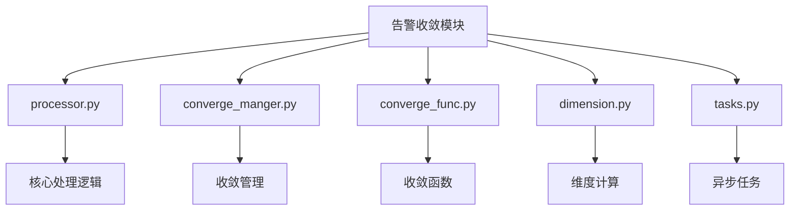
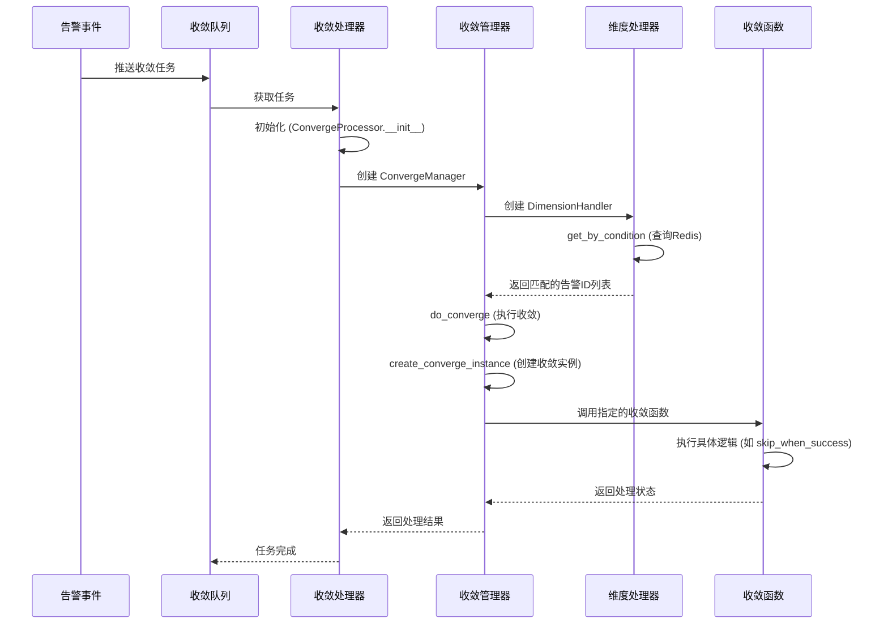
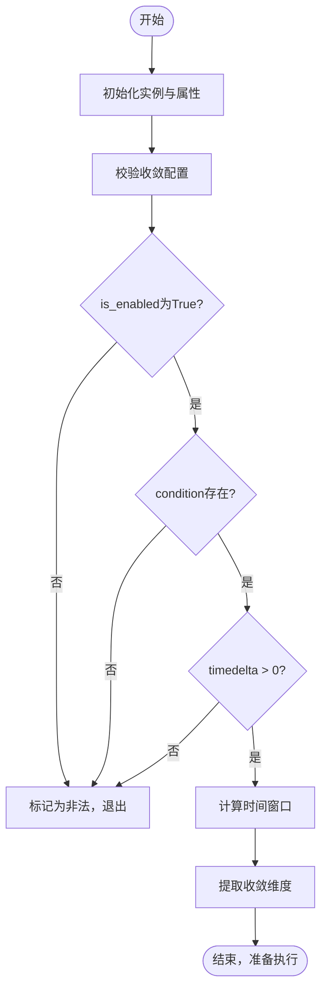
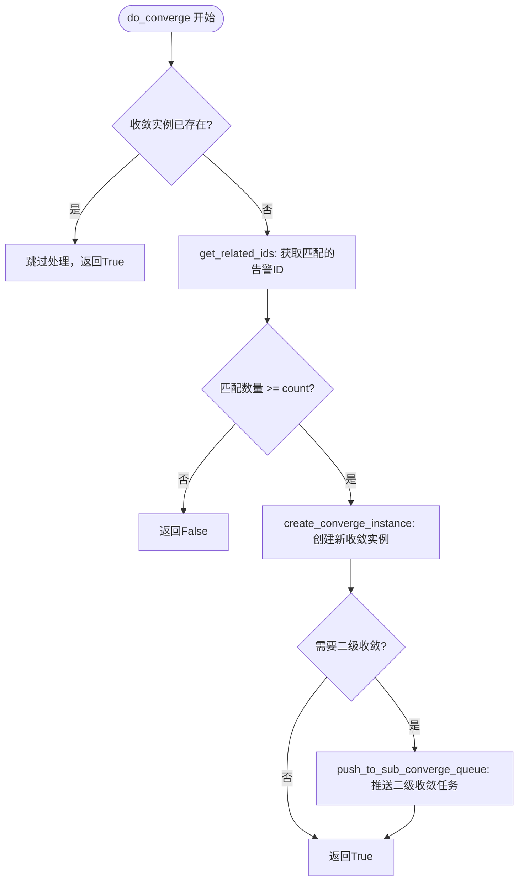
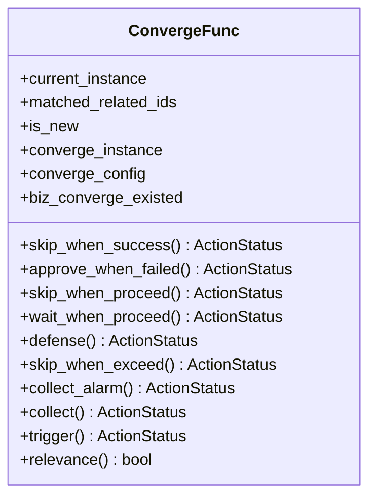
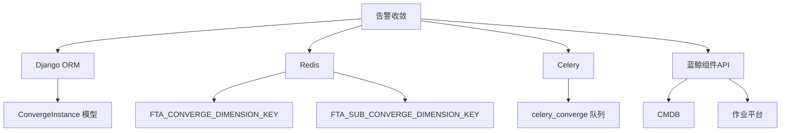

# 告警收敛

<cite>
**本文档引用的文件**   
- [processor.py](file://bkmonitor/alarm_backends/service/converge/processor.py)
- [converge_manger.py](file://bkmonitor/alarm_backends/service/converge/converge_manger.py)
- [converge_func.py](file://bkmonitor/alarm_backends/service/converge/converge_func.py)
- [dimension.py](file://bkmonitor/alarm_backends/service/converge/dimension.py)
- [tasks.py](file://bkmonitor/alarm_backends/service/converge/tasks.py)
- [action.py](file://bkmonitor/models/fta/action.py)
- [action.py](file://constants/action.py)
</cite>

## 目录
1. [引言](#引言)
2. [项目结构](#项目结构)
3. [核心组件](#核心组件)
4. [架构概述](#架构概述)
5. [详细组件分析](#详细组件分析)
6. [依赖分析](#依赖分析)
7. [性能考量](#性能考量)
8. [故障排除指南](#故障排除指南)
9. [结论](#结论)

## 引言
本文档旨在全面阐述蓝鲸监控平台中的告警收敛机制。告警收敛是一种关键的运维功能，用于减少因系统故障或异常导致的告警风暴，避免大量重复或相似的告警信息淹没运维人员。通过配置收敛规则，系统可以将满足特定条件的多个告警合并处理，从而提升告警的有效性和可操作性。本文将深入解析告警收敛的算法原理、配置方法、处理流程，并提供实际应用示例。

## 项目结构
告警收敛功能主要位于 `bkmonitor` 模块下的 `alarm_backends/service/converge` 目录中。该目录包含了实现告警收敛逻辑的核心文件。

**图示来源**
- [processor.py](file://bkmonitor/alarm_backends/service/converge/processor.py)
- [converge_manger.py](file://bkmonitor/alarm_backends/service/converge/converge_manger.py)
- [converge_func.py](file://bkmonitor/alarm_backends/service/converge/converge_func.py)
- [dimension.py](file://bkmonitor/alarm_backends/service/converge/dimension.py)
- [tasks.py](file://bkmonitor/alarm_backends/service/converge/tasks.py)

## 核心组件
告警收敛的核心组件包括收敛处理器（ConvergeProcessor）、收敛管理器（ConvergeManager）、收敛函数（ConvergeFunc）和维度处理器（DimensionHandler）。这些组件协同工作，完成从告警接收、规则匹配到最终处理的全过程。

**组件来源**
- [processor.py](file://bkmonitor/alarm_backends/service/converge/processor.py#L110-L199)
- [converge_manger.py](file://bkmonitor/alarm_backends/service/converge/converge_manger.py#L69-L199)
- [converge_func.py](file://bkmonitor/alarm_backends/service/converge/converge_func.py#L63-L199)
- [dimension.py](file://bkmonitor/alarm_backends/service/converge/dimension.py#L254-L199)

## 架构概述
告警收敛的处理流程是一个典型的异步任务处理模式。当一个告警事件触发后，系统会将其推入一个收敛队列。一个后台任务（Celery Worker）会从队列中取出任务，创建一个 `ConvergeProcessor` 实例，并执行收敛逻辑。

**图示来源**
- [tasks.py](file://bkmonitor/alarm_backends/service/converge/tasks.py#L50-L116)
- [processor.py](file://bkmonitor/alarm_backends/service/converge/processor.py#L110-L199)
- [converge_manger.py](file://bkmonitor/alarm_backends/service/converge/converge_manger.py#L100-L199)
- [dimension.py](file://bkmonitor/alarm_backends/service/converge/dimension.py#L100-L199)
- [converge_func.py](file://bkmonitor/alarm_backends/service/converge/converge_func.py#L100-L199)

## 详细组件分析
### 收敛处理器分析
`ConvergeProcessor` 是整个收敛流程的入口和控制器。它负责初始化上下文、校验配置、协调管理器和函数的调用。

#### 初始化流程

**图示来源**
- [processor.py](file://bkmonitor/alarm_backends/service/converge/processor.py#L110-L199)

**代码来源**
- [processor.py](file://bkmonitor/alarm_backends/service/converge/processor.py#L110-L199)

### 收敛管理器分析
`ConvergeManager` 负责核心的收敛逻辑判断和实例管理。

#### 收敛执行流程

**图示来源**
- [converge_manger.py](file://bkmonitor/alarm_backends/service/converge/converge_manger.py#L100-L199)

**代码来源**
- [converge_manger.py](file://bkmonitor/alarm_backends/service/converge/converge_manger.py#L100-L199)

### 收敛函数分析
`ConvergeFunc` 类定义了多种不同的收敛策略，通过 `converge_func` 配置项来选择。

#### 收敛函数类型

**图示来源**
- [converge_func.py](file://bkmonitor/alarm_backends/service/converge/converge_func.py#L63-L199)

**代码来源**
- [converge_func.py](file://bkmonitor/alarm_backends/service/converge/converge_func.py#L63-L199)

## 依赖分析
告警收敛模块依赖于多个外部组件和数据源。

**图示来源**
- [action.py](file://bkmonitor/models/fta/action.py#L681-L754)
- [dimension.py](file://bkmonitor/alarm_backends/service/converge/dimension.py#L20-L50)
- [tasks.py](file://bkmonitor/alarm_backends/service/converge/tasks.py#L20-L50)

## 性能考量
告警收敛的性能主要受以下因素影响：
1.  **Redis查询性能**：`DimensionHandler.get_by_condition` 方法使用Redis的 `ZRangeByScore` 命令进行范围查询，性能较高。
2.  **数据库操作**：创建 `ConvergeInstance` 和 `ConvergeRelation` 涉及数据库写入，应确保数据库性能。
3.  **任务队列延迟**：Celery任务的调度和执行速度直接影响告警的响应时间。
4.  **复杂度**：收敛规则的复杂度（维度数量、时间窗口大小）会影响匹配和计算的开销。

## 故障排除指南
### 常见问题
1.  **告警未被收敛**：
    *   检查 `converge_config.is_enabled` 是否为 `true`。
    *   确认 `count` 和 `timedelta` 设置合理。
    *   检查 `condition` 中的维度和值是否正确匹配。
2.  **收敛任务积压**：
    *   检查Celery Worker是否正常运行。
    *   查看 `celery_converge` 队列的长度。
    *   检查Redis和数据库的性能。
3.  **收敛逻辑未按预期执行**：
    *   查看 `converge_func` 的配置是否正确。
    *   检查 `ConvergeFunc` 相关方法的返回值是否符合预期。
    *   审查日志文件，查找 `fta_action.converge` 相关的错误信息。

**代码来源**
- [processor.py](file://bkmonitor/alarm_backends/service/converge/processor.py#L110-L199)
- [tasks.py](file://bkmonitor/alarm_backends/service/converge/tasks.py#L50-L116)

## 结论
告警收敛是蓝鲸监控平台中一个强大且灵活的功能，它通过一套基于维度、时间窗口和频率的规则，有效地管理了告警风暴。其核心设计采用了异步任务处理模式，保证了系统的稳定性和可扩展性。通过深入理解 `ConvergeProcessor`、`ConvergeManager`、`ConvergeFunc` 和 `DimensionHandler` 等核心组件的工作原理，运维人员可以更有效地配置和优化收敛策略，从而提升运维效率和系统的可观测性。