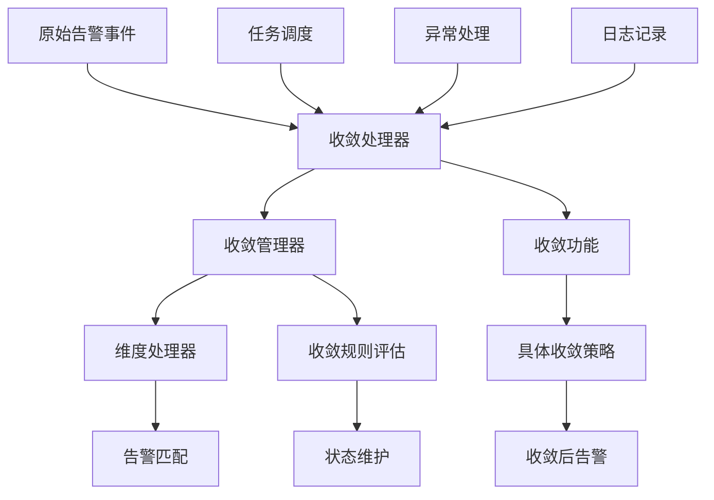
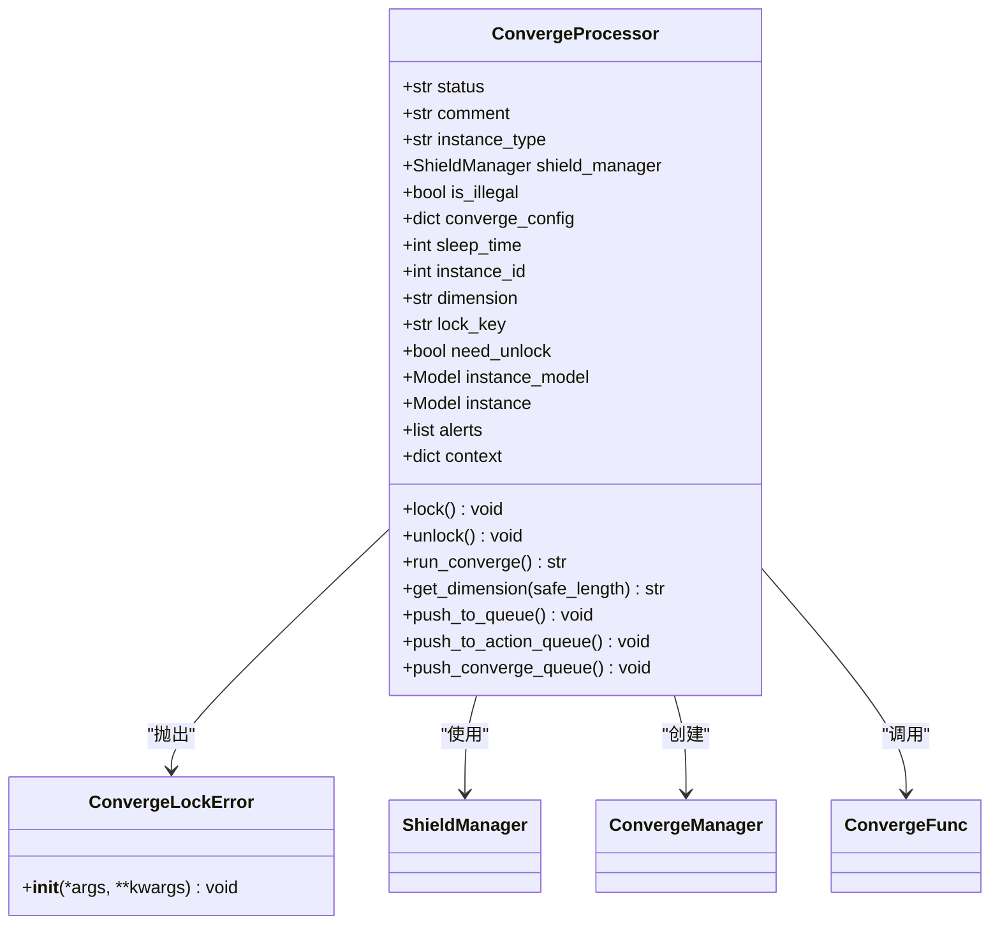
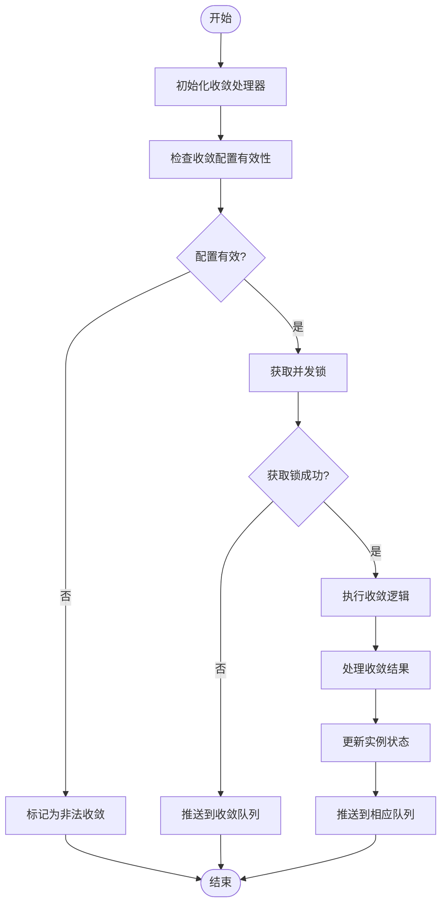
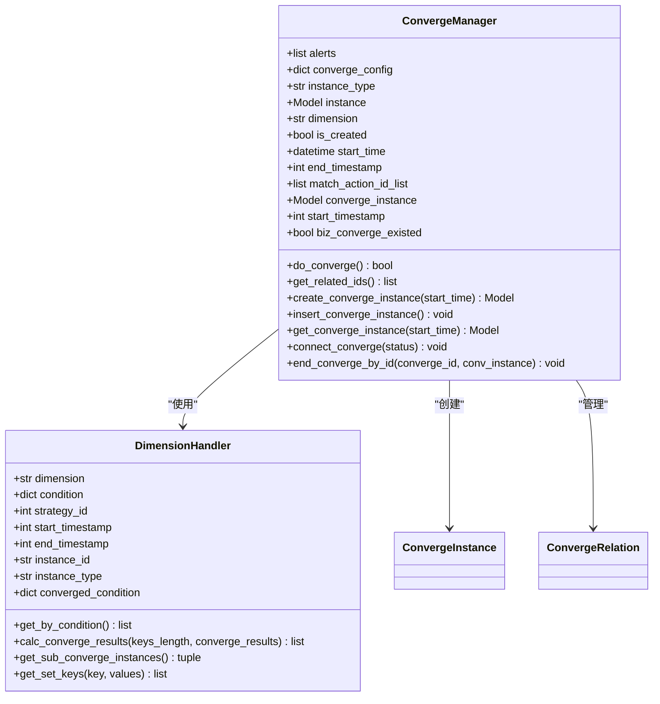
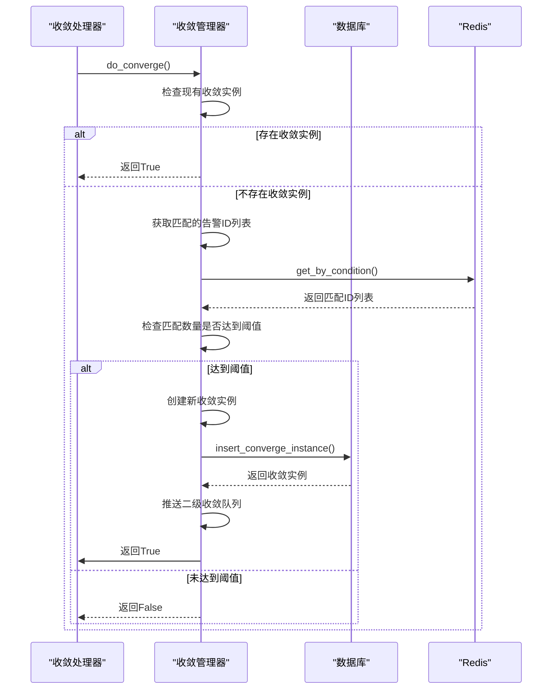
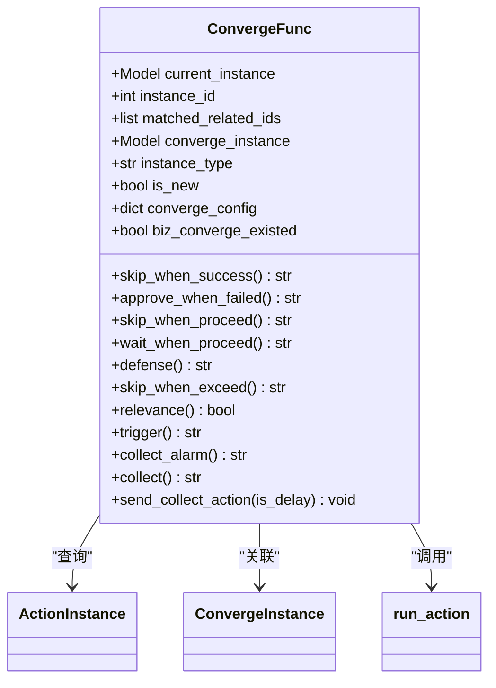
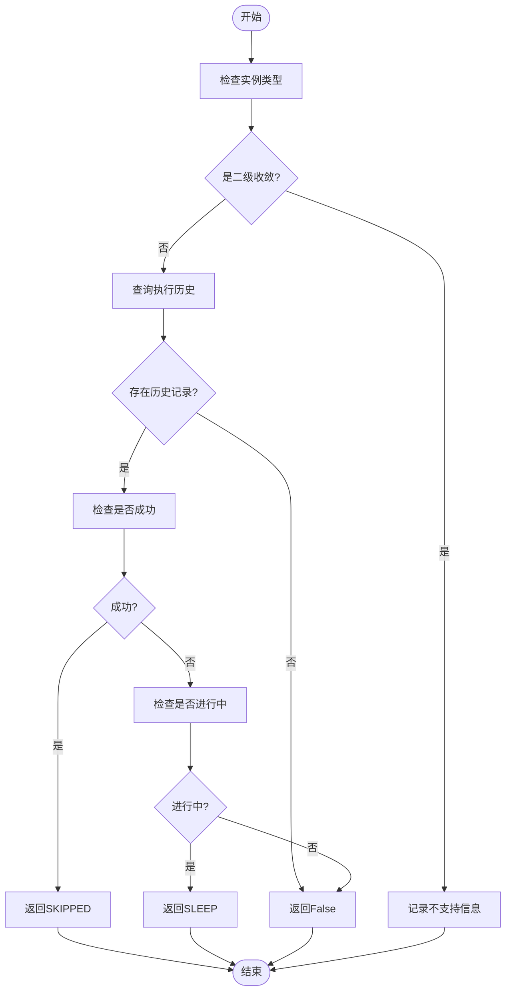
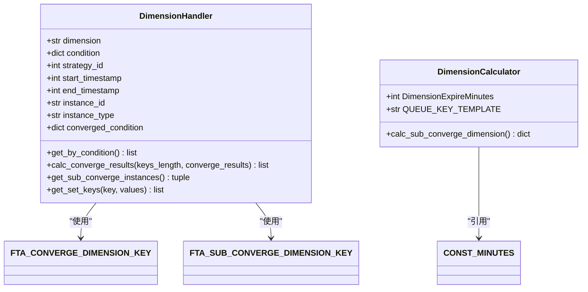
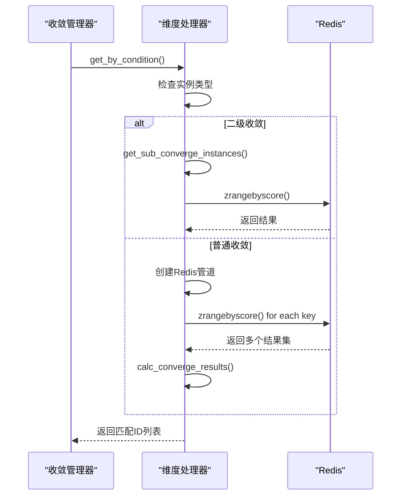
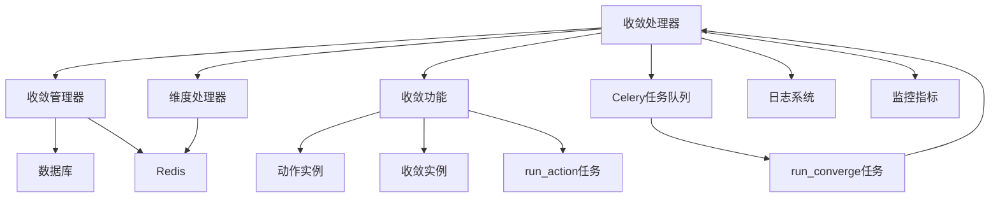

# 收敛处理

<cite>
**本文档引用的文件**   
- [processor.py](file://bkmonitor\alarm_backends\service\converge\processor.py)
- [tasks.py](file://bkmonitor\alarm_backends\service\converge\tasks.py)
- [converge_manger.py](file://bkmonitor\alarm_backends\service\converge\converge_manger.py)
- [converge_func.py](file://bkmonitor\alarm_backends\service\converge\converge_func.py)
- [dimension.py](file://bkmonitor\alarm_backends\service\converge\dimension.py)
</cite>

## 目录
1. [引言](#引言)
2. [核心组件](#核心组件)
3. [架构概览](#架构概览)
4. [详细组件分析](#详细组件分析)
5. [依赖分析](#依赖分析)
6. [性能考量](#性能考量)
7. [故障排除指南](#故障排除指南)
8. [结论](#结论)

## 引言
本文档全面描述了告警收敛处理流程，从接收到原始告警事件到生成收敛后告警的完整处理过程。深入解析了告警匹配、收敛规则评估、状态维护和结果生成等环节。详细说明了收敛处理器（ConvergenceProcessor）的核心算法逻辑，特别是如何处理并发告警事件和保证收敛状态的一致性。文档还涵盖了收敛任务的调度机制和执行周期，以及异常情况下的重试策略。提供了收敛处理过程中的关键日志分析方法，帮助运维人员诊断收敛问题，并包含性能优化建议。

## 核心组件
告警收敛处理流程的核心组件包括收敛处理器（ConvergeProcessor）、收敛管理器（ConvergeManager）、收敛功能（ConvergeFunc）和维度处理器（DimensionHandler）。这些组件协同工作，实现从原始告警到收敛后告警的完整转换过程。收敛处理器负责整体流程控制和状态管理，收敛管理器处理收敛规则评估和状态维护，收敛功能实现具体的收敛策略逻辑，维度处理器则负责告警匹配和条件评估。

**本节来源**
- [processor.py](file://bkmonitor\alarm_backends\service\converge\processor.py#L0-L199)
- [converge_manger.py](file://bkmonitor\alarm_backends\service\converge\converge_manger.py#L0-L199)

## 架构概览
告警收敛处理流程采用分层架构设计，各组件职责明确，协同完成收敛任务。整个流程始于告警事件的接收，经过收敛处理器的调度，由收敛管理器进行规则评估，最终通过收敛功能执行具体的收敛策略。



**图示来源**
- [processor.py](file://bkmonitor\alarm_backends\service\converge\processor.py#L0-L199)
- [converge_manger.py](file://bkmonitor\alarm_backends\service\converge\converge_manger.py#L0-L199)
- [converge_func.py](file://bkmonitor\alarm_backends\service\converge\converge_func.py#L0-L200)

## 详细组件分析

### 收敛处理器分析
收敛处理器（ConvergeProcessor）是告警收敛流程的核心控制器，负责协调整个收敛过程。它初始化收敛上下文，获取并发锁，执行收敛逻辑，并处理各种异常情况。

#### 类图


**图示来源**
- [processor.py](file://bkmonitor\alarm_backends\service\converge\processor.py#L0-L199)

#### 处理流程


**图示来源**
- [processor.py](file://bkmonitor\alarm_backends\service\converge\processor.py#L200-L400)

### 收敛管理器分析
收敛管理器（ConvergeManager）负责收敛规则的评估和状态维护。它处理收敛实例的创建、关联和终止，确保收敛状态的一致性。

#### 类图


**图示来源**
- [converge_manger.py](file://bkmonitor\alarm_backends\service\converge\converge_manger.py#L0-L199)

#### 收敛流程


**图示来源**
- [converge_manger.py](file://bkmonitor\alarm_backends\service\converge\converge_manger.py#L200-L400)

### 收敛功能分析
收敛功能（ConvergeFunc）实现了具体的收敛策略逻辑，如"成功后跳过"、"失败时审批"等。每个收敛策略对应一个具体的方法。

#### 类图


**图示来源**
- [converge_func.py](file://bkmonitor\alarm_backends\service\converge\converge_func.py#L0-L200)

#### 策略流程


**图示来源**
- [converge_func.py](file://bkmonitor\alarm_backends\service\converge\converge_func.py#L200-L325)

### 维度处理器分析
维度处理器（DimensionHandler）负责告警匹配和条件评估，通过Redis存储和查询机制实现高效的告警匹配。

#### 类图


**图示来源**
- [dimension.py](file://bkmonitor\alarm_backends\service\converge\dimension.py#L0-L200)

#### 匹配流程


**图示来源**
- [dimension.py](file://bkmonitor\alarm_backends\service\converge\dimension.py#L200-L403)

## 依赖分析
告警收敛处理流程涉及多个组件和外部系统的依赖关系。核心依赖包括数据库、Redis缓存、Celery任务队列和各种API服务。



**图示来源**
- [processor.py](file://bkmonitor\alarm_backends\service\converge\processor.py#L0-L774)
- [tasks.py](file://bkmonitor\alarm_backends\service\converge\tasks.py#L0-L116)
- [converge_manger.py](file://bkmonitor\alarm_backends\service\converge\converge_manger.py#L0-L612)

## 性能考量
告警收敛处理流程在高负载场景下需要特别关注性能优化。关键性能指标包括处理延迟、并发处理能力和资源利用率。

### 并发控制
收敛处理器通过Redis计数器实现并发控制，限制同一维度的并发收敛数量：
```python
parallel_converge_count = max(int(self.converge_count) // 2, 1)
if client.incr(self.lock_key) > parallel_converge_count:
    raise ConvergeLockError
```

### 批处理优化
维度处理器使用Redis管道批量查询，减少网络往返次数，提高查询效率：
```python
pipeline = FTA_CONVERGE_DIMENSION_KEY.client.pipeline()
for key, values in self.condition.items():
    set_keys = self.get_set_keys(key, values)
    for set_key in set_keys:
        pipeline.zrangebyscore(set_key, self.start_timestamp, self.end_timestamp, withscores=True)
pipeline_results = pipeline.execute()
```

### 重试策略
收敛任务采用指数退避重试机制，最多重试3次，每次间隔30秒：
```python
if retry_times < 3:
    task_id = run_converge.apply_async(
        (converge_config, instance_id, instance_type, converge_context, alerts, retry_times + 1),
        countdown=CONST_HALF_MINUTE,
    )
```

**本节来源**
- [processor.py](file://bkmonitor\alarm_backends\service\converge\processor.py#L343-L373)
- [dimension.py](file://bkmonitor\alarm_backends\service\converge\dimension.py#L0-L200)
- [tasks.py](file://bkmonitor\alarm_backends\service\converge\tasks.py#L0-L116)

## 故障排除指南
### 关键日志分析
收敛处理过程中的关键日志可以帮助运维人员诊断问题：

1. **并发锁获取失败**：
```
get parallel converge failed, current_parallel_converge_count is {count}, converge condition is {dimension}
```
表示同一维度的并发收敛数量超过限制，需要检查收敛配置或增加并发限制。

2. **收敛实例创建失败**：
```
create converge_instance by instance({id}) failed：{error}
```
表示创建收敛实例失败，可能是数据库问题或配置错误。

3. **二级收敛已存在**：
```
action({id}|{converge_id}) will be skipped because count of biz_converge_lock_key({key}) is bigger than {count}
```
表示业务维度的二级收敛已达到阈值，当前告警被跳过。

### 常见问题
1. **收敛不生效**：检查收敛配置是否启用，收敛条件是否正确，以及收敛数量阈值是否合理。
2. **处理延迟过高**：检查Redis和数据库性能，调整并发处理参数，优化收敛规则。
3. **重复收敛**：检查维度配置是否唯一，确保收敛维度能够准确区分不同的收敛场景。

**本节来源**
- [processor.py](file://bkmonitor\alarm_backends\service\converge\processor.py#L307-L343)
- [converge_manger.py](file://bkmonitor\alarm_backends\service\converge\converge_manger.py#L273-L305)
- [tasks.py](file://bkmonitor\alarm_backends\service\converge\tasks.py#L0-L116)

## 结论
告警收敛处理流程通过分层架构设计，实现了高效、可靠的告警收敛功能。收敛处理器作为核心控制器，协调收敛管理器、收敛功能和维度处理器等组件，完成从原始告警到收敛后告警的完整转换过程。通过Redis缓存和数据库的协同工作，实现了高效的告警匹配和状态维护。并发控制和重试机制确保了系统的稳定性和可靠性。在高负载场景下，可以通过调整并发度、优化查询性能和合理配置收敛规则来提升系统性能。