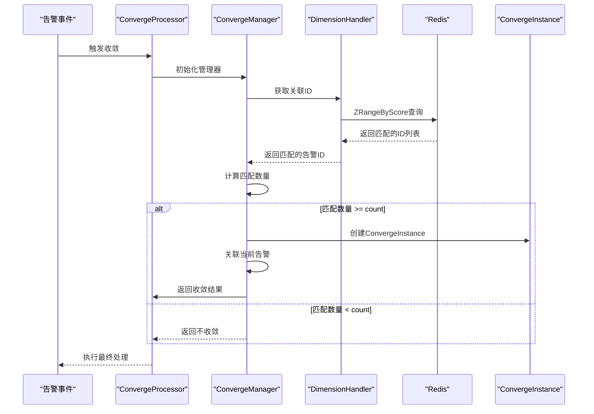
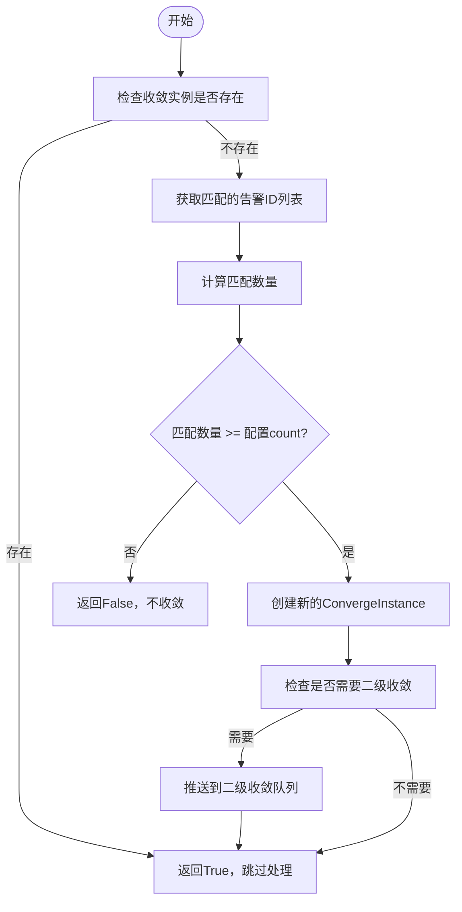
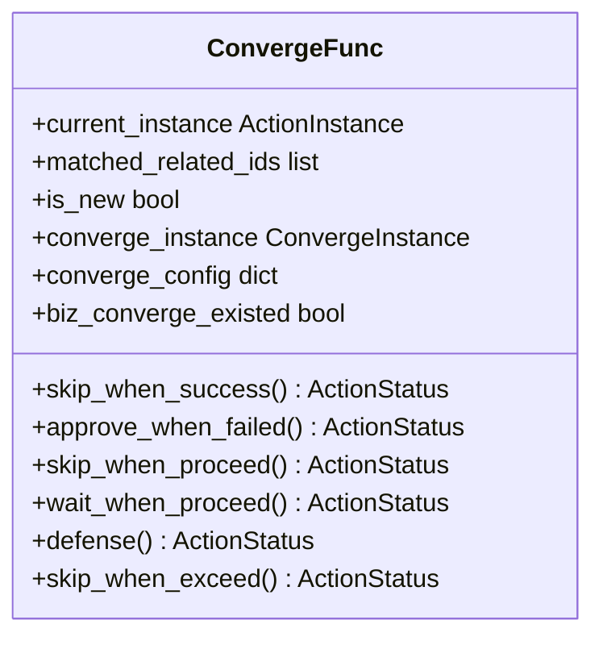

# 收敛策略

<cite>
**本文档引用的文件**   
- [converge.py](file://bkmonitor/alarm_backends/core/context/converge.py)
- [converge_func.py](file://bkmonitor/alarm_backends/service/converge/converge_func.py)
- [converge_manger.py](file://bkmonitor/alarm_backends/service/converge/converge_manger.py)
- [processor.py](file://bkmonitor/alarm_backends/service/converge/processor.py)
- [dimension.py](file://bkmonitor/alarm_backends/service/converge/dimension.py)
- [action.py](file://bkmonitor/constants/action.py)
- [strategy.py](file://bkmonitor/bkmonitor/models/strategy.py)
- [strategy.py](file://bkmonitor/bkmonitor/strategy/strategy.py)
</cite>

## 目录
1. [引言](#引言)
2. [项目结构](#项目结构)
3. [核心组件](#核心组件)
4. [架构概述](#架构概述)
5. [详细组件分析](#详细组件分析)
6. [依赖分析](#依赖分析)
7. [性能考虑](#性能考虑)
8. [故障排除指南](#故障排除指南)
9. [结论](#结论)

## 引言
本文档旨在深入阐述蓝鲸监控平台中的告警收敛策略，为运维人员提供全面的配置指导和实现原理说明。告警收敛是监控系统中至关重要的功能，它通过将大量重复或相关的告警信息进行聚合与处理，有效避免了告警风暴，提升了告警信息的可读性和处理效率。文档将详细解析收敛策略的配置方法，涵盖业务、资源和时间等多个维度，并深入探讨核心参数如收敛键、时间窗口和最大告警数的设置及其业务影响。同时，文档还将阐明收敛策略与告警策略的关联关系及优先级处理机制，为用户设计高效、合理的告警管理方案提供最佳实践和反模式警示。

## 项目结构
蓝鲸监控平台的告警收敛功能主要分布在`alarm_backends`模块中，其代码结构清晰，遵循了高内聚、低耦合的设计原则。核心的收敛逻辑被封装在`service/converge`子目录下，通过多个职责分明的类和模块协同工作。

```mermaid
graph TD
subgraph "收敛核心模块"
ConvergeManager[ConvergeManager<br/>收敛管理器]
ConvergeProcessor[ConvergeProcessor<br/>收敛处理器]
ConvergeFunc[ConvergeFunc<br/>收敛函数]
DimensionHandler[DimensionHandler<br/>维度处理器]
end
subgraph "数据模型"
ConvergeInstance[ConvergeInstance<br/>收敛实例]
ConvergeRelation[ConvergeRelation<br/>收敛关系]
ActionInstance[ActionInstance<br/>动作实例]
end
subgraph "配置与常量"
action_constants[action.py<br/>常量定义]
strategy_model[strategy.py<br/>策略模型]
end
ConvergeManager --> ConvergeProcessor : "调用"
ConvergeProcessor --> ConvergeFunc : "使用"
ConvergeProcessor --> DimensionHandler : "使用"
ConvergeManager --> DimensionHandler : "使用"
ConvergeProcessor --> ConvergeInstance : "操作"
ConvergeProcessor --> ConvergeRelation : "操作"
action_constants --> ConvergeFunc : "提供配置"
strategy_model --> ConvergeProcessor : "提供策略上下文"
```

**图示来源**
- [converge_manger.py](file://bkmonitor/alarm_backends/service/converge/converge_manger.py#L56)
- [processor.py](file://bkmonitor/alarm_backends/service/converge/processor.py#L100)
- [converge_func.py](file://bkmonitor/alarm_backends/service/converge/converge_func.py#L27)
- [dimension.py](file://bkmonitor/alarm_backends/service/converge/dimension.py#L80)
- [action.py](file://bkmonitor/constants/action.py#L503)
- [strategy.py](file://bkmonitor/bkmonitor/models/strategy.py#L1)

## 核心组件
告警收敛系统的核心由几个关键组件构成：`ConvergeManager`（收敛管理器）负责协调整个收敛流程；`ConvergeProcessor`（收敛处理器）是执行收敛逻辑的主入口；`ConvergeFunc`（收敛函数）则封装了具体的收敛行为，如“成功后跳过”、“执行中等待”等；`DimensionHandler`（维度处理器）专门处理基于不同维度的匹配和查询。这些组件共同协作，实现了灵活且强大的告警收敛能力。

**组件来源**
- [converge_manger.py](file://bkmonitor/alarm_backends/service/converge/converge_manger.py#L56)
- [processor.py](file://bkmonitor/alarm_backends/service/converge/processor.py#L100)
- [converge_func.py](file://bkmonitor/alarm_backends/service/converge/converge_func.py#L27)
- [dimension.py](file://bkmonitor/alarm_backends/service/converge/dimension.py#L80)

## 架构概述
告警收敛的架构遵循典型的处理流程：当一个告警事件（`ActionInstance`）触发时，系统首先会创建一个`ConvergeProcessor`来处理该事件。处理器会根据告警策略中的收敛配置，初始化一个`ConvergeManager`。管理器利用`DimensionHandler`在Redis中查询过去一段时间内（时间窗口）是否已存在满足相同收敛条件的其他告警。如果满足预设的`count`阈值，管理器将创建一个`ConvergeInstance`（收敛实例），并将当前告警与之关联。最后，`ConvergeFunc`会根据配置的`converge_func`类型，决定对当前告警是跳过、等待还是进行其他处理。



**图示来源**
- [processor.py](file://bkmonitor/alarm_backends/service/converge/processor.py#L100)
- [converge_manger.py](file://bkmonitor/alarm_backends/service/converge/converge_manger.py#L183)
- [dimension.py](file://bkmonitor/alarm_backends/service/converge/dimension.py#L120)

## 详细组件分析

### 收敛管理器分析
`ConvergeManager`是收敛流程的协调者，其核心方法`do_converge`定义了收敛的主逻辑。



**图示来源**
- [converge_manger.py](file://bkmonitor/alarm_backends/service/converge/converge_manger.py#L183)

**组件来源**
- [converge_manger.py](file://bkmonitor/alarm_backends/service/converge/converge_manger.py#L183)

### 收敛函数分析
`ConvergeFunc`类定义了多种具体的收敛行为，这些行为通过不同的方法实现。



**图示来源**
- [converge_func.py](file://bkmonitor/alarm_backends/service/converge/converge_func.py#L27)

**组件来源**
- [converge_func.py](file://bkmonitor/alarm_backends/service/converge/converge_func.py#L27)

## 依赖分析
收敛系统依赖于多个外部模块和数据源。它依赖`bkmonitor.models.fta`包中的`ActionInstance`和`ConvergeInstance`等模型进行数据持久化。它使用`constants.action`模块中的常量来定义收敛函数类型和默认配置。在数据存储层面，它通过`alarm_backends.core.cache.key`模块定义的Redis键来高效地查询历史告警，实现快速的维度匹配。

```mermaid
graph TD
ConvergeManager --> ActionInstance : "依赖"
ConvergeManager --> ConvergeInstance : "依赖"
ConvergeManager --> ConvergeRelation : "依赖"
ConvergeFunc --> ActionStatus : "依赖"
ConvergeFunc --> ConvergeType : "依赖"
DimensionHandler --> FTA_CONVERGE_DIMENSION_KEY : "依赖"
DimensionHandler --> FTA_SUB_CONVERGE_DIMENSION_KEY : "依赖"
processor.py --> action.py : "导入常量"
processor.py --> strategy.py : "导入模型"
```

**图示来源**
- [converge_manger.py](file://bkmonitor/alarm_backends/service/converge/converge_manger.py#L10)
- [converge_func.py](file://bkmonitor/alarm_backends/service/converge/converge_func.py#L10)
- [dimension.py](file://bkmonitor/alarm_backends/service/converge/dimension.py#L10)

**组件来源**
- [converge_manger.py](file://bkmonitor/alarm_backends/service/converge/converge_manger.py#L10)
- [converge_func.py](file://bkmonitor/alarm_backends/service/converge/converge_func.py#L10)
- [dimension.py](file://bkmonitor/alarm_backends/service/converge/dimension.py#L10)

## 性能考虑
为了保证高并发下的性能，收敛系统采用了多项优化措施。首先，它使用Redis作为缓存，利用其`ZSet`数据结构的`ZRangeByScore`命令，可以非常高效地在时间范围内查询和聚合告警。其次，系统通过`ACTION_CONVERGE_KEY_PROCESS_LOCK`等Redis锁来控制并发，防止过多的收敛任务同时执行。最后，`DimensionHandler`使用了Redis Pipeline技术，将多个查询命令打包执行，显著减少了网络往返开销。

## 故障排除指南
当收敛功能未按预期工作时，应首先检查以下几点：
1.  **收敛配置**：确认告警策略中的收敛配置`is_enabled`为`True`，且`count`和`timedelta`等参数设置合理。
2.  **日志排查**：查看`fta_action.converge`日志，搜索`instance_id`，可以清晰地看到从查询、匹配到决策的完整流程，是定位问题的关键。
3.  **Redis状态**：检查相关的Redis键（如`fta:converge:*`）是否存在，以及其中的数据是否符合预期。
4.  **并发锁**：如果日志中出现大量关于锁的警告，可能需要调整并发控制策略。

**组件来源**
- [processor.py](file://bkmonitor/alarm_backends/service/converge/processor.py#L150)
- [converge_manger.py](file://bkmonitor/alarm_backends/service/converge/converge_manger.py#L200)

## 结论
蓝鲸监控平台的告警收敛策略是一个设计精良、功能强大的系统。它通过维度化、时间窗口和阈值控制，有效地解决了告警泛滥的问题。通过对`ConvergeManager`、`ConvergeProcessor`和`ConvergeFunc`等核心组件的深入理解，运维人员可以灵活地配置和定制收敛规则，以适应不同的业务场景。遵循本文档提供的最佳实践，将有助于构建一个更加稳定、高效的监控告警体系。