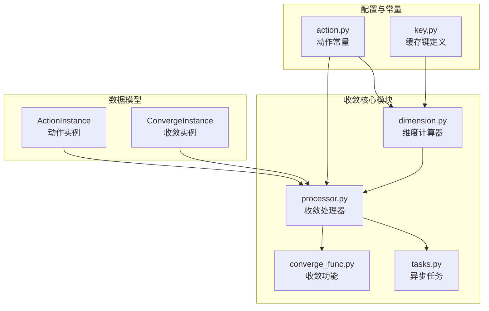
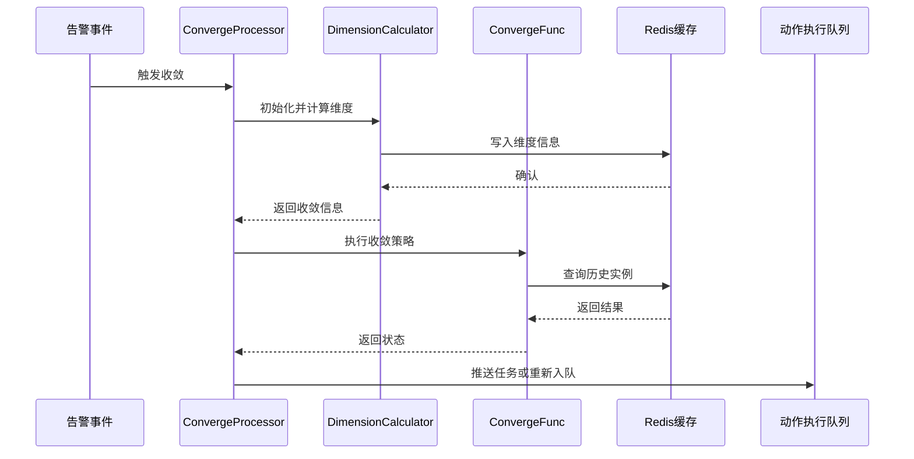
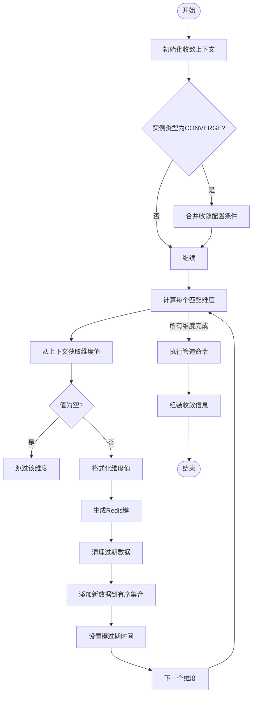
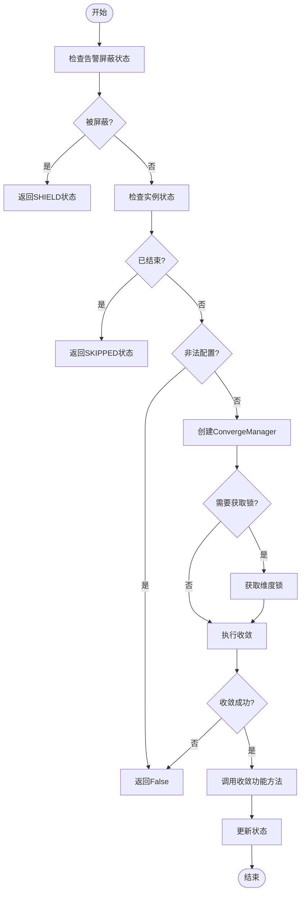
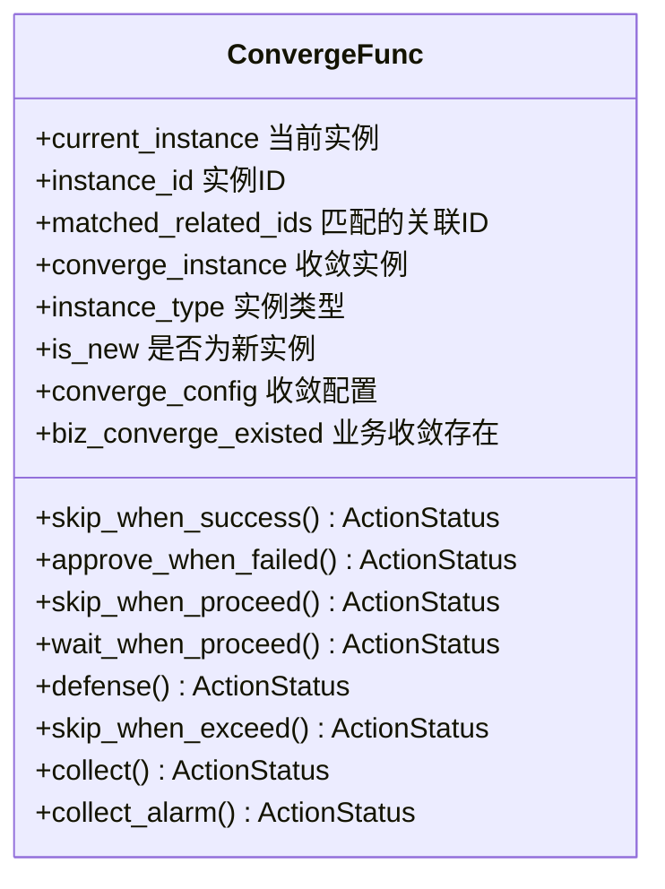
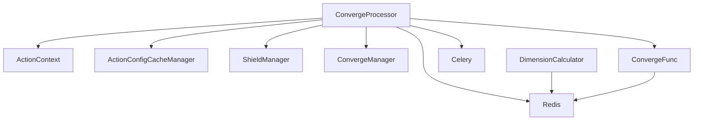

# 收敛维度

<cite>
**本文档引用的文件**   
- [dimension.py](file://bkmonitor/alarm_backends/service/converge/dimension.py)
- [action.py](file://bkmonitor/constants/action.py)
- [processor.py](file://bkmonitor/alarm_backends/service/converge/processor.py)
- [converge_func.py](file://bkmonitor/alarm_backends/service/converge/converge_func.py)
</cite>

## 目录
1. [引言](#引言)
2. [项目结构](#项目结构)
3. [核心组件](#核心组件)
4. [架构概述](#架构概述)
5. [详细组件分析](#详细组件分析)
6. [依赖分析](#依赖分析)
7. [性能考虑](#性能考虑)
8. [故障排除指南](#故障排除指南)
9. [结论](#结论)

## 引言
本文档全面介绍了蓝鲸监控平台中收敛维度的详细技术实现。收敛维度是告警处理系统中的核心概念，用于对相似告警进行聚合和管理，避免告警风暴。文档详细阐述了支持的收敛维度类型、应用场景、配置方法、算法实现以及性能优化策略，为系统设计人员提供了完整的维度扩展接口说明和实现指南。

## 项目结构
该项目是一个复杂的监控告警系统，其核心功能围绕告警的收敛处理。项目结构清晰，主要模块包括`alarm_backends`（告警后端服务）、`constants`（常量定义）和`bkmonitor`（监控核心）。与收敛维度直接相关的代码主要分布在`alarm_backends/service/converge`目录下，该目录包含了维度计算、处理器、功能实现和任务调度等关键组件。

**图源**
- [dimension.py](file://bkmonitor/alarm_backends/service/converge/dimension.py)
- [processor.py](file://bkmonitor/alarm_backends/service/converge/processor.py)
- [converge_func.py](file://bkmonitor/alarm_backends/service/converge/converge_func.py)
- [action.py](file://bkmonitor/constants/action.py)

## 核心组件
收敛系统的核心组件包括`DimensionCalculator`（维度计算器）、`ConvergeProcessor`（收敛处理器）和`ConvergeFunc`（收敛功能类）。`DimensionCalculator`负责从告警上下文中提取并计算用于匹配的维度信息，是收敛匹配的前置步骤。`ConvergeProcessor`是整个收敛流程的控制中心，它负责加载配置、获取上下文、执行收敛逻辑并根据结果推送任务。`ConvergeFunc`则封装了具体的收敛策略，如“成功后跳过”、“执行中等待”等，是收敛行为的执行者。

**节源**
- [dimension.py](file://bkmonitor/alarm_backends/service/converge/dimension.py#L200-L402)
- [processor.py](file://bkmonitor/alarm_backends/service/converge/processor.py#L0-L199)
- [converge_func.py](file://bkmonitor/alarm_backends/service/converge/converge_func.py#L0-L199)

## 架构概述
系统的收敛架构采用分层设计，从上至下分为配置层、处理层和执行层。配置层由`action.py`中的常量定义，明确了所有可用的收敛维度和功能。处理层是核心，`ConvergeProcessor`作为主控制器，协调`DimensionCalculator`进行维度计算，并调用`ConvergeFunc`执行具体的收敛策略。执行层则通过Celery异步任务（如`run_converge`和`run_action`）来实现非阻塞的队列处理，确保系统的高并发和高可用性。整个流程通过Redis进行状态同步和数据缓存，保证了分布式环境下的数据一致性。

**图源**
- [processor.py](file://bkmonitor/alarm_backends/service/converge/processor.py#L200-L400)
- [dimension.py](file://bkmonitor/alarm_backends/service/converge/dimension.py#L200-L402)
- [converge_func.py](file://bkmonitor/alarm_backends/service/converge/converge_func.py#L0-L199)

## 详细组件分析
### 维度计算器分析
`DimensionCalculator`类是收敛维度提取和匹配的核心。它通过`calc_dimension`方法将告警的上下文信息（如策略ID、告警级别、业务ID等）转换为可用于Redis存储和查询的键值对。

#### 维度计算流程

**图源**
- [dimension.py](file://bkmonitor/alarm_backends/service/converge/dimension.py#L200-L402)

**节源**
- [dimension.py](file://bkmonitor/alarm_backends/service/converge/dimension.py#L200-L402)

### 收敛处理器分析
`ConvergeProcessor`是收敛逻辑的总调度器。其`run_converge`方法是核心，它首先检查告警是否被屏蔽，然后获取分布式锁以防止并发冲突，最后调用`ConvergeManager`和`ConvergeFunc`来执行具体的收敛逻辑。

#### 收敛处理流程

**图源**
- [processor.py](file://bkmonitor/alarm_backends/service/converge/processor.py#L400-L600)

**节源**
- [processor.py](file://bkmonitor/alarm_backends/service/converge/processor.py#L400-L600)

### 收敛功能分析
`ConvergeFunc`类实现了多种收敛策略。例如，`skip_when_success`方法会查询是否存在已成功执行的关联动作，如果存在则返回`SKIPPED`状态，从而跳过当前告警的处理。

#### 收敛功能实现

**图源**
- [converge_func.py](file://bkmonitor/alarm_backends/service/converge/converge_func.py#L0-L199)

**节源**
- [converge_func.py](file://bkmonitor/alarm_backends/service/converge/converge_func.py#L0-L199)

## 依赖分析
收敛系统依赖于多个内部和外部组件。内部依赖包括`ActionContext`用于构建告警上下文，`ActionConfigCacheManager`用于获取动作配置，以及`ShieldManager`用于检查告警屏蔽状态。外部依赖则包括Redis（用于`FTA_CONVERGE_DIMENSION_KEY`等缓存键的存储和查询）和Celery（用于`run_converge`和`run_action`等异步任务的调度）。这些依赖通过清晰的接口进行交互，保证了系统的模块化和可维护性。

**图源**
- [processor.py](file://bkmonitor/alarm_backends/service/converge/processor.py#L0-L199)
- [dimension.py](file://bkmonitor/alarm_backends/service/converge/dimension.py#L200-L402)
- [converge_func.py](file://bkmonitor/alarm_backends/service/converge/converge_func.py#L0-L199)

**节源**
- [processor.py](file://bkmonitor/alarm_backends/service/converge/processor.py#L0-L199)

## 性能考虑
为了优化性能，系统采用了多项策略。首先，使用Redis管道（pipeline）批量执行多个命令，显著减少了网络往返开销。其次，通过SHA1哈希和长度截断（`get_dimension`方法中的`safe_length`参数）来缩短维度字符串，减小了Redis的存储和查询压力。此外，系统还实现了分布式锁（`ACTION_CONVERGE_KEY_PROCESS_LOCK`）来控制并发收敛的数量，防止资源耗尽。对于大量告警的场景，二级收敛（sub_converge_config）机制可以先在业务级别进行汇总，再进行更精细的收敛，有效降低了计算复杂度。

## 故障排除指南
当收敛功能未按预期工作时，应首先检查日志。`ConvergeProcessor`中的`logger`会记录关键信息，如非法配置警告（`illegal converge_config`）、并发锁获取失败（`get parallel converge failed`）以及策略未找到的错误。其次，应验证收敛配置的正确性，确保`condition`中的`dimension`是有效的（如`strategy_id`、`bk_biz_id`），且`timedelta`和`count`为正数。最后，检查Redis实例是否正常运行，并确认相关的缓存键（如`fta_action.converge.*`）中是否有预期的数据。

**节源**
- [processor.py](file://bkmonitor/alarm_backends/service/converge/processor.py#L200-L400)
- [dimension.py](file://bkmonitor/alarm_backends/service/converge/dimension.py#L200-L402)

## 结论
本文档详细解析了蓝鲸监控平台的收敛维度系统。该系统设计精巧，通过维度提取、Redis存储和策略执行的组合，实现了灵活高效的告警收敛。开发者可以基于现有的`ALL_CONVERGE_DIMENSION`和`ConvergeFunction`扩展新的维度和策略，以满足特定的业务需求。理解其内部机制对于优化告警处理流程和提升系统稳定性至关重要。