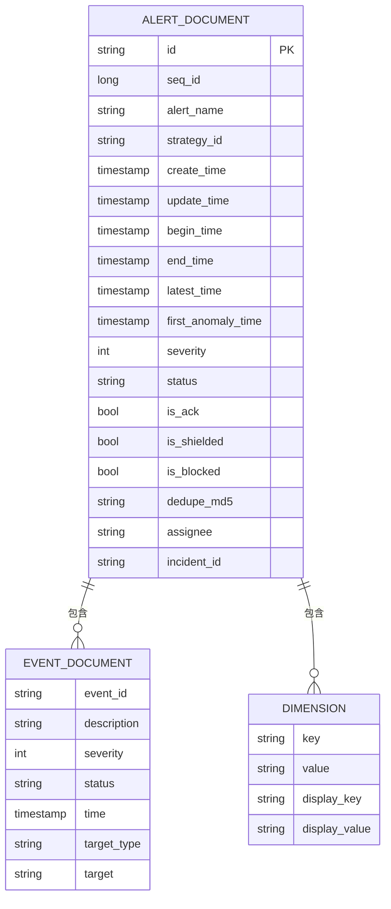
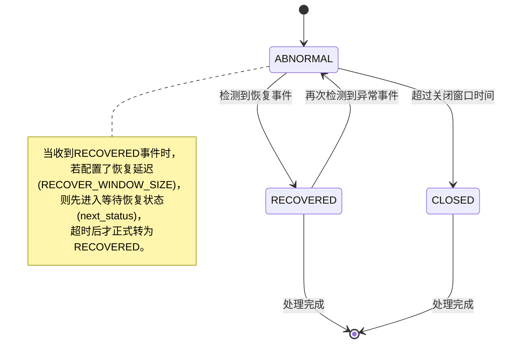
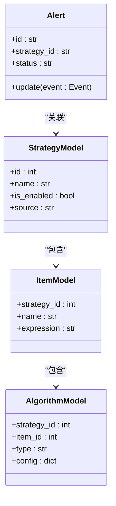
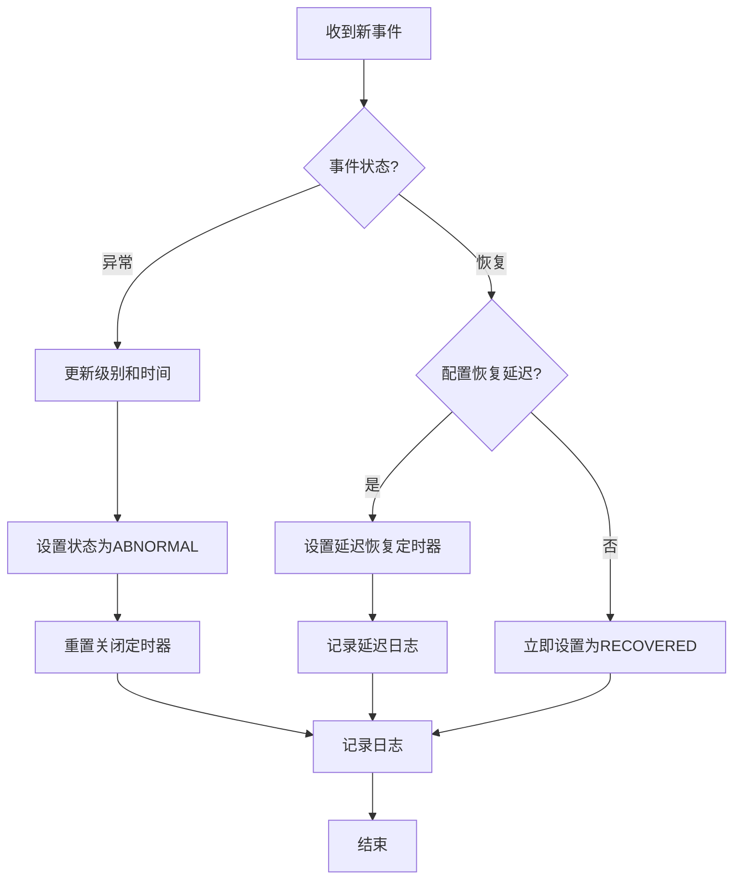
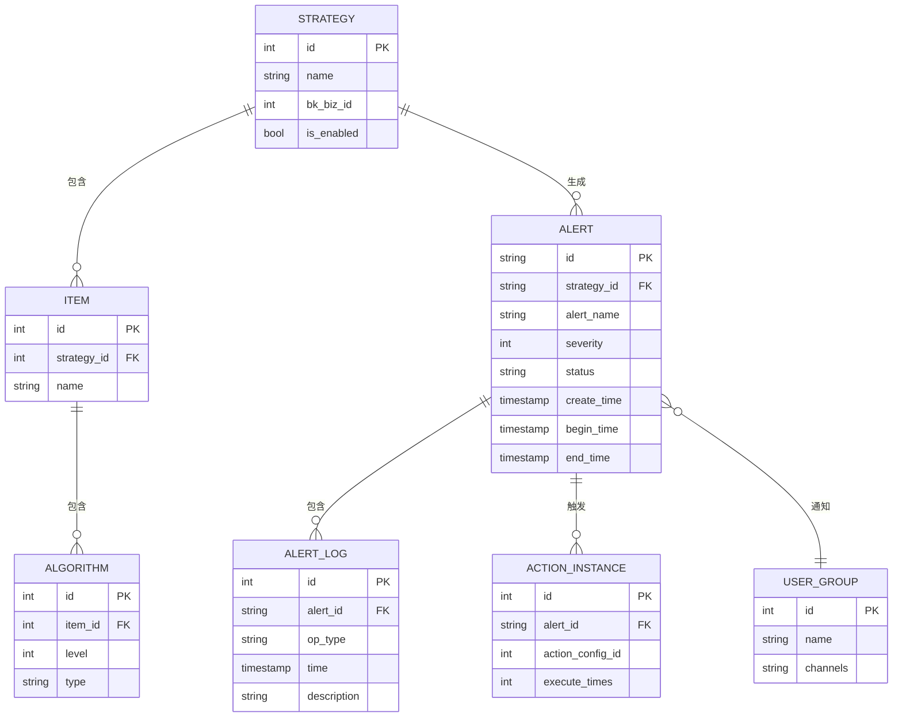

# 告警模型

<cite>
**本文档引用文件**   
- [strategy.py](file://bkmonitor/bkmonitor/models/strategy.py)
- [alert.py](file://bkmonitor/alarm_backends/core/alert/alert.py)
- [alert.py](file://bkmonitor/bkmonitor/documents/alert.py)
- [event.py](file://bkmonitor/alarm_backends/core/alert/event.py)
- [alert.py](file://bkmonitor/constants/alert.py)
</cite>

## 目录
1. [引言](#引言)
2. [告警实体数据结构](#告警实体数据结构)
3. [告警状态机](#告警状态机)
4. [告警生命周期管理](#告警生命周期管理)
5. [告警与监控策略关系](#告警与监控策略关系)
6. [告警处理流程](#告警处理流程)
7. [ER图：告警模型关系](#er图告警模型关系)
8. [开发者最佳实践](#开发者最佳实践)

## 引言

本文档全面阐述了蓝鲸监控平台的告警模型，详细描述了告警事件的数据结构、处理流程和生命周期管理。文档深入解析了告警实体的核心字段、告警状态机的转换逻辑，以及告警与监控策略、告警实例、处理动作之间的复杂关系。通过ER图直观展示了告警模型与其他相关实体的关联，并为开发者提供了告警处理的最佳实践和常见查询示例，旨在为系统维护和二次开发提供权威的技术参考。

## 告警实体数据结构

告警实体是监控系统的核心数据单元，其数据结构定义了告警的完整信息。告警数据在内存中以`Alert`对象形式存在，在存储层则通过`AlertDocument`映射到Elasticsearch。

### 核心属性与数据类型

告警实体包含以下核心属性，这些属性定义了告警的基本信息和状态：

**告警标识与时间**
- **id**: 告警唯一标识符（`str`），由时间戳和序列号组成，确保全局唯一。
- **create_time**: 告警创建时间（`int`），Unix时间戳，记录告警首次生成的时间。
- **update_time**: 最后更新时间（`int`），每次告警状态或内容变更时更新。
- **begin_time**: 告警开始时间（`int`），首次检测到异常的时间。
- **end_time**: 告警结束时间（`int`），告警恢复或关闭的时间，可能为空。
- **latest_time**: 最新异常时间（`int`），最近一次异常事件发生的时间。

**告警内容与级别**
- **alert_name**: 告警名称（`str`），可读的告警标题。
- **severity**: 告警级别（`int`），整数表示，1为致命，2为预警，3为提醒。
- **status**: 告警状态（`str`），当前状态，如“ABNORMAL”（未恢复）、“RECOVERED”（已恢复）。
- **description**: 告警描述（`str`），对告警内容的详细说明。

**关联与维度**
- **strategy_id**: 关联策略ID（`str`），指向生成此告警的监控策略。
- **dimensions**: 维度列表（`list`），包含`key`、`value`、`display_key`、`display_value`的字典，用于多维度下钻分析。
- **dedupe_md5**: 去重指纹（`str`），基于告警名称、策略ID、目标等关键字段计算的MD5值，用于告警合并。

**状态标志**
- **is_ack**: 是否已确认（`bool`），标记告警是否已被人工确认。
- **is_shielded**: 是否被屏蔽（`bool`），标记告警是否处于屏蔽状态。
- **is_blocked**: 是否阻断（`bool`），标记告警是否因流控而被阻断。

**Section sources**
- [alert.py](file://bkmonitor/alarm_backends/core/alert/alert.py#L100-L200)
- [alert.py](file://bkmonitor/bkmonitor/documents/alert.py#L50-L100)

### 存储层数据结构

在Elasticsearch中，告警数据通过`AlertDocument`类进行映射，其字段设计优化了查询性能：



**Diagram sources**
- [alert.py](file://bkmonitor/bkmonitor/documents/alert.py#L50-L150)

## 告警状态机

告警状态机定义了告警在其生命周期内状态的转换逻辑，是告警处理的核心。

### 状态定义

根据`constants/alert.py`文件，告警状态定义如下：

- **ABNORMAL (未恢复)**: 告警处于激活状态，系统持续检测到异常。
- **RECOVERED (已恢复)**: 告警已恢复，异常条件不再满足。
- **CLOSED (已失效)**: 告警已关闭，通常因长时间无更新而自动关闭。

### 状态转换逻辑

状态转换由`Alert`类的`update`和`move_to_next_status`方法驱动：



**Diagram sources**
- [alert.py](file://bkmonitor/alarm_backends/core/alert/alert.py#L300-L400)

**Section sources**
- [alert.py](file://bkmonitor/alarm_backends/core/alert/alert.py#L300-L400)
- [alert.py](file://bkmonitor/constants/alert.py#L20-L30)

## 告警生命周期管理

告警的生命周期从事件触发开始，到告警关闭结束，完整流程如下：

### 触发阶段

1.  **事件生成**: 数据采集或计算模块生成一个`Event`对象。
2.  **事件清洗**: `Event`类的`clean`方法对原始数据进行标准化处理，如清理空字段、校验级别、计算去重指纹`dedupe_md5`。
3.  **创建告警**: 调用`Alert.from_event(event)`方法，将事件转换为新的告警对象。此时告警状态为`ABNORMAL`，并设置关闭定时器。

### 处理阶段

1.  **状态更新**: 当收到新的`Event`时，调用`Alert.update(event)`方法。
    - 如果是更高级别的异常事件，会更新告警级别和代表性事件。
    - 如果是恢复事件，会根据配置决定是立即恢复还是延迟恢复。
2.  **流控检查**: 系统会检查告警是否因QoS（服务质量）策略被阻断。
3.  **日志记录**: 每次状态变更都会生成一条流水日志，记录操作类型、时间、描述等。

### 结束阶段

1.  **恢复**: 当系统确认异常已消除，告警状态变为`RECOVERED`。
2.  **关闭**: 如果告警长时间（默认1小时）没有收到新的异常事件，`move_to_next_status`方法会将其状态变为`CLOSED`。
3.  **归档**: 已关闭的告警在Elasticsearch中保留，但不再参与实时处理。

**Section sources**
- [alert.py](file://bkmonitor/alarm_backends/core/alert/alert.py#L200-L500)
- [event.py](file://bkmonitor/alarm_backends/core/alert/event.py#L50-L100)

## 告警与监控策略关系

告警与监控策略是多对一的关系。一个监控策略可以产生多个告警实例，而每个告警都关联到一个具体的策略。

### 策略模型分析

`StrategyModel`（位于`models/strategy.py`）定义了监控策略的核心配置：

- **name**: 策略名称。
- **scenario**: 监控场景，如主机、服务等。
- **is_enabled**: 是否启用。
- **source**: 来源系统。

策略通过`ItemModel`（监控项）、`DetectModel`（检测配置）和`AlgorithmModel`（算法配置）等子模型来定义具体的检测逻辑。

### 关系映射

告警通过`strategy_id`字段与`StrategyModel`建立关联。当告警需要获取策略详情时，会从`extra_info`字段中反序列化出完整的策略快照。



**Diagram sources**
- [strategy.py](file://bkmonitor/bkmonitor/models/strategy.py#L100-L200)
- [alert.py](file://bkmonitor/alarm_backends/core/alert/alert.py#L100-L150)

**Section sources**
- [strategy.py](file://bkmonitor/bkmonitor/models/strategy.py#L100-L200)

## 告警处理流程

告警处理流程是系统的核心业务逻辑，其代码主要位于`alarm_backends/core/alert/alert.py`。

### 核心处理方法

`Alert.update(event)`方法是处理流程的入口，其逻辑如下：

1.  **刷新更新时间**: 调用`refresh_update_time()`。
2.  **级别提升检查**: 如果新事件的级别更高，则更新告警级别和代表性事件。
3.  **时间更新**: 更新`first_anomaly_time`和`latest_time`。
4.  **状态迁移**:
    - **异常事件**: 设置告警状态为`ABNORMAL`，并重置关闭定时器。
    - **恢复事件**: 根据`RECOVER_WINDOW_SIZE`决定是立即恢复还是延迟恢复。
5.  **日志记录**: 记录本次更新的流水日志。



**Diagram sources**
- [alert.py](file://bkmonitor/alarm_backends/core/alert/alert.py#L200-L400)

**Section sources**
- [alert.py](file://bkmonitor/alarm_backends/core/alert/alert.py#L200-L400)

## ER图：告警模型关系

以下是告警模型与其他核心实体的ER图：



**Diagram sources**
- [strategy.py](file://bkmonitor/bkmonitor/models/strategy.py)
- [alert.py](file://bkmonitor/alarm_backends/core/alert/alert.py)
- [alert.py](file://bkmonitor/bkmonitor/documents/alert.py)

## 开发者最佳实践

### 常见查询示例

1.  **查询指定业务下的所有未恢复告警**:
    ```python
    from bkmonitor.documents import AlertDocument
    alerts = AlertDocument.search().filter("term", bk_biz_id=2).filter("term", status="ABNORMAL").execute()
    ```

2.  **根据去重指纹获取最新告警**:
    ```python
    try:
        alert = AlertDocument.get_by_dedupe_md5(dedupe_md5="abc123", start_time=1609430400)
    except AlertNotFoundError:
        # 处理未找到的情况
        pass
    ```

3.  **批量获取告警详情**:
    ```python
    alert_ids = ["12345678901234567890", "09876543210987654321"]
    alerts = AlertDocument.mget(ids=alert_ids, fields=["id", "alert_name", "status"])
    ```

### 最佳实践建议

- **避免直接修改`data`字典**: 应使用`Alert`类提供的`set`、`add_dimension`等方法来修改告警属性，以确保内部状态同步。
- **及时刷新状态**: 在修改可能影响告警状态的字段后，调用`refresh_update_time()`和`_refresh_db = True`标记需要持久化。
- **合理使用`extra_info`**: 将与告警处理相关的临时或扩展信息存储在`extra_info`中，避免污染核心字段。
- **处理边界情况**: 在调用`get`、`mget`等方法时，始终处理`AlertNotFoundError`等异常。

**Section sources**
- [alert.py](file://bkmonitor/bkmonitor/documents/alert.py#L200-L300)
- [alert.py](file://bkmonitor/alarm_backends/core/alert/alert.py#L500-L600)