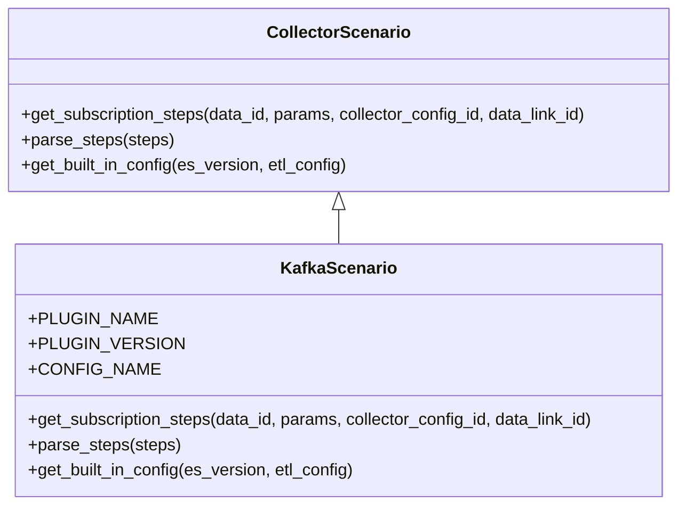
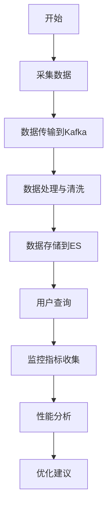

# 数据接入模型

<cite>
**本文档引用的文件**   
- [models.py](file://bklog/apps/log_databus/models.py)
- [serializers.py](file://bklog/apps/log_databus/serializers.py)
- [constants.py](file://bklog/apps/log_databus/constants.py)
- [base.py](file://bklog/apps/log_databus/handlers/collector_scenario/base.py)
- [kafka.py](file://bklog/apps/log_databus/handlers/collector_scenario/kafka.py)
- [handler.py](file://bklog/apps/log_databus/handlers/check_collector/handler.py)
- [utils.py](file://bklog/apps/log_databus/handlers/collector_scenario/utils.py)
- [metrics.py](file://bklog/apps/log_esquery/metrics.py)
- [es.py](file://bklog/apps/log_measure/utils/es.py)
</cite>

## 目录
1. [引言](#引言)
2. [数据采集实体设计](#数据采集实体设计)
3. [关键字段应用](#关键字段应用)
4. [采集插件集成机制](#采集插件集成机制)
5. [配置版本管理与回滚](#配置版本管理与回滚)
6. [性能监控指标](#性能监控指标)
7. [结论](#结论)

## 引言
本文档深入介绍数据接入模型，重点阐述CollectorConfig等数据采集实体的设计与实现。详细说明collector_config_overlay、bcs_cluster_id、is_nanos等字段在不同采集场景下的应用，解释数据接入模型与各种采集插件（如bkunifylogbeat、kafka）的集成机制，描述采集配置的版本管理和回滚策略，并提供性能监控指标的跟踪方法。

## 数据采集实体设计
数据接入模型的核心是CollectorConfig类，它定义了数据采集的配置。该类继承自CollectorBase，包含了采集配置的各类属性，如采集配置ID、名称、插件ID、采集场景、数据分类、目标对象类型等。CollectorConfig还包含了与数据链路、存储、清洗等相关的配置，如data_link_id、bk_data_id、table_id、etl_config等。

**Section sources**
- [models.py](file://bklog/apps/log_databus/models.py#L101-L200)

## 关键字段应用
### collector_config_overlay
该字段用于覆盖采集器的默认配置。在创建或更新采集配置时，可以通过该字段传递自定义的配置参数，从而实现对采集行为的精细化控制。

### bcs_cluster_id
该字段用于标识BCS（蓝鲸容器服务）集群ID。在容器化环境中，通过该字段可以将采集配置与特定的BCS集群关联，实现针对不同集群的差异化采集策略。

### is_nanos
该字段用于标识采集项是否为纳秒级采集。当该字段为True时，表示采集的时间戳精度为纳秒级别，适用于对时间精度要求极高的场景。

**Section sources**
- [models.py](file://bklog/apps/log_databus/models.py#L175-L193)
- [k8s.py](file://bklog/apps/log_databus/handlers/collector/k8s.py#L1027-L1038)

## 采集插件集成机制
数据接入模型通过CollectorScenario类实现与各种采集插件的集成。CollectorScenario是一个抽象基类，定义了获取订阅步骤、解析步骤、获取内置配置等方法。具体的采集场景（如行日志、段日志、Kafka日志等）通过继承CollectorScenario并实现相应方法来完成与采集插件的集成。

### Kafka采集插件集成
KafkaScenario类实现了Kafka数据采集的集成。通过get_subscription_steps方法生成节点管理插件下发步骤，包括配置Kafka主机、主题、用户名、密码等参数，并将这些参数传递给bkunifylogbeat采集器。

**Diagram sources **
- [base.py](file://bklog/apps/log_databus/handlers/collector_scenario/base.py#L49-L87)
- [kafka.py](file://bklog/apps/log_databus/handlers/collector_scenario/kafka.py#L35-L108)

**Section sources**
- [base.py](file://bklog/apps/log_databus/handlers/collector_scenario/base.py#L49-L87)
- [kafka.py](file://bklog/apps/log_databus/handlers/collector_scenario/kafka.py#L35-L108)

## 配置版本管理与回滚
系统通过CollectorConfig的is_active字段来管理采集配置的启用状态。当需要回滚配置时，可以将当前配置的is_active设置为False，并启用之前的配置版本。此外，系统还提供了批量操作接口，支持对多个采集配置进行统一的启用、停用操作。

**Section sources**
- [collector_batch_operation.py](file://bklog/apps/log_databus/handlers/collector_batch_operation.py#L114-L146)

## 性能监控指标
系统提供了多种性能监控指标，用于跟踪采集延迟、数据吞吐量等关键性能指标。

### 采集延迟
通过ESQUERY_SEARCH_LATENCY指标来监控搜索API的延迟，该指标记录了不同索引集、存储集群的搜索延迟分布。

### 数据吞吐量
通过ESQUERY_SEARCH_COUNT指标来监控搜索API的调用次数，结合其他指标可以计算出数据的吞吐量。

**Diagram sources **
- [metrics.py](file://bklog/apps/log_esquery/metrics.py#L7-L21)
- [es.py](file://bklog/apps/log_measure/utils/es.py#L522-L756)

**Section sources**
- [metrics.py](file://bklog/apps/log_esquery/metrics.py#L7-L21)
- [es.py](file://bklog/apps/log_measure/utils/es.py#L522-L756)

## 结论
本文档详细介绍了数据接入模型的设计与实现，涵盖了数据采集实体、关键字段应用、采集插件集成、配置版本管理及性能监控等方面。通过本模型，可以实现灵活、高效的数据采集与管理，满足不同场景下的需求。