# 数据模型

<cite>
**Referenced Files in This Document**   
- [ProjectInfo](file://bklog/apps/log_search/models.py#L214-L274)
- [IndexSetConfig](file://bklog/apps/log_search/models.py#L336-L666)
- [ClusteringConfig](file://bklog/apps/log_clustering/models.py#L106-L238)
- [ClusteringConfig](file://bklog/apps/log_clustering/models.py#L239-L337)
- [ClusteringSubscription](file://bklog/apps/log_clustering/models.py#L270-L337)
- [RegexTemplate](file://bklog/apps/log_clustering/models.py#L329-L337)
- [CollectorConfig](file://bklog/apps/log_databus/models.py#L101-L398)
- [LogIndexSet](file://bklog/apps/log_search/models.py#L336-L666)
</cite>

## 目录
1. [引言](#引言)
2. [核心数据模型](#核心数据模型)
3. [实体关系图](#实体关系图)
4. [关键业务规则与数据验证](#关键业务规则与数据验证)
5. [数据库迁移策略](#数据库迁移策略)
6. [性能优化建议](#性能优化建议)
7. [数据生命周期管理](#数据生命周期管理)

## 引言
本文档旨在全面描述日志平台系统中的数据模型，涵盖所有核心实体及其相互关系。文档详细说明了ProjectInfo、IndexSetConfig、ClusteringConfig等关键模型的字段定义、数据类型和约束。通过实体关系图（ER图）展示了实体间的一对一、一对多和多对多关系。此外，文档还解释了关键的业务规则和数据验证逻辑，描述了安全的数据库模式变更迁移策略，并提供了性能优化建议，包括索引设计和分库分表策略。最后，文档涵盖了数据生命周期管理，包括数据保留和归档机制。

## 核心数据模型

### ProjectInfo
`ProjectInfo` 模型代表系统中的项目实体，是组织和管理日志数据的基本单位。

**字段定义：**
- `project_id` (AutoField): 项目ID，主键。
- `project_name` (CharField): 项目名称，最大长度64字符。
- `bk_biz_id` (IntegerField): 业务ID，可为空。
- `bk_app_code` (CharField): 接入的来源APP，最大长度64字符。
- `time_zone` (CharField): 时区，最大长度64字符。
- `description` (TextField): 项目描述，可为空。
- `ip_topo_switch` (BooleanField): 是否可以使用IP快选。
- `is_v3_biz` (BooleanField): 是否为CMDB V3业务。
- `is_v3_mixed` (BooleanField): 是否混合使用CMDB V3业务。
- `feature_toggle` (CharField): 功能白名单，最大长度255字符，可为空。

**Section sources**
- [log_search/models.py](file://bklog/apps/log_search/models.py#L214-L274)

### IndexSetConfig
`IndexSetConfig` 模型（在代码中为 `LogIndexSet`）代表索引集配置，用于管理一组相关的日志索引。

**字段定义：**
- `index_set_id` (AutoField): 索引集ID，主键。
- `index_set_name` (CharField): 索引集名称，最大长度64字符。
- `space_uid` (CharField): 空间唯一标识，最大长度256字符。
- `project_id` (IntegerField): 项目ID。
- `category_id` (CharField): 数据分类，最大长度64字符，可为空。
- `bkdata_project_id` (IntegerField): 绑定的数据平台项目ID，可为空。
- `collector_config_id` (IntegerField): 绑定Transfer采集ID，可为空。
- `scenario_id` (CharField): 接入场景标识，选择范围为 `Scenario.CHOICES`。
- `storage_cluster_id` (IntegerField): 存储集群ID，可为空。
- `source_id` (IntegerField): 数据源ID，可为空。
- `orders` (IntegerField): 顺序。
- `view_roles` (MultiStrSplitByCommaField): 查看权限，冗余字段。
- `pre_check_tag` (BooleanField): 预查询校验是否通过。
- `pre_check_msg` (TextField): 预查询描述，可为空。
- `is_active` (BooleanField): 是否可用。
- `fields_snapshot` (JsonField): 字段快照，存储索引的字段信息。

**Section sources**
- [log_search/models.py](file://bklog/apps/log_search/models.py#L336-L666)

### ClusteringConfig
`ClusteringConfig` 模型代表日志聚类配置，用于定义日志聚类的算法参数和处理流程。

**字段定义：**
- `index_set_id` (IntegerField): 索引集ID，外键关联 `LogIndexSet`。
- `collector_config_id` (IntegerField): 采集项ID，可为空。
- `collector_config_name_en` (CharField): 采集项英文名，最大长度255字符，可为空。
- `min_members` (IntegerField): 最小日志数量。
- `max_dist_list` (CharField): 敏感度，最大长度128字符。
- `st_list` (CharField): 相似度阈值，最大长度128字符。
- `predefined_varibles` (TextField): 预先定义的正则表达式。
- `delimeter` (TextField): 分词符。
- `max_log_length` (IntegerField): 最大日志长度。
- `is_case_sensitive` (IntegerField): 是否大小写忽略。
- `depth` (IntegerField): 搜索树深度。
- `max_child` (IntegerField): 搜索树最大子节点数。
- `clustering_fields` (CharField): 聚合字段，最大长度128字符。
- `filter_rules` (JsonField): 过滤规则，可为空。
- `bk_biz_id` (IntegerField): 业务ID。
- `signature_enable` (BooleanField): 数据指纹开关。
- `pre_treat_flow_id` (IntegerField): 预处理flowid，可为空。
- `after_treat_flow_id` (IntegerField): 模型应用flowid，可为空。
- `source_rt_name` (CharField): 源rt名，最大长度255字符，可为空。
- `category_id` (CharField): 数据分类，最大长度64字符，可为空。
- `es_storage` (CharField): ES集群，最大长度64字符，可为空。
- `task_records` (JsonField): 任务记录。
- `task_details` (JsonField): 任务详情。
- `clustered_rt` (CharField): 聚类结果表，最大长度255字符，可为空。
- `signature_pattern_rt` (CharField): Pattern结果表，最大长度255字符，可为空。
- `new_cls_strategy_enable` (BooleanField): 是否开启新类告警。
- `normal_strategy_enable` (BooleanField): 是否开启数量突增告警。
- `access_finished` (BooleanField): 是否接入完成。
- `regex_rule_type` (CharField): 规则类型，选择范围为 `RegexRuleTypeEnum.get_choices()`。
- `regex_template_id` (IntegerField): 模板ID。
- `use_mini_link` (BooleanField): 是否启用小型化链路。
- `predict_cluster` (CharField): 预测集群名称，最大长度64字符，可为空。

**Section sources**
- [log_clustering/models.py](file://bklog/apps/log_clustering/models.py#L106-L238)

### ClusteringSubscription
`ClusteringSubscription` 模型代表日志聚类订阅，用于配置聚类结果的定期报告和通知。

**字段定义：**
- `subscription_type` (CharField): 订阅类型，选择范围为 `SubscriptionTypeEnum.get_choices()`。
- `space_uid` (CharField): 空间ID，最大长度256字符。
- `index_set_id` (IntegerField): 索引集ID。
- `title` (TextField): 标题。
- `receivers` (JsonField): 接收人。
- `managers` (JsonField): 管理员。
- `frequency` (JsonField): 发送频率。
- `pattern_level` (CharField): 敏感度，选择范围为 `PatternEnum.get_choices()`。
- `log_display_count` (IntegerField): 日志条数。
- `log_col_show_type` (CharField): 日志列显示，选择范围为 `LogColShowTypeEnum.get_choices()`。
- `group_by` (JsonField): 统计维度。
- `year_on_year_hour` (IntegerField): 同比，选择范围为 `YearOnYearEnum.get_choices()`。
- `year_on_year_change` (CharField): 同比变化，选择范围为 `YearOnYearChangeEnum.get_choices()`。
- `query_string` (TextField): 查询语句。
- `addition` (JsonField): 查询条件。
- `host_scopes` (JsonField): 主机范围。
- `is_show_new_pattern` (BooleanField): 是否只要新类。
- `is_enabled` (BooleanField): 是否启用。
- `last_run_at` (DateTimeField): 最后运行时间，可为空。

**Section sources**
- [log_clustering/models.py](file://bklog/apps/log_clustering/models.py#L270-L337)

### RegexTemplate
`RegexTemplate` 模型代表聚类正则模板，用于存储可复用的正则表达式配置。

**字段定义：**
- `space_uid` (CharField): 空间唯一标识，最大长度256字符。
- `template_name` (CharField): 模板名称，最大长度256字符。
- `predefined_varibles` (TextField): 模板的正则表达式。

**Section sources**
- [log_clustering/models.py](file://bklog/apps/log_clustering/models.py#L329-L337)

### CollectorConfig
`CollectorConfig` 模型代表采集配置，用于定义日志采集的具体规则。

**字段定义：**
- `collector_config_id` (AutoField): 采集配置ID，主键。
- `collector_config_name` (CharField): 采集配置名称，最大长度64字符。
- `collector_plugin_id` (BigIntegerField): 采集插件ID，可为空。
- `bk_app_code` (CharField): 接入的来源APP，最大长度64字符。
- `collector_scenario_id` (CharField): 采集场景。
- `custom_type` (CharField): 自定义类型，选择范围为 `CustomTypeEnum.get_choices()`。
- `category_id` (CharField): 数据分类。
- `target_object_type` (CharField): 对象类型，选择范围为 `TargetObjectTypeEnum.get_choices()`。
- `target_node_type` (CharField): 节点类型，选择范围为 `TargetNodeTypeEnum.get_choices()`。
- `target_nodes` (JsonField): 采集目标，可为空。
- `description` (TextField): 描述。
- `is_active` (BooleanField): 是否可用。
- `data_link_id` (IntegerField): 采集链路id，可为空。
- `bk_data_id` (IntegerField): 采集链路data_id，可为空。
- `table_id` (CharField): 结果表ID，最大长度255字符，可为空。
- `etl_processor` (CharField): 数据处理引擎，选择范围为 `ETLProcessorChoices.get_choices()`。
- `etl_config` (CharField): 清洗配置，可为空。
- `subscription_id` (IntegerField): 节点管理订阅ID，可为空。
- `task_id_list` (MultiStrSplitByCommaField): 最后一次部署任务，可为空。
- `bkdata_data_id` (IntegerField): 接入数据平台data id，可为空。
- `index_set_id` (IntegerField): 索引集id，可为空。
- `data_encoding` (CharField): 日志字符集，可为空。
- `params` (JsonField): 参数，可为空。
- `itsm_ticket_sn` (CharField): itsm单据号，可为空。
- `itsm_ticket_status` (CharField): 采集接入单据状态，选择范围为 `CollectItsmStatus.get_choices()`。
- `collector_config_name_en` (CharField): 采集项英文名，最大长度255字符，可为空。

**Section sources**
- [log_databus/models.py](file://bklog/apps/log_databus/models.py#L101-L398)

## 实体关系图

```mermaid
erDiagram
ProjectInfo ||--o{ LogIndexSet : "拥有"
ProjectInfo {
int project_id PK
string project_name
int bk_biz_id
string bk_app_code
string time_zone
string description
}
LogIndexSet }|--|| CollectorConfig : "绑定"
LogIndexSet {
int index_set_id PK
string index_set_name
string space_uid
int project_id FK
string category_id
int bkdata_project_id
int collector_config_id FK
string scenario_id
int storage_cluster_id
int source_id
bool is_active
}
CollectorConfig }|--|| ClusteringConfig : "配置"
CollectorConfig {
int collector_config_id PK
string collector_config_name
string collector_config_name_en
string collector_scenario_id
string category_id
string target_object_type
string target_node_type
json target_nodes
string description
bool is_active
int bk_data_id
string table_id
int index_set_id FK
string data_encoding
}
ClusteringConfig }|--|| ClusteringSubscription : "触发"
ClusteringConfig {
int index_set_id PK, FK
int collector_config_id
string collector_config_name_en
int min_members
string max_dist_list
string st_list
text predefined_varibles
text delimeter
int max_log_length
int is_case_sensitive
int depth
int max_child
string clustering_fields
json filter_rules
int bk_biz_id
bool signature_enable
int pre_treat_flow_id
int after_treat_flow_id
string source_rt_name
string category_id
string es_storage
json task_records
json task_details
string clustered_rt
string signature_pattern_rt
bool new_cls_strategy_enable
bool normal_strategy_enable
bool access_finished
string regex_rule_type
int regex_template_id
bool use_mini_link
string predict_cluster
}
ClusteringSubscription {
int subscription_id PK
string subscription_type
string space_uid
int index_set_id FK
string title
json receivers
json managers
json frequency
string pattern_level
int log_display_count
string log_col_show_type
json group_by
int year_on_year_hour
string year_on_year_change
string query_string
json addition
json host_scopes
bool is_show_new_pattern
bool is_enabled
datetime last_run_at
}
RegexTemplate {
int template_id PK
string space_uid
string template_name
text predefined_varibles
}
ClusteringConfig }|--|| RegexTemplate : "使用"
```

**Diagram sources **
- [log_search/models.py](file://bklog/apps/log_search/models.py#L336-L666)
- [log_clustering/models.py](file://bklog/apps/log_clustering/models.py#L106-L337)
- [log_databus/models.py](file://bklog/apps/log_databus/models.py#L101-L398)

## 关键业务规则与数据验证

1.  **索引集名称唯一性**：在同一 `space_uid` 下，`LogIndexSet` 的 `index_set_name` 必须唯一。在创建或更新索引集时，系统会检查此约束，如果名称重复则抛出 `IndexSetNameDuplicateException` 异常。
2.  **聚类配置互斥性**：一个索引集（`index_set_id`）一旦创建了 `ClusteringConfig`，就不能再创建新的聚类配置。在创建聚类配置的处理逻辑中，会首先检查是否存在已有的配置，如果存在则抛出 `ClusteringConfigHasExistException` 异常。
3.  **接入场景限制**：并非所有类型的索引集都允许接入聚类。只有“计算平台索引”（`scenario_id == Scenario.BKDATA`）和“采集项索引”（`scenario_id == Scenario.LOG` 且 `collector_config_id` 存在）才允许接入聚类。否则，会抛出 `ClusteringAccessNotSupportedException` 异常。
4.  **数据源唯一性**：对于同一个 `space_uid`，不允许添加具有相同IP和端口的ES数据源。在 `AccessSourceConfig` 模型的 `save` 方法中会进行此检查。
5.  **采集配置名称唯一性**：在一个业务（`bk_biz_id`）下，`CollectorConfig` 的 `collector_config_name` 必须唯一，通过 `unique_together` 约束实现。

**Section sources**
- [log_search/models.py](file://bklog/apps/log_search/models.py#L410-L419)
- [log_clustering/handlers/clustering_config.py](file://bklog/apps/log_clustering/handlers/clustering_config.py#L101-L105)
- [log_clustering/handlers/clustering_config.py](file://bklog/apps/log_clustering/handlers/clustering_config.py#L109-L113)
- [log_databus/models.py](file://bklog/apps/log_databus/models.py#L298-L313)
- [log_databus/models.py](file://bklog/apps/log_databus/models.py#L297-L298)

## 数据库迁移策略
系统使用Django的迁移框架来管理数据库模式变更。以下是安全进行模式变更的策略：

1.  **生成迁移文件**：当修改模型（如添加、删除或修改字段）后，使用 `python manage.py makemigrations` 命令生成新的迁移文件。该文件会记录从当前数据库状态到新状态的变更步骤。
2.  **审查迁移文件**：在应用迁移前，必须仔细审查生成的迁移文件（位于 `migrations/` 目录下），确保其操作符合预期，特别是对于可能丢失数据的操作（如删除字段或表）。
3.  **应用迁移**：使用 `python manage.py migrate` 命令将迁移应用到数据库。此命令会按顺序执行所有未应用的迁移，并更新 `django_migrations` 表以记录已应用的迁移。
4.  **回滚策略**：每个迁移文件都包含 `operations` 列表，用于定义正向操作，以及一个可选的 `reverse` 方法或 `operations` 列表用于定义反向操作（回滚）。在生产环境中，应优先使用 `migrate` 命令回滚到上一个版本（例如 `python manage.py migrate app_name 0001`），而不是手动执行SQL。
5.  **数据迁移**：对于需要转换现有数据的复杂变更（如字段重命名或数据格式转换），可以在迁移文件中编写 `RunPython` 操作来执行自定义的Python代码。
6.  **环境一致性**：确保开发、测试和生产环境使用相同的迁移历史，以避免因模式不一致导致的问题。

**Section sources**
- [log_search/migrations/0001_initial.py](file://bklog/apps/log_search/migrations/0001_initial.py)
- [log_clustering/migrations/0001_initial.py](file://bklog/apps/log_clustering/migrations/0001_initial.py)
- [log_databus/migrations/0001_initial.py](file://bklog/apps/log_databus/migrations/0001_initial.py)

## 性能优化建议

### 索引设计
1.  **高频查询字段**：为 `LogIndexSet.index_set_name`、`LogIndexSet.space_uid`、`ClusteringConfig.index_set_id` 等经常用于查询和过滤的字段创建数据库索引。
2.  **复合索引**：对于组合查询，创建复合索引。例如，`LogIndexSet` 模型的 `ordering` 元选项 `("-orders", "-index_set_id")` 已经创建了一个复合索引。
3.  **JSON字段索引**：对于 `JsonField` 类型的字段（如 `filter_rules`、`task_details`），如果需要根据其内部的特定键进行查询，应考虑在数据库层面创建GIN索引（PostgreSQL）或等效索引，以提高查询性能。

### 查询优化
1.  **避免N+1查询**：在查询 `LogIndexSet` 及其关联的 `ClusteringConfig` 时，使用 `select_related` 或 `prefetch_related` 来减少数据库查询次数。
2.  **字段选择**：使用 `only()` 或 `defer()` 方法来仅查询需要的字段，避免加载不必要的大字段（如 `fields_snapshot`）。
3.  **分页**：对于返回大量结果的查询，必须实现分页（pagination），避免一次性加载过多数据导致内存溢出。

### 分库分表策略
1.  **按业务分库**：随着业务增长，可以考虑按 `bk_biz_id` 或 `space_uid` 将数据分布到不同的数据库实例中，以分散单个数据库的负载。
2.  **按时间分表**：对于日志数据量巨大的 `LogIndexSetData` 或类似存储原始日志的表，可以采用按时间（如按天或按月）进行分表。这能显著提高单表的查询性能，并便于数据的归档和删除。

**Section sources**
- [log_search/models.py](file://bklog/apps/log_search/models.py#L356-L358)
- [log_search/models.py](file://bklog/apps/log_search/models.py#L663-L666)
- [log_clustering/models.py](file://bklog/apps/log_clustering/models.py#L75-L77)
- [log_clustering/models.py](file://bklog/apps/log_clustering/models.py#L94-L96)

## 数据生命周期管理

### 数据保留策略
1.  **ES索引过期**：通过 `StorageDurationTimeEnum` 枚举定义了ES索引的过期时间选项（1天、3天、7天、14天、30天）。系统会根据配置自动清理过期的索引。
2.  **任务记录清理**：`ClusteringConfig` 中的 `task_records` 和 `task_details` 字段记录了聚类任务的历史。应制定策略定期清理这些历史记录，只保留最近N条或最近N天的数据。

### 归档机制
1.  **归档配置**：`ArchiveConfig` 模型用于配置归档任务，可以关联到 `CollectorConfig`、`CollectorPlugin` 或 `LogIndexSet`。
2.  **归档流程**：归档操作会将指定时间范围内的日志数据从ES集群快照到指定的快照仓库。`RestoreConfig` 模型用于管理回溯（恢复）任务。
3.  **生命周期**：归档后的数据可以长期保存，而在线数据则遵循较短的保留策略。当需要分析历史数据时，可以通过回溯任务将归档数据恢复到临时的索引集中进行查询。

**Section sources**
- [log_databus/models.py](file://bklog/apps/log_databus/models.py#L547-L608)
- [log_databus/models.py](file://bklog/apps/log_databus/models.py#L609-L662)
- [log_search/constants.py](file://bklog/apps/log_search/constants.py#L833-L861)