# 数据模型

<cite>
**本文档引用的文件**   
- [application.py](file://bkmonitor/apm/models/application.py)
- [datasource.py](file://bkmonitor/apm/models/datasource.py)
- [profile.py](file://bkmonitor/apm/models/profile.py)
- [subscription_config.py](file://bkmonitor/apm/models/subscription_config.py)
- [topo.py](file://bkmonitor/apm/models/topo.py)
- [config.py](file://bkmonitor/apm/models/config.py)
- [doris.py](file://bkmonitor/apm/models/doris.py)
- [apm.py](file://bkmonitor/constants/apm.py)
- [common.py](file://bkmonitor/constants/common.py)
</cite>

## 目录
1. [引言](#引言)
2. [核心实体与关系](#核心实体与关系)
3. [应用模型](#应用模型)
4. [数据源模型](#数据源模型)
5. [APM特有模型](#apm特有模型)
6. [拓扑模型](#拓扑模型)
7. [配置模型](#配置模型)
8. [常量与枚举](#常量与枚举)
9. [实体关系图](#实体关系图)
10. [数据生命周期与存储策略](#数据生命周期与存储策略)

## 引言
本文档旨在全面描述蓝鲸APM（Application Performance Management）系统的数据模型。文档详细阐述了核心实体如监控策略、告警、动作实例、应用和指标的定义，以及它们之间的关系。重点分析了`models/`目录下的各模型文件的字段定义、数据类型、主外键关系和业务约束，并特别说明了`apm/models/`中APM特有的模型，如`ProfileDataSource`（性能分析数据源）和`SubscriptionConfig`（订阅配置）。同时，利用`constants/`目录中的常量文件解释了状态码、类型枚举等。最后，通过ER图（实体关系图）可视化模型间的关联，并说明了数据生命周期和存储策略。

## 核心实体与关系
APM系统的数据模型围绕“应用”（Application）这一核心实体构建。一个应用（`ApmApplication`）是监控的基本单元，它关联了多种数据源（`MetricDataSource`, `TraceDataSource`, `LogDataSource`, `ProfileDataSource`），用于收集指标、链路追踪、日志和性能分析数据。应用与数据源之间是一对多的关系。

`SubscriptionConfig` 模型记录了应用与节点管理（NodeMan）之间的订阅关系，用于配置和部署监控探针。

在拓扑发现方面，系统通过`TopoNode`、`TopoRelation`和`TopoInstance`等模型构建了服务的拓扑结构。`ApmTopoDiscoverRule` 定义了如何从原始数据中发现服务、组件和关系的规则。

此外，`ApmApplication` 与 `BcsClusterDefaultApplicationRelation` 之间存在关联，用于管理BCS（蓝鲸容器服务）集群中默认上报的应用。

**Section sources**
- [application.py](file://bkmonitor/apm/models/application.py#L36-L139)
- [datasource.py](file://bkmonitor/apm/models/datasource.py#L192-L778)
- [topo.py](file://bkmonitor/apm/models/topo.py#L55-L137)

## 应用模型
`ApmApplication` 模型代表一个被监控的应用实例。

**字段定义与数据类型：**
- `bk_biz_id` (IntegerField): 业务ID，与CMDB业务关联。
- `app_name` (CharField): 应用名称，与`bk_biz_id`共同构成唯一键。
- `app_alias` (CharField): 应用别名，用于展示。
- `description` (CharField): 应用描述。
- `token` (CharField): 应用Token，用于身份验证。
- `is_enabled` (BooleanField): 是否启用应用。
- `is_enabled_log`, `is_enabled_trace`, `is_enabled_metric`, `is_enabled_profiling` (BooleanField): 分别控制日志、链路追踪、指标和性能分析功能的开关。
- `bk_tenant_id` (CharField): 租户ID，用于多租户支持。

**主外键关系：**
- 无显式外键，但通过`bk_biz_id`与CMDB的业务表关联。
- 通过`app_name`和`bk_biz_id`作为外键，被`MetricDataSource`, `TraceDataSource`, `LogDataSource`, `ProfileDataSource`等数据源模型引用。

**业务约束：**
- `unique_together = ("app_name", "bk_biz_id")` 确保在同一个业务下，应用名称唯一。
- 提供了`start_trace()`, `start_metric()`, `start_profiling()`, `start_log()`等方法来开启对应的数据源功能，这些方法会调用相应的数据源类进行初始化。

**Section sources**
- [application.py](file://bkmonitor/apm/models/application.py#L36-L139)

## 数据源模型
数据源模型继承自`ApmDataSourceConfigBase`基类，为指标、链路追踪、日志和性能分析提供了统一的配置框架。

### ApmDataSourceConfigBase (基类)
该抽象基类定义了所有数据源的公共字段和方法。
- **字段**:
  - `bk_biz_id` (IntegerField): 业务ID。
  - `app_name` (CharField): 所属应用名称。
  - `bk_data_id` (IntegerField): 数据ID，用于数据平台接入。
  - `result_table_id` (CharField): 结果表ID，数据存储的核心标识。
- **方法**:
  - `apply_datasource(cls, bk_biz_id, app_name, **options)`: 类方法，用于创建或更新数据源，是数据源初始化的入口。
  - `create_data_id()`: 创建或获取数据ID。
  - `create_or_update_result_table(**option)`: 抽象方法，由子类实现，用于创建或更新结果表（即数据存储表）。

### MetricDataSource (指标数据源)
负责管理时序指标数据的存储。
- **字段**:
  - `time_series_group_id` (IntegerField): 时序分组ID，用于数据平台管理。
  - `data_label` (CharField): 数据标签。
  - `bk_data_virtual_metric_config` (JsonField): 数据平台虚拟指标配置。
- **业务逻辑**:
  - `create_or_update_result_table()`: 调用`metadata.create_time_series_group` API创建时序分组，并定义`bk_apm_duration`等核心字段。

### TraceDataSource (链路追踪数据源)
负责管理链路追踪数据的存储，通常存储在Elasticsearch中。
- **字段**:
  - `index_set_id` (IntegerField): 日志平台的索引集ID。
  - `index_set_name` (CharField): 索引集名称。
- **业务逻辑**:
  - `create_or_update_result_table()`: 调用`metadata.create_result_table`创建结果表，并调用`log_search.create_index_set`创建索引集，实现链路数据的存储和查询配置。

### LogDataSource (日志数据源)
负责管理日志数据的存储。
- **字段**:
  - `collector_config_id` (IntegerField): 日志采集配置ID。
  - `index_set_id` (IntegerField): 索引集ID。
- **业务逻辑**:
  - `apply_datasource()`: 调用`log_search.create_custom_report` API创建自定义上报，初始化日志采集。

**Section sources**
- [datasource.py](file://bkmonitor/apm/models/datasource.py#L56-L1257)

## APM特有模型
### ProfileDataSource (性能分析数据源)
此模型专门用于管理性能分析（Profiling）数据的存储，数据通常存储在Doris中。

**字段定义与数据类型：**
- `profile_bk_biz_id` (IntegerField): Profile数据源在数据平台（BKBase）中创建的业务ID，可能与`bk_biz_id`不同。
- `retention` (IntegerField): 数据过期时间（天）。
- `created` (DateTimeField): 创建时间。
- `updated` (DateTimeField): 更新时间。

**业务逻辑：**
- `apply_datasource()`: 该方法是核心。它通过`BkDataDorisProvider`类组装参数，并调用`bkdata.create_data_hub` API在数据平台创建数据接入点（DataHub），从而完成Doris数据源的创建。创建成功后，会将返回的`bk_data_id`和`result_table_id`保存到模型实例中。
- `create_builtin_source()`: 类方法，用于创建一个内置的、全局的性能分析数据源，供系统内部使用。

### SubscriptionConfig (订阅配置)
此模型记录了APM应用与节点管理（NodeMan）之间的订阅关系，用于自动化部署监控探针。

**字段定义与数据类型：**
- `bk_tenant_id` (CharField): 租户ID。
- `bk_biz_id` (IntegerField): 业务ID。`0`代表全局默认配置。
- `app_name` (CharField): 应用名称。空字符串`""`代表全局默认配置。
- `subscription_id` (IntegerField): 节点管理的订阅ID。
- `config` (JsonField): 订阅配置，以JSON格式存储探针的详细配置信息。

**业务约束：**
- 该表同时存储了平台级配置（`bk_biz_id=0`且`app_name=""`）和应用级配置，通过`bk_biz_id`和`app_name`的组合来区分。

**Section sources**
- [datasource.py](file://bkmonitor/apm/models/datasource.py#L1089-L1180)
- [subscription_config.py](file://bkmonitor/apm/models/subscription_config.py#L21-L37)

## 拓扑模型
该模块用于构建和管理服务的拓扑结构。

### TopoBase (基类)
所有拓扑模型的抽象基类。
- **字段**:
  - `bk_biz_id`, `app_name`: 业务和应用标识。
  - `created_at`, `updated_at`: 创建和更新时间。
  - `extra_data` (JsonField): 额外数据，用于存储动态信息。

### TopoNode (拓扑节点)
代表拓扑图中的一个节点，如一个服务或组件。
- **字段**:
  - `topo_key` (CharField): 节点的唯一键。
  - `system`, `platform`, `sdk` (JSONField): 分别存储系统类型、部署平台和上报SDK信息。
  - `source` (JSONField): 服务发现来源，如`["trace", "metric"]`。
  - `is_permanent` (BooleanField): 是否永久保存。

### TopoRelation (拓扑关系)
代表两个`TopoNode`之间的调用关系。
- **字段**:
  - `from_topo_key`, `to_topo_key`: 源节点和目标节点的key。
  - `kind` (CharField): 关系类型，如`sync`（同步）或`async`（异步）。
  - `to_topo_key_kind`, `to_topo_key_category`: 目标节点的类型和分类。

### TopoInstance (拓扑实例)
代表一个具体的实例，如某个服务的一个进程。
- **字段**:
  - `instance_id` (CharField): 实例ID。
  - `topo_node_key` (CharField): 所属拓扑节点的key。
  - `sdk_name`, `sdk_version`, `sdk_language`: 探针的相关信息。

**Section sources**
- [topo.py](file://bkmonitor/apm/models/topo.py#L23-L137)

## 配置模型
这些模型用于存储APM系统的各种运行时配置。

### ApmTopoDiscoverRule (拓扑发现规则)
定义了如何从原始数据中发现服务、组件和关系的规则。
- **字段**:
  - `category_id`: 分类ID，如`http`, `rpc`, `db`。
  - `endpoint_key`: 接口字段，通常为`span_name`。
  - `instance_key`: 实例字段，用于生成实例的唯一标识。
  - `topo_kind`: 拓扑类型，如`service`或`component`。
  - `predicate_key`: 判断字段，用于匹配规则。
  - `sort`: 排序，决定规则的匹配优先级。
  - `type`: 规则类型，如`category`, `system`, `platform`。

### ApdexConfig (Apdex配置)
用于配置Apdex（应用性能指数）的计算规则。
- **字段**:
  - `span_kind`: 作用的Span类型。
  - `predicate_key`: 判断字段。
  - `apdex_t` (IntegerField): 满意阈值（毫秒）。

### SamplerConfig (采样配置)
用于配置数据采样策略。
- **字段**:
  - `sampler_type` (CharField): 采样类型，如`random`。
  - `sampling_percentage` (IntegerField): 采样百分比。

**Section sources**
- [config.py](file://bkmonitor/apm/models/config.py#L36-L800)

## 常量与枚举
常量文件定义了系统中使用的各种枚举值和配置常量。

### apm.py
- `SpanKind`: 定义了Span的类型，如`SPAN_KIND_SERVER`（被调）、`SPAN_KIND_CLIENT`（主调）。
- `OtlpKey`: 定义了OTLP协议中常用的字段键，如`SPAN_NAME`, `TRACE_ID`, `ATTRIBUTES`。
- `TraceDataSourceConfig`: 定义了链路追踪数据源在Elasticsearch中的字段配置，如`TRACE_FIELD_LIST`。
- `DiscoverRuleType` (TextChoices): 定义了拓扑发现规则的类型，如`CATEGORY`, `SYSTEM`, `PLATFORM`。

### common.py
- `DEFAULT_TENANT_ID` (str): 默认租户ID，值为`"system"`。

**Section sources**
- [apm.py](file://bkmonitor/constants/apm.py#L224-L231)
- [common.py](file://bkmonitor/constants/common.py#L128)

## 实体关系图

```mermaid
erDiagram
ApmApplication {
int bk_biz_id PK
string app_name PK
string app_alias
string description
string token
bool is_enabled
bool is_enabled_log
bool is_enabled_trace
bool is_enabled_metric
bool is_enabled_profiling
string bk_tenant_id
}
MetricDataSource {
int bk_biz_id PK
string app_name PK
int bk_data_id
string result_table_id
int time_series_group_id
string data_label
json bk_data_virtual_metric_config
}
TraceDataSource {
int bk_biz_id PK
string app_name PK
int bk_data_id
string result_table_id
int index_set_id
string index_set_name
}
LogDataSource {
int bk_biz_id PK
string app_name PK
int bk_data_id
string result_table_id
int collector_config_id
int index_set_id
}
ProfileDataSource {
int bk_biz_id PK
string app_name PK
int bk_data_id
string result_table_id
int profile_bk_biz_id
int retention
datetime created
datetime updated
}
SubscriptionConfig {
int bk_biz_id PK
string app_name PK
int subscription_id
json config
string bk_tenant_id
}
TopoNode {
int bk_biz_id PK
string app_name PK
string topo_key PK
json system
json platform
json sdk
json source
bool is_permanent
json extra_data
datetime created_at
datetime updated_at
}
TopoRelation {
int bk_biz_id PK
string app_name PK
string from_topo_key PK
string to_topo_key PK
string kind
string to_topo_key_kind
string to_topo_key_category
datetime created_at
datetime updated_at
json extra_data
}
TopoInstance {
int bk_biz_id PK
string app_name PK
string instance_id PK
string topo_node_key
string sdk_name
string sdk_version
string sdk_language
datetime created_at
datetime updated_at
json extra_data
}
ApmApplication ||--o{ MetricDataSource : "has"
ApmApplication ||--o{ TraceDataSource : "has"
ApmApplication ||--o{ LogDataSource : "has"
ApmApplication ||--o{ ProfileDataSource : "has"
ApmApplication ||--o{ SubscriptionConfig : "has"
ApmApplication ||--o{ TopoNode : "generates"
ApmApplication ||--o{ TopoRelation : "generates"
ApmApplication ||--o{ TopoInstance : "generates"
TopoNode ||--o{ TopoRelation : "source"
TopoNode ||--o{ TopoInstance : "contains"
```

**Diagram sources **
- [application.py](file://bkmonitor/apm/models/application.py#L36-L139)
- [datasource.py](file://bkmonitor/apm/models/datasource.py#L192-L1180)
- [subscription_config.py](file://bkmonitor/apm/models/subscription_config.py#L21-L37)
- [topo.py](file://bkmonitor/apm/models/topo.py#L55-L137)

## 数据生命周期与存储策略
APM系统的数据生命周期和存储策略由其数据源模型和外部系统共同管理。

1.  **数据写入与存储**:
    - **指标 (Metric)**: 存储在InfluxDB或TSDB中，通过`MetricDataSource`创建时序分组进行管理。
    - **链路追踪 (Trace)**: 存储在Elasticsearch中，由`TraceDataSource`创建结果表和索引集。存储配置（如分片数、副本数、保留时间）在创建时通过`create_or_update_result_table`方法指定。
    - **日志 (Log)**: 存储在Elasticsearch中，由`LogDataSource`通过日志平台的自定义上报功能进行管理。
    - **性能分析 (Profile)**: 存储在Doris中，由`ProfileDataSource`通过调用数据平台API创建DataHub来完成。

2.  **数据保留 (Retention)**:
    - 数据的保留时间（过期时间）是创建数据源时的关键配置。例如，`TraceDataSource`的`retention`配置在Elasticsearch的`index_settings`中，`ProfileDataSource`的`retention`直接存储在模型中，并在创建Doris表时使用。

3.  **数据访问与查询**:
    - 系统通过`unify_query`等服务对存储在不同数据源中的数据进行统一查询。
    - `TraceDataSource`提供了`fetch`属性，返回一个`EsSearch`对象，用于直接对Elasticsearch进行查询。

4.  **数据清理**:
    - 对于`TopoInstance`等缓存性质的数据，系统提供了`clear_expired`方法，根据应用的`trace_datasource.retention`设置来清理过期数据。

**Section sources**
- [datasource.py](file://bkmonitor/apm/models/datasource.py#L568-L650)
- [topo.py](file://bkmonitor/apm/models/topo.py#L38-L53)