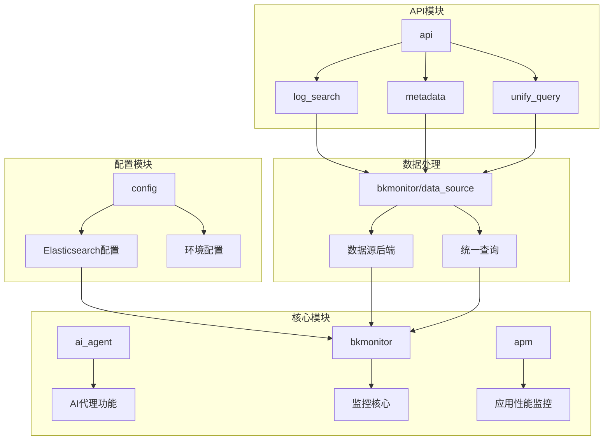
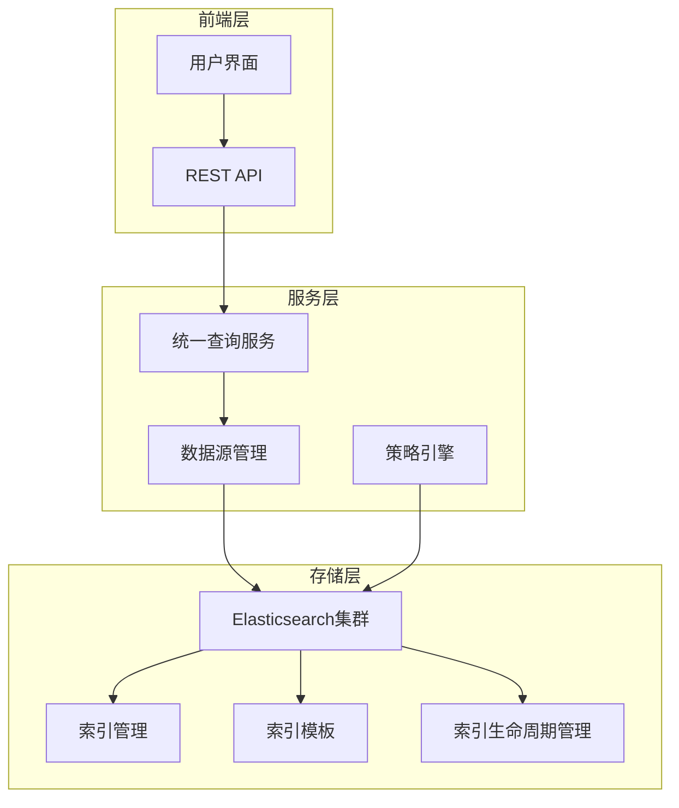
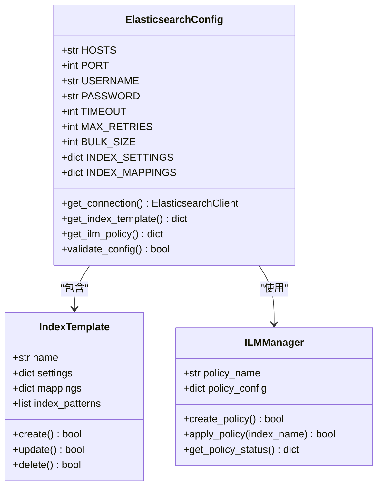
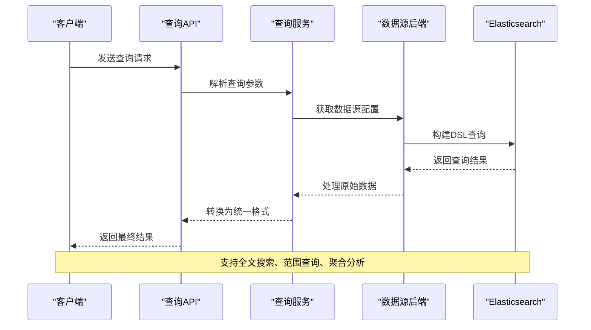
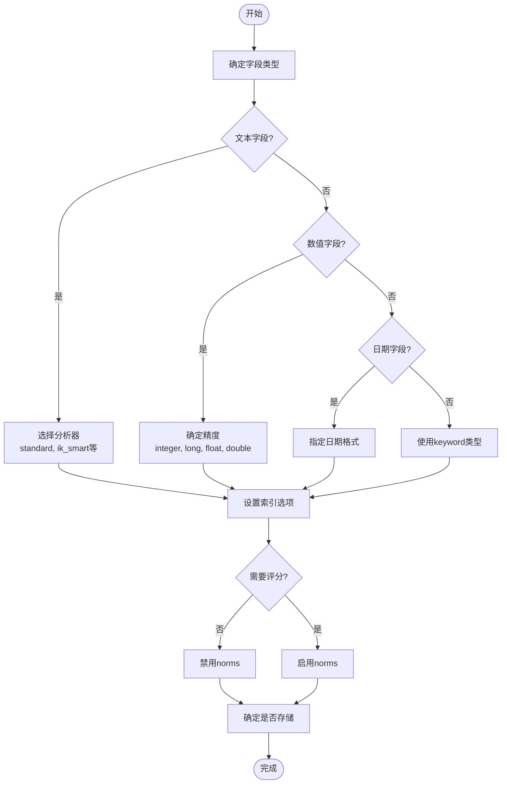
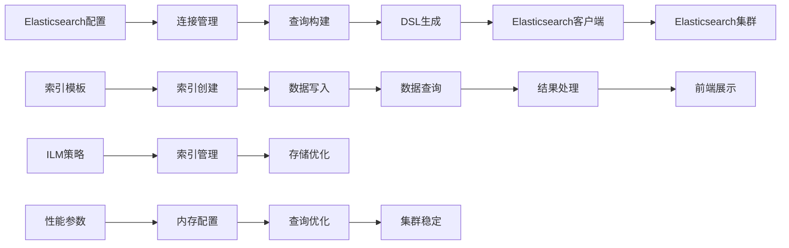

# Elasticsearch存储引擎

<cite>
**本文档引用文件**  
- [elasticsearch.py](file://config/tools/elasticsearch.py)
- [constants.py](file://constants/elasticsearch.py)
- [es_search.py](file://apm/utils/es_search.py)
- [utils.py](file://bkmonitor/utils/elasticsearch/utils.py)
- [default.py](file://api/log_search/default.py)
- [data_source.py](file://bkmonitor/data_source/data_source.py)
- [backends.py](file://bkmonitor/data_source/backends.py)
- [unify_query.py](file://bkmonitor/data_source/unify_query.py)
- [strategy.py](file://bkmonitor/strategy/strategy.py)
- [models.py](file://bkmonitor/models/strategy.py)
- [documents.py](file://bkmonitor/documents/log.py)
- [trace.py](file://bkmonitor/trace/elastic.py)
- [config.py](file://config/config.py)
- [prod.py](file://config/prod.py)
- [dev.py](file://config/dev.py)
</cite>

## 目录
1. [引言](#引言)
2. [项目结构](#项目结构)
3. [核心组件](#核心组件)
4. [架构概述](#架构概述)
5. [详细组件分析](#详细组件分析)
6. [依赖分析](#依赖分析)
7. [性能考虑](#性能考虑)
8. [故障排除指南](#故障排除指南)
9. [结论](#结论)

## 引言
本文档深入解析Elasticsearch作为日志和事件数据存储引擎的实现机制。涵盖ES集群管理、索引模板配置、数据映射设计等内容，说明其在全文搜索和复杂查询场景下的优势。提供ES存储配置参数详解，包括分片策略、副本配置、索引生命周期管理(ILM)，并为开发者提供性能优化建议。

## 项目结构
项目采用模块化设计，以功能为单位组织代码结构。Elasticsearch相关功能分布在多个模块中，主要包括配置管理、日志搜索、数据源处理、策略管理等。

**图表来源**
- [config/tools/elasticsearch.py](file://config/tools/elasticsearch.py)
- [api/log_search/default.py](file://api/log_search/default.py)
- [bkmonitor/data_source/data_source.py](file://bkmonitor/data_source/data_source.py)

**本节来源**
- [config/tools/elasticsearch.py](file://config/tools/elasticsearch.py)
- [api/log_search/default.py](file://api/log_search/default.py)

## 核心组件
Elasticsearch存储引擎的核心组件包括：配置管理、查询接口、数据映射、索引管理、查询优化等。这些组件协同工作，实现高效的数据存储与检索。

**本节来源**
- [config/tools/elasticsearch.py](file://config/tools/elasticsearch.py)
- [constants/elasticsearch.py](file://constants/elasticsearch.py)
- [apm/utils/es_search.py](file://apm/utils/es_search.py)

## 架构概述
系统采用分层架构，Elasticsearch作为底层数据存储引擎，上层通过统一查询接口进行数据访问。架构设计考虑了可扩展性、性能和稳定性。

**图表来源**
- [api/unify_query/default.py](file://api/unify_query/default.py)
- [bkmonitor/data_source/unify_query.py](file://bkmonitor/data_source/unify_query.py)
- [config/tools/elasticsearch.py](file://config/tools/elasticsearch.py)

## 详细组件分析

### 配置管理分析
Elasticsearch配置管理组件负责集群连接参数、索引策略、性能调优等配置的管理。

**图表来源**
- [config/tools/elasticsearch.py](file://config/tools/elasticsearch.py)
- [constants/elasticsearch.py](file://constants/elasticsearch.py)

**本节来源**
- [config/tools/elasticsearch.py](file://config/tools/elasticsearch.py)
- [constants/elasticsearch.py](file://constants/elasticsearch.py)

### 查询服务分析
查询服务组件提供统一的查询接口，支持复杂查询条件和聚合分析。

**图表来源**
- [api/log_search/default.py](file://api/log_search/default.py)
- [bkmonitor/data_source/backends.py](file://bkmonitor/data_source/backends.py)
- [apm/utils/es_search.py](file://apm/utils/es_search.py)

**本节来源**
- [api/log_search/default.py](file://api/log_search/default.py)
- [bkmonitor/data_source/backends.py](file://bkmonitor/data_source/backends.py)

### 数据映射分析
数据映射设计是Elasticsearch性能优化的关键，合理的字段类型选择和分析器配置能显著提升查询效率。

**图表来源**
- [constants/elasticsearch.py](file://constants/elasticsearch.py)
- [bkmonitor/documents/log.py](file://bkmonitor/documents/log.py)

**本节来源**
- [constants/elasticsearch.py](file://constants/elasticsearch.py)
- [bkmonitor/documents/log.py](file://bkmonitor/documents/log.py)

## 依赖分析
Elasticsearch存储引擎依赖多个组件和外部服务，形成复杂的依赖关系网络。

**图表来源**
- [config/tools/elasticsearch.py](file://config/tools/elasticsearch.py)
- [apm/utils/es_search.py](file://apm/utils/es_search.py)
- [bkmonitor/utils/elasticsearch/utils.py](file://bkmonitor/utils/elasticsearch/utils.py)

**本节来源**
- [config/tools/elasticsearch.py](file://config/tools/elasticsearch.py)
- [apm/utils/es_search.py](file://apm/utils/es_search.py)

## 性能考虑
Elasticsearch性能优化涉及多个方面，包括硬件资源配置、索引设计、查询优化等。

### 分片策略
合理的分片策略是性能优化的基础。分片过少会导致单个分片过大，影响查询性能；分片过多会增加集群管理开销。

- **分片大小**：建议每个分片大小在10-50GB之间
- **分片数量**：根据数据量和查询负载确定，通常每节点不超过20个分片
- **主分片**：创建索引时确定，后续不可更改
- **副本分片**：可动态调整，提高可用性和查询吞吐量

### 内存配置
JVM堆内存配置对Elasticsearch性能有重要影响。

- **堆内存大小**：建议不超过32GB，通常为物理内存的50%
- **文件系统缓存**：剩余内存用于操作系统缓存，提高I/O性能
- **GC优化**：使用G1垃圾收集器，减少停顿时间

### 查询优化
- **避免通配符查询**：尽量使用精确匹配或前缀查询
- **合理使用聚合**：限制聚合桶数量，使用采样技术
- **分页优化**：深分页使用search_after替代from/size
- **缓存利用**：充分利用查询缓存和请求缓存

**本节来源**
- [config/tools/elasticsearch.py](file://config/tools/elasticsearch.py)
- [constants/elasticsearch.py](file://constants/elasticsearch.py)
- [config/prod.py](file://config/prod.py)

## 故障排除指南
### 常见问题及解决方案

1. **集群健康状态异常**
   - 检查节点连接状态
   - 查看磁盘使用率
   - 检查分片分配情况

2. **查询性能下降**
   - 分析慢查询日志
   - 检查索引分片分布
   - 评估查询复杂度

3. **索引创建失败**
   - 验证索引模板语法
   - 检查磁盘空间
   - 确认权限配置

4. **数据写入延迟**
   - 检查批量写入配置
   - 评估集群负载
   - 优化刷新间隔

**本节来源**
- [bkmonitor/trace/elastic.py](file://bkmonitor/trace/elastic.py)
- [apm/utils/es_search.py](file://apm/utils/es_search.py)
- [config/tools/elasticsearch.py](file://config/tools/elasticsearch.py)

## 结论
Elasticsearch作为日志和事件数据存储引擎，在全文搜索和复杂查询场景下表现出显著优势。通过合理的索引设计、分片策略和性能调优，能够满足大规模数据存储和实时查询的需求。系统实现了配置管理、查询服务、数据映射等核心功能的模块化设计，具有良好的可维护性和扩展性。建议持续关注集群性能指标，定期优化索引策略，确保系统的稳定高效运行。