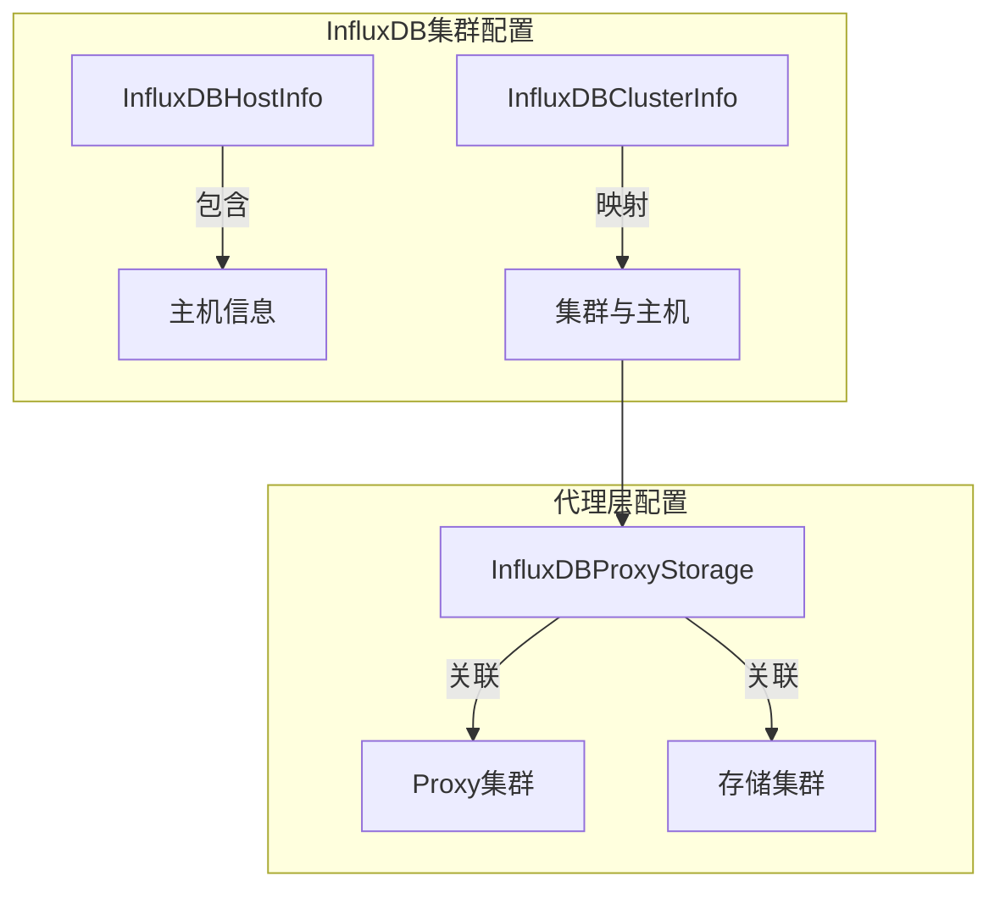
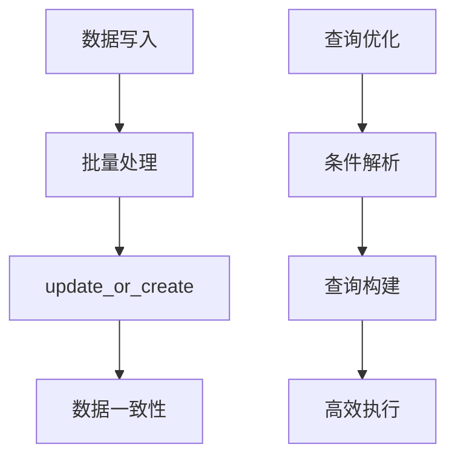
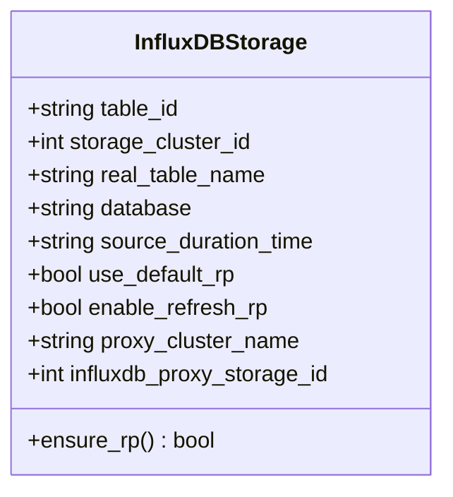
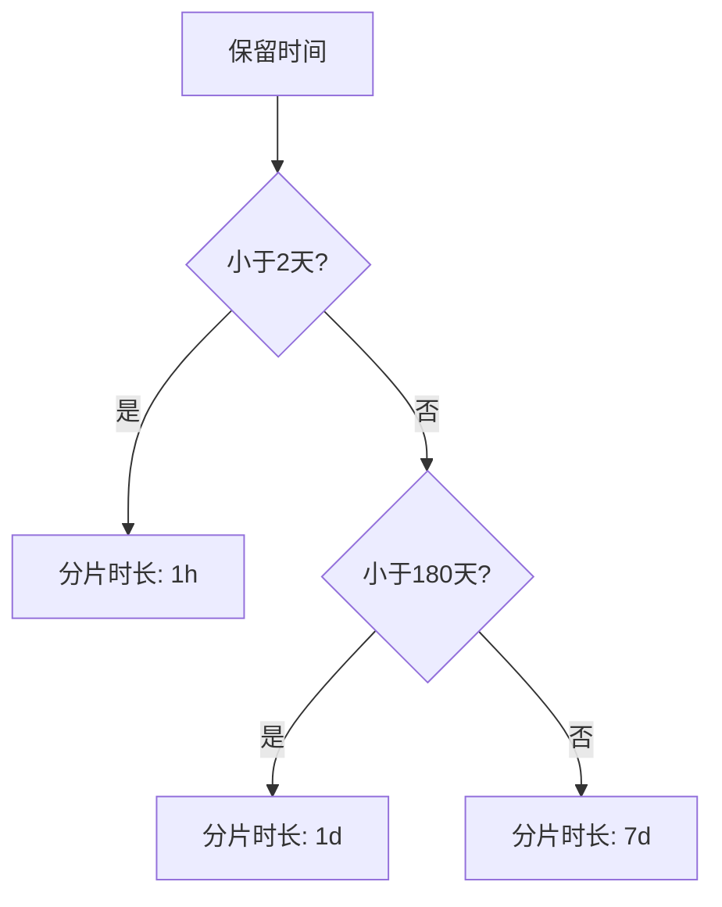
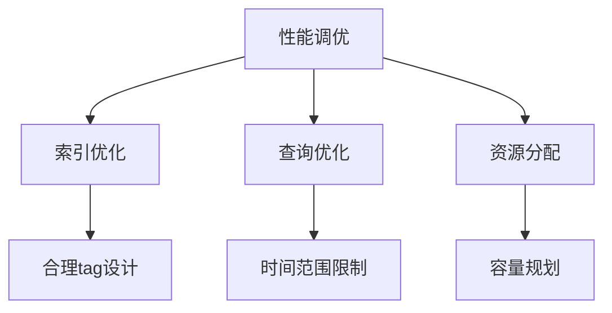

# InfluxDB存储引擎

<cite>
**本文档引用的文件**   
- [test_influxdb_storage.py](file://bkmonitor\metadata\tests\influxdb_cluster\test_influxdb_storage.py)
- [storage.py](file://bkmonitor\metadata\models\storage.py)
- [influxdb_cluster.py](file://bkmonitor\metadata\models\influxdb_cluster.py)
- [test_influxdb_host_info.py](file://bkmonitor\metadata\tests\influxdb_cluster\test_influxdb_host_info.py)
- [metadata_create_result_table.md](file://bkmonitor\support-files\apigw\docs\zh\metadata_create_result_table.md)
- [init_influxdb_proxy_storage.py](file://bkmonitor\metadata\management\commands\init_influxdb_proxy_storage.py)
- [sync_cluster_config.py](file://bkmonitor\metadata\management\commands\sync_cluster_config.py)
- [influxdb_instance.py](file://bkmonitor\metadata\service\influxdb_instance.py)
- [influxdb_checker.py](file://bkmonitor\scripts\influxdb_checker.py)
- [new_strategy.py](file://bkmonitor\bkmonitor\strategy\new_strategy.py)
- [test_models.py](file://bkmonitor\metadata\tests\test_models.py)
</cite>

## 目录
1. [引言](#引言)
2. [InfluxDB集群配置与代理层工作原理](#influxdb集群配置与代理层工作原理)
3. [数据写入与查询优化策略](#数据写入与查询优化策略)
4. [InfluxDB存储配置参数详解](#influxdb存储配置参数详解)
5. [InfluxDB性能调优最佳实践](#influxdb性能调优最佳实践)
6. [结论](#结论)

## 引言
本文档详细解析了InfluxDB作为时序数据存储引擎的实现机制，重点涵盖InfluxDB集群配置、代理层工作原理、数据写入与查询优化策略。文档说明了InfluxDB在监控系统中的适用场景和性能特点，提供了InfluxDB存储配置参数的详细说明，包括保留策略、分片策略和压缩配置。最后，为开发者提供了InfluxDB性能调优的最佳实践，包括索引优化、查询优化和资源分配建议。

## InfluxDB集群配置与代理层工作原理

InfluxDB集群配置通过`InfluxDBHostInfo`和`InfluxDBClusterInfo`模型进行管理。`InfluxDBHostInfo`模型定义了InfluxDB主机的详细信息，包括主机名、域名、端口、用户名、密码等。`InfluxDBClusterInfo`模型则定义了集群与主机的映射关系，通过`cluster_name`和`host_name`字段将集群与具体的主机关联起来。

代理层通过`InfluxDBProxyStorage`模型实现，该模型定义了InfluxDB Proxy集群与实际存储集群的关系。`proxy_cluster_id`字段标识Proxy集群，`instance_cluster_name`字段标识实际的存储集群，`service_name`字段标识服务名称。这种设计实现了逻辑集群与物理集群的解耦，允许通过代理层进行负载均衡和故障转移。

**图示来源**
- [influxdb_cluster.py](file://bkmonitor\metadata\models\influxdb_cluster.py#L486-L528)
- [influxdb_cluster.py](file://bkmonitor\metadata\models\influxdb_cluster.py#L87-L123)
- [influxdb_cluster.py](file://bkmonitor\metadata\models\influxdb_cluster.py#L801-L831)

**本节来源**
- [influxdb_cluster.py](file://bkmonitor\metadata\models\influxdb_cluster.py#L486-L528)
- [influxdb_cluster.py](file://bkmonitor\metadata\models\influxdb_cluster.py#L87-L123)
- [influxdb_cluster.py](file://bkmonitor\metadata\models\influxdb_cluster.py#L801-L831)

## 数据写入与查询优化策略

InfluxDB的数据写入优化策略主要体现在批量写入和合理的数据模型设计上。系统通过`init_metrics_and_refresh_router.py`命令实现指标的批量写入，采用`update_or_create`方法确保数据的一致性。查询优化策略则体现在查询语句的构建和执行上，系统通过`new_strategy.py`中的查询构建逻辑，将复杂的查询条件转换为高效的InfluxDB查询语句。

**图示来源**
- [init_metrics_and_refresh_router.py](file://bkmonitor\metadata\management\commands\init_metrics_and_refresh_router.py#L27-L45)
- [new_strategy.py](file://bkmonitor\bkmonitor\strategy\new_strategy.py#L1580-L1609)

**本节来源**
- [init_metrics_and_refresh_router.py](file://bkmonitor\metadata\management\commands\init_metrics_and_refresh_router.py#L27-L45)
- [new_strategy.py](file://bkmonitor\bkmonitor\strategy\new_strategy.py#L1580-L1609)

## InfluxDB存储配置参数详解

### 保留策略
InfluxDB的保留策略通过`source_duration_time`参数配置，该参数定义了数据的保存时间。系统通过`ensure_rp`方法确保数据库存在正确的保留策略。当`use_default_rp`为False且`enable_refresh_rp`为True时，系统会检查并更新保留策略。

**图示来源**
- [storage.py](file://bkmonitor\metadata\models\storage.py#L1249-L1281)
- [test_influxdb_storage.py](file://bkmonitor\metadata\tests\influxdb_cluster\test_influxdb_storage.py#L61-L96)

### 分片策略
分片策略通过`judge_shard`静态方法根据数据保留时间自动判断。当保留时间小于2天时，分片时长为1小时；当保留时间在2天到180天之间时，分片时长为1天；当保留时间大于180天时，分片时长为7天。

**图示来源**
- [influxdb_cluster.py](file://bkmonitor\metadata\models\influxdb_cluster.py#L773-L803)
- [test_influxdb_host_info.py](file://bkmonitor\metadata\tests\influxdb_cluster\test_influxdb_host_info.py#L31-L68)

### 压缩配置
InfluxDB的压缩配置主要通过`backup_rate_limit`和`read_rate_limit`参数控制。`backup_rate_limit`参数定义了备份恢复的速率限制，`read_rate_limit`参数定义了读取速率限制。这些参数有助于在高负载情况下保护InfluxDB实例的稳定性。

**本节来源**
- [influxdb_cluster.py](file://bkmonitor\metadata\models\influxdb_cluster.py#L486-L528)
- [metadata_create_result_table.md](file://bkmonitor\support-files\apigw\docs\zh\metadata_create_result_table.md#L28-L54)

## InfluxDB性能调优最佳实践

### 索引优化
InfluxDB的索引优化主要通过合理的tag设计实现。系统通过`InfluxDBTagPartitioning`模型实现tag分区，将不同的tag值映射到不同的集群，从而实现数据的水平扩展和查询性能的提升。

### 查询优化
查询优化的最佳实践包括使用合适的聚合函数、限制查询时间范围、避免全表扫描等。系统通过`new_strategy.py`中的查询构建逻辑，自动添加时间范围条件，避免不必要的数据扫描。

### 资源分配建议
资源分配建议包括合理配置InfluxDB实例的CPU、内存和磁盘资源，根据数据量和查询负载进行容量规划。系统通过`influxdb_checker.py`脚本监控InfluxDB实例的性能指标，包括请求速率、错误率和系统资源使用情况。

**图示来源**
- [influxdb_cluster.py](file://bkmonitor\metadata\models\influxdb_cluster.py#L87-L123)
- [new_strategy.py](file://bkmonitor\bkmonitor\strategy\new_strategy.py#L1580-L1609)
- [influxdb_checker.py](file://bkmonitor\scripts\influxdb_checker.py#L38-L76)

**本节来源**
- [influxdb_cluster.py](file://bkmonitor\metadata\models\influxdb_cluster.py#L87-L123)
- [new_strategy.py](file://bkmonitor\bkmonitor\strategy\new_strategy.py#L1580-L1609)
- [influxdb_checker.py](file://bkmonitor\scripts\influxdb_checker.py#L38-L76)

## 结论
InfluxDB作为时序数据存储引擎，在监控系统中表现出色。通过合理的集群配置、代理层设计、存储参数配置和性能调优，可以充分发挥InfluxDB的优势，满足大规模时序数据存储和查询的需求。本文档提供的配置参数详解和性能调优最佳实践，为开发者提供了实用的指导，有助于构建高效、稳定的监控系统。