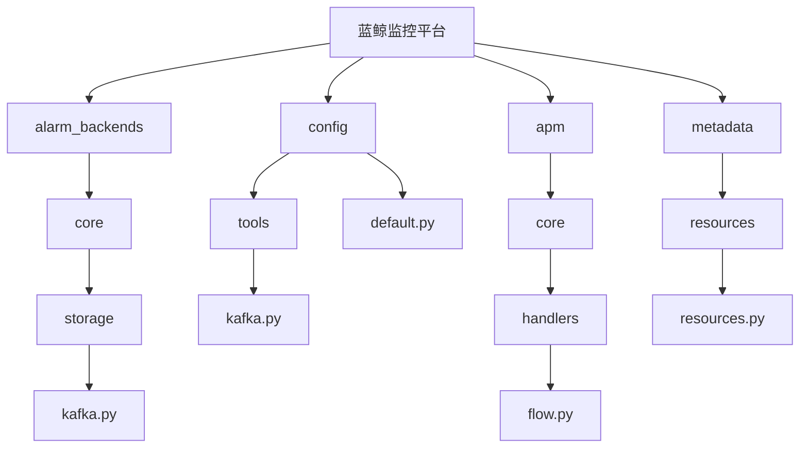
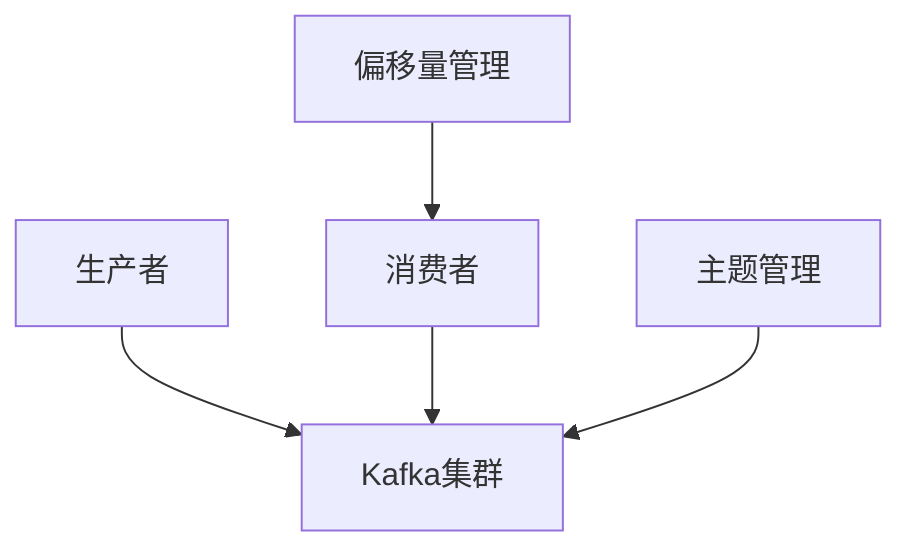
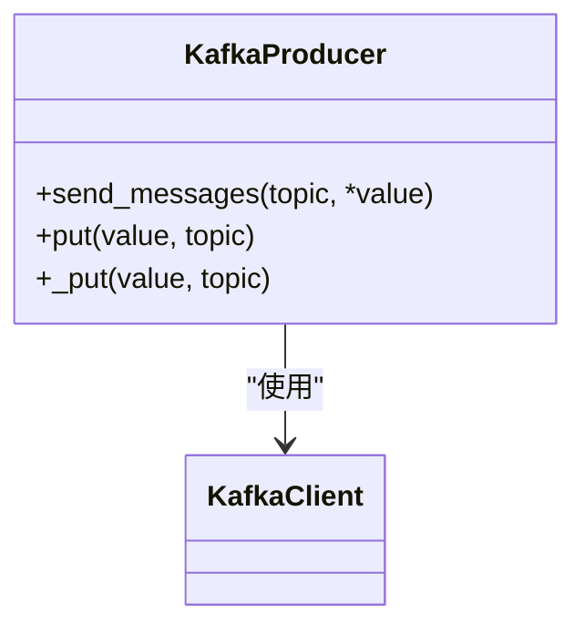
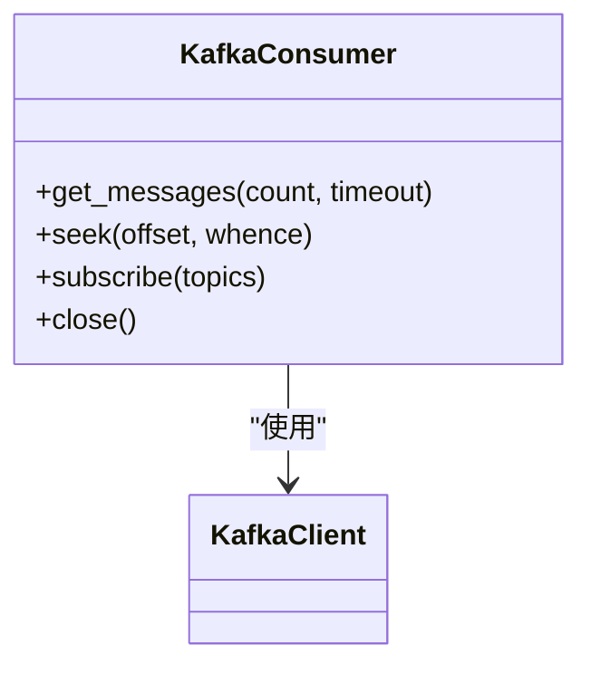
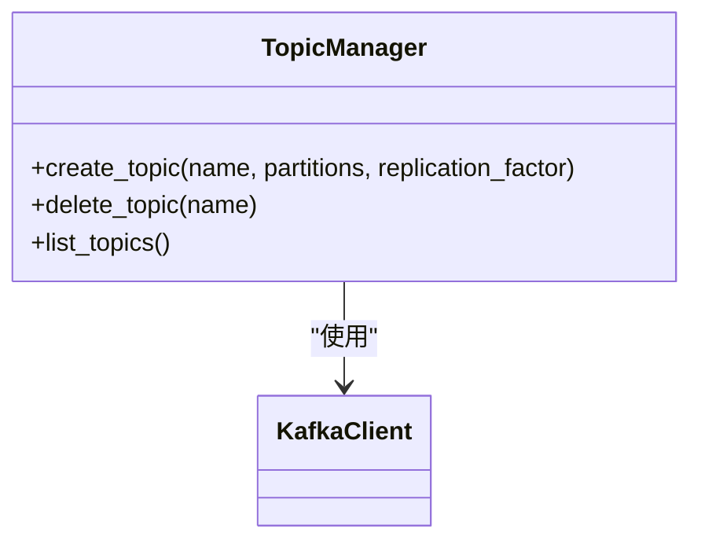
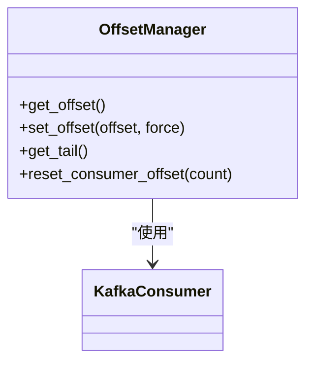
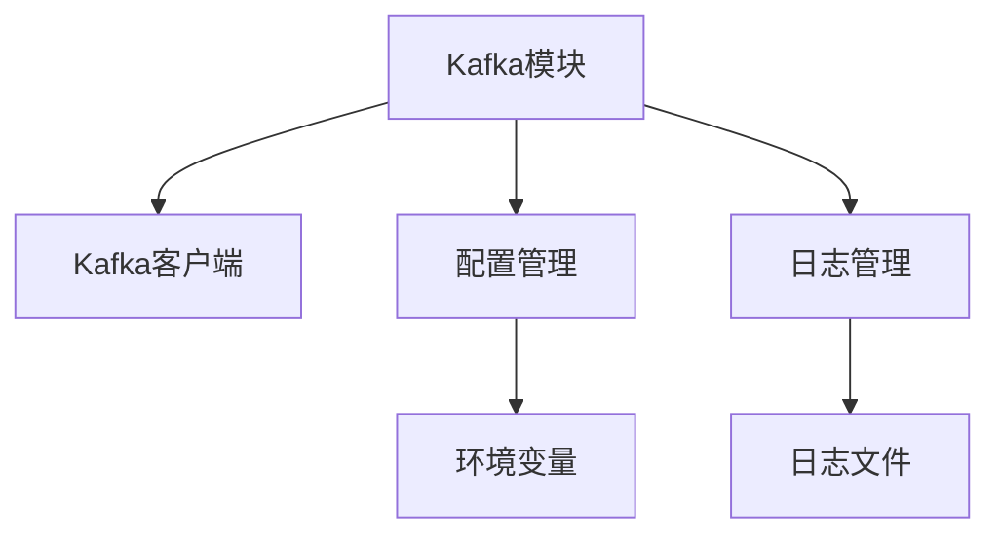

# Kafka存储引擎

<cite>
**本文档引用的文件**   
- [kafka.py](file://bkmonitor\alarm_backends\core\storage\kafka.py)
- [kafka.py](file://bkmonitor\config\tools\kafka.py)
- [default.py](file://bkmonitor\config\default.py)
- [flow.py](file://bkmonitor\apm\core\handlers\bk_data\flow.py)
- [client.py](file://bkmonitor\alarm_backends\service\fta_action\message_queue\client.py)
- [resources.py](file://bkmonitor\metadata\resources\resources.py)
- [processor.py](file://bkmonitor\alarm_backends\service\access\data\processor.py)
- [storage.py](file://bkmonitor\metadata\models\storage.py)
</cite>

## 目录
1. [引言](#引言)
2. [项目结构](#项目结构)
3. [核心组件](#核心组件)
4. [架构概述](#架构概述)
5. [详细组件分析](#详细组件分析)
6. [依赖分析](#依赖分析)
7. [性能考虑](#性能考虑)
8. [故障排除指南](#故障排除指南)
9. [结论](#结论)

## 引言
本文档详细解析了Kafka作为消息队列和流式数据存储引擎在蓝鲸监控平台中的实现机制。文档涵盖了Kafka主题配置、分区策略、消费者组管理等方面的内容，说明了Kafka在实时数据处理和系统解耦方面的优势。同时提供了Kafka存储配置参数的详解，包括消息保留策略、副本因子、压缩配置等，并为开发者提供了Kafka性能优化建议。

## 项目结构
蓝鲸监控平台的项目结构中，Kafka相关的实现主要分布在`alarm_backends/core/storage/`目录下，其中`kafka.py`文件包含了Kafka生产者和消费者的核心实现。此外，配置相关的代码位于`config/tools/kafka.py`，而Kafka的超时设置等参数则定义在`config/default.py`文件中。

**图示来源**
- [kafka.py](file://bkmonitor\alarm_backends\core\storage\kafka.py)
- [kafka.py](file://bkmonitor\config\tools\kafka.py)
- [default.py](file://bkmonitor\config\default.py)
- [flow.py](file://bkmonitor\apm\core\handlers\bk_data\flow.py)
- [resources.py](file://bkmonitor\metadata\resources\resources.py)

## 核心组件
Kafka在蓝鲸监控平台中的核心组件主要包括生产者、消费者、主题管理和偏移量管理。这些组件共同协作，实现了高效的消息传递和数据存储功能。

**组件来源**
- [kafka.py](file://bkmonitor\alarm_backends\core\storage\kafka.py)

## 架构概述
Kafka在蓝鲸监控平台中的架构主要包括以下几个部分：生产者负责将数据发送到Kafka集群，消费者从Kafka集群中读取数据，主题管理负责创建和管理Kafka主题，偏移量管理负责跟踪消费者的消费进度。

**图示来源**
- [kafka.py](file://bkmonitor\alarm_backends\core\storage\kafka.py)

## 详细组件分析

### 生产者分析
生产者负责将数据发送到Kafka集群。在蓝鲸监控平台中，生产者的实现位于`alarm_backends/core/storage/kafka.py`文件中。

**图示来源**
- [kafka.py](file://bkmonitor\alarm_backends\core\storage\kafka.py#L126-L157)

### 消费者分析
消费者负责从Kafka集群中读取数据。在蓝鲸监控平台中，消费者的实现位于`alarm_backends/core/storage/kafka.py`文件中。

**图示来源**
- [kafka.py](file://bkmonitor\alarm_backends\core\storage\kafka.py#L64-L95)

### 主题管理分析
主题管理负责创建和管理Kafka主题。在蓝鲸监控平台中，主题管理的实现位于`apm/core/handlers/bk_data/flow.py`文件中。

**图示来源**
- [flow.py](file://bkmonitor\apm\core\handlers\bk_data\flow.py#L220-L242)

### 偏移量管理分析
偏移量管理负责跟踪消费者的消费进度。在蓝鲸监控平台中，偏移量管理的实现位于`alarm_backends/core/storage/kafka.py`文件中。

**图示来源**
- [kafka.py](file://bkmonitor\alarm_backends\core\storage\kafka.py#L94-L127)

## 依赖分析
Kafka在蓝鲸监控平台中的依赖主要包括Kafka客户端库、配置管理模块和日志管理模块。这些依赖共同支持了Kafka的正常运行。

**图示来源**
- [kafka.py](file://bkmonitor\alarm_backends\core\storage\kafka.py)
- [kafka.py](file://bkmonitor\config\tools\kafka.py)
- [default.py](file://bkmonitor\config\default.py)

## 性能考虑
为了优化Kafka的性能，蓝鲸监控平台采取了以下措施：
- **批量发送**：通过批量发送消息减少网络开销。
- **连接池**：使用连接池管理Kafka连接，减少连接建立的开销。
- **超时设置**：合理设置超时时间，避免长时间等待。

**性能参数来源**
- [default.py](file://bkmonitor\config\default.py#L1450-L1460)

## 故障排除指南
在使用Kafka时，可能会遇到以下常见问题：
- **连接失败**：检查Kafka集群地址和端口是否正确。
- **消息丢失**：确保生产者和消费者的配置正确，特别是`auto.commit`设置。
- **性能瓶颈**：检查网络带宽和Kafka集群的负载情况。

**故障排除来源**
- [kafka.py](file://bkmonitor\alarm_backends\core\storage\kafka.py)
- [client.py](file://bkmonitor\alarm_backends\service\fta_action\message_queue\client.py)

## 结论
Kafka在蓝鲸监控平台中扮演着重要的角色，通过高效的生产者-消费者模型，实现了实时数据处理和系统解耦。通过合理的配置和优化，可以充分发挥Kafka的性能优势，满足大规模数据处理的需求。