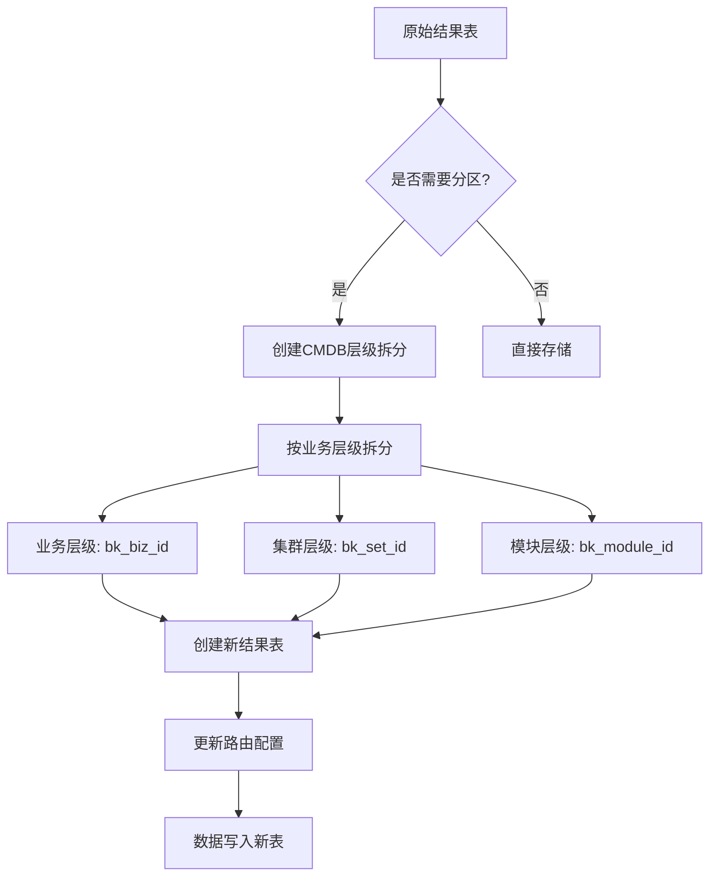
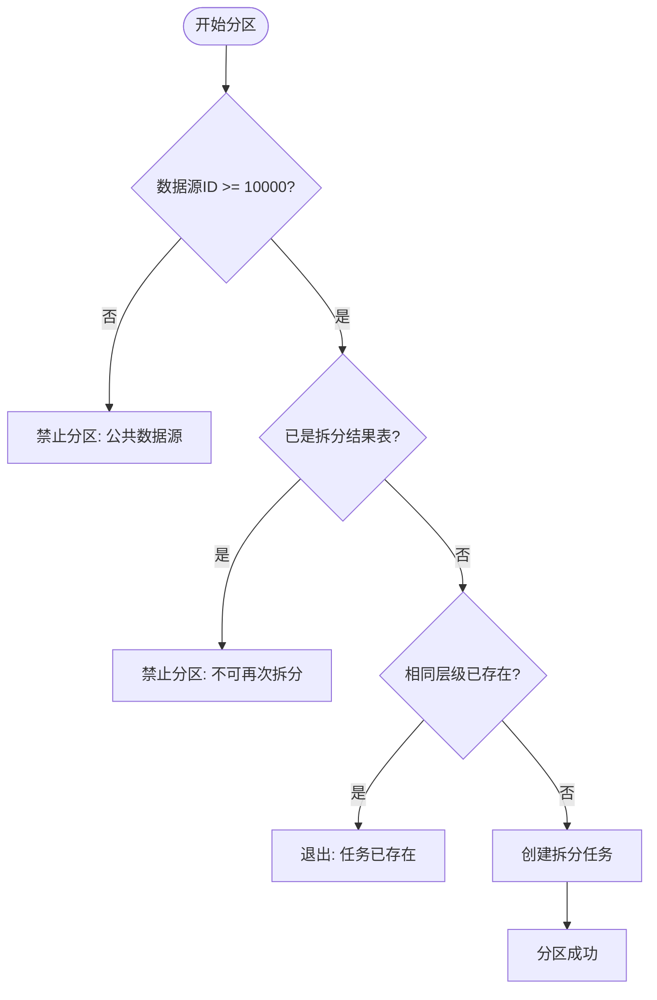
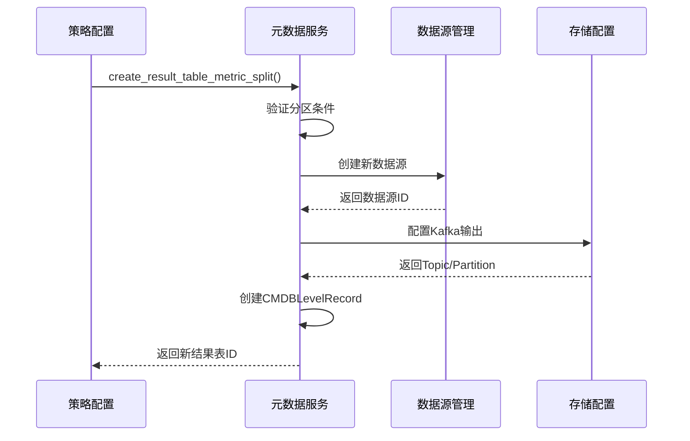

# 数据分区策略

<cite>
**本文档引用的文件**   
- [bkmonitor\constants\strategy.py](file://bkmonitor\constants\strategy.py)
- [bkmonitor\metadata\models\result_table.py](file://bkmonitor\metadata\models\result_table.py)
- [bkmonitor\bkmonitor\strategy\strategy.py](file://bkmonitor\bkmonitor\strategy\strategy.py)
- [bkmonitor\metadata\management\commands\access_bkdata_prom_compute_datasource.py](file://bkmonitor\metadata\management\commands\access_bkdata_prom_compute_datasource.py)
</cite>

## 目录
1. [引言](#引言)
2. [核心分区策略](#核心分区策略)
3. [分区键选择与维度](#分区键选择与维度)
4. [分区实现机制](#分区实现机制)
5. [分区管理与自动化](#分区管理与自动化)
6. [性能影响与优化建议](#性能影响与优化建议)
7. [最佳实践与迁移方案](#最佳实践与迁移方案)

## 引言
本系统采用基于业务维度的动态数据分区策略，通过CMDB层级拆分实现数据的高效组织与查询。分区策略主要围绕业务拓扑结构展开，旨在提升大规模监控数据的存储效率和查询性能。系统通过元数据管理模块实现分区的创建、维护和查询优化，支持灵活的业务场景需求。

## 核心分区策略

### 基于CMDB层级的业务维度分区
系统主要采用基于CMDB（配置管理数据库）层级的业务维度分区策略，将监控数据按照业务拓扑结构进行拆分。这种策略特别适用于具有复杂业务架构的监控场景，能够有效组织海量监控数据。



**图示来源**
- [bkmonitor\metadata\models\result_table.py](file://bkmonitor\metadata\models\result_table.py#L1500-L1700)

**本节来源**
- [bkmonitor\metadata\models\result_table.py](file://bkmonitor\metadata\models\result_table.py#L1500-L1700)

### 分区策略的触发条件
分区操作需要满足特定条件才能执行，确保数据一致性和系统稳定性。主要条件包括：
- 数据源ID必须大于或等于10000（排除公共数据源）
- 目标结果表不能是已拆分结果表的子表
- 相同层级的拆分任务不能重复创建



**图示来源**
- [bkmonitor\metadata\models\result_table.py](file://bkmonitor\metadata\models\result_table.py#L1500-L1700)

**本节来源**
- [bkmonitor\metadata\models\result_table.py](file://bkmonitor\metadata\models\result_table.py#L1500-L1700)

## 分区键选择与维度

### 分区维度定义
系统定义了标准的分区维度，这些维度与CMDB拓扑结构紧密关联，确保分区的业务意义和查询效率。

```python
# 分区维度定义
SPLIT_DIMENSIONS = ["bk_obj_id", "bk_inst_id"]
```

其中：
- `bk_obj_id`: CMDB对象类型ID，表示拓扑层级类型
- `bk_inst_id`: CMDB实例ID，表示具体的拓扑实例

**本节来源**
- [bkmonitor\constants\strategy.py](file://bkmonitor\constants\strategy.py#L212)

### CMDB层级映射
系统通过层级映射将业务概念转换为具体的数据库字段，实现灵活的分区配置。

```python
# CMDB层级映射
SPLIT_CMDB_LEVEL_MAP = {
    "biz": "bk_biz_id", 
    "set": "bk_set_id", 
    "module": "bk_module_id"
}
```

该映射支持以下层级：
- **业务层级 (biz)**: 对应 `bk_biz_id` 字段
- **集群层级 (set)**: 对应 `bk_set_id` 字段  
- **模块层级 (module)**: 对应 `bk_module_id` 字段

**本节来源**
- [bkmonitor\constants\strategy.py](file://bkmonitor\constants\strategy.py#L215-L218)

### 不可分区维度
系统明确标识了不可用于分区的维度，避免不当的分区操作影响数据完整性。

```python
# 不可分区维度列表
NOT_SPLIT_DIMENSIONS = ["bk_target_ip", "bk_target_service_instance_id"]
```

这些维度通常用于精确的目标定位，不适合进行数据拆分。

**本节来源**
- [bkmonitor\constants\strategy.py](file://bkmonitor\constants\strategy.py#L214)

## 分区实现机制

### 分区创建流程
分区创建是一个原子性操作，涉及多个组件的协同工作，确保数据一致性。



**图示来源**
- [bkmonitor\bkmonitor\strategy\strategy.py](file://bkmonitor\bkmonitor\strategy\strategy.py#L508-L538)
- [bkmonitor\metadata\models\result_table.py](file://bkmonitor\metadata\models\result_table.py#L1500-L1700)

**本节来源**
- [bkmonitor\bkmonitor\strategy\strategy.py](file://bkmonitor\bkmonitor\strategy\strategy.py#L508-L538)

### Kafka分区配置
对于需要流式处理的数据，系统支持Kafka分区配置，优化数据并行处理能力。

```python
# Kafka分区配置参数
parser.add_argument("--partition", type=int, required=False, default=1, help="接入时指定partition数量")
```

分区数量配置要点：
- 默认分区数为1
- 必须大于0
- 可根据数据量和消费能力调整

**本节来源**
- [bkmonitor\metadata\management\commands\access_bkdata_prom_compute_datasource.py](file://bkmonitor\metadata\management\commands\access_bkdata_prom_compute_datasource.py#L24-L51)

## 分区管理与自动化

### 分区记录管理
系统通过`CMDBLevelRecord`模型管理所有分区记录，确保分区配置的可追溯性和一致性。

```python
class CMDBLevelRecord(models.Model):
    """
    记录结果表拆解CMDB层级的关系记录
    """
    source_table_id = models.CharField(verbose_name="来源结果表", max_length=128)
    target_table_id = models.CharField(verbose_name="落地结果表", max_length=128)
    bk_data_id = models.IntegerField(verbose_name="数据源配置ID")
    cmdb_level = models.CharField(verbose_name="拆解CMDB的层级名", max_length=255)
    bk_tenant_id = models.CharField("租户ID", max_length=256, null=True, default="system")
    is_disable = models.BooleanField(verbose_name="记录是否已经废弃", default=False)
```

关键字段说明：
- `source_table_id`: 原始结果表ID
- `target_table_id`: 分区后结果表ID
- `cmdb_level`: 分区层级名称
- `is_disable`: 记录是否已废弃

**本节来源**
- [bkmonitor\metadata\models\result_table.py](file://bkmonitor\metadata\models\result_table.py#L2600-L2800)

### 分区清理机制
系统提供分区清理功能，可以安全地移除不再需要的分区配置。

```python
def clean_metric_split(self, cmdb_level, operator):
    """
    清理一个CMDB_LEVEL拆分配置记录
    :param cmdb_level: cmdb层级记录名
    :param operator: 操作者
    :return: True | False
    """
    # 1. 判断是否存在该metric的拆分记录
    if not CMDBLevelRecord.objects.filter(
        source_table_id=self.table_id, cmdb_level=cmdb_level, bk_tenant_id=self.bk_tenant_id
    ).exists():
        raise ValueError(_("结果表不存在该字段拆分记录"))

    # 2. 去掉cmdb_level信息
    record = CMDBLevelRecord.objects.get(
        source_table_id=self.table_id, cmdb_level=cmdb_level, bk_tenant_id=self.bk_tenant_id
    )
    record.delete()
    
    # 3. 重新覆盖option的记录
    ResultTableOption.sync_cmdb_level_option(
        table_id=record.target_table_id, operator=operator, bk_tenant_id=self.bk_tenant_id
    )
    return True
```

清理流程：
1. 验证分区记录存在性
2. 删除CMDB层级记录
3. 同步更新结果表选项

**本节来源**
- [bkmonitor\metadata\models\result_table.py](file://bkmonitor\metadata\models\result_table.py#L1700-L1900)

## 性能影响与优化建议

### 查询性能影响
合理的分区策略可以显著提升查询性能，主要体现在：
- **查询范围缩小**: 通过分区键过滤，减少扫描数据量
- **并行处理能力**: 不同分区可并行查询，提高吞吐量
- **索引效率提升**: 分区内的数据更有序，索引效果更好

### 存储效率优化
分区策略对存储效率的影响：
- **冷热数据分离**: 可将不同生命周期的数据存储在不同分区
- **压缩效率**: 同类数据集中存储，提高压缩比
- **备份恢复**: 可按分区进行备份恢复，提高运维效率

### 跨分区查询优化
对于需要跨分区的查询，建议：
- 使用统一的查询接口，由系统自动处理分区路由
- 避免全表扫描，尽量使用分区键作为查询条件
- 合理设置查询时间范围，减少数据扫描量

**本节来源**
- [bkmonitor\metadata\models\result_table.py](file://bkmonitor\metadata\models\result_table.py#L1500-L1700)

## 最佳实践与迁移方案

### 分区大小规划
建议的分区大小规划原则：
- 单个分区数据量控制在合理范围内（建议10GB-100GB）
- 根据数据增长率预估分区生命周期
- 考虑查询性能和维护成本的平衡

### 分区迁移方案
分区迁移步骤：
1. **准备阶段**: 评估迁移影响，制定迁移计划
2. **创建新分区**: 按照新策略创建目标分区
3. **数据迁移**: 逐步将数据从旧分区迁移到新分区
4. **验证阶段**: 验证数据完整性和查询性能
5. **切换阶段**: 更新应用配置，指向新分区
6. **清理阶段**: 确认无误后清理旧分区

### 自动化管理建议
- 实现分区监控，及时发现异常分区
- 建立分区生命周期管理机制
- 开发自动化分区优化工具
- 定期评估分区策略的有效性

**本节来源**
- [bkmonitor\metadata\models\result_table.py](file://bkmonitor\metadata\models\result_table.py#L1500-L1700)
- [bkmonitor\constants\strategy.py](file://bkmonitor\constants\strategy.py#L212)