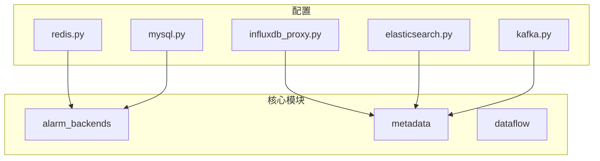
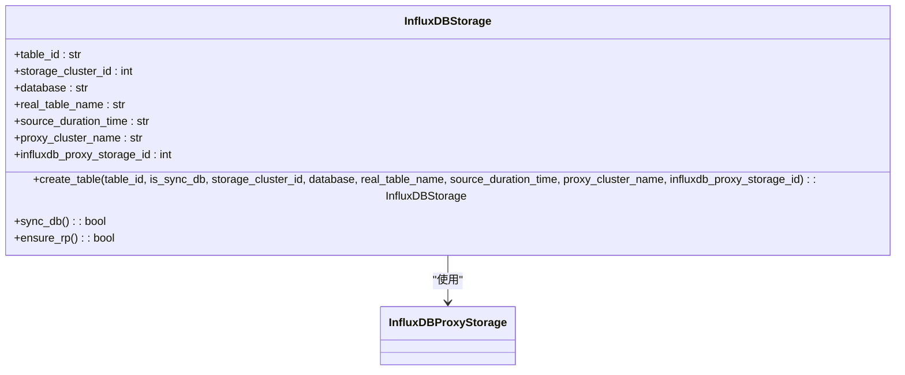
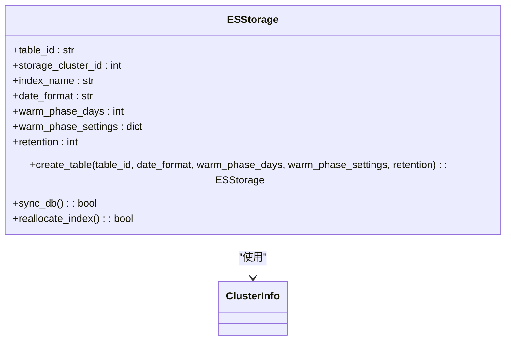
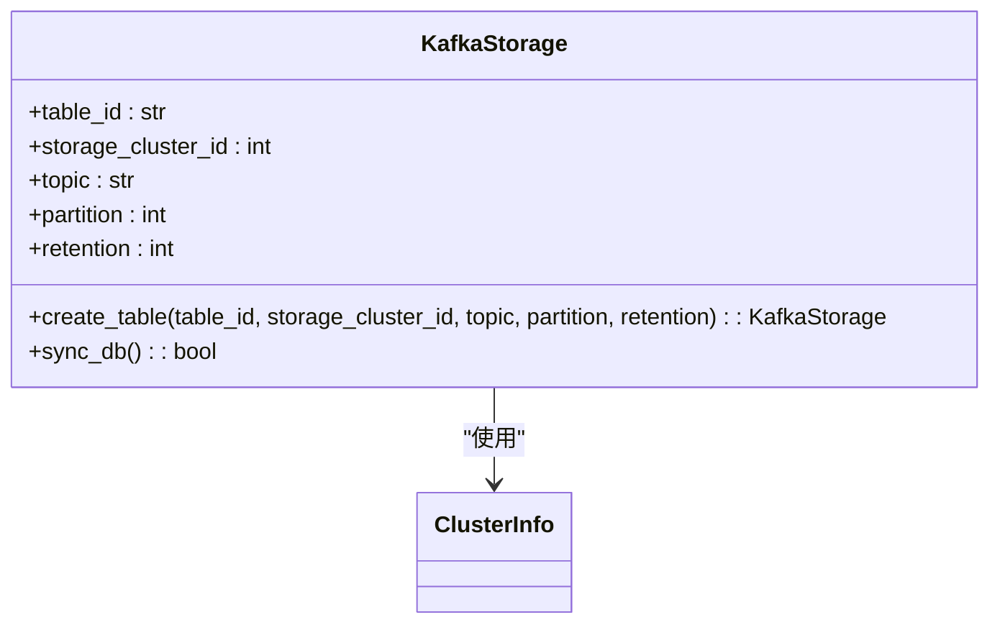
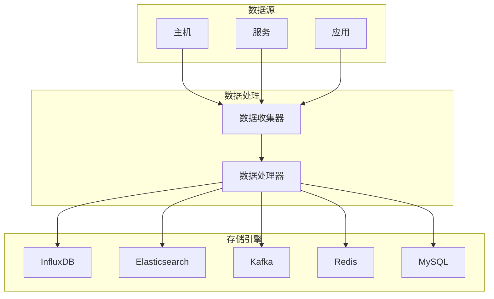
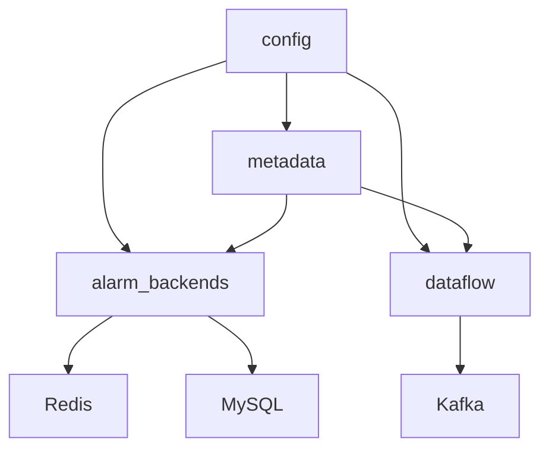

# 数据存储

<cite>
**本文档引用的文件**   
- [influxdb_proxy.py](file://bkmonitor\config\tools\influxdb_proxy.py)
- [elasticsearch.py](file://bkmonitor\config\tools\elasticsearch.py)
- [kafka.py](file://bkmonitor\config\tools\kafka.py)
- [redis.py](file://bkmonitor\config\tools\redis.py)
- [mysql.py](file://bkmonitor\config\tools\mysql.py)
- [influxdb-proxy.yml](file://bkmonitor\support-files\templates\influxdb-proxy#etc#influxdb-proxy.yml)
- [storage.py](file://bkmonitor\metadata\models\storage.py)
- [test_influxdb_storage.py](file://bkmonitor\metadata\tests\influxdb_cluster\test_influxdb_storage.py)
- [test_models.py](file://bkmonitor\metadata\tests\test_models.py)
- [test_es_storage.py](file://bkmonitor\metadata\tests\storage\test_es_storage.py)
- [node\storage.py](file://bkmonitor\bkmonitor\dataflow\node\storage.py)
</cite>

## 目录
1. [引言](#引言)
2. [项目结构](#项目结构)
3. [核心组件](#核心组件)
4. [架构概述](#架构概述)
5. [详细组件分析](#详细组件分析)
6. [依赖分析](#依赖分析)
7. [性能考虑](#性能考虑)
8. [故障排除指南](#故障排除指南)
9. [结论](#结论)

## 引言
本文档深入解析蓝鲸监控平台（BlueKing - Monitor）的数据存储策略，涵盖存储引擎选择、数据分区策略、索引设计、配置参数及其对性能的影响。通过对比分析不同存储方案，帮助用户根据具体场景选择合适的存储方案。同时，文档记录了数据生命周期管理策略，包括数据保留周期、归档和清理机制，并为开发者提供存储性能优化的实用建议。

## 项目结构
蓝鲸监控平台的项目结构清晰，主要模块包括`ai_agent`、`bkmonitor`、`api`、`apm`等。`bkmonitor`模块是核心监控组件，包含`alarm_backends`、`metadata`、`dataflow`等子模块，负责告警处理、元数据管理和数据流处理。`config`目录下的`tools`子目录包含各种存储和缓存的配置文件，如`influxdb_proxy.py`、`elasticsearch.py`、`kafka.py`、`redis.py`和`mysql.py`，这些文件定义了与不同存储系统的连接配置。



**图示来源**
- [influxdb_proxy.py](file://bkmonitor\config\tools\influxdb_proxy.py)
- [elasticsearch.py](file://bkmonitor\config\tools\elasticsearch.py)
- [kafka.py](file://bkmonitor\config\tools\kafka.py)
- [redis.py](file://bkmonitor\config\tools\redis.py)
- [mysql.py](file://bkmonitor\config\tools\mysql.py)
- [storage.py](file://bkmonitor\metadata\models\storage.py)

**本节来源**
- [influxdb_proxy.py](file://bkmonitor\config\tools\influxdb_proxy.py)
- [elasticsearch.py](file://bkmonitor\config\tools\elasticsearch.py)
- [kafka.py](file://bkmonitor\config\tools\kafka.py)
- [redis.py](file://bkmonitor\config\tools\redis.py)
- [mysql.py](file://bkmonitor\config\tools\mysql.py)

## 核心组件
### InfluxDB 存储引擎
InfluxDB 是蓝鲸监控平台中用于存储时间序列数据的主要存储引擎。通过`influxdb_proxy.py`文件中的`get_influxdb_proxy_settings`函数，系统获取InfluxDB代理的主机和端口配置。`influxdb-proxy.yml`配置文件定义了InfluxDB代理的监听地址、端口、Kafka配置、Consul配置等。

```python
def get_influxdb_proxy_settings() -> Tuple[str, int]:
    host = os.environ.get("BK_INFLUXDB_PROXY_HOST", "influxdb-proxy.bkmonitorv3.service.consul")
    port = int(os.environ.get("BK_INFLUXDB_PROXY_PORT", 10202))
    return host, port
```

InfluxDB存储的创建和管理在`metadata\models\storage.py`文件中实现。`InfluxDBStorage`类负责创建和管理InfluxDB存储记录，包括数据库、表名、保留策略等配置。



**图示来源**
- [influxdb_proxy.py](file://bkmonitor\config\tools\influxdb_proxy.py)
- [influxdb-proxy.yml](file://bkmonitor\support-files\templates\influxdb-proxy#etc#influxdb-proxy.yml)
- [storage.py](file://bkmonitor\metadata\models\storage.py)

**本节来源**
- [influxdb_proxy.py](file://bkmonitor\config\tools\influxdb_proxy.py)
- [influxdb-proxy.yml](file://bkmonitor\support-files\templates\influxdb-proxy#etc#influxdb-proxy.yml)
- [storage.py](file://bkmonitor\metadata\models\storage.py)

### Elasticsearch 存储引擎
Elasticsearch 用于存储日志和事件数据。`elasticsearch.py`文件中的`get_es7_settings`函数获取Elasticsearch的连接配置，包括主机、端口、用户名和密码。

```python
def get_es7_settings(fta=True) -> Tuple[str, int, int, str, str]:
    if fta:
        host = os.getenv("BKAPP_FTA_ES7_HOST") or os.getenv("BK_FTA_ES7_HOST") or "es7.service.consul"
        rest_port = int(os.getenv("BKAPP_FTA_ES7_REST_PORT") or os.getenv("BK_FTA_ES7_REST_PORT") or "9200")
        transport_port = int(
            os.getenv("BKAPP_FTA_ES7_TRANSPORT_PORT") or os.getenv("BK_FTA_ES7_TRANSPORT_PORT") or "9301"
        )
        user = os.getenv("BKAPP_FTA_ES7_USER") or os.getenv("BK_FTA_ES7_USER") or ""
        password = os.getenv("BKAPP_FTA_ES7_PASSWORD") or os.getenv("BK_FTA_ES7_PASSWORD") or ""
    else:
        host = os.getenv("BK_MONITOR_ES7_HOST", "es7.service.consul")
        rest_port = int(os.getenv("BK_MONITOR_ES7_REST_PORT", "9200"))
        transport_port = int(os.getenv("BK_MONITOR_ES7_TRANSPORT_PORT", "9301"))
        user = os.getenv("BK_MONITOR_ES7_USER", "")
        password = os.getenv("BK_MONITOR_ES7_PASSWORD", "")
    return host, rest_port, transport_port, user, password
```

Elasticsearch存储的创建和管理在`metadata\models\storage.py`文件中实现。`ESStorage`类负责创建和管理Elasticsearch存储记录，包括索引名称、分片策略、保留策略等配置。



**图示来源**
- [elasticsearch.py](file://bkmonitor\config\tools\elasticsearch.py)
- [storage.py](file://bkmonitor\metadata\models\storage.py)

**本节来源**
- [elasticsearch.py](file://bkmonitor\config\tools\elasticsearch.py)
- [storage.py](file://bkmonitor\metadata\models\storage.py)

### Kafka 消息队列
Kafka 用于实时数据流的传输。`kafka.py`文件中的`get_kafka_settings`函数获取Kafka的连接配置，包括主机和端口。

```python
def get_kafka_settings() -> Tuple[List[str], int]:
    host = [os.environ.get("BK_MONITOR_KAFKA_HOST", "kafka.service.consul")]
    port = int(os.environ.get("BK_MONITOR_KAFKA_PORT", 9092))
    return host, port
```

Kafka存储的创建和管理在`metadata\models\storage.py`文件中实现。`KafkaStorage`类负责创建和管理Kafka存储记录，包括topic、分区数量、数据过期时间等配置。



**图示来源**
- [kafka.py](file://bkmonitor\config\tools\kafka.py)
- [storage.py](file://bkmonitor\metadata\models\storage.py)

**本节来源**
- [kafka.py](file://bkmonitor\config\tools\kafka.py)
- [storage.py](file://bkmonitor\metadata\models\storage.py)

### Redis 缓存
Redis 用于缓存和会话管理。`redis.py`文件中的`get_redis_settings`函数获取Redis的连接配置，包括主机、端口、密码、模式（单实例或哨兵模式）等。

```python
def get_redis_settings():
    is_dev = ENVIRONMENT == "development"
    host = os.environ.get("REDIS_HOST")
    port = os.getenv("REDIS_PORT")
    password = os.environ.get("REDIS_PASSWORD", "")

    if ROLE in ["worker", "api"]:
        if PAAS_VERSION == "V3" or is_dev:
            mode = "standalone"
        else:
            mode = "sentinel"

        mode = os.environ.get("BK_MONITOR_REDIS_MODE", mode)

        cache_backend_type = {"sentinel": "SentinelRedisCache", "standalone": "RedisCache"}.get(
            mode, "SentinelRedisCache"
        )

        if cache_backend_type == "SentinelRedisCache":
            host = os.environ.get("BK_MONITOR_REDIS_SENTINEL_HOST", host)
            port = os.environ.get("BK_MONITOR_REDIS_SENTINEL_PORT", port)

            if is_dev:
                host = host or ("127.0.0.1" if ENVIRONMENT == "development" else "redis_sentinel.service.consul")
                port = int(port or 16379)
        else:
            host = os.environ.get("BK_MONITOR_REDIS_HOST", host)
            port = os.environ.get("BK_MONITOR_REDIS_PORT", port)

            if is_dev:
                host = host or ("127.0.0.1" if ENVIRONMENT == "development" else "redis.service.consul")
                port = int(port or 6379)

        password = os.environ.get("BK_MONITOR_REDIS_PASSWORD", password)
    else:
        cache_backend_type = "RedisCache"

    master_name = os.environ.get("BK_MONITOR_REDIS_SENTINEL_MASTER_NAME", "mymaster")
    sentinel_password = os.environ.get("BK_MONITOR_REDIS_SENTINEL_PASSWORD", "")
    return cache_backend_type, host, port, password, master_name, sentinel_password
```

**本节来源**
- [redis.py](file://bkmonitor\config\tools\redis.py)

### MySQL 数据库
MySQL 用于存储结构化数据和元数据。`mysql.py`文件中的`get_saas_mysql_settings`、`get_backend_mysql_settings`和`get_grafana_mysql_settings`函数获取不同场景下的MySQL连接配置。

```python
def get_saas_mysql_settings():
    name = os.getenv("GCS_MYSQL_NAME") or os.getenv("MYSQL_NAME") or os.getenv("DB_NAME", "bk_monitorv3")
    user = os.getenv("GCS_MYSQL_USER") or os.getenv("MYSQL_USER") or os.getenv("DB_USERNAME", "root")
    password = os.getenv("GCS_MYSQL_PASSWORD") or os.getenv("MYSQL_PASSWORD") or os.getenv("DB_PASSWORD", "")
    host = os.getenv("GCS_MYSQL_HOST") or os.getenv("MYSQL_HOST") or os.getenv("DB_HOST", "localhost")
    port = int(os.getenv("GCS_MYSQL_PORT") or os.getenv("MYSQL_PORT") or os.getenv("DB_PORT", "3306"))

    host = os.getenv("BKAPP_SAAS_DB_HOST") or os.getenv("BK_PAAS_MYSQL_HOST") or host
    port = os.getenv("BKAPP_SAAS_DB_PORT") or os.getenv("BK_PAAS_MYSQL_PORT") or port
    user = os.getenv("BKAPP_SAAS_DB_USER") or os.getenv("BK_PAAS_MYSQL_USER") or user
    password = os.getenv("BKAPP_SAAS_DB_PASSWORD") or os.getenv("BK_PAAS_MYSQL_PASSWORD") or password

    return name, host, port, user, password
```

**本节来源**
- [mysql.py](file://bkmonitor\config\tools\mysql.py)

## 架构概述
蓝鲸监控平台的数据存储架构采用多存储引擎协同工作的模式。InfluxDB 负责时间序列数据的存储，Elasticsearch 负责日志和事件数据的存储，Kafka 负责实时数据流的传输，Redis 负责缓存和会话管理，MySQL 负责结构化数据和元数据的存储。各存储引擎通过配置文件和代码中的配置函数进行连接和管理，确保数据的高效存储和查询。



**图示来源**
- [influxdb_proxy.py](file://bkmonitor\config\tools\influxdb_proxy.py)
- [elasticsearch.py](file://bkmonitor\config\tools\elasticsearch.py)
- [kafka.py](file://bkmonitor\config\tools\kafka.py)
- [redis.py](file://bkmonitor\config\tools\redis.py)
- [mysql.py](file://bkmonitor\config\tools\mysql.py)
- [storage.py](file://bkmonitor\metadata\models\storage.py)

## 详细组件分析
### InfluxDB 存储策略
InfluxDB 存储策略通过`InfluxDBStorage`类实现。`create_table`方法用于创建新的InfluxDB存储记录，`sync_db`方法用于同步数据库配置，`ensure_rp`方法用于确保保留策略的正确配置。

```python
@classmethod
def create_table(
    cls,
    table_id,
    is_sync_db=True,
    storage_cluster_id=None,
    database=None,
    real_table_name=None,
    source_duration_time="30d",
    proxy_cluster_name=None,
    influxdb_proxy_storage_id=None,
    **kwargs,
):
    # 分割table_id为数据库名和实际表名两部分
    except_database, except_table_name = table_id.split(".")
    if database is None:
        database = except_database
    if real_table_name is None:
        real_table_name = except_table_name

    new_storage = cls.objects.create(
        table_id=table_id,
        storage_cluster_id=storage_cluster_id,
        database=database,
        real_table_name=real_table_name,
        source_duration_time=source_duration_time,
        proxy_cluster_name=proxy_cluster_name,
        influxdb_proxy_storage_id=influxdb_proxy_storage_id,
        **kwargs,
    )
    logger.info(f"result_table->[{new_storage.table_id}] now has create influxDB storage.")

    if is_sync_db:
        new_storage.sync_db()

    return new_storage
```

**本节来源**
- [storage.py](file://bkmonitor\metadata\models\storage.py)

### Elasticsearch 存储策略
Elasticsearch 存储策略通过`ESStorage`类实现。`create_table`方法用于创建新的Elasticsearch存储记录，`sync_db`方法用于同步数据库配置，`reallocate_index`方法用于重新分配索引。

```python
@classmethod
def create_table(
    cls,
    table_id,
    date_format="%Y%m%d%H",
    warm_phase_days=0,
    warm_phase_settings=None,
    retention=30,
    **kwargs,
):
    new_storage = cls.objects.create(
        table_id=table_id,
        date_format=date_format,
        warm_phase_days=warm_phase_days,
        warm_phase_settings=warm_phase_settings or {},
        retention=retention,
        **kwargs,
    )
    logger.info(f"result_table->[{new_storage.table_id}] now has create ES storage.")

    if is_sync_db:
        new_storage.sync_db()

    return new_storage
```

**本节来源**
- [storage.py](file://bkmonitor\metadata\models\storage.py)

### Kafka 存储策略
Kafka 存储策略通过`KafkaStorage`类实现。`create_table`方法用于创建新的Kafka存储记录，`sync_db`方法用于同步数据库配置。

```python
@classmethod
def create_table(
    cls,
    table_id,
    bk_tenant_id=DEFAULT_TENANT_ID,
    is_sync_db=False,
    storage_cluster_id=None,
    topic=None,
    partition=1,
    retention=1800000,
    use_default_format=True,
    **kwargs,
):
    if storage_cluster_id is None:
        if settings.DEFAULT_KAFKA_STORAGE_CLUSTER_ID is not None:
            storage_cluster_id = settings.DEFAULT_KAFKA_STORAGE_CLUSTER_ID
        else:
            storage_cluster_id = ClusterInfo.objects.get(
                bk_tenant_id=bk_tenant_id, cluster_type=ClusterInfo.TYPE_KAFKA, is_default_cluster=True
            ).cluster_id

    new_storage = cls.objects.create(
        table_id=table_id,
        bk_tenant_id=bk_tenant_id,
        storage_cluster_id=storage_cluster_id,
        topic=topic,
        partition=partition,
        retention=retention,
        **kwargs,
    )
    logger.info(f"result_table->[{new_storage.table_id}] now has create Kafka storage.")

    if is_sync_db:
        new_storage.sync_db()

    return new_storage
```

**本节来源**
- [storage.py](file://bkmonitor\metadata\models\storage.py)

## 依赖分析
蓝鲸监控平台的各个存储组件之间存在紧密的依赖关系。`metadata`模块依赖`config`模块中的配置文件来获取存储系统的连接信息。`alarm_backends`模块依赖`redis`进行缓存管理，依赖`mysql`进行告警数据的存储。`dataflow`模块依赖`kafka`进行实时数据流的传输。



**图示来源**
- [influxdb_proxy.py](file://bkmonitor\config\tools\influxdb_proxy.py)
- [elasticsearch.py](file://bkmonitor\config\tools\elasticsearch.py)
- [kafka.py](file://bkmonitor\config\tools\kafka.py)
- [redis.py](file://bkmonitor\config\tools\redis.py)
- [mysql.py](file://bkmonitor\config\tools\mysql.py)
- [storage.py](file://bkmonitor\metadata\models\storage.py)

**本节来源**
- [influxdb_proxy.py](file://bkmonitor\config\tools\influxdb_proxy.py)
- [elasticsearch.py](file://bkmonitor\config\tools\elasticsearch.py)
- [kafka.py](file://bkmonitor\config\tools\kafka.py)
- [redis.py](file://bkmonitor\config\tools\redis.py)
- [mysql.py](file://bkmonitor\config\tools\mysql.py)
- [storage.py](file://bkmonitor\metadata\models\storage.py)

## 性能考虑
### InfluxDB 性能优化
- **保留策略**：合理设置数据保留时间，避免存储过多历史数据。
- **索引优化**：利用InfluxDB的TSM引擎，优化时间序列数据的存储和查询性能。
- **分片策略**：根据数据量和查询需求，合理设置分片策略。

### Elasticsearch 性能优化
- **分片和副本**：合理设置分片和副本数量，平衡查询性能和数据冗余。
- **索引模板**：使用索引模板统一管理索引配置，提高管理效率。
- **冷热数据分离**：通过配置暖数据策略，将不常用的数据迁移到成本较低的存储节点。

### Kafka 性能优化
- **分区数量**：根据数据量和消费者数量，合理设置topic的分区数量。
- **数据过期时间**：根据业务需求，合理设置数据过期时间，避免存储过多无用数据。
- **压缩策略**：启用数据压缩，减少网络传输和存储开销。

## 故障排除指南
### InfluxDB 故障排除
- **连接问题**：检查`influxdb_proxy.py`中的配置是否正确，确保InfluxDB代理服务正常运行。
- **数据写入失败**：检查InfluxDB的日志，确认是否有权限或网络问题。
- **查询性能下降**：检查InfluxDB的索引和分片策略，优化查询语句。

### Elasticsearch 故障排除
- **连接问题**：检查`elasticsearch.py`中的配置是否正确，确保Elasticsearch集群正常运行。
- **索引创建失败**：检查Elasticsearch的日志，确认是否有权限或磁盘空间问题。
- **查询性能下降**：检查Elasticsearch的分片和副本配置，优化查询语句。

### Kafka 故障排除
- **连接问题**：检查`kafka.py`中的配置是否正确，确保Kafka集群正常运行。
- **数据丢失**：检查Kafka的生产者和消费者配置，确保数据传输的可靠性。
- **性能瓶颈**：检查Kafka的分区和副本配置，优化数据传输性能。

**本节来源**
- [influxdb_proxy.py](file://bkmonitor\config\tools\influxdb_proxy.py)
- [elasticsearch.py](file://bkmonitor\config\tools\elasticsearch.py)
- [kafka.py](file://bkmonitor\config\tools\kafka.py)

## 结论
蓝鲸监控平台通过多种存储引擎的协同工作，实现了高效、可靠的数据存储和管理。InfluxDB、Elasticsearch、Kafka、Redis 和 MySQL 各司其职，共同构建了一个完整的数据存储体系。通过合理的配置和优化，可以显著提升系统的性能和稳定性。开发者应根据具体业务需求，选择合适的存储方案，并定期进行性能优化和故障排查，确保系统的长期稳定运行。