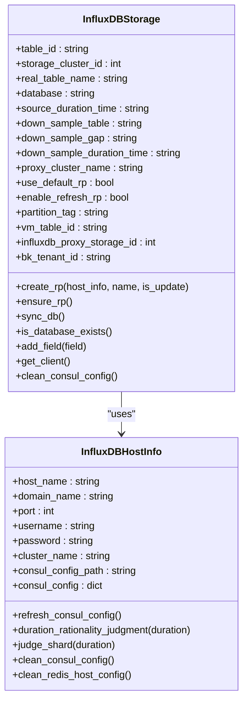
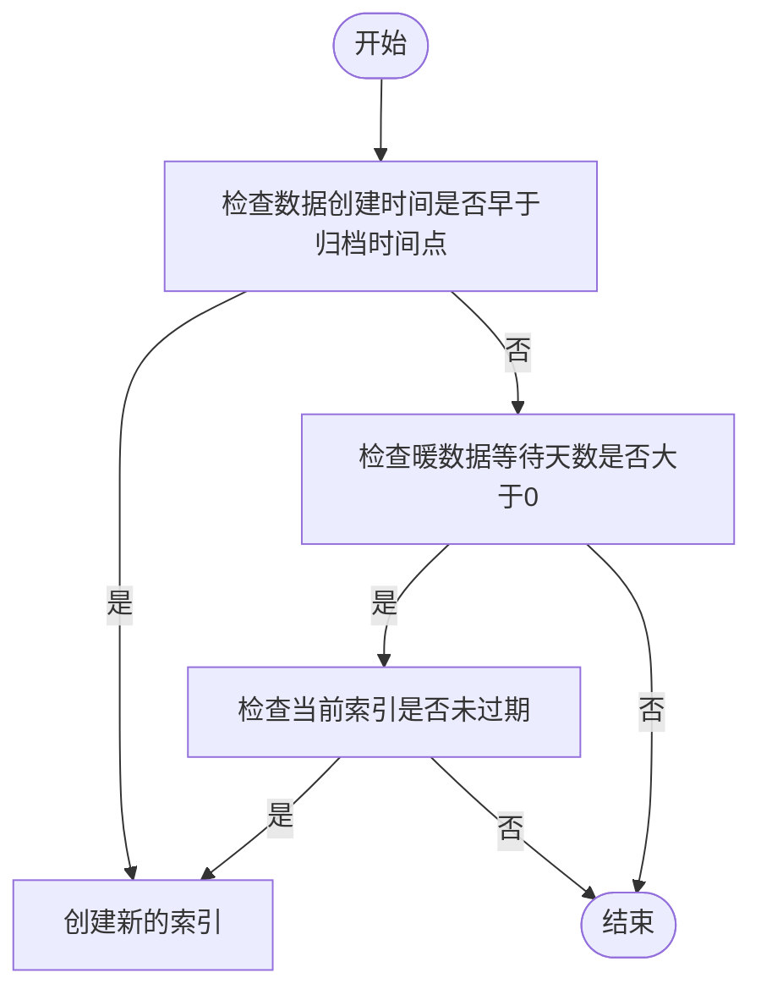
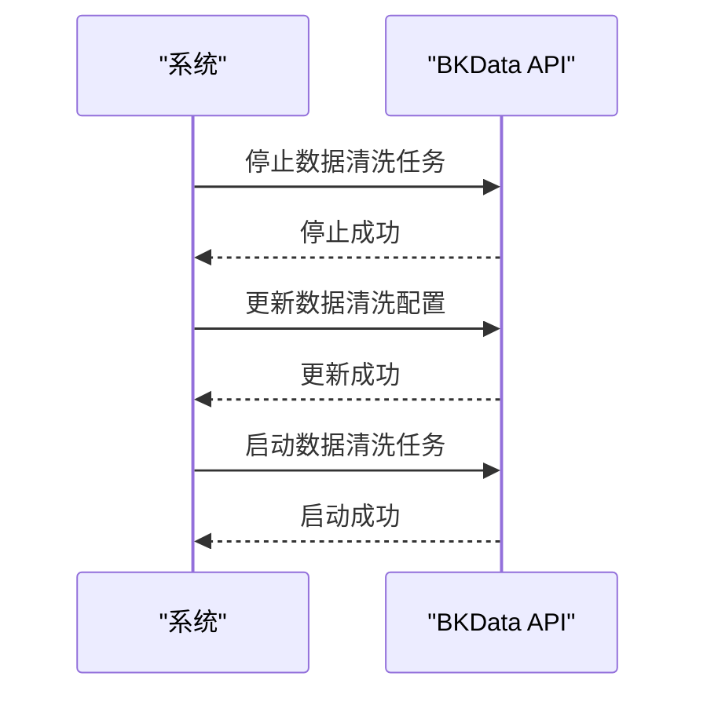
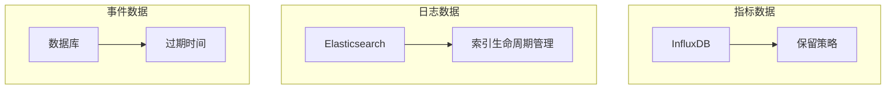
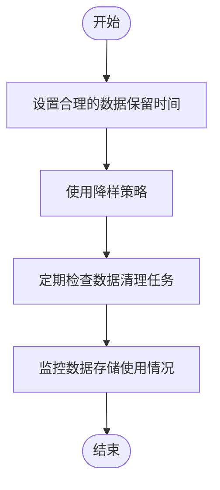
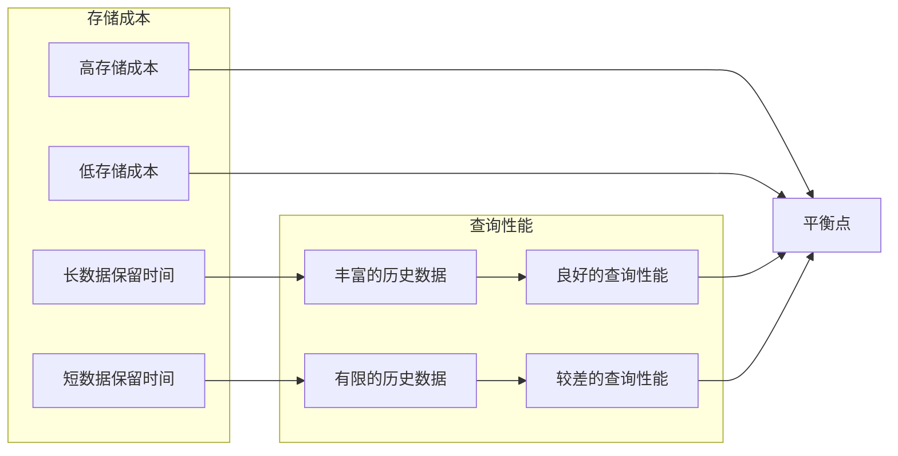
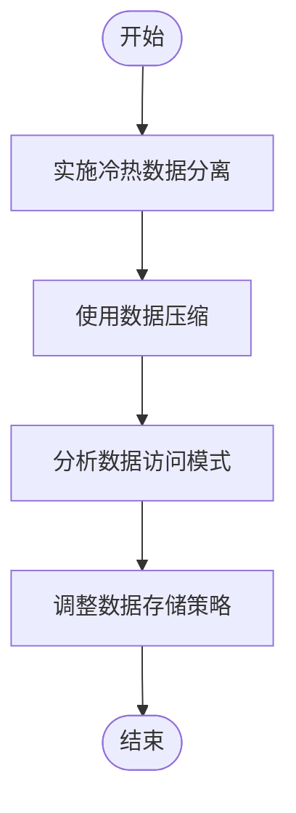

# 数据生命周期管理

<cite>
**本文档引用的文件**   
- [storage.py](file://bkmonitor\metadata\models\storage.py#L832-L1281)
- [influxdb_cluster.py](file://bkmonitor\metadata\models\influxdb_cluster.py#L748-L777)
- [bkdata_link.py](file://bkmonitor\metadata\resources\bkdata_link.py#L324-L345)
- [rotate.py](file://bkmonitor\alarm_backends\service\selfmonitor\log\rotate.py#L109-L147)
- [virtual_metric.py](file://bkmonitor\apm\core\handlers\bk_data\virtual_metric.py#L127-L181)
- [utils.py](file://bkmonitor\metadata\models\vm\utils.py#L325-L358)
- [doris.py](file://bkmonitor\apm\models\doris.py#L346-L387)
- [datasource.py](file://bkmonitor\apm\models\datasource.py#L619-L648)
- [metadata_create_result_table.md](file://bkmonitor\support-files\apigw\docs\zh\metadata_create_result_table.md#L56-L80)
</cite>

## 目录
1. [数据保留周期配置](#数据保留周期配置)
2. [自动归档策略](#自动归档策略)
3. [数据清理机制](#数据清理机制)
4. [不同数据类型的生命周期管理差异](#不同数据类型的生命周期管理差异)
5. [数据生命周期配置最佳实践](#数据生命周期配置最佳实践)
6. [存储成本与查询性能影响分析](#存储成本与查询性能影响分析)
7. [数据生命周期优化建议](#数据生命周期优化建议)

## 数据保留周期配置

数据保留周期配置是数据生命周期管理的核心部分，系统通过配置不同的存储策略来管理数据的保留时间。在InfluxDB存储中，通过`source_duration_time`字段配置原始数据的保留时间，`down_sample_duration_time`字段配置降样数据的保存时间。系统还支持使用默认的保留策略（RP）配置，通过`use_default_rp`字段控制是否使用默认RP配置。

**图表来源**
- [storage.py](file://bkmonitor\metadata\models\storage.py#L832-L999)
- [influxdb_cluster.py](file://bkmonitor\metadata\models\influxdb_cluster.py#L700-L899)

**本节来源**
- [storage.py](file://bkmonitor\metadata\models\storage.py#L832-L1281)
- [influxdb_cluster.py](file://bkmonitor\metadata\models\influxdb_cluster.py#L748-L777)

## 自动归档策略

自动归档策略通过判断数据的创建时间和当前时间的差值来决定是否需要创建新的索引。当数据的创建时间早于归档时间点时，系统会创建新的索引。此外，系统还支持暖数据等待天数配置，当暖数据等待天数大于0且当前索引未过期时，系统会创建新的索引。

**图表来源**
- [storage.py](file://bkmonitor\metadata\models\storage.py#L3331-L3355)

**本节来源**
- [storage.py](file://bkmonitor\metadata\models\storage.py#L3331-L3355)

## 数据清理机制

数据清理机制通过调用BKData API来停止和更新数据清洗任务。当需要更新清洗配置时，系统会先停止现有的清洗任务，然后更新清洗配置并重新启动清洗任务。如果清洗任务尚未创建，则系统会直接创建并启动新的清洗任务。

**图表来源**
- [virtual_metric.py](file://bkmonitor\apm\core\handlers\bk_data\virtual_metric.py#L127-L181)
- [utils.py](file://bkmonitor\metadata\models\vm\utils.py#L325-L358)

**本节来源**
- [virtual_metric.py](file://bkmonitor\apm\core\handlers\bk_data\virtual_metric.py#L127-L181)
- [utils.py](file://bkmonitor\metadata\models\vm\utils.py#L325-L358)

## 不同数据类型的生命周期管理差异

不同数据类型（指标、日志、事件）的生命周期管理存在显著差异。对于指标数据，系统主要通过InfluxDB的保留策略来管理数据的保留时间；对于日志数据，系统通过Elasticsearch的索引生命周期管理来控制数据的保留时间；对于事件数据，系统则通过数据库的过期时间配置来管理数据的生命周期。

**图表来源**
- [storage.py](file://bkmonitor\metadata\models\storage.py#L832-L1281)
- [metadata_create_result_table.md](file://bkmonitor\support-files\apigw\docs\zh\metadata_create_result_table.md#L56-L80)

**本节来源**
- [storage.py](file://bkmonitor\metadata\models\storage.py#L832-L1281)
- [metadata_create_result_table.md](file://bkmonitor\support-files\apigw\docs\zh\metadata_create_result_table.md#L56-L80)

## 数据生命周期配置最佳实践

在配置数据生命周期时，应遵循以下最佳实践：
1. 根据业务需求合理设置数据保留时间，避免数据保留时间过长导致存储成本过高。
2. 对于高频数据，建议使用降样策略来减少数据量。
3. 定期检查数据清理任务的执行情况，确保数据能够按时清理。
4. 使用监控工具监控数据存储的使用情况，及时发现存储异常。

**图表来源**
- [metadata_create_result_table.md](file://bkmonitor\support-files\apigw\docs\zh\metadata_create_result_table.md#L56-L80)

**本节来源**
- [metadata_create_result_table.md](file://bkmonitor\support-files\apigw\docs\zh\metadata_create_result_table.md#L56-L80)

## 存储成本与查询性能影响分析

数据生命周期管理对存储成本和查询性能有显著影响。较长的数据保留时间会增加存储成本，但可以提供更长时间的历史数据查询能力。较短的数据保留时间可以降低存储成本，但可能会影响历史数据的查询。因此，在配置数据生命周期时，需要在存储成本和查询性能之间找到平衡点。

**图表来源**
- [doris.py](file://bkmonitor\apm\models\doris.py#L346-L387)

**本节来源**
- [doris.py](file://bkmonitor\apm\models\doris.py#L346-L387)

## 数据生命周期优化建议

为了优化数据生命周期管理，建议采取以下措施：
1. 实施冷热数据分离策略，将频繁访问的热数据存储在高性能存储中，将不常访问的冷数据存储在低成本存储中。
2. 使用数据压缩策略来减少存储空间占用。
3. 定期分析数据访问模式，根据访问频率调整数据存储策略。

**图表来源**
- [datasource.py](file://bkmonitor\apm\models\datasource.py#L619-L648)

**本节来源**
- [datasource.py](file://bkmonitor\apm\models\datasource.py#L619-L648)