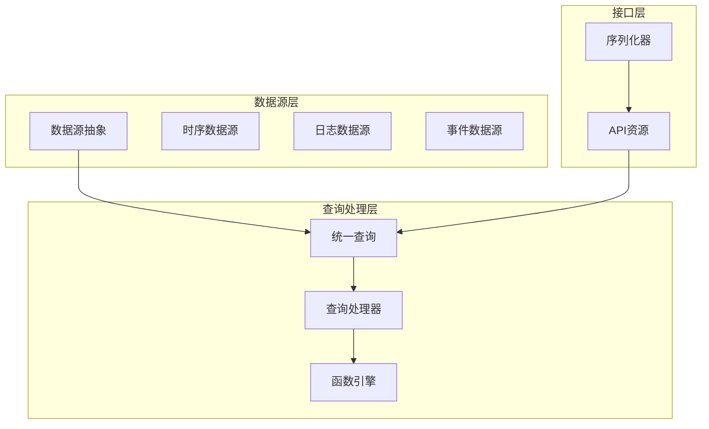
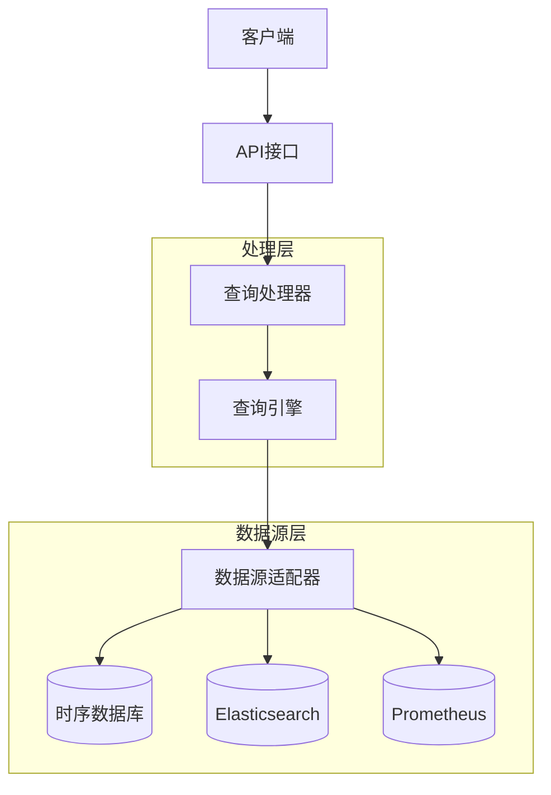
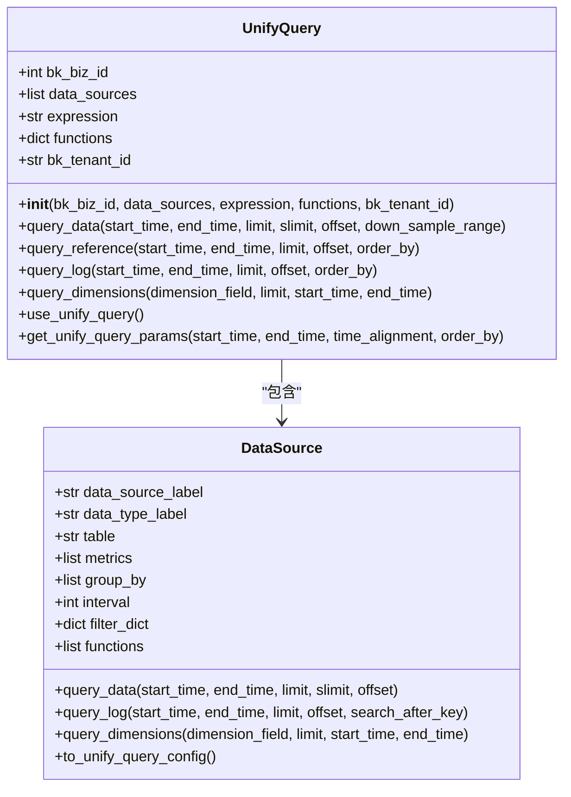
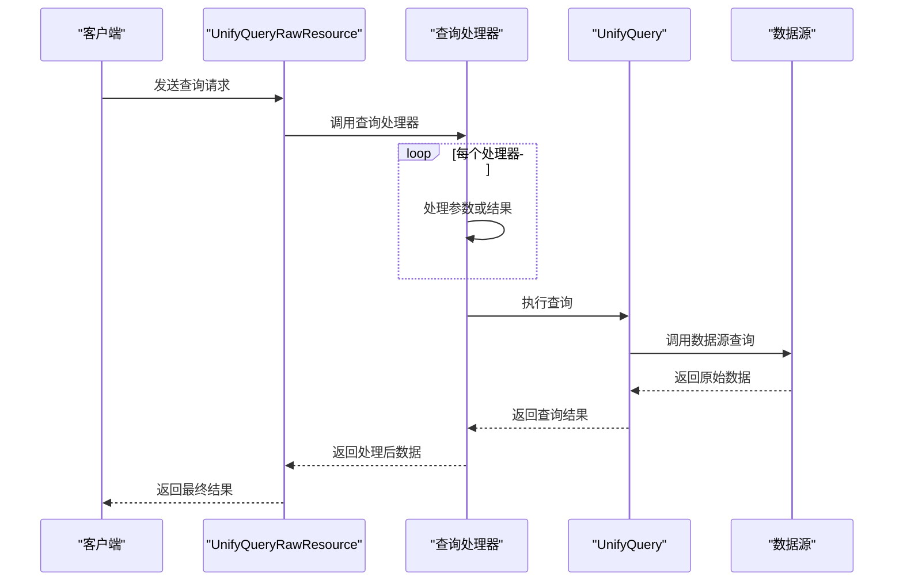
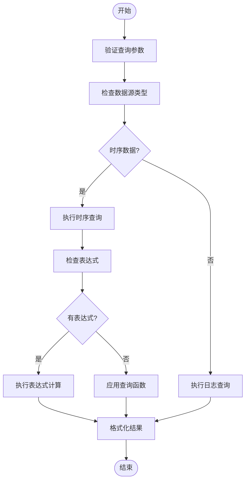
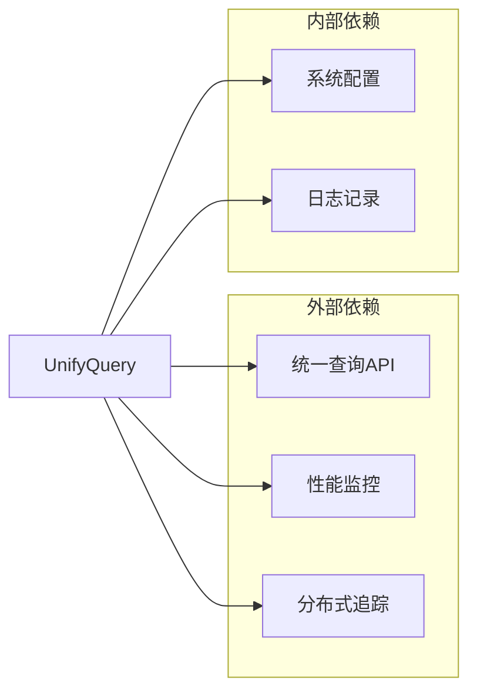

# 数据查询

<cite>
**本文档中引用的文件**   
- [unify_query.py](file://bkmonitor\packages\monitor_web\grafana\resources\unify_query.py)
- [query.py](file://bkmonitor\bkmonitor\data_source\unify_query\query.py)
- [query.py](file://bkmonitor\bkmonitor\data_source\models\query.py)
- [data_source.py](file://bkmonitor\constants\data_source.py)
</cite>

## 目录
1. [引言](#引言)
2. [项目结构](#项目结构)
3. [核心组件](#核心组件)
4. [架构概述](#架构概述)
5. [详细组件分析](#详细组件分析)
6. [依赖分析](#依赖分析)
7. [性能考虑](#性能考虑)
8. [故障排除指南](#故障排除指南)
9. [结论](#结论)

## 引言
本文档全面介绍蓝鲸监控平台中的数据查询功能，重点分析统一查询接口的设计与实现。文档涵盖查询语法、过滤条件、聚合函数等核心功能，详细说明如何支持多种数据源的查询操作。同时提供查询性能优化建议，包括索引使用和查询缓存策略，并记录常见的查询模式和最佳实践，帮助用户高效获取所需数据。为开发者提供自定义查询处理器的开发指南，确保系统具有良好的扩展性。

## 项目结构
蓝鲸监控平台的数据查询功能主要分布在多个模块中，形成了分层的架构体系。核心查询逻辑位于`bkmonitor/data_source`目录下，而统一查询接口则在`packages/monitor_web/grafana/resources/`路径中实现。系统通过清晰的模块划分，实现了数据源抽象、查询处理和结果格式化等功能的解耦。

**图示来源**
- [unify_query.py](file://bkmonitor\packages\monitor_web\grafana\resources\unify_query.py)
- [query.py](file://bkmonitor\bkmonitor\data_source\unify_query\query.py)

## 核心组件
数据查询系统的核心组件包括统一查询类`UnifyQuery`、数据源抽象类`DataSource`以及多个查询处理器。`UnifyQuery`类作为查询入口，负责协调多个数据源的查询操作，支持多数据源联合查询和表达式计算。系统通过`QueryMixin`和`IterMixin`等混入类提供了丰富的查询方法和迭代功能。

**组件来源**
- [query.py](file://bkmonitor\bkmonitor\data_source\unify_query\query.py#L1-L50)
- [query.py](file://bkmonitor\bkmonitor\data_source\models\query.py#L1-L100)

## 架构概述
系统采用分层架构设计，从上至下分为接口层、处理层和数据源层。接口层提供RESTful API，接收查询请求并进行参数校验；处理层负责查询逻辑的解析和执行，包括表达式计算、函数处理和结果格式化；数据源层则封装了对不同数据存储系统的访问细节。

**图示来源**
- [unify_query.py](file://bkmonitor\packages\monitor_web\grafana\resources\unify_query.py#L1-L100)
- [query.py](file://bkmonitor\bkmonitor\data_source\unify_query\query.py#L1-L50)

## 详细组件分析

### 统一查询类分析
`UnifyQuery`类是整个查询系统的核心，负责协调多个数据源的查询操作。该类通过`use_unify_query`方法判断是否使用统一查询模块，根据查询配置的复杂度自动选择最优的查询策略。

**图示来源**
- [query.py](file://bkmonitor\bkmonitor\data_source\unify_query\query.py#L50-L100)

### 查询处理器分析
系统实现了多个查询处理器，用于处理特定的查询需求。这些处理器通过责任链模式组合，每个处理器负责处理特定类型的查询功能，如时间对比、空值补全、维度排序等。

**图示来源**
- [unify_query.py](file://bkmonitor\packages\monitor_web\grafana\resources\unify_query.py#L100-L500)

### 查询语法与功能
系统支持丰富的查询语法和功能，包括基本查询、表达式计算、聚合函数等。查询配置通过`QueryConfigSerializer`进行校验和解析，确保输入参数的合法性。

**图示来源**
- [unify_query.py](file://bkmonitor\packages\monitor_web\grafana\resources\unify_query.py#L500-L800)
- [query.py](file://bkmonitor\bkmonitor\data_source\unify_query\query.py#L500-L800)

## 依赖分析
数据查询系统依赖于多个核心模块和外部服务。系统通过`api`模块调用统一查询服务，利用`metrics`模块进行性能监控，通过`bk_biz_id_to_bk_tenant_id`工具进行租户ID转换。

**图示来源**
- [query.py](file://bkmonitor\bkmonitor\data_source\unify_query\query.py#L1-L50)
- [unify_query.py](file://bkmonitor\packages\monitor_web\grafana\resources\unify_query.py#L1-L50)

## 性能考虑
系统在设计时充分考虑了查询性能，通过多种机制优化查询效率。包括查询缓存、结果分片、并行查询等策略，确保在大数据量场景下的查询响应速度。

1. **查询缓存**：对频繁查询的结果进行缓存，减少重复查询的开销
2. **并行处理**：使用线程池对多个数据源的查询进行并行处理
3. **结果分片**：通过`slimit`参数限制返回的维度数量，避免结果集过大
4. **降采样**：对长时间范围的查询使用降采样策略，提高查询效率

## 故障排除指南
当遇到查询问题时，可以按照以下步骤进行排查：

1. **检查参数合法性**：确保查询参数符合API规范，特别是时间范围和过滤条件
2. **验证数据源配置**：确认数据源标签和类型配置正确
3. **查看日志信息**：检查系统日志中的错误信息，定位问题根源
4. **测试简单查询**：从简单的单指标查询开始，逐步增加复杂度

**故障排除来源**
- [query.py](file://bkmonitor\bkmonitor\data_source\unify_query\query.py#L100-L200)
- [unify_query.py](file://bkmonitor\packages\monitor_web\grafana\resources\unify_query.py#L100-L200)

## 结论
蓝鲸监控平台的数据查询系统通过统一查询接口的设计，实现了对多种数据源的高效查询支持。系统采用模块化设计，具有良好的扩展性和维护性。通过丰富的查询功能和优化策略，能够满足不同场景下的数据查询需求，为用户提供高效、可靠的数据访问能力。