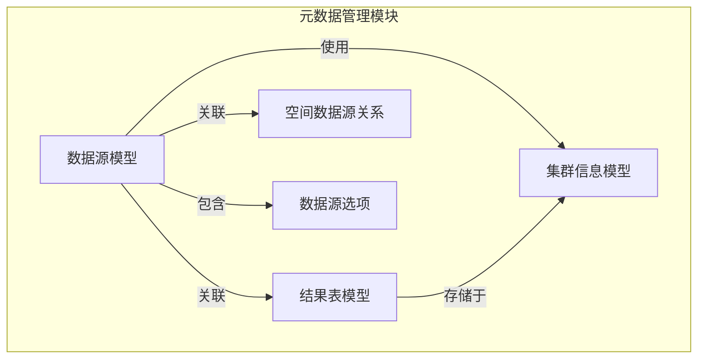
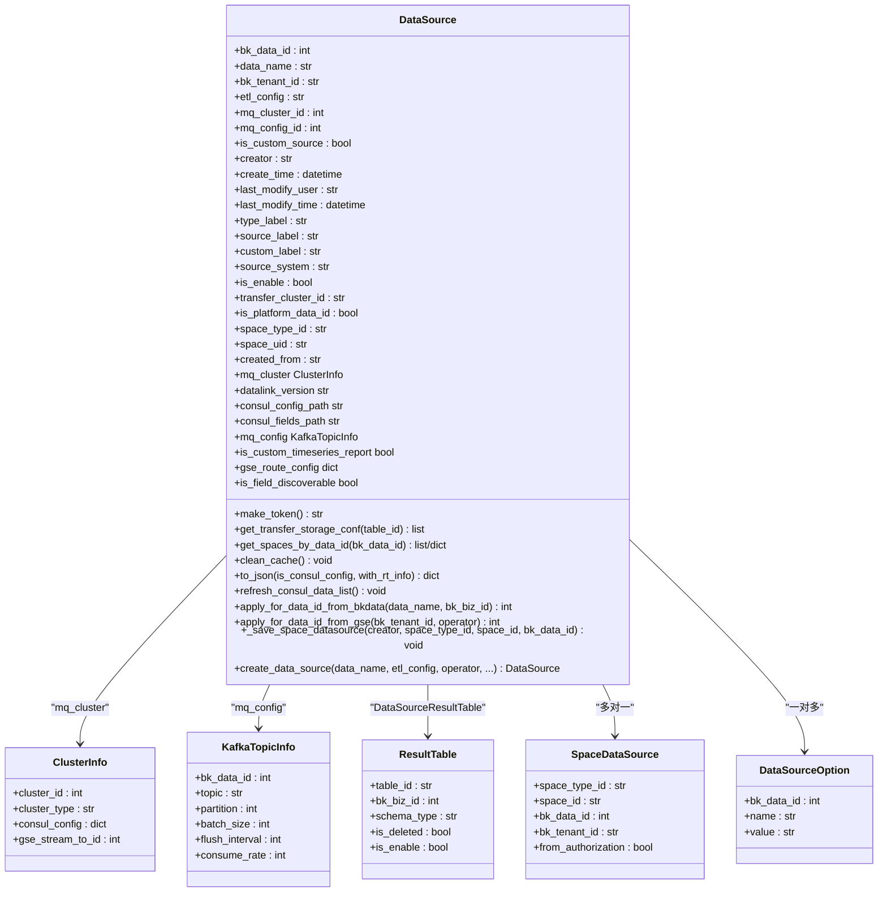
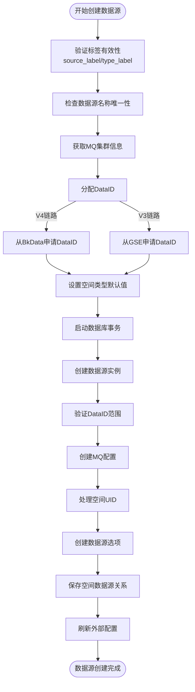
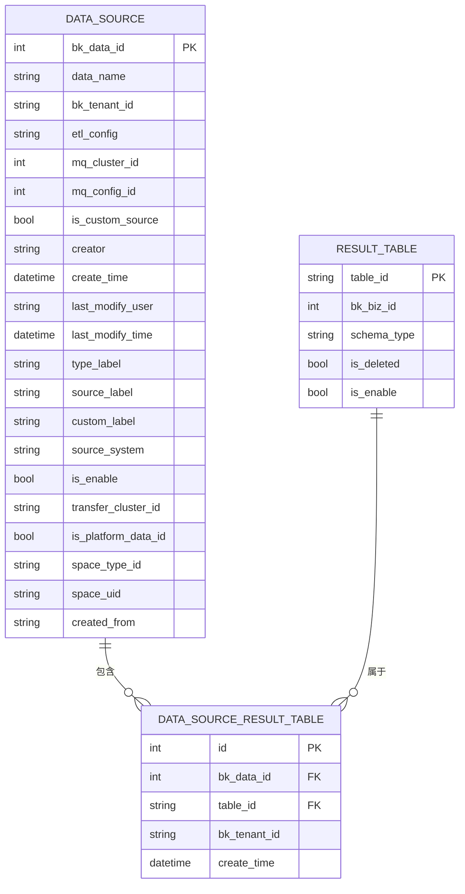
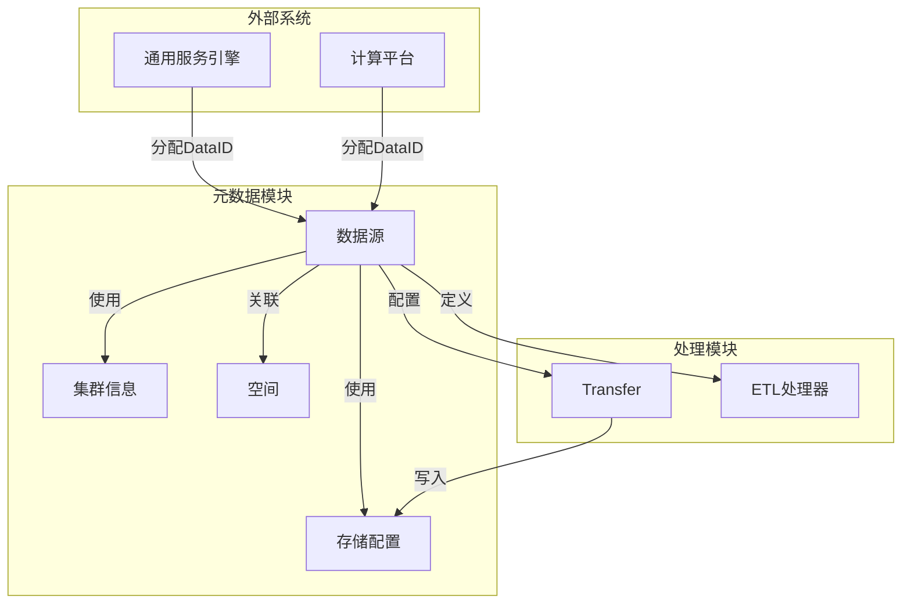

# 数据源模型

<cite>
**本文档引用的文件**  
- [data_source.py](file://bkmonitor/metadata/models/data_source.py#L0-L1535)
- [constants.py](file://constants/data_source.py#L0-L50)
- [config.py](file://metadata/config.py#L0-L100)
- [ClusterInfo.py](file://metadata/models/storage.py#L0-L200)
- [SpaceDataSource.py](file://metadata/models/space.py#L0-L150)
- [DataSourceOption.py](file://metadata/models/data_source.py#L0-L1535)
- [ResultTable.py](file://metadata/models/result_table.py#L0-L300)
</cite>

## 目录
1. [引言](#引言)
2. [项目结构](#项目结构)
3. [核心组件](#核心组件)
4. [架构概览](#架构概览)
5. [详细组件分析](#详细组件分析)
6. [依赖关系分析](#依赖关系分析)
7. [性能考虑](#性能考虑)
8. [故障排查指南](#故障排查指南)
9. [结论](#结论)

## 引言
本文档全面描述了蓝鲸监控平台中的数据源模型设计与实现。数据源（DataSource）是整个监控系统的核心实体之一，负责定义数据的来源、格式、存储路径和处理规则。该模型支持多租户架构，确保不同租户之间的数据隔离，并通过灵活的ETL配置支持多种数据类型（如指标、日志、事件）的接入。文档深入解析了数据源的字段定义、创建流程、与结果表的关系以及配置管理机制，为开发者提供配置最佳实践和常见问题解决方案。

## 项目结构
数据源模型位于`bkmonitor/metadata/models/data_source.py`文件中，是元数据管理模块的核心部分。该模块负责监控系统中所有数据源、结果表、存储集群等元数据的定义与管理。

**图示来源**  
- [data_source.py](file://bkmonitor/metadata/models/data_source.py#L0-L1535)
- [result_table.py](file://metadata/models/result_table.py#L0-L300)
- [storage.py](file://metadata/models/storage.py#L0-L200)

**本节来源**  
- [data_source.py](file://bkmonitor/metadata/models/data_source.py#L0-L1535)

## 核心组件
数据源模型的核心功能包括数据源的创建、配置转换、与外部系统（如GSE、BkData）的集成以及与结果表的关联管理。其主要职责是作为数据接入的入口，定义数据的采集、清洗、路由和存储规则。

**本节来源**  
- [data_source.py](file://bkmonitor/metadata/models/data_source.py#L0-L1535)

## 架构概览
数据源模型采用面向对象设计，继承自Django的`models.Model`，并与其他元数据模型（如结果表、存储集群、空间）建立关联。其核心架构围绕数据源的生命周期管理展开，包括创建、配置、启用/禁用和删除。

**图示来源**  
- [data_source.py](file://bkmonitor/metadata/models/data_source.py#L0-L1535)
- [storage.py](file://metadata/models/storage.py#L0-L200)
- [result_table.py](file://metadata/models/result_table.py#L0-L300)

## 详细组件分析
### 数据源实体分析
`DataSource`模型是数据源的核心数据结构，定义了数据源的所有属性和行为。

#### 字段定义
| 字段名 | 类型 | 约束 | 描述 |
| :--- | :--- | :--- | :--- |
| `bk_data_id` | AutoField | 主键 | 数据源唯一标识ID |
| `data_name` | CharField | 联合唯一索引 | 数据源名称，在租户内必须唯一 |
| `bk_tenant_id` | CharField | 联合唯一索引 | 租户ID，实现多租户隔离 |
| `etl_config` | TextField | 无 | ETL清洗配置，可为JSON或内置配置名 |
| `mq_cluster_id` | IntegerField | 外键 | 消息队列集群ID，指向`ClusterInfo` |
| `mq_config_id` | IntegerField | 外键 | 消息队列配置ID，指向`KafkaTopicInfo` |
| `is_custom_source` | BooleanField | 无 | 是否为自定义数据源 |
| `creator` | CharField | 无 | 创建者用户名 |
| `create_time` | DateTimeField | 自动添加 | 创建时间 |
| `last_modify_user` | CharField | 无 | 最后修改者 |
| `last_modify_time` | DateTimeField | 自动更新 | 最后修改时间 |
| `type_label` | CharField | 无 | 数据类型标签（如时序、事件） |
| `source_label` | CharField | 无 | 数据源标签（如bk_monitor, custom） |
| `custom_label` | CharField | 可为空 | 自定义标签信息 |
| `source_system` | CharField | 无 | 请求来源系统 |
| `is_enable` | BooleanField | 默认True | 数据源是否启用 |
| `transfer_cluster_id` | CharField | 无 | Transfer集群ID |
| `is_platform_data_id` | BooleanField | 无 | 是否为平台级ID，可全局访问 |
| `space_type_id` | CharField | 无 | 所属空间类型 |
| `space_uid` | CharField | 无 | 所属空间的唯一标识 |
| `created_from` | CharField | 无 | DataID来源（GSE或BkData） |

#### 核心方法分析
##### `create_data_source` 方法
该方法是创建数据源的入口，实现了完整的创建流程。

**图示来源**  
- [data_source.py](file://bkmonitor/metadata/models/data_source.py#L0-L1535)

**本节来源**  
- [data_source.py](file://bkmonitor/metadata/models/data_source.py#L0-L1535)

### 数据源与结果表关系
数据源与结果表通过`DataSourceResultTable`中间表建立多对多关系。一个数据源可以产生多个结果表，一个结果表也可以来源于多个数据源。

**图示来源**  
- [data_source.py](file://bkmonitor/metadata/models/data_source.py#L0-L1535)
- [result_table.py](file://metadata/models/result_table.py#L0-L300)

**本节来源**  
- [data_source.py](file://bkmonitor/metadata/models/data_source.py#L0-L1535)

## 依赖关系分析
数据源模型依赖于多个核心组件，形成一个完整的数据接入和处理链路。

**图示来源**  
- [data_source.py](file://bkmonitor/metadata/models/data_source.py#L0-L1535)
- [config.py](file://metadata/config.py#L0-L100)

**本节来源**  
- [data_source.py](file://bkmonitor/metadata/models/data_source.py#L0-L1535)

## 性能考虑
在设计和使用数据源时，需考虑以下性能因素：
- **缓存机制**：`mq_cluster`和`mq_config`属性使用了内部缓存，避免重复查询数据库。
- **事务处理**：`create_data_source`方法使用数据库事务，确保数据一致性，但需注意事务范围不宜过大。
- **批量操作**：`_save_space_datasource`方法使用`bulk_create`进行批量插入，提高授权空间关系的创建效率。
- **Consul配置**：`to_json`方法生成的配置会写入Consul，需确保配置大小合理，避免影响Consul性能。

## 故障排查指南
### 常见问题
1. **数据源创建失败**
   - 检查`data_name`是否在租户内已存在。
   - 确认`source_label`和`type_label`是否为有效标签。
   - 验证MQ集群是否存在且属于当前租户。

2. **DataID分配失败**
   - 检查GSE或BkData服务是否正常。
   - 确认系统配置`IS_ASSIGN_DATAID_BY_GSE`和`ENABLE_V2_VM_DATA_LINK`是否正确。

3. **数据无法写入**
   - 检查`transfer_cluster_id`配置是否正确。
   - 验证MQ集群和Topic配置是否有效。
   - 确认数据源`is_enable`状态为True。

**本节来源**  
- [data_source.py](file://bkmonitor/metadata/models/data_source.py#L0-L1535)
- [errors.py](file://core/errors/api.py#L0-L50)

## 结论
数据源模型是蓝鲸监控平台数据接入的核心，提供了灵活、可扩展的数据源管理能力。通过清晰的字段定义、完整的创建流程和与其他组件的紧密集成，该模型支持多租户、多数据类型和多链路的数据接入需求。开发者在使用时应遵循最佳实践，合理配置各项参数，并利用提供的工具和方法进行高效管理和故障排查。