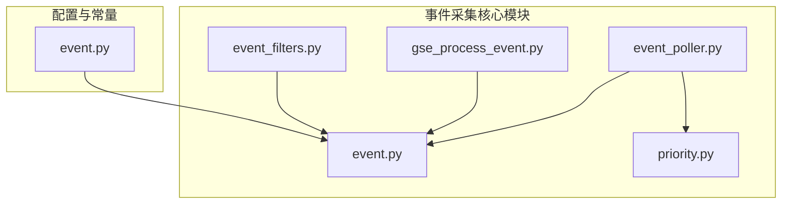
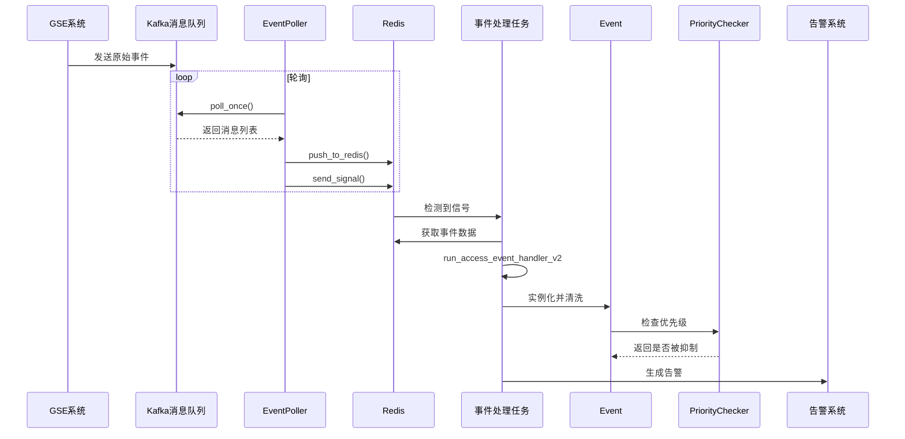
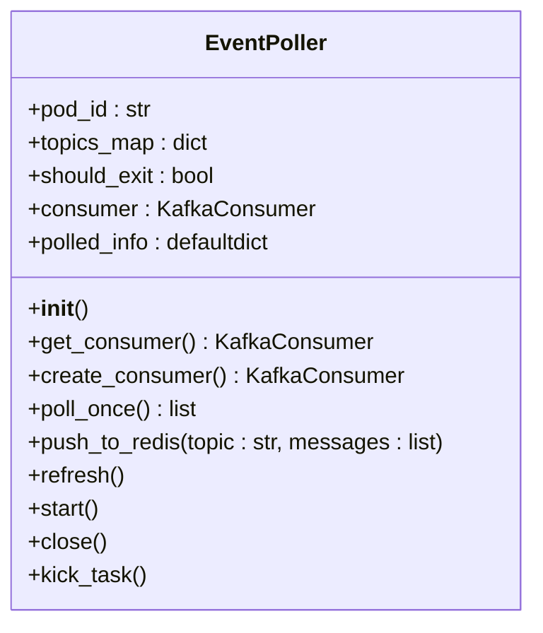
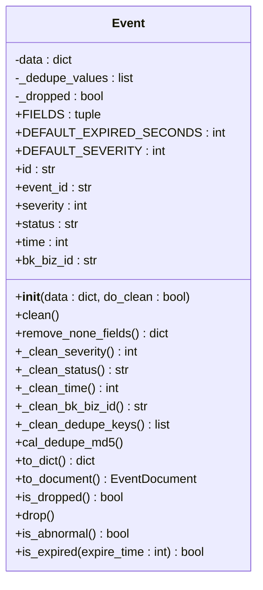
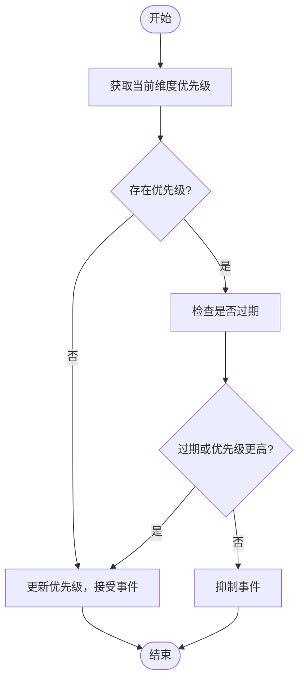
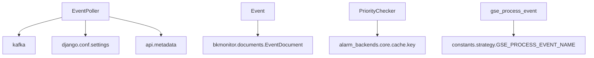

# 事件数据采集

<cite>
**本文档引用的文件**   
- [event_poller.py](file://bkmonitor/alarm_backends/service/access/event/event_poller.py)
- [event.py](file://bkmonitor/alarm_backends/core/alert/event.py)
- [priority.py](file://bkmonitor/alarm_backends/service/access/priority.py)
- [gse_process_event.py](file://bkmonitor/alarm_backends/service/access/event/records/gse_process_event.py)
- [event_filters.py](file://bkmonitor/packages/monitor_web/alert_events/event_filters.py)
- [event.py](file://bkmonitor/constants/event.py)
</cite>

## 目录
1. [引言](#引言)
2. [项目结构](#项目结构)
3. [核心组件](#核心组件)
4. [架构概述](#架构概述)
5. [详细组件分析](#详细组件分析)
6. [依赖分析](#依赖分析)
7. [性能考虑](#性能考虑)
8. [故障排除指南](#故障排除指南)
9. [结论](#结论)

## 引言
本文档全面阐述了蓝鲸监控平台中事件数据采集的架构设计与实现细节。事件数据采集是监控系统的核心功能之一，负责从GSE、Job、SOPS等多个系统收集事件数据，并进行标准化处理、过滤、优先级设置和合并。文档详细解释了事件源注册、事件过滤规则、优先级设置和事件合并策略，以及异常处理机制和数据一致性保障措施。

## 项目结构
事件数据采集功能主要分布在`bkmonitor`目录下的多个子模块中。核心的事件处理逻辑位于`alarm_backends`包内，特别是`service/access/event`和`core/alert`目录。`event_poller.py`是事件采集的入口点，负责从Kafka消费原始事件数据。`event.py`定义了事件的核心数据结构和处理逻辑。`priority.py`实现了事件的优先级管理机制。不同类型的事件（如GSE进程事件）有专门的处理模块，如`gse_process_event.py`。

**图示来源**
- [event_poller.py](file://bkmonitor/alarm_backends/service/access/event/event_poller.py)
- [event.py](file://bkmonitor/alarm_backends/core/alert/event.py)
- [priority.py](file://bkmonitor/alarm_backends/service/access/priority.py)
- [gse_process_event.py](file://bkmonitor/alarm_backends/service/access/event/records/gse_process_event.py)
- [event_filters.py](file://bkmonitor/packages/monitor_web/alert_events/event_filters.py)
- [event.py](file://bkmonitor/constants/event.py)

## 核心组件
事件数据采集的核心组件包括事件轮询器（EventPoller）、事件模型（Event）、优先级检查器（PriorityChecker）和事件记录处理器（如GseProcessEventRecord）。EventPoller负责从Kafka消息队列中拉取原始事件数据，并将其推送到Redis进行后续处理。Event类是事件数据的核心表示，包含了事件的所有属性和处理方法，如数据清洗、去重和状态管理。PriorityChecker实现了基于Redis的优先级抑制机制，确保高优先级的事件能够被优先处理。特定类型的事件处理器（如GseProcessEventRecord）负责将原始数据转换为标准化的事件格式。

**组件来源**
- [event_poller.py](file://bkmonitor/alarm_backends/service/access/event/event_poller.py#L1-L205)
- [event.py](file://bkmonitor/alarm_backends/core/alert/event.py#L1-L428)
- [priority.py](file://bkmonitor/alarm_backends/service/access/priority.py#L1-L158)
- [gse_process_event.py](file://bkmonitor/alarm_backends/service/access/event/records/gse_process_event.py#L1-L146)

## 架构概述
事件数据采集的架构遵循典型的生产者-消费者模式。GSE等系统作为事件的生产者，将原始事件数据发送到Kafka消息队列。`EventPoller`作为消费者，定期从Kafka拉取数据，并将其存入Redis的列表中，同时通过Redis的集合（Set）发送信号，通知下游的处理任务。`run_access_event_handler_v2`任务被触发后，会从Redis中获取事件数据，经过`Event`模型的清洗和标准化处理，最终生成告警。优先级管理模块通过Redis的哈希表（Hash）存储和查询优先级信息，实现事件的抑制和合并。

**图示来源**
- [event_poller.py](file://bkmonitor/alarm_backends/service/access/event/event_poller.py#L1-L205)
- [event.py](file://bkmonitor/alarm_backends/core/alert/event.py#L1-L428)
- [priority.py](file://bkmonitor/alarm_backends/service/access/priority.py#L1-L158)

## 详细组件分析

### 事件轮询器 (EventPoller) 分析
`EventPoller`是事件采集的入口，它负责与Kafka和Redis交互。其主要职责是持续地从Kafka订阅的Topic中拉取事件数据，然后将这些数据批量推送到Redis的指定列表中，并通过Redis的集合（Set）发送一个信号，以触发后续的事件处理任务。这种设计实现了数据采集与处理的解耦，提高了系统的可扩展性和容错性。

#### 类图

**图示来源**
- [event_poller.py](file://bkmonitor/alarm_backends/service/access/event/event_poller.py#L1-L205)

### 事件模型 (Event) 分析
`Event`类是整个事件处理流程的核心数据结构。它不仅定义了事件的标准化字段，还封装了数据清洗、去重、状态管理等一系列关键方法。当原始数据被加载到`Event`实例中时，`clean()`方法会被调用，对各个字段进行校验和标准化处理，例如将`severity`（严重级别）限制在1-3的范围内，将`status`（状态）统一为大写枚举值。

#### 类图

**图示来源**
- [event.py](file://bkmonitor/alarm_backends/core/alert/event.py#L1-L428)

### 优先级检查器 (PriorityChecker) 分析
`PriorityChecker`实现了事件的优先级抑制机制。该机制基于Redis的哈希表存储，以`priority_group_key`为键，以`dimensions_md5`为哈希键，存储`优先级:时间戳`的组合值。当一个新的事件到达时，系统会检查其所属维度的当前优先级。如果新事件的优先级更高，或者旧的优先级信息已过期，则新事件会被接受，并更新Redis中的优先级信息；否则，该事件将被抑制（丢弃）。

#### 流程图

**图示来源**
- [priority.py](file://bkmonitor/alarm_backends/service/access/priority.py#L1-L158)

## 依赖分析
事件数据采集模块依赖于多个外部系统和内部组件。它依赖`kafka`库与Kafka消息队列通信，依赖`django`框架的配置和`api`模块与元数据服务交互。`Event`模型依赖`bkmonitor.documents`中的`EventDocument`用于数据持久化。`PriorityChecker`依赖`alarm_backends.core.cache.key`模块定义的Redis键名。这些依赖关系通过清晰的模块化设计进行管理，确保了核心逻辑的独立性和可测试性。

**图示来源**
- [event_poller.py](file://bkmonitor/alarm_backends/service/access/event/event_poller.py#L1-L205)
- [event.py](file://bkmonitor/alarm_backends/core/alert/event.py#L1-L428)
- [priority.py](file://bkmonitor/alarm_backends/service/access/priority.py#L1-L158)
- [gse_process_event.py](file://bkmonitor/alarm_backends/service/access/event/records/gse_process_event.py#L1-L146)

## 性能考虑
为了保证事件采集的高性能和高吞吐量，系统在多个层面进行了优化。`EventPoller`在单次轮询中会批量拉取最多`MAX_RETRIEVE_NUMBER`条消息，并批量推送到Redis，减少了网络I/O开销。`PriorityChecker`使用本地字典（`priority_cache`）缓存从Redis获取的优先级信息，避免了对Redis的频繁查询。此外，`Event`类使用`@cached_property`装饰器对策略、业务ID等计算开销较大的属性进行缓存，避免了重复计算。

## 故障排除指南
当事件数据采集出现问题时，可以按照以下步骤进行排查：
1.  **检查Kafka连接**：确认`EventPoller`能否成功连接到Kafka集群，检查`bootstrap_servers`配置是否正确。
2.  **检查Redis状态**：确认Redis服务是否正常运行，`EVENT_LIST_KEY`和`EVENT_SIGNAL_KEY`对应的键是否存在且有数据。
3.  **查看日志**：检查`access.event`日志，重点关注`EventPoller`的`poll_once`和`push_to_redis`方法的输出，以及`run_access_event_handler_v2`任务的执行日志，查找异常堆栈信息。
4.  **验证数据格式**：对于特定类型的事件（如GSE事件），检查上游系统发送的原始数据格式是否符合`gse_process_event.py`等处理器中定义的`raw data format`。

**故障排除来源**
- [event_poller.py](file://bkmonitor/alarm_backends/service/access/event/event_poller.py#L1-L205)
- [event.py](file://bkmonitor/alarm_backends/core/alert/event.py#L1-L428)

## 结论
蓝鲸监控平台的事件数据采集架构设计精良，通过`EventPoller`、`Event`模型和`PriorityChecker`等核心组件的协同工作，实现了从多源系统高效、可靠地采集事件数据的能力。该架构具备良好的扩展性、解耦性和容错性，能够满足大规模监控场景下的性能要求。通过深入理解其设计和实现，开发者可以更好地进行功能扩展、性能调优和问题排查。