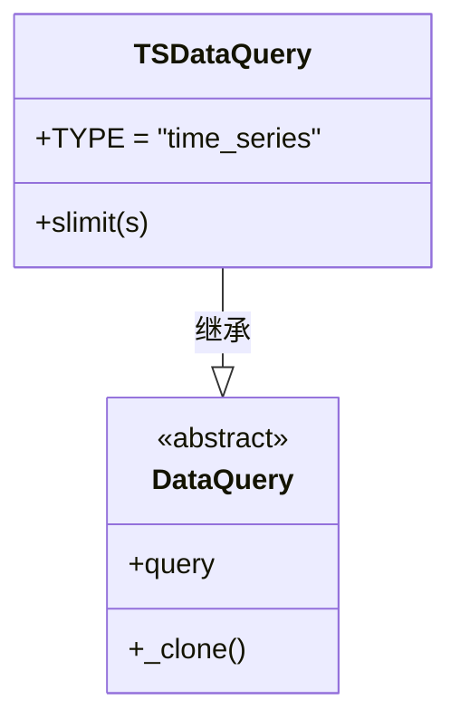
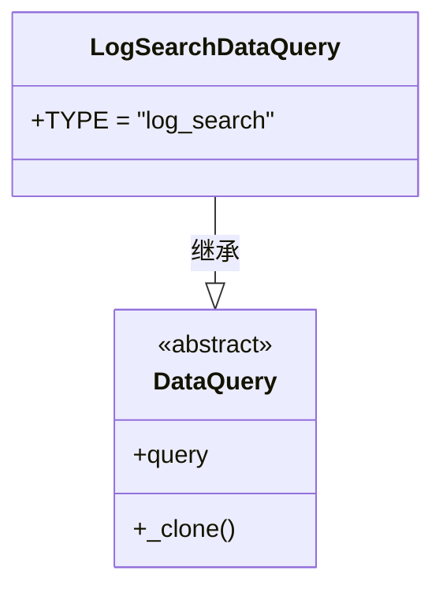
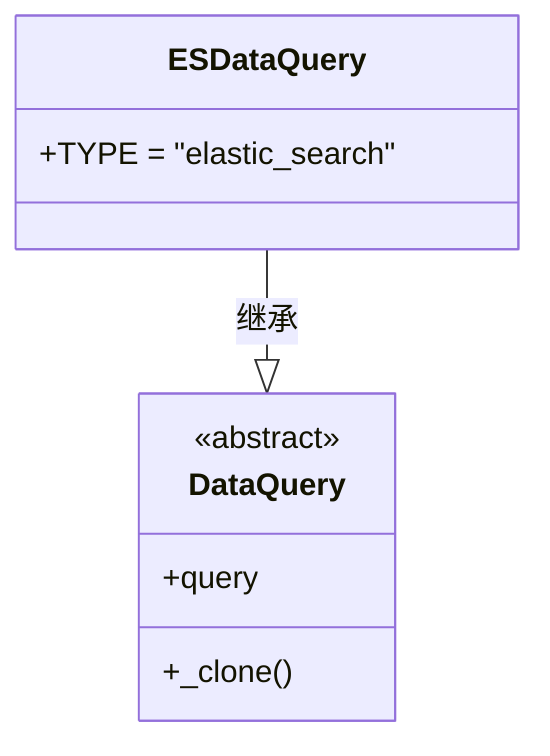
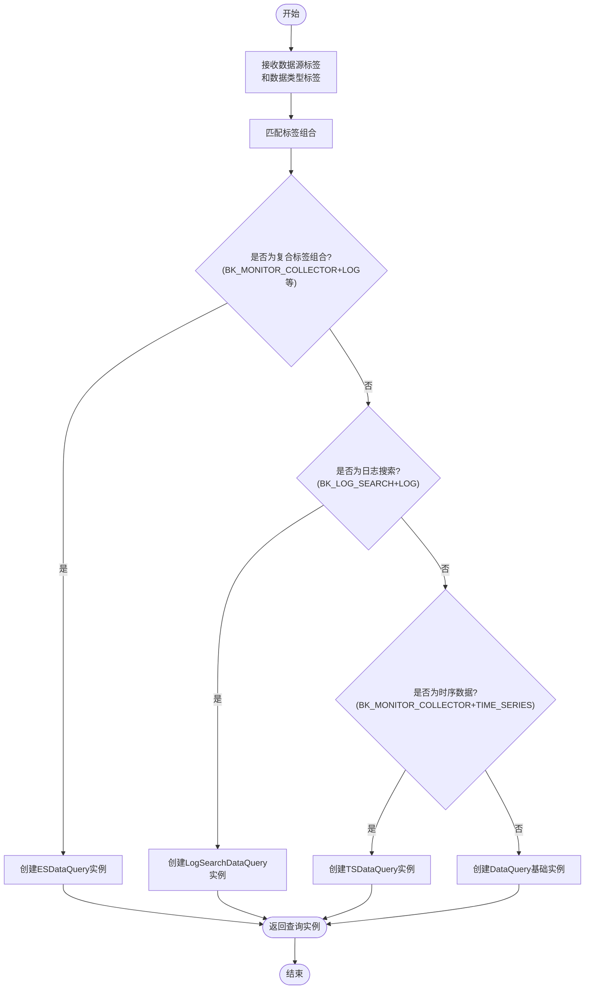

# 数据采集

<cite>
**本文档引用的文件**  
- [data_source\__init__.py](file://bkmonitor\bkmonitor\data_source\__init__.py)
- [handler\__init__.py](file://bkmonitor\bkmonitor\data_source\handler\__init__.py)
- [handler\time_series.py](file://bkmonitor\bkmonitor\data_source\handler\time_series.py)
- [handler\log_search.py](file://bkmonitor\bkmonitor\data_source\handler\log_search.py)
- [handler\elastic_search.py](file://bkmonitor\bkmonitor\data_source\handler\elastic_search.py)
- [README.md](file://bkmonitor\bkmonitor\data_source\README.md)
</cite>

## 目录

1. [数据采集机制概述](#数据采集机制概述)
2. [支持的数据源类型](#支持的数据源类型)
3. [数据采集器类型与处理机制](#数据采集器类型与处理机制)
4. [数据采集流程](#数据采集流程)
5. [数据格式与结构](#数据格式与结构)
6. [数据采集配置示例](#数据采集配置示例)
7. [错误处理与重试机制](#错误处理与重试机制)
8. [最佳实践与性能优化建议](#最佳实践与性能优化建议)

## 数据采集机制概述

蓝鲸监控平台的数据采集机制基于统一的数据源（DataSource）模块实现，旨在为SaaS应用、告警后台等不同模块提供统一的查询入口。该机制支持时序数据、日志数据和事件数据等多种数据类型的采集与查询，通过封装底层SQL拼接逻辑，提供类似Django ORM的使用方式，简化了数据查询的复杂性。

数据采集的核心设计参考了Django数据库模块的设计思路，采用分层架构，将数据源的定义、查询逻辑、连接管理等职责分离，实现了高内聚、低耦合的模块化设计。整个采集流程从数据源注册、查询实例创建到数据获取，均通过工厂模式和策略模式进行解耦，确保了系统的可扩展性和可维护性。

**本节来源**  
- [README.md](file://bkmonitor\bkmonitor\data_source\README.md#L0-L50)

## 支持的数据源类型

系统支持多种数据源类型，每种数据源对应不同的数据来源系统和数据内容形态。数据源类型通过`data_source_label`（数据源标签）和`data_type_label`（数据类型标签）的组合来唯一标识。

根据代码分析，系统支持的主要数据源类型包括：

- **BK_MONITOR_COLLECTOR**：蓝鲸监控采集器，支持时序数据（TIME_SERIES）、日志数据（LOG）
- **CUSTOM**：自定义数据源，支持事件数据（EVENT）、时序数据（TIME_SERIES）
- **BK_APM**：应用性能监控数据源，支持日志数据（LOG）、时序数据（TIME_SERIES）
- **BK_LOG_SEARCH**：日志搜索专用数据源，支持日志数据（LOG）
- **BK_FTA_EVENT**：故障自愈事件数据源
- **BK_APM_TRACE**：APM Trace数据源
- **PROMETHEUS**：Prometheus时序型数据源

这些数据源类型在系统启动时通过映射表进行注册，确保在运行时能够根据标签组合快速定位到对应的数据源处理类。

**本节来源**  
- [data_source\__init__.py](file://bkmonitor\bkmonitor\data_source\__init__.py#L3110-L3122)

## 数据采集器类型与处理机制

数据采集器的处理机制采用工厂模式实现，通过`DataQueryHandler`工厂类根据数据源标签和数据类型标签动态创建对应的数据查询实例。该机制实现了查询逻辑的适配和解耦，确保不同类型的数据源能够使用最适合的查询处理器。

### 时序数据采集器

时序数据采集器（`TSDataQuery`）专门处理来自`BK_MONITOR_COLLECTOR`的时序数据。该采集器继承自基础查询类`DataQuery`，并设置了`TYPE = "time_series"`标识。其主要功能是通过`slimit`方法设置查询结果的系列限制，控制返回的时序数据量。



**图示来源**  
- [handler\time_series.py](file://bkmonitor\bkmonitor\data_source\handler\time_series.py#L0-L20)

### 日志搜索采集器

日志搜索采集器（`LogSearchDataQuery`）专门处理来自`BK_LOG_SEARCH`的日志数据。该采集器同样继承自`DataQuery`，并设置了`TYPE = "log_search"`标识。它针对日志搜索场景进行了优化，能够高效处理大规模日志数据的查询请求。



**图示来源**  
- [handler\log_search.py](file://bkmonitor\bkmonitor\data_source\handler\log_search.py#L0-L15)

### Elasticsearch采集器

Elasticsearch采集器（`ESDataQuery`）用于处理存储在Elasticsearch中的日志和事件数据，支持`BK_MONITOR_COLLECTOR`的LOG类型、`CUSTOM`的EVENT类型以及`BK_APM`的数据。该采集器设置了`TYPE = "elastic_search"`标识，能够利用Elasticsearch的强大搜索能力进行复杂查询。



**图示来源**  
- [handler\elastic_search.py](file://bkmonitor\bkmonitor\data_source\handler\elastic_search.py#L0-L15)

## 数据采集流程

数据采集流程遵循工厂模式的设计原则，通过`DataQueryHandler`类的`__new__`方法实现。整个流程如下：

1. **参数接收**：接收`data_source_label`和`data_type_label`两个关键参数
2. **标签匹配**：按照预定义的优先级顺序匹配标签组合
3. **实例创建**：根据匹配结果创建对应的数据查询实例
4. **返回实例**：返回初始化后的查询对象供后续使用



**图示来源**  
- [handler\__init__.py](file://bkmonitor\bkmonitor\data_source\handler\__init__.py#L0-L79)

## 数据格式与结构

数据采集返回的结果格式根据数据类型的不同而有所差异：

- **时序数据**：返回聚合后的时序数据，通常包含时间戳、指标值、维度信息等字段
- **日志数据**：返回聚合后的日志数量，也是时序数据形式，便于进行趋势分析
- **事件数据**：返回离散的事件记录，包含事件发生时间、事件类型、事件详情等信息

所有数据查询均通过统一的`DataQuery`基类实现，确保了API接口的一致性。查询结果的结构设计参考了Django ORM的查询集（QuerySet）模式，支持链式调用和延迟加载，提高了查询的灵活性和性能。

**本节来源**  
- [README.md](file://bkmonitor\bkmonitor\data_source\README.md#L0-L50)

## 数据采集配置示例

以下是一个典型的时序数据采集配置示例：

```python
from bkmonitor.data_source.handler import DataQueryHandler
from constants.data_source import DataSourceLabel, DataTypeLabel

# 创建时序数据查询处理器
query_handler = DataQueryHandler(
    data_source_label=DataSourceLabel.BK_MONITOR_COLLECTOR,
    data_type_label=DataTypeLabel.TIME_SERIES
)

# 设置查询系列限制
query = query_handler.slimit(100)

# 执行查询并获取结果
results = query.execute()
```

对于日志数据采集，配置方式类似：

```python
# 创建日志数据查询处理器
log_query_handler = DataQueryHandler(
    data_source_label=DataSourceLabel.BK_MONITOR_COLLECTOR,
    data_type_label=DataTypeLabel.LOG
)

# 执行日志查询
log_results = log_query_handler.execute()
```

**本节来源**  
- [handler\__init__.py](file://bkmonitor\bkmonitor\data_source\handler\__init__.py#L0-L79)
- [handler\time_series.py](file://bkmonitor\bkmonitor\data_source\handler\time_series.py#L0-L20)

## 错误处理与重试机制

当前代码分析显示，数据采集模块的错误处理主要体现在以下几个方面：

1. **标签验证**：在创建数据查询实例前，会验证`data_source_label`和`data_type_label`的有效性，确保标签组合在预定义范围内
2. **空值检查**：对输入参数进行空值检查，避免因空参数导致的运行时错误
3. **异常捕获**：在数据源创建过程中，如果创建失败会抛出异常，由上层调用者进行处理

系统目前未实现显式的重试机制，错误处理主要依赖上层业务逻辑的异常捕获和处理。建议在实际应用中添加重试逻辑，特别是在网络不稳定或数据源暂时不可用的情况下。

**本节来源**  
- [handler\__init__.py](file://bkmonitor\bkmonitor\data_source\handler\__init__.py#L0-L79)

## 最佳实践与性能优化建议

### 最佳实践

1. **合理选择数据源类型**：根据实际数据来源选择正确的`data_source_label`和`data_type_label`组合
2. **使用预定义标签**：优先使用系统预定义的标签组合，避免自定义标签带来的兼容性问题
3. **限制查询范围**：通过`slimit`等方法限制查询结果的数量，避免一次性获取过多数据导致性能问题

### 性能优化建议

1. **缓存查询结果**：对于频繁查询且变化不频繁的数据，建议添加缓存层
2. **批量查询**：将多个小查询合并为批量查询，减少网络开销
3. **索引优化**：确保底层存储系统（如Elasticsearch、InfluxDB）有适当的索引策略
4. **异步处理**：对于耗时较长的查询，建议采用异步处理模式，避免阻塞主线程

通过遵循这些最佳实践和优化建议，可以显著提升数据采集的效率和系统的整体性能。

**本节来源**  
- [handler\time_series.py](file://bkmonitor\bkmonitor\data_source\handler\time_series.py#L0-L20)
- [handler\__init__.py](file://bkmonitor\bkmonitor\data_source\handler\__init__.py#L0-L79)