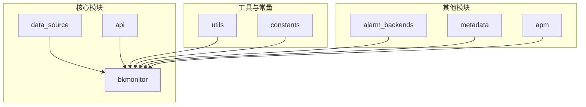
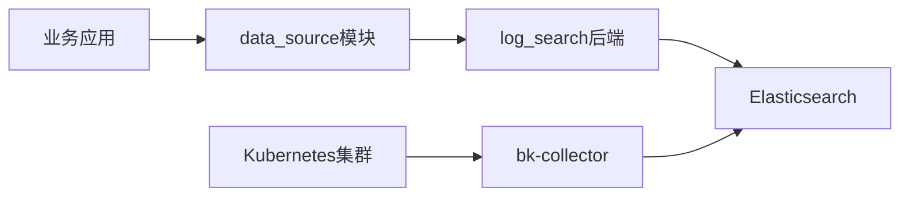
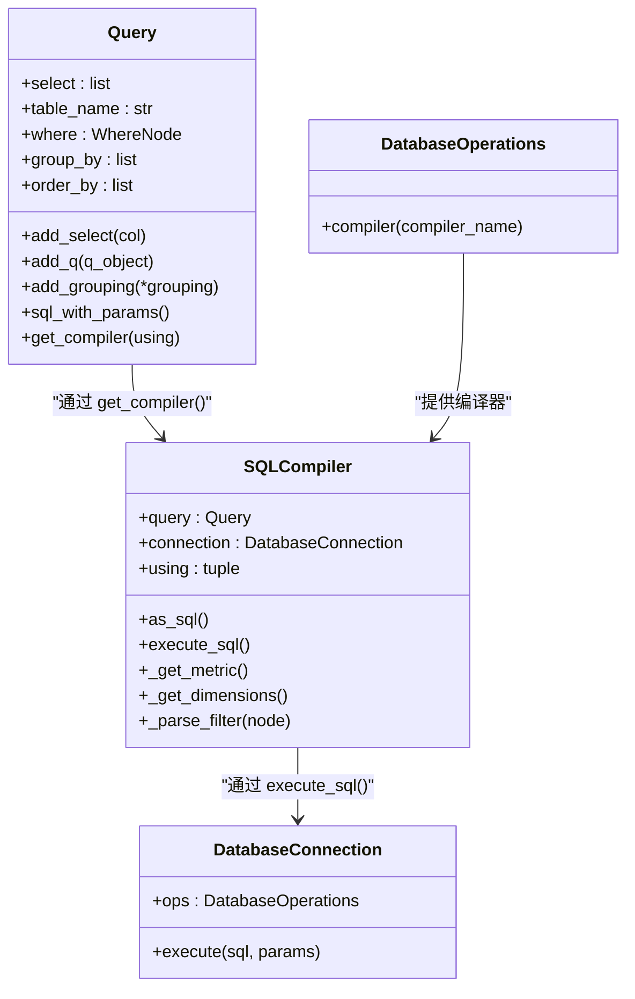
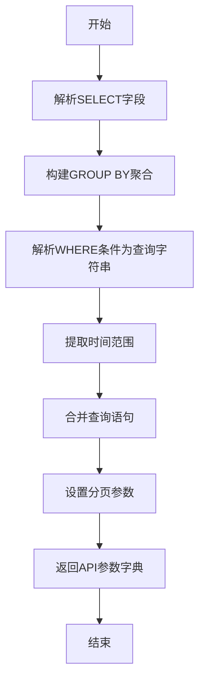
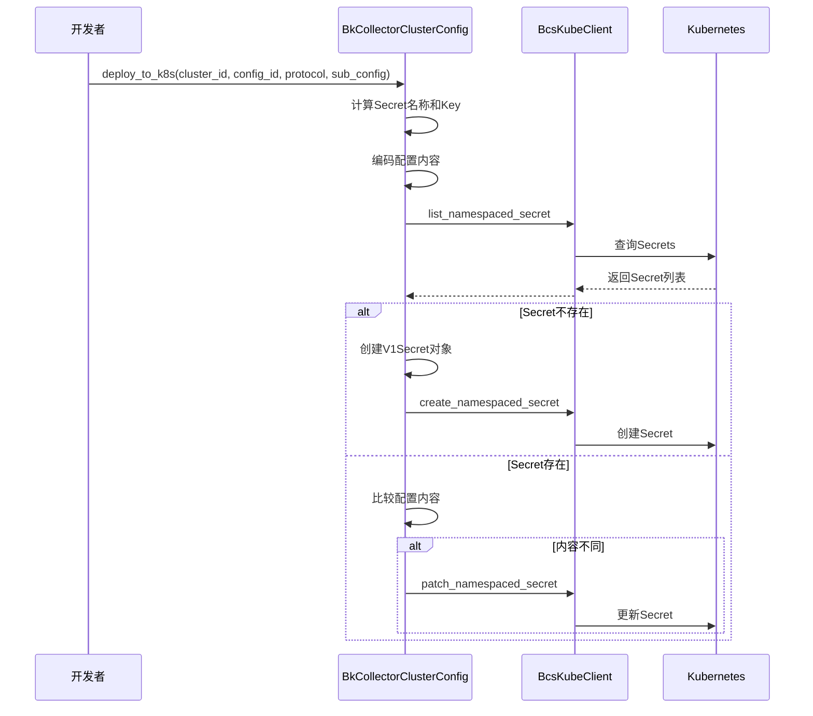
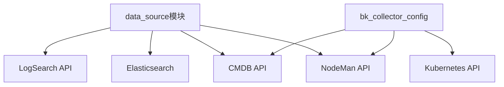

# 日志数据采集

<cite>
**本文档引用的文件**   
- [README.md](file://bkmonitor\bkmonitor\data_source\README.md)
- [query.py](file://bkmonitor\bkmonitor\data_source\models\sql\query.py)
- [compiler.py](file://bkmonitor\bkmonitor\data_source\backends\log_search\compiler.py)
- [connection.py](file://bkmonitor\bkmonitor\data_source\backends\log_search\connection.py)
- [data_source.py](file://bkmonitor\bkmonitor\data_source\__init__.py)
- [bk_collector_config.py](file://bkmonitor\bkmonitor\utils\bk_collector_config.py)
- [bk_collector.py](file://bkmonitor\constants\bk_collector.py)
- [data_source.py](file://bkmonitor\constants\data_source.py)
- [log_search.py](file://bkmonitor\bkmonitor\data_source\handler\log_search.py)
- [elasticsearch.py](file://bkmonitor\bkmonitor\utils\elasticsearch\handler.py)
</cite>

## 目录

1. [简介](#简介)
2. [项目结构](#项目结构)
3. [核心组件](#核心组件)
4. [架构概述](#架构概述)
5. [详细组件分析](#详细组件分析)
6. [依赖分析](#依赖分析)
7. [性能考虑](#性能考虑)
8. [故障排除指南](#故障排除指南)
9. [结论](#结论)

## 简介

本文档深入解析了日志数据采集的全流程，涵盖日志源接入、解析规则配置、字段提取和索引构建等关键环节。文档详细说明了如何通过Elasticsearch、LogSearch等系统实现高效的日志采集与查询。提供了日志采集配置的代码示例，展示了日志格式识别、正则匹配和结构化处理的实现方式。同时，记录了日志采集过程中的常见问题及解决方案，如日志丢失、解析失败等，并为开发者提供了日志采集性能优化建议，包括缓冲策略、批量上传和错误重试机制。

## 项目结构

该项目是一个复杂的监控平台，其核心功能围绕日志和指标数据的采集、处理与查询。项目结构清晰地划分为多个模块，每个模块负责特定的功能。`bkmonitor` 是主模块，包含了数据源管理、告警后端、API接口等核心功能。`api` 模块提供了与外部系统（如CMDB、GSE、LogSearch）的集成接口。`data_source` 模块是日志采集和查询的核心，它提供了一个统一的查询入口，支持多种数据类型（时序、日志、事件）和数据源（监控采集器、计算平台、日志平台）。`utils` 和 `constants` 模块则提供了通用的工具函数和常量定义，支撑整个系统的运行。

**图源**
- [README.md](file://bkmonitor\bkmonitor\data_source\README.md)

**节源**
- [README.md](file://bkmonitor\bkmonitor\data_source\README.md)

## 核心组件

日志数据采集的核心组件主要包括数据源管理、日志搜索后端和采集器配置管理。`data_source` 模块是整个日志采集流程的中枢，它通过抽象的查询接口（如 `Query` 和 `RawQuery`）屏蔽了底层存储（如Elasticsearch）的复杂性，为上层应用提供了统一的数据访问方式。`log_search` 后端是 `data_source` 模块针对日志平台的具体实现，它负责将高级查询语句编译成日志平台（如ES）可理解的DSL，并处理查询结果。`bk_collector_config` 工具类则负责管理日志采集器（bk-collector）在Kubernetes集群中的部署和配置下发，确保日志能够被正确地采集和上报。

**节源**
- [query.py](file://bkmonitor\bkmonitor\data_source\models\sql\query.py)
- [bk_collector_config.py](file://bkmonitor\bkmonitor\utils\bk_collector_config.py)
- [compiler.py](file://bkmonitor\bkmonitor\data_source\backends\log_search\compiler.py)

## 架构概述

整个日志采集系统采用分层架构设计。最上层是业务应用，它们通过 `data_source` 模块提供的统一API发起数据查询请求。中间层是 `data_source` 模块，它根据请求的数据源和类型，动态加载相应的后端（如 `log_search`），并将查询请求转换为底层存储的原生查询语言。最底层是数据存储和采集层，包括Elasticsearch集群用于存储日志数据，以及部署在各个Kubernetes集群中的 `bk-collector` 代理负责从应用容器中采集日志并发送到ES。这种架构实现了查询逻辑与存储细节的解耦，提高了系统的灵活性和可维护性。

**图源**
- [query.py](file://bkmonitor\bkmonitor\data_source\models\sql\query.py)
- [connection.py](file://bkmonitor\bkmonitor\data_source\backends\log_search\connection.py)
- [bk_collector_config.py](file://bkmonitor\bkmonitor\utils\bk_collector_config.py)

## 详细组件分析

### 数据源查询组件分析

`data_source` 模块的核心是 `Query` 类，它提供了一个类似Django ORM的链式调用接口，允许用户以声明式的方式构建复杂的查询。`Query` 对象在执行时，会通过 `get_compiler` 方法获取对应的 `SQLCompiler` 实例。`SQLCompiler` 负责将 `Query` 对象中的各种条件（如 `select`, `where`, `group_by`）编译成一个包含查询参数的字典，然后由 `DatabaseConnection` 将这个字典传递给底层的API（如 `api.log_search.es_query_search`）来执行实际的查询。

**图源**
- [query.py](file://bkmonitor\bkmonitor\data_source\models\sql\query.py)
- [compiler.py](file://bkmonitor\bkmonitor\data_source\backends\log_search\compiler.py)
- [connection.py](file://bkmonitor\bkmonitor\data_source\backends\log_search\connection.py)

**节源**
- [query.py](file://bkmonitor\bkmonitor\data_source\models\sql\query.py)
- [compiler.py](file://bkmonitor\bkmonitor\data_source\backends\log_search\compiler.py)

### 日志搜索后端编译器分析

`log_search` 后端的 `SQLCompiler` 是实现日志查询的关键。它重写了 `as_sql` 方法，将 `Query` 对象转换为调用日志搜索API所需的参数。其主要工作包括：
1.  **解析选择字段**：从 `select` 中提取聚合方法（如 `count`, `sum`）、指标字段和别名。
2.  **构建过滤条件**：将 `where` 条件树（由 `Q` 对象构成）递归解析为日志平台支持的查询字符串（如 `field: "value"` 或 `NOT field: "value"`），并处理特殊字符的转义。
3.  **处理聚合维度**：将 `group_by` 字段转换为ES的 `terms` 聚合，并将时间聚合（如 `time(60s)`）转换为 `date_histogram`。
4.  **设置时间范围**：从 `where` 条件中提取 `dtEventTimeStamp__gte` 和 `dtEventTimeStamp__lte`，转换为API所需的 `start_time` 和 `end_time`（秒级时间戳）。
5.  **合并查询语句**：将原始查询字符串（`raw_query_string`）和由 `where` 条件生成的过滤字符串合并。

**图源**
- [compiler.py](file://bkmonitor\bkmonitor\data_source\backends\log_search\compiler.py)

**节源**
- [compiler.py](file://bkmonitor\bkmonitor\data_source\backends\log_search\compiler.py)

### 采集器配置管理分析

`BkCollectorConfig` 和 `BkCollectorClusterConfig` 类负责管理 `bk-collector` 的部署和配置。`BkCollectorConfig` 主要处理与CMDB和节点管理（NodeMan）的交互，用于获取目标主机列表。`BkCollectorClusterConfig` 则专注于Kubernetes环境，它通过 `BcsKubeClient` 与K8s API交互，实现配置的动态下发。其核心逻辑是将采集配置（`sub_config`）进行GZIP压缩和Base64编码后，存储到K8s的 `Secret` 资源中。为了管理大量的配置，系统采用了分片策略，将配置ID按范围（如1-20, 21-40）分配到不同的 `Secret` 中，避免单个 `Secret` 过大。

**图源**
- [bk_collector_config.py](file://bkmonitor\bkmonitor\utils\bk_collector_config.py)
- [bk_collector.py](file://bkmonitor\constants\bk_collector.py)

**节源**
- [bk_collector_config.py](file://bkmonitor\bkmonitor\utils\bk_collector_config.py)

## 依赖分析

该日志采集系统依赖于多个内部和外部服务。核心依赖包括：
*   **CMDB**：用于获取主机、业务和集群的元数据信息。
*   **NodeMan**：用于管理节点和代理（如 `bk-collector`）的部署。
*   **GSE**：通用服务引擎，可能用于指令下发。
*   **Elasticsearch**：作为日志数据的主要存储后端。
*   **Kubernetes API**：用于在容器化环境中管理 `bk-collector` 的部署。
*   **LogSearch API**：提供日志查询服务。

**图源**
- [data_source.py](file://bkmonitor\bkmonitor\data_source\__init__.py)
- [bk_collector_config.py](file://bkmonitor\bkmonitor\utils\bk_collector_config.py)

**节源**
- [data_source.py](file://bkmonitor\bkmonitor\data_source\__init__.py)
- [bk_collector_config.py](file://bkmonitor\bkmonitor\utils\bk_collector_config.py)

## 性能考虑

为了保证日志采集和查询的高性能，系统在设计上做了多方面的优化：
1.  **批量处理**：`bk-collector` 会将采集到的日志进行缓冲和批量发送，减少网络请求次数。
2.  **连接池**：与Elasticsearch等后端服务的连接应使用连接池，避免频繁创建和销毁连接的开销。
3.  **索引优化**：Elasticsearch的索引设计（如分片、副本、映射）对查询性能至关重要，应根据数据量和查询模式进行合理配置。
4.  **查询优化**：在 `log_search` 编译器中，应尽量使用精确的过滤条件和合理的聚合粒度，避免全表扫描和过大的结果集。`GRAPH_MAX_SLIMIT` 等常量用于限制单图展示的线条数，防止前端性能问题。
5.  **错误重试**：在数据上报和配置下发过程中，应实现指数退避等重试机制，以应对网络抖动。

## 故障排除指南

在日志采集过程中，可能会遇到以下常见问题：

**问题：日志数据丢失**
*   **原因**：`bk-collector` 代理未正常运行、网络不通、Elasticsearch集群写入压力过大。
*   **解决方案**：检查 `bk-collector` 的Pod状态和日志；检查网络连通性；监控ES的写入延迟和线程池状态。

**问题：日志解析失败**
*   **原因**：日志格式与配置的解析规则不匹配、正则表达式错误。
*   **解决方案**：在日志平台中验证解析规则；检查日志样本是否符合预期格式。

**问题：查询性能低下**
*   **原因**：查询时间范围过大、未使用索引字段进行过滤、聚合维度过多。
*   **解决方案**：缩小时间范围；确保 `where` 条件中包含高基数的索引字段；减少 `group_by` 的字段数量。

**节源**
- [bk_collector_config.py](file://bkmonitor\bkmonitor\utils\bk_collector_config.py)
- [compiler.py](file://bkmonitor\bkmonitor\data_source\backends\log_search\compiler.py)

## 结论

本文档全面解析了 `bk-monitor` 项目中的日志数据采集系统。该系统通过 `data_source` 模块实现了对多种数据源的统一查询，其 `log_search` 后端能够高效地将高级查询编译为ES DSL。同时，通过 `bk-collector` 和 `BkCollectorClusterConfig` 实现了对日志采集器的自动化部署和配置管理。整体架构清晰，组件职责分明，为大规模日志数据的采集、存储和查询提供了一个健壮的解决方案。开发者在使用时，应重点关注查询性能优化和错误处理机制，以确保系统的稳定运行。