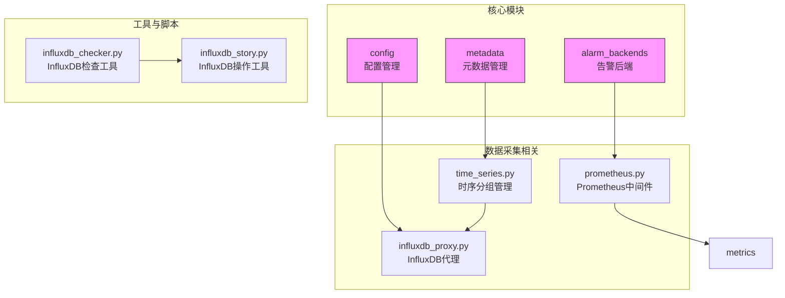
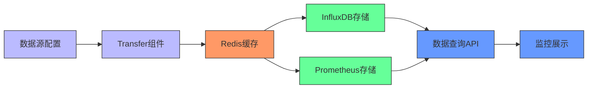
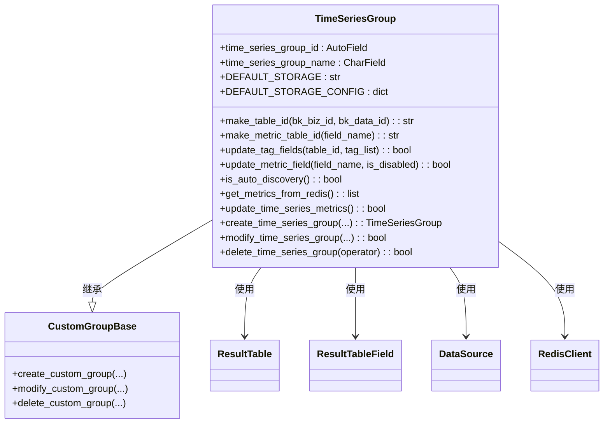
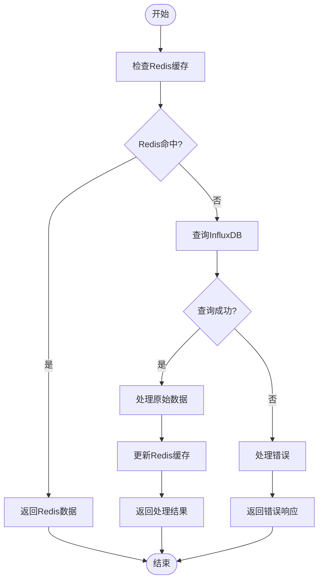
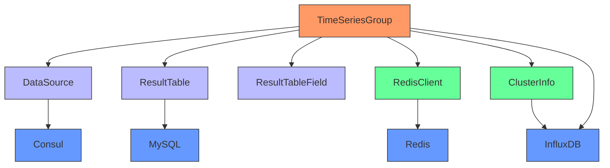

# 时序数据采集

<cite>
**本文档引用的文件**   
- [time_series.py](file://bkmonitor\metadata\models\custom_report\time_series.py)
- [influxdb_proxy.py](file://bkmonitor\config\tools\influxdb_proxy.py)
- [prometheus.py](file://bkmonitor\bkmonitor\middlewares\prometheus.py)
- [metrics.py](file://bkmonitor\core\prometheus\metrics.py)
- [custom_ts_group.py](file://bkmonitor\alarm_backends\core\cache\models\custom_ts_group.py)
- [custom_time_series.md](file://bkmonitor\support-files\apigw\docs\zh\custom_time_series.md)
- [告警数据的来源.md](file://bkmonitor\wiki\告警数据的来源.md)
- [influxdb_checker.py](file://bkmonitor\scripts\influxdb_checker.py)
- [influxdb_story.py](file://bkmonitor\alarm_backends\management\story\influxdb_story.py)
</cite>

## 目录
1. [简介](#简介)
2. [项目结构](#项目结构)
3. [核心组件](#核心组件)
4. [架构概述](#架构概述)
5. [详细组件分析](#详细组件分析)
6. [依赖分析](#依赖分析)
7. [性能考虑](#性能考虑)
8. [故障排除指南](#故障排除指南)
9. [结论](#结论)

## 简介
本文档详细说明了蓝鲸监控平台中时序数据采集的实现机制。系统通过自定义时序分组（TimeSeriesGroup）管理数据源配置，支持InfluxDB和Prometheus等多种后端存储系统。数据采集流程包括数据源配置、采集周期管理、指标定义和数据聚合等关键环节。平台采用Redis作为中间缓存层，实现数据的异步处理和系统解耦，确保监控平台的高可用性和扩展性。

## 项目结构
蓝鲸监控平台的项目结构体现了模块化设计原则，各功能模块按目录组织，职责分明。时序数据采集相关功能主要分布在metadata、config和alarm_backends等模块中。



**图源**
- [time_series.py](file://bkmonitor\metadata\models\custom_report\time_series.py)
- [influxdb_proxy.py](file://bkmonitor\config\tools\influxdb_proxy.py)
- [prometheus.py](file://bkmonitor\bkmonitor\middlewares\prometheus.py)
- [influxdb_checker.py](file://bkmonitor\scripts\influxdb_checker.py)
- [influxdb_story.py](file://bkmonitor\alarm_backends\management\story\influxdb_story.py)

**本节来源**
- [time_series.py](file://bkmonitor\metadata\models\custom_report\time_series.py)
- [influxdb_proxy.py](file://bkmonitor\config\tools\influxdb_proxy.py)
- [prometheus.py](file://bkmonitor\bkmonitor\middlewares\prometheus.py)

## 核心组件
时序数据采集的核心组件是TimeSeriesGroup类，它负责管理自定义时序分组的生命周期，包括创建、修改、删除和指标同步等操作。该类定义了默认存储为InfluxDB，并通过Redis缓存指标数据，实现高效的指标发现和管理。

```python
class TimeSeriesGroup(CustomGroupBase):
    # 默认存储INFLUXDB
    DEFAULT_STORAGE = ClusterInfo.TYPE_INFLUXDB
    
    # 默认INFLUXDB存储配置
    DEFAULT_STORAGE_CONFIG = {"use_default_rp": True}
    
    @property
    def metric_consul_path(self):
        return f"{config.CONSUL_PATH}/influxdb_metrics/{self.bk_data_id}/time_series_metric"
```

**本节来源**
- [time_series.py](file://bkmonitor\metadata\models\custom_report\time_series.py)

## 架构概述
时序数据采集系统采用分层架构设计，包含数据源管理层、缓存层、存储层和应用层。数据采集流程从数据源配置开始，通过Transfer组件上报数据到Redis缓存，再由后台任务同步到InfluxDB等持久化存储。



**图源**
- [time_series.py](file://bkmonitor\metadata\models\custom_report\time_series.py)
- [influxdb_proxy.py](file://bkmonitor\config\tools\influxdb_proxy.py)
- [prometheus.py](file://bkmonitor\bkmonitor\middlewares\prometheus.py)

## 详细组件分析
### TimeSeriesGroup类分析
TimeSeriesGroup类是时序数据采集的核心，提供了完整的生命周期管理功能。

#### 类图


**图源**
- [time_series.py](file://bkmonitor\metadata\models\custom_report\time_series.py)

#### 数据采集流程


**图源**
- [time_series.py](file://bkmonitor\metadata\models\custom_report\time_series.py)
- [influxdb_proxy.py](file://bkmonitor\config\tools\influxdb_proxy.py)

**本节来源**
- [time_series.py](file://bkmonitor\metadata\models\custom_report\time_series.py)

## 依赖分析
时序数据采集系统依赖多个核心组件和服务，形成了复杂的依赖关系网络。



**图源**
- [time_series.py](file://bkmonitor\metadata\models\custom_report\time_series.py)
- [influxdb_proxy.py](file://bkmonitor\config\tools\influxdb_proxy.py)

**本节来源**
- [time_series.py](file://bkmonitor\metadata\models\custom_report\time_series.py)

## 性能考虑
时序数据采集系统在设计时充分考虑了性能优化，采用了多种技术手段确保系统的高效运行。

1. **批量操作**：使用bulk_create和bulk_update方法进行数据库批量操作，减少数据库交互次数
2. **分页查询**：通过filter_model_by_in_page函数实现分页查询，避免一次性加载大量数据
3. **缓存机制**：利用Redis作为缓存层，减少对后端存储的直接访问
4. **异步处理**：数据采集和处理采用异步方式，提高系统响应速度
5. **连接池**：使用连接池管理数据库连接，减少连接创建开销

## 故障排除指南
### 常见问题及解决方案
1. **指标数据缺失**
   - 检查Redis中是否存在对应数据：`client.zrangebyscore(custom_metrics_key, valid_begin_ts, now_time.timestamp())`
   - 验证数据源配置是否正确
   - 检查Transfer组件是否正常运行

2. **InfluxDB连接失败**
   - 使用influxdb_checker.py脚本检查InfluxDB状态
   - 验证consul配置中的连接参数
   - 检查网络连通性

3. **指标同步延迟**
   - 检查Redis数据过期时间设置
   - 验证update_time_series_metrics任务执行频率
   - 监控系统资源使用情况

**本节来源**
- [time_series.py](file://bkmonitor\metadata\models\custom_report\time_series.py)
- [influxdb_checker.py](file://bkmonitor\scripts\influxdb_checker.py)

## 结论
蓝鲸监控平台的时序数据采集系统通过TimeSeriesGroup类实现了完整的生命周期管理，支持InfluxDB和Prometheus等多种存储后端。系统采用Redis作为中间缓存层，实现了数据的异步处理和系统解耦。通过批量操作、分页查询和连接池等技术手段，确保了系统的高性能和可扩展性。未来可进一步优化指标发现算法，提高大规模场景下的数据处理效率。