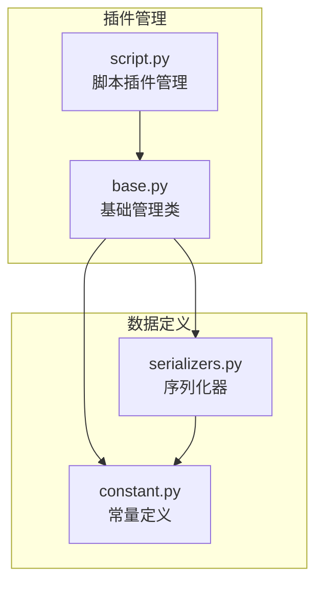
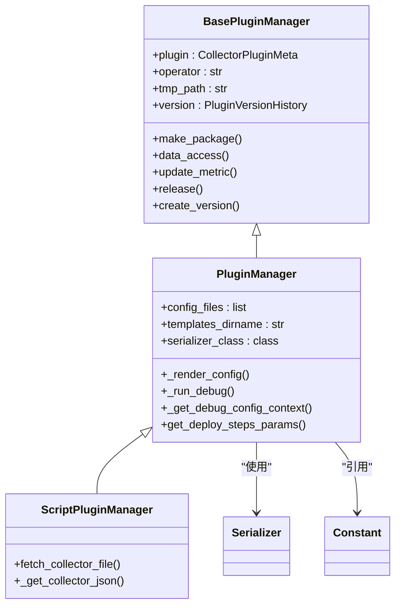
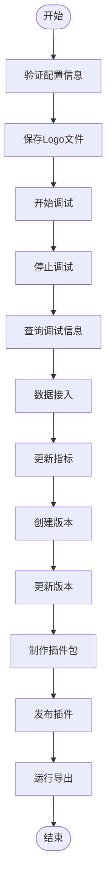
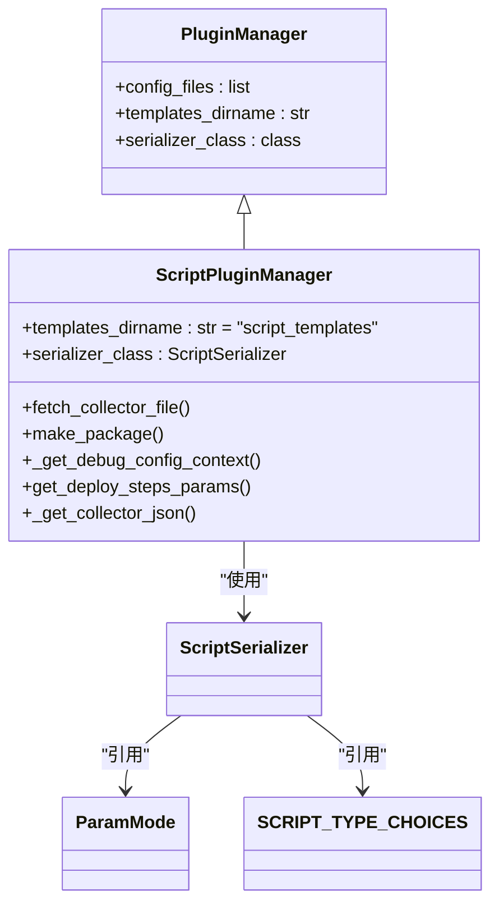
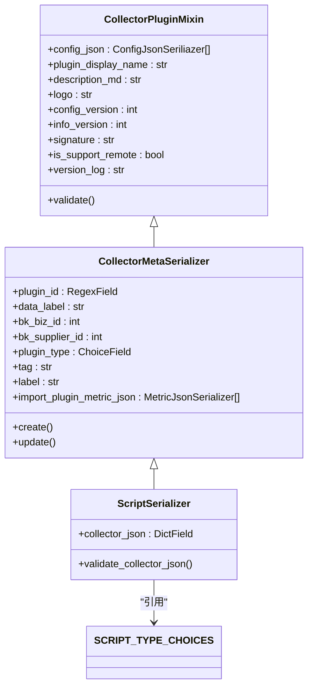
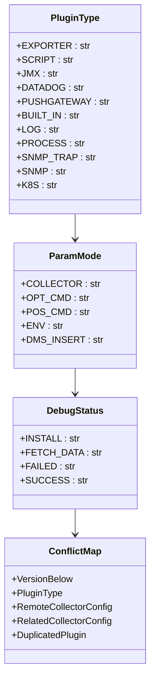
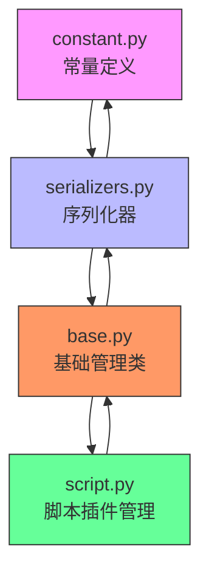
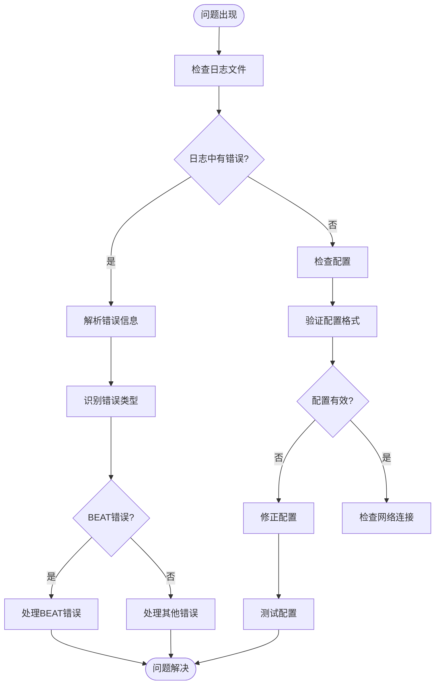

# 自定义数据采集

<cite>
**本文档引用的文件**   
- [base.py](file://bkmonitor/packages/monitor_web/plugin/manager/base.py)
- [script.py](file://bkmonitor/packages/monitor_web/plugin/manager/script.py)
- [serializers.py](file://bkmonitor/packages/monitor_web/plugin/serializers.py)
- [constant.py](file://bkmonitor/packages/monitor_web/plugin/constant.py)
</cite>

## 目录
1. [引言](#引言)
2. [项目结构](#项目结构)
3. [核心组件](#核心组件)
4. [架构概述](#架构概述)
5. [详细组件分析](#详细组件分析)
6. [依赖分析](#依赖分析)
7. [性能考虑](#性能考虑)
8. [故障排除指南](#故障排除指南)
9. [结论](#结论)

## 引言
本文档详细说明了蓝鲸监控平台中自定义数据采集的扩展机制。文档涵盖了插件化架构设计、采集器接口规范、注册机制以及自定义采集器的开发和部署流程。通过分析核心代码文件，本文档为开发者提供了从零开始创建自定义采集器的完整指南，包括数据格式定义、采集逻辑实现、错误处理、调试方法、安全验证和版本兼容性要求。

## 项目结构
自定义数据采集功能主要位于`bkmonitor/packages/monitor_web/plugin/`目录下，包含管理器、序列化器和常量定义等核心模块。

**图源**
- [base.py](file://bkmonitor/packages/monitor_web/plugin/manager/base.py)
- [script.py](file://bkmonitor/packages/monitor_web/plugin/manager/script.py)
- [serializers.py](file://bkmonitor/packages/monitor_web/plugin/serializers.py)
- [constant.py](file://bkmonitor/packages/monitor_web/plugin/constant.py)

**本节来源**
- [base.py](file://bkmonitor/packages/monitor_web/plugin/manager/base.py)
- [script.py](file://bkmonitor/packages/monitor_web/plugin/manager/script.py)

## 核心组件
自定义数据采集系统的核心组件包括插件管理基类、具体插件管理器、序列化器和常量定义。这些组件共同构成了一个完整的插件化采集框架。

**本节来源**
- [base.py](file://bkmonitor/packages/monitor_web/plugin/manager/base.py#L1-L50)
- [serializers.py](file://bkmonitor/packages/monitor_web/plugin/serializers.py#L1-L30)

## 架构概述
自定义数据采集系统采用插件化架构设计，通过基类定义通用接口，具体插件类型继承基类实现特定功能。系统通过序列化器验证数据格式，通过常量定义统一配置标准。

**图源**
- [base.py](file://bkmonitor/packages/monitor_web/plugin/manager/base.py#L100-L200)
- [script.py](file://bkmonitor/packages/monitor_web/plugin/manager/script.py#L10-L50)

## 详细组件分析

### 插件管理基类分析
`BasePluginManager`是所有插件管理器的基类，定义了插件管理的核心接口和通用功能。

**图源**
- [base.py](file://bkmonitor/packages/monitor_web/plugin/manager/base.py#L50-L100)

**本节来源**
- [base.py](file://bkmonitor/packages/monitor_web/plugin/manager/base.py#L1-L1170)

### 脚本插件管理器分析
`ScriptPluginManager`是脚本类型插件的具体实现，处理脚本采集器的特殊逻辑。

**图源**
- [script.py](file://bkmonitor/packages/monitor_web/plugin/manager/script.py#L10-L30)

**本节来源**
- [script.py](file://bkmonitor/packages/monitor_web/plugin/manager/script.py#L1-L273)

### 序列化器分析
序列化器定义了插件配置的数据结构和验证规则，确保数据格式的正确性。

**图源**
- [serializers.py](file://bkmonitor/packages/monitor_web/plugin/serializers.py#L50-L100)

**本节来源**
- [serializers.py](file://bkmonitor/packages/monitor_web/plugin/serializers.py#L1-L318)

### 常量定义分析
常量文件定义了系统中使用的所有常量，包括插件类型、参数模式、错误代码等。

**图源**
- [constant.py](file://bkmonitor/packages/monitor_web/plugin/constant.py#L100-L150)

**本节来源**
- [constant.py](file://bkmonitor/packages/monitor_web/plugin/constant.py#L1-L204)

## 依赖分析
自定义数据采集系统的组件之间存在清晰的依赖关系，形成了一个层次化的架构。

**图源**
- [base.py](file://bkmonitor/packages/monitor_web/plugin/manager/base.py)
- [script.py](file://bkmonitor/packages/monitor_web/plugin/manager/script.py)
- [serializers.py](file://bkmonitor/packages/monitor_web/plugin/serializers.py)
- [constant.py](file://bkmonitor/packages/monitor_web/plugin/constant.py)

**本节来源**
- [base.py](file://bkmonitor/packages/monitor_web/plugin/manager/base.py)
- [script.py](file://bkmonitor/packages/monitor_web/plugin/manager/script.py)

## 性能考虑
自定义数据采集系统在设计时考虑了性能因素，通过以下机制确保系统的高效运行：
- 使用MD5哈希值检测配置变更，避免不必要的重新打包
- 异步处理数据接入和指标缓存更新
- 批量处理配置文件发布
- 缓存频繁访问的数据

## 故障排除指南
当自定义采集器出现问题时，可以按照以下步骤进行排查：

**本节来源**
- [base.py](file://bkmonitor/packages/monitor_web/plugin/manager/base.py#L600-L800)
- [constant.py](file://bkmonitor/packages/monitor_web/plugin/constant.py#L10-L50)

## 结论
蓝鲸监控平台的自定义数据采集系统提供了一个强大而灵活的插件化架构，允许开发者轻松创建和管理自定义采集器。通过遵循本文档中描述的接口规范和最佳实践，开发者可以高效地开发、部署和维护自定义采集器，满足各种监控需求。