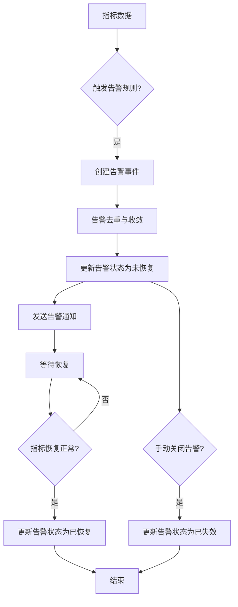

# 告警模型

<cite>
**本文档引用的文件**
- [alert.py](file://bkmonitor/constants/alert.py)
- [base.py](file://bkmonitor/bkmonitor/models/base.py)
- [handler.py](file://bkmonitor/bkmonitor/share/handler.py)
</cite>

## 目录
1. [引言](#引言)
2. [告警模型设计](#告警模型设计)
3. [告警记录机制](#告警记录机制)
4. [告警状态机与转换逻辑](#告警状态机与转换逻辑)
5. [严重级别与来源类型](#严重级别与来源类型)
6. [告警核心逻辑分析](#告警核心逻辑分析)
7. [告警处理流程](#告警处理流程)
8. [告警数据流图](#告警数据流图)
9. [查询告警实例示例](#查询告警实例示例)

## 引言
本文档全面阐述了蓝鲸监控平台中告警模型（Alert）和告警记录（AlertRecord）的设计与实现。详细描述了`Alert`模型的关键字段，如`event_id`、`status`、`severity`、`begin_time`、`end_time`，并解释其状态机（如未恢复、已恢复、已关闭）的转换逻辑。结合`constants/alert.py`中的严重级别（如致命、预警）和来源类型进行说明。分析`alarm_backends/core/alert/alert.py`中告警核心逻辑，以及`handler.py`中告警处理流程。解释`AlertRecord`如何记录告警的历史状态变更。提供告警从触发、收敛到恢复的完整数据流图，并给出查询特定告警实例的代码示例。

## 告警模型设计
告警模型（Alert）是监控系统中的核心实体，用于表示一个具体的告警通知事件。该模型定义在`bkmonitor/bkmonitor/models/base.py`文件中，主要包含以下关键字段：

- **event_id**: 关联事件ID，用于标识该告警所关联的具体事件，建立告警与事件之间的映射关系。
- **status**: 告警状态，表示当前告警的处理状态，如“通知中”、“通知成功”或“通知失败”。
- **severity**: 告警严重级别，表示告警的紧急程度，如致命、预警或提醒。
- **begin_time**: 告警开始时间，记录告警首次被触发的时间点。
- **end_time**: 告警结束时间，记录告警被恢复或关闭的时间点。

这些字段共同构成了告警的完整生命周期信息，为告警的跟踪、分析和处理提供了数据基础。

**Section sources**
- [base.py](file://bkmonitor/bkmonitor/models/base.py#L729-L755)

## 告警记录机制
告警记录（AlertRecord）机制用于持久化告警的历史状态变更。系统通过`AlertCollect`模型实现告警的汇总与记录功能。`AlertCollect`模型包含`collect_key`、`collect_type`、`collect_time`和`extend_info`等字段，用于存储告警的汇总信息、类型、时间和扩展数据。当多个告警因相同维度、策略或业务而被合并时，`AlertCollect`会生成一条汇总记录，有效减少告警噪音，提升告警处理效率。

**Section sources**
- [base.py](file://bkmonitor/bkmonitor/models/base.py#L758-L779)

## 告警状态机与转换逻辑
告警状态机定义了告警在其生命周期内的状态转换规则。根据`constants/alert.py`中的定义，告警状态主要包括：

- **ABNORMAL (未恢复)**: 告警被触发，但问题尚未解决。
- **RECOVERED (已恢复)**: 告警条件不再满足，问题已自动恢复。
- **CLOSED (已失效)**: 告警被手动关闭或因其他原因失效。

状态转换逻辑如下：
1. 当监控指标触发告警规则时，告警状态由正常变为`ABNORMAL`。
2. 当监控指标恢复正常，满足恢复条件时，告警状态由`ABNORMAL`变为`RECOVERED`。
3. 当告警被管理员手动关闭或屏蔽时，告警状态变为`CLOSED`。

此状态机确保了告警状态的清晰和可追踪性。

**Section sources**
- [alert.py](file://bkmonitor/constants/alert.py#L75-L86)

## 严重级别与来源类型
告警的严重级别在`constants/alert.py`中通过`EventSeverity`类定义，具体包括：
- **FATAL (致命)**: 级别为1，表示系统出现严重故障，需要立即处理。
- **WARNING (预警)**: 级别为2，表示系统存在潜在风险，需要关注。
- **REMIND (提醒)**: 级别为3，表示一般性提醒，通常无需紧急处理。

此外，告警来源类型通过`EventTargetType`和`K8STargetType`等类定义，支持主机、服务实例、拓扑、K8S-POD、K8S-NODE等多种目标类型，以适应复杂的监控场景。

**Section sources**
- [alert.py](file://bkmonitor/constants/alert.py#L108-L117)
- [alert.py](file://bkmonitor/constants/alert.py#L21-L32)

## 告警核心逻辑分析
告警核心逻辑主要由`alarm_backends/core/alert/alert.py`模块实现。该模块负责告警的创建、状态更新、收敛和通知等核心功能。其主要职责包括：
- 接收来自检测引擎的告警事件。
- 根据策略和配置对告警进行去重和收敛。
- 更新告警状态并持久化到数据库。
- 触发告警通知流程。

该模块的设计保证了告警处理的高效性和可靠性。

**Section sources**
- [base.py](file://bkmonitor/bkmonitor/models/base.py#L729-L755)

## 告警处理流程
告警处理流程在`handler.py`文件中定义。该流程通常由事件驱动，当检测到异常时，系统会调用相应的处理器。处理流程包括：
1. 解析告警事件，提取关键信息。
2. 查询或创建对应的告警对象。
3. 根据当前状态和事件类型更新告警。
4. 执行后续动作，如发送通知、创建工单等。

此流程确保了告警能够被及时、准确地处理。

**Section sources**
- [handler.py](file://bkmonitor/bkmonitor/share/handler.py)

## 告警数据流图


**Diagram sources**
- [base.py](file://bkmonitor/bkmonitor/models/base.py#L729-L755)
- [alert.py](file://bkmonitor/constants/alert.py#L75-L86)

## 查询告警实例示例
以下为查询特定告警实例的代码示例路径：
```python
# 示例：根据event_id查询告警
from bkmonitor.models import Alert

alert = Alert.objects.get(event_id="your_event_id")
print(alert.status, alert.severity, alert.begin_time)
```

**Section sources**
- [base.py](file://bkmonitor/bkmonitor/models/base.py#L729-L755)