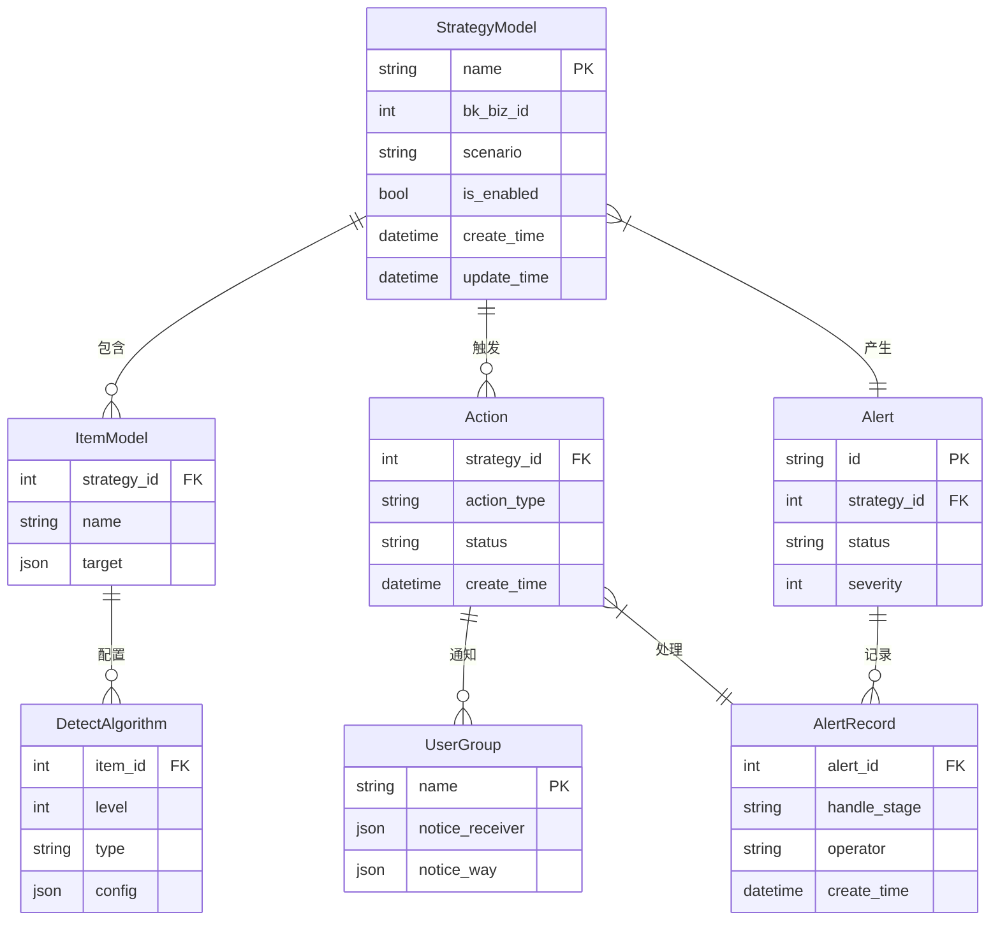

# 核心监控模型

<cite>
**本文档引用的文件**
- [strategy.py](file://bkmonitor/bkmonitor/models/strategy.py)
- [alert.py](file://bkmonitor/bkmonitor/models/alert.py)
- [action.py](file://bkmonitor/bkmonitor/models/action.py)
- [constants/strategy.py](file://constants/strategy.py)
- [constants/alert.py](file://constants/alert.py)
- [constants/action.py](file://constants/action.py)
</cite>

## 目录
1. [监控策略与检测算法](#监控策略与检测算法)
2. [告警与告警记录](#告警与告警记录)
3. [动作实例与通知组](#动作实例与通知组)
4. [核心枚举常量](#核心枚举常量)
5. [实体关系图](#实体关系图)

## 监控策略与检测算法

本节详细描述 `strategy.py` 文件中定义的监控策略（`StrategyModel`）和检测算法（`DetectAlgorithm`）实体。

`StrategyModel` 是策略配置的核心模型，用于定义监控策略的基本信息和配置。其主要字段包括：
- **name**: 策略名称，字符串类型，最大长度128字符。
- **bk_biz_id**: 业务ID，整数类型，用于标识策略所属的业务。
- **source**: 来源系统，字符串类型，标识策略的创建来源。
- **scenario**: 监控场景，字符串类型，如 "os"（主机）、"service_module"（服务模块）等。
- **type**: 策略类型，字符串类型，可选值包括 "monitor"（监控）、"fta"（故障自愈）等。
- **is_enabled**: 是否启用，布尔类型，标识策略当前是否处于激活状态。
- **is_invalid**: 是否失效，布尔类型，标识策略是否因配置错误等原因失效。
- **invalid_type**: 失效类型，字符串类型，描述策略失效的具体原因。
- **create_user** 和 **update_user**: 创建人和最后修改人，字符串类型。
- **create_time** 和 **update_time**: 创建时间和最后修改时间，日期时间类型。
- **labels**: 策略标签，通过 `StrategyLabel` 模型关联，用于对策略进行分类和管理。
- **priority**: 优先级，整数类型，用于在多个策略匹配时确定执行顺序。
- **priority_group_key**: 优先级分组键，字符串类型，用于将策略分组以实现更精细的优先级控制。

`DetectAlgorithm` 模型（在代码中为 `AlgorithmModel`）用于定义具体的检测算法，与 `StrategyModel` 通过 `ItemModel`（监控项）进行关联。其主要字段包括：
- **strategy_id**: 关联策略ID，整数类型，外键指向 `StrategyModel`。
- **item_id**: 关联监控项ID，整数类型，外键指向 `ItemModel`。
- **level**: 告警级别，整数类型，可选值为1（致命）、2（预警）、3（提醒）。
- **type**: 算法类型，字符串类型，是核心的业务约束，定义了检测的逻辑。根据 `constants/strategy.py` 中的 `AlgorithmChoices` 枚举，支持多种算法，例如：
  - `Threshold`: 静态阈值算法
  - `SimpleRingRatio`: 简易环比算法
  - `SimpleYearRound`: 简易同比算法
  - `IntelligentDetect`: 智能异常检测算法
  - `HostAnomalyDetection`: 主机异常检测算法
- **unit_prefix**: 算法单位前缀，字符串类型，用于显示告警值的单位。
- **config**: 算法配置，JSON类型，存储算法特定的配置参数，如阈值、环比/同比的百分比等。

`StrategyModel` 与 `DetectAlgorithm` 之间通过 `ItemModel` 建立了一对多的关系。一个策略可以包含多个监控项（`ItemModel`），而每个监控项又可以配置多个检测算法（`DetectAlgorithm`），从而实现一个策略内对同一指标进行多维度、多级别的检测。

**Section sources**
- [strategy.py](file://bkmonitor/bkmonitor/models/strategy.py#L335-L403)
- [strategy.py](file://bkmonitor/bkmonitor/models/strategy.py#L151-L232)

## 告警与告警记录

本节解释 `alert.py` 中告警（`Alert`）和告警记录（`AlertRecord`）的生命周期与状态转换。

告警（`Alert`）实体代表一个正在发生的异常事件。其生命周期始于监控系统根据策略检测到异常，此时告警状态为 **ABNORMAL**（未恢复）。当系统持续检测到异常时，告警会保持在此状态。

告警的生命周期主要涉及以下状态转换：
1.  **恢复 (Recovered)**: 当关联的检测算法不再满足触发条件时，告警状态会从 `ABNORMAL` 转换为 `RECOVERED`（已恢复）。这表示异常情况已经结束。
2.  **关闭 (Closed)**: 在某些情况下，告警可能被手动关闭或因策略失效、业务变更等原因而失效，此时状态会变为 `CLOSED`（已失效）。

这些状态在 `constants/alert.py` 文件中通过 `EventStatus` 类进行定义：
```python
class EventStatus:
    CLOSED = "CLOSED"
    RECOVERED = "RECOVERED"
    ABNORMAL = "ABNORMAL"
```

告警记录（`AlertRecord`）实体则用于记录告警的整个生命周期和处理过程。它与 `Alert` 实体紧密关联，用于追踪告警的处理阶段（`HandleStage`），如：
- **NOISE_REDUCE** (已抑制): 通过降噪规则被抑制。
- **HANDLE** (已通知): 已经发送通知。
- **SHIELD** (已屏蔽): 被屏蔽规则屏蔽。
- **ACK** (已确认): 被运维人员手动确认。

告警记录还存储了处理过程中的详细信息，如处理人、处理时间、处理意见等，为后续的审计和分析提供数据支持。

**Section sources**
- [alert.py](file://bkmonitor/bkmonitor/models/alert.py)
- [constants/alert.py](file://constants/alert.py#L75-L86)

## 动作实例与通知组

本节说明 `action.py` 中动作实例（`ActionInstance`）和通知组（`NoticeGroup`）的模型设计。

`ActionInstance` 模型（在代码中为 `Action`）代表一个具体的、可执行的动作实例，例如发送通知、执行作业、创建ITSM工单等。其核心设计如下：
- **id**: 主键。
- **config_id**: 配置ID，整数类型，外键指向 `ActionConfig` 模型，标识该实例所使用的动作套餐配置。
- **strategy_id**: 关联策略ID，整数类型，标识该动作实例由哪个策略触发。
- **action_type**: 动作类型，字符串类型，与 `constants/action.py` 中的 `ActionPluginType` 枚举对应，如 `notice`（通知）、`job`（作业平台）、`sops`（标准运维）等。
- **status**: 执行状态，字符串类型，表示动作的当前状态，如 "running"（执行中）、"success"（成功）、"failure"（失败）等。
- **execute_config**: 执行配置，JSON类型，包含执行该动作所需的详细参数，例如作业平台的任务ID、通知内容模板等。
- **create_time** 和 **end_time**: 记录动作的开始和结束时间。

`NoticeGroup` 模型（在代码中为 `UserGroup`）代表一个通知组，即一组接收告警通知的人员或角色。其设计要点包括：
- **name**: 通知组名称，字符串类型。
- **bk_biz_id**: 业务ID，整数类型，标识该通知组所属的业务范围。
- **notice_receiver**: 通知接收人，JSON类型，存储接收人的ID和类型（如 "user" 用户、"group" 用户组）。
- **notice_way**: 通知方式，JSON类型，定义了通过哪些渠道发送通知，如 "weixin"（微信）、"mail"（邮件）、"voice"（电话）等。
- **message**: 通知组描述或备注信息。
- **alert_notice** 和 **action_notice**: 分别存储告警通知和处理动作通知的详细配置，包括不同告警级别、不同时间段的发送规则。

`ActionInstance` 与 `NoticeGroup` 通过中间表 `ActionNoticeMapping` 建立多对多关系。一个动作实例可以向多个通知组发送通知，同时一个通知组也可以被多个不同的动作实例引用。

**Section sources**
- [action.py](file://bkmonitor/bkmonitor/models/action.py)
- [constants/action.py](file://constants/action.py)

## 核心枚举常量

本节利用 `constants/` 目录中的常量文件解释关键的枚举值。

`constants/strategy.py` 文件定义了策略相关的枚举：
- **DataTarget**: 定义了监控数据的目标类型，如 `HOST_TARGET`（主机目标）、`SERVICE_TARGET`（服务目标）。
- **TargetFieldType**: 定义了监控目标的字段类型，如 `host_topo`（主机拓扑）、`service_topo`（服务拓扑）、`host_ip`（主机IP）。
- **SourceType**: 定义了数据的来源类型，如 `BKMONITOR`（监控采集）、`BKDATA`（计算平台）。

`constants/alert.py` 文件定义了告警相关的枚举：
- **EventStatus**: 定义了告警的三种核心状态：`ABNORMAL`（未恢复）、`RECOVERED`（已恢复）、`CLOSED`（已失效）。
- **EventSeverity**: 定义了告警的严重级别：`FATAL`（致命，1级）、`WARNING`（预警，2级）、`REMIND`（提醒，3级）。
- **DEFAULT_NOTICE_GROUPS**: 定义了系统内置的默认通知组，如 "主备负责人"、"运维"、"开发" 等，以及它们对应的接收人和通知方式。

`constants/action.py` 文件定义了动作相关的枚举：
- **ActionPluginType**: 定义了动作插件的类型，这是动作实例（`ActionInstance`）的核心业务约束，包括：
  - `NOTICE`: 通知
  - `WEBHOOK`: HTTP回调
  - `JOB`: 作业平台
  - `SOPS`: 标准运维
  - `ITSM`: 流程服务
- **NoticeWay**: 定义了具体的通知方式，如 `SMS`（短信）、`MAIL`（邮件）、`WEIXIN`（微信）、`VOICE`（电话）等。
- **ActionStatus**: 定义了动作实例的多种状态，如 `RECEIVED`（已收到）、`RUNNING`（处理中）、`SUCCESS`（成功）、`FAILURE`（失败）、`SKIPPED`（跳过）等。

这些常量文件为整个监控系统提供了统一的、可维护的枚举值定义，确保了代码的一致性和可读性。

**Section sources**
- [constants/strategy.py](file://constants/strategy.py)
- [constants/alert.py](file://constants/alert.py)
- [constants/action.py](file://constants/action.py)

## 实体关系图

以下ER图可视化了策略（Strategy）、告警（Alert）、动作（Action）三者之间的核心关联。



**Diagram sources**
- [strategy.py](file://bkmonitor/bkmonitor/models/strategy.py)
- [alert.py](file://bkmonitor/bkmonitor/models/alert.py)
- [action.py](file://bkmonitor/bkmonitor/models/action.py)