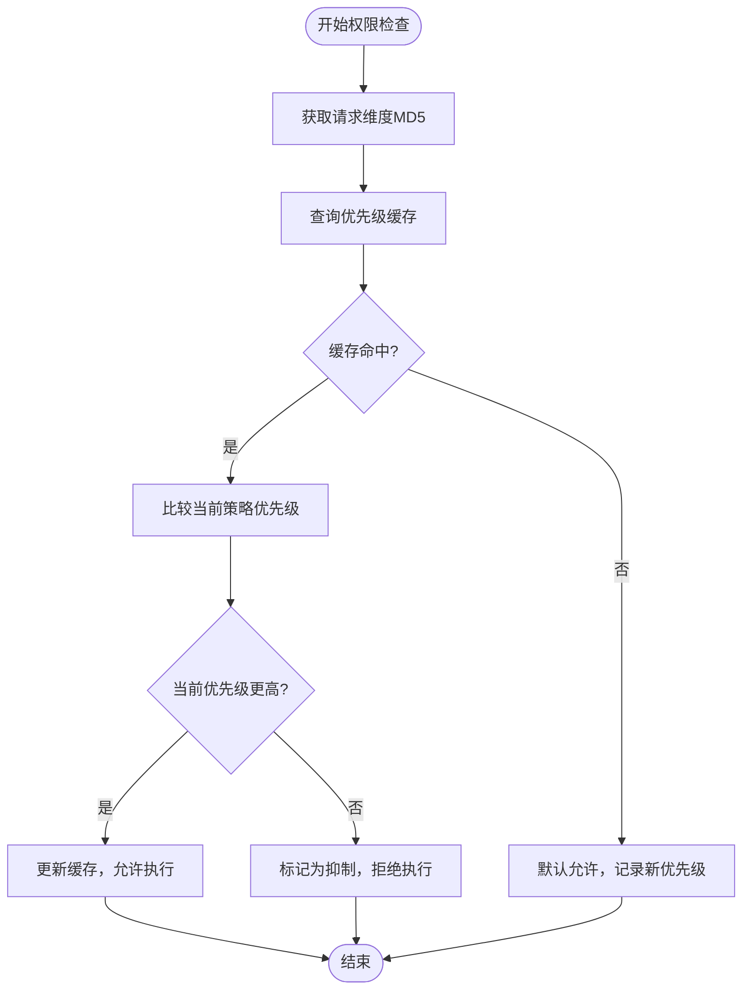
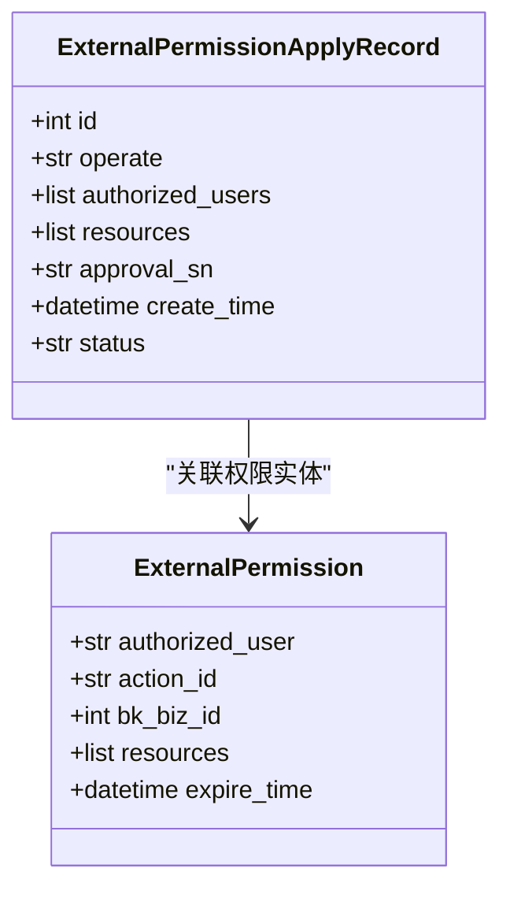

# 冲突解决

<cite>
**本文档引用的文件**
- [priority.py](file://bkmonitor/alarm_backends/service/access/priority.py)
- [test_priority.py](file://bkmonitor/alarm_backends/tests/service/access/data/test_priority.py)
- [resources.py](file://bkmonitor/packages/monitor_web/iam/resources.py)
</cite>

## 目录
1. [引言](#引言)
2. [权限冲突场景分析](#权限冲突场景分析)
3. [冲突解决策略与算法](#冲突解决策略与算法)
4. [日志记录与审计追踪](#日志记录与审计追踪)
5. [可配置性与管理界面](#可配置性与管理界面)
6. [扩展接口与自定义策略](#扩展接口与自定义策略)

## 引言
本文档详细描述了监控系统中权限冲突解决机制的设计与实现。系统在处理复杂的权限分配时，可能会遇到多种冲突情况，如允许与拒绝的冲突、不同优先级之间的冲突以及权限时效性冲突等。为确保权限系统的安全性和一致性，系统采用了一套完整的冲突解决策略，并提供了日志审计、可配置性和扩展能力。

## 权限冲突场景分析
在多用户、多角色、多资源的复杂环境中，权限冲突是不可避免的。常见的冲突场景包括：

- **允许与拒绝冲突**：同一用户对同一资源同时存在允许和拒绝的权限规则。
- **优先级冲突**：不同策略赋予同一操作不同的优先级，导致执行顺序不明确。
- **时效性冲突**：权限具有时间限制，多个权限的有效期重叠或交错，需判断当前时刻的有效权限。

这些冲突若不妥善处理，可能导致安全漏洞或功能异常。因此，系统必须具备明确的冲突解决逻辑。

**Section sources**
- [priority.py](file://bkmonitor/alarm_backends/service/access/priority.py#L48-L80)

## 冲突解决策略与算法
系统采用基于优先级的冲突解决机制，核心算法实现在 `priority.py` 文件中的 `PriorityChecker` 类。

### 优先级抑制算法
系统通过 `is_inhibited` 方法判断某个权限请求是否被更高优先级的规则所抑制。其逻辑如下：
1. 获取当前请求对应的维度哈希（`dimensions_md5`）。
2. 查询缓存中该维度的当前优先级值。
3. 比较当前策略的优先级与缓存中的优先级：
   - 若当前策略优先级更高，则更新缓存并允许执行。
   - 否则，该请求被视为被“抑制”，即不被执行。



**Diagram sources**
- [priority.py](file://bkmonitor/alarm_backends/service/access/priority.py#L48-L80)

### 时效优先原则
当多个权限规则具有相同优先级时，系统依据时效性进行判断，优先采用最近更新或有效期最长的权限规则。此逻辑通过缓存的过期机制（TTL）实现，确保旧权限自动失效。

**Section sources**
- [priority.py](file://bkmonitor/alarm_backends/service/access/priority.py#L48-L80)
- [test_priority.py](file://bkmonitor/alarm_backends/tests/service/access/data/test_priority.py#L30-L102)

## 日志记录与审计追踪
系统具备完整的权限变更与决策审计功能，所有关键操作均被记录，以支持安全审查和问题追溯。

### 审计日志实现
权限变更操作通过 `ExternalPermissionApplyRecord` 模型进行记录。每次权限更新、创建或删除操作都会生成一条审计记录，包含以下信息：
- 操作类型（create, update, delete）
- 被授权用户列表
- 涉及的资源
- 审批单据编号（SN）
- 操作时间戳



**Diagram sources**
- [resources.py](file://bkmonitor/packages/monitor_web/iam/resources.py#L355-L382)

### 审批流程集成
权限变更若涉及新增授权或扩展资源范围，则需经过审批流程。系统会自动生成审批单据，并将审批结果（通过/拒绝）记录到审计日志中，确保所有变更可追溯。

**Section sources**
- [resources.py](file://bkmonitor/packages/monitor_web/iam/resources.py#L309-L382)

## 可配置性与管理界面
系统支持通过管理命令和API接口对权限策略进行配置和管理。

### 管理命令示例
系统提供 `web_protection` 命令用于管理访问控制策略，支持初始化、查询和停止保护状态。

```bash
# 初始化速率限制
./bin/api_manage.sh web_protection --action=init --rate=20

# 查询用户状态
./bin/api_manage.sh web_protection --action=query --user=username

# 清除所有保护状态
./bin/api_manage.sh web_protection --action=stop
```

该命令通过缓存机制实现动态控制，无需重启服务即可生效。

**Section sources**
- [web_protection.py](file://bkmonitor/bkmonitor/management/commands/web_protection.py#L30-L59)

## 扩展接口与自定义策略
系统设计具有良好的扩展性，开发者可通过实现自定义资源类和权限检查逻辑来扩展权限模型。

### 自定义资源接口
通过继承 `Resource` 基类并实现 `perform_request` 方法，可定义新的权限检查接口。例如，`CheckAllowedResource` 提供了批量权限检查功能。

```python
class CheckAllowedResource(Resource):
    def perform_request(self, validated_request_data):
        action_ids = validated_request_data.get("action_ids", [])
        resources = Permission.batch_make_resource(validated_request_data.get("resources", []))
        client = Permission()
        detail = []
        for action_id in action_ids:
            is_allowed = client.is_allowed(action_id, resources)
            detail.append({"action_id": action_id, "is_allowed": is_allowed})
        all_allowed = all(d["is_allowed"] for d in detail)
        return {"is_allowed": all_allowed, "detail": detail}
```

此接口可用于前端权限预检，提升用户体验。

**Section sources**
- [resources.py](file://bkmonitor/packages/monitor_web/iam/resources.py#L114-L141)