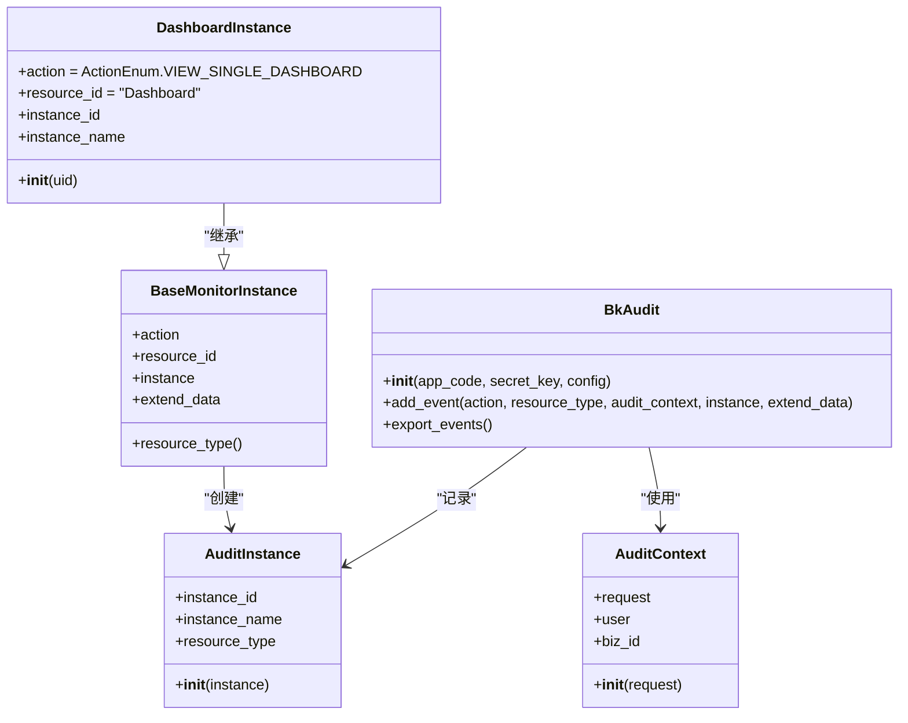
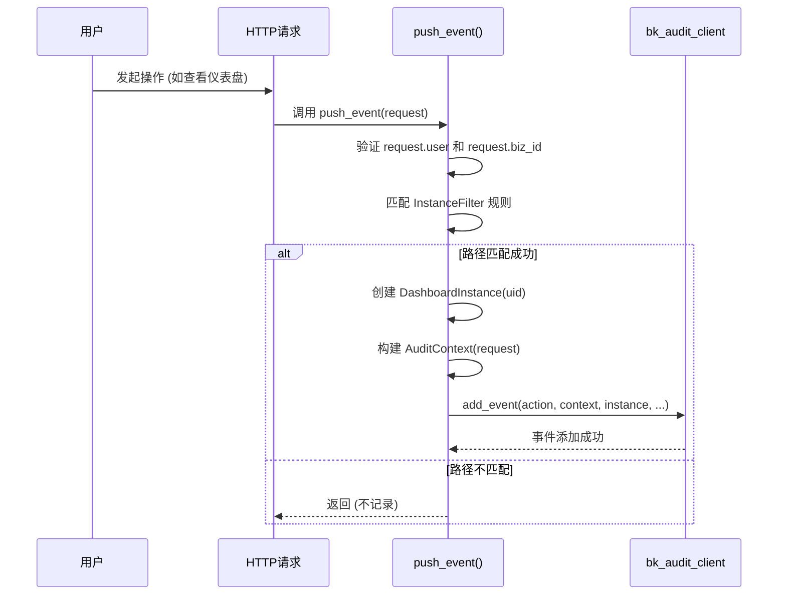
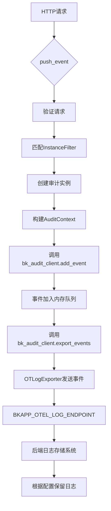

# 审计追踪

<cite>
**本文档引用的文件**   
- [client.py](file://bkmonitor/packages/audit/client.py)
- [instance.py](file://bkmonitor/packages/audit/instance.py)
- [apps.py](file://bkmonitor/packages/audit/apps.py)
</cite>

## 目录
1. [引言](#引言)
2. [核心组件分析](#核心组件分析)
3. [审计日志记录流程](#审计日志记录流程)
4. [日志存储与导出机制](#日志存储与导出机制)
5. [日志查询与分析](#日志查询与分析)
6. [安全保护措施](#安全保护措施)

## 引言
本文档全面描述了蓝鲸监控平台的权限冲突审计追踪机制。系统通过集成审计客户端，对用户操作进行详细记录，为安全管理员提供合规性检查和问题排查的依据。文档深入解析了审计日志的记录格式、存储位置、保留策略以及查询分析方法，并说明了相关的安全保护措施。

## 核心组件分析

审计功能的核心由`bkmonitor/packages/audit`目录下的模块实现。主要组件包括：

*   **审计客户端 (BkAudit)**: 位于`client.py`，是审计功能的核心，负责收集、格式化和导出审计事件。
*   **审计实例 (AuditInstance)**: 位于`instance.py`，定义了不同操作类型（如查看仪表盘）对应的审计实例，用于构建具体的审计事件。
*   **事件推送 (push_event)**: 位于`instance.py`，是审计日志上报的入口函数，根据HTTP请求自动触发审计事件的记录。

**图例来源**
- [client.py](file://bkmonitor/packages/audit/client.py#L20-L21)
- [instance.py](file://bkmonitor/packages/audit/instance.py#L10-L48)

**本节来源**
- [client.py](file://bkmonitor/packages/audit/client.py)
- [instance.py](file://bkmonitor/packages/audit/instance.py)

## 审计日志记录流程

系统的审计日志记录流程始于用户的HTTP请求。`push_event`函数作为核心入口，通过分析请求路径来确定具体的操作类型，并构建相应的审计事件。

1.  **请求验证**: 函数首先检查传入的`request`对象是否包含`user`和`biz_id`等必要属性，确保请求的合法性。
2.  **实例匹配**: 通过预定义的`InstanceFilter`规则列表，使用正则表达式匹配请求路径。例如，对`/grafana/api/dashboards/uid/{uid}`路径的请求会被匹配到`DashboardInstance`类。
3.  **实例化**: 匹配成功后，使用正则表达式捕获的参数（如`uid`）创建具体的审计实例对象。
4.  **上下文构建**: 创建`AuditContext`对象，将`request`对象作为参数传入，以捕获用户、业务ID等上下文信息。
5.  **事件上报**: 调用`bk_audit_client.add_event`方法，将操作类型(`action`)、资源类型(`resource_type`)、审计上下文(`audit_context`)、审计实例(`instance`)以及扩展数据(`extend_data`)打包成一个审计事件并添加到客户端的事件队列中。

**图例来源**
- [instance.py](file://bkmonitor/packages/audit/instance.py#L50-L108)

**本节来源**
- [instance.py](file://bkmonitor/packages/audit/instance.py#L50-L108)

## 日志存储与导出机制

审计日志的存储和导出由`bk_audit_client`实例配置的导出器(Exporter)负责。

*   **导出器配置**: 在`client.py`中，`bk_audit_client`被初始化时，配置了一个`OTLogExporter`（OpenTelemetry日志导出器）。这表明审计日志将通过OpenTelemetry协议进行传输。
*   **上报端点**: 导出器的上报端点由环境变量`BKAPP_OTEL_LOG_ENDPOINT`决定。该变量在`apps.py`的`ready`方法中被检查，如果未设置则不启用审计功能。这确保了日志上报的目标地址是可配置的。
*   **上报流程**: `push_event`函数在调用`add_event`将事件加入队列后，会立即调用`export_events`方法。此方法会触发导出器将当前队列中的所有事件批量发送到配置的`BKAPP_OTEL_LOG_ENDPOINT`。
*   **保留策略**: 从现有代码分析，审计日志的保留策略（如保留天数）并未在代码中硬编码，而是由后端接收系统（如日志中心）根据其自身的配置来管理。`bk_audit_client`本身主要负责日志的生成和传输，不直接管理长期存储和过期清理。

**图例来源**
- [client.py](file://bkmonitor/packages/audit/client.py#L20-L21)
- [apps.py](file://bkmonitor/packages/audit/apps.py#L20-L26)
- [instance.py](file://bkmonitor/packages/audit/instance.py#L101)

**本节来源**
- [client.py](file://bkmonitor/packages/audit/client.py)
- [apps.py](file://bkmonitor/packages/audit/apps.py)
- [instance.py](file://bkmonitor/packages/audit/instance.py)

## 日志查询与分析

虽然`instance.py`文件主要负责日志的生成，但系统提供了强大的日志查询和分析能力，主要通过集成的蓝鲸日志平台(BKLog)实现。

*   **查询接口**: 系统中的`data_source`模块（如`bkmonitor/data_source/data_source/__init__.py`）提供了`query_log`方法，允许根据时间范围、过滤条件等参数查询原始日志数据。
*   **分析工具**: 审计日志作为日志数据的一种，可以利用平台提供的日志检索、聚合分析、可视化图表等功能进行分析。例如，安全管理员可以查询特定用户在特定时间范围内的所有操作，或统计不同操作类型的频率。
*   **关联分析**: 通过`event_related_info.py`等工具，可以将审计日志与其他监控数据（如告警、事件）进行关联分析，帮助进行问题的根因定位。

**本节来源**
- [data_source/__init__.py](file://bkmonitor/data_source/data_source/__init__.py#L1708-L1746)
- [event_related_info.py](file://bkmonitor/utils/event_related_info.py)

## 安全保护措施

为确保审计日志的完整性和安全性，系统采取了以下措施：

*   **防篡改**: 审计日志一旦生成并上报，其内容即被锁定。后端日志存储系统通常具备写保护和不可变性设计，防止日志被修改。
*   **防删除**: 系统本身不提供删除审计日志的功能。日志的删除（如果需要）应由后端日志存储系统的管理员在严格授权下进行，并且此类删除操作本身也应被记录在独立的审计日志中。
*   **访问控制**: 对审计日志的查询和分析功能受到严格的权限控制。只有具备相应权限的安全管理员才能访问这些敏感信息，权限由系统的IAM（身份和访问管理）模块管理。

**本节来源**
- [iam.py](file://bkmonitor/iam/permission.py)
- [alert_log.py](file://packages/fta_web/alert/handlers/alert_log.py)