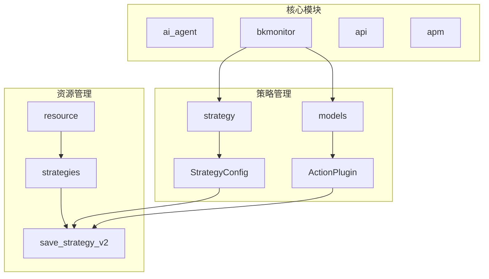
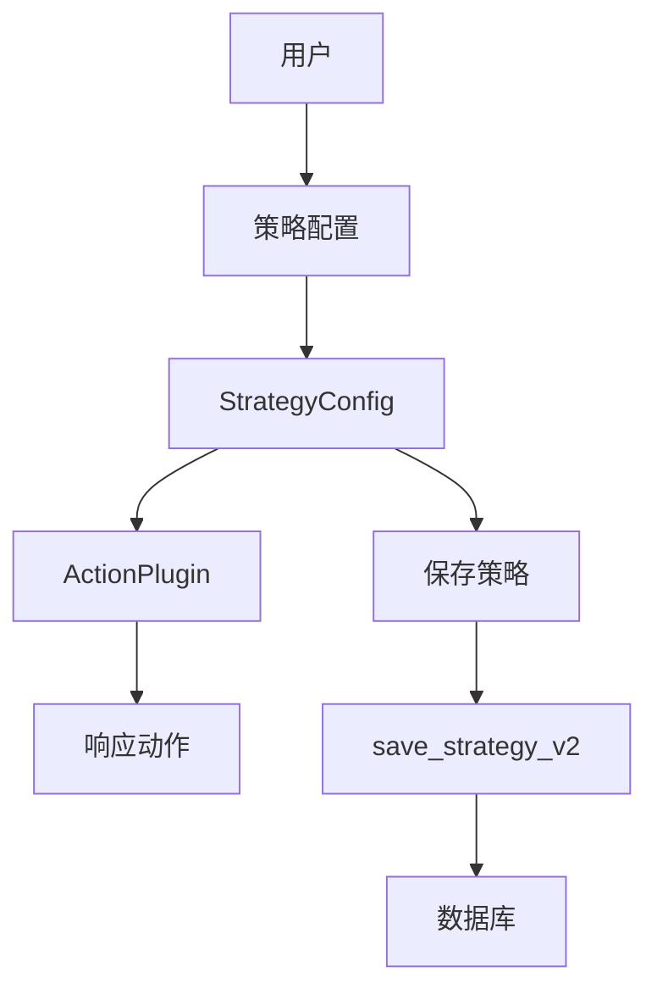
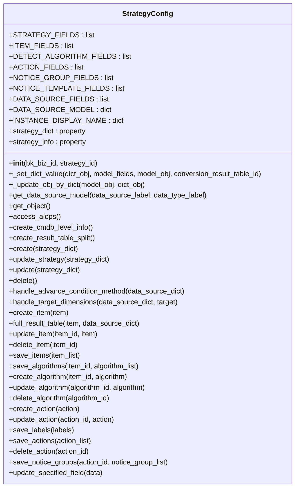
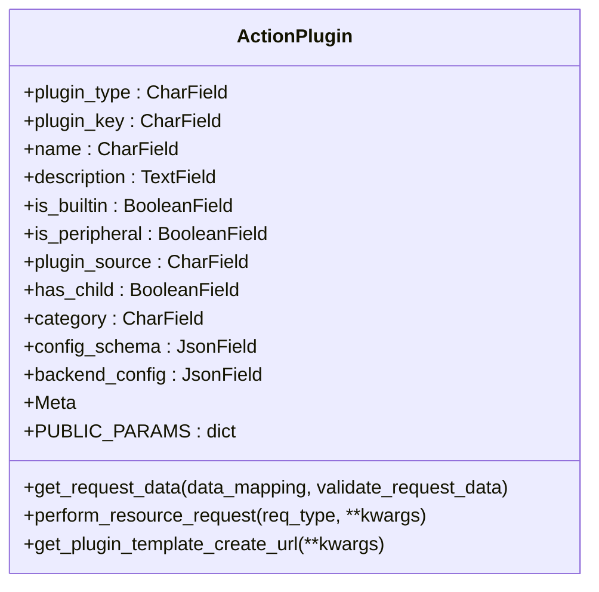
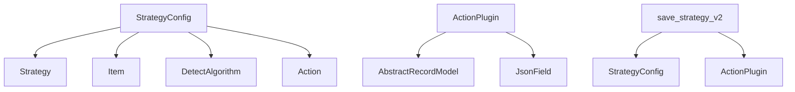

# 自定义策略

<cite>
**本文档引用的文件**   
- [strategy.py](file://bkmonitor\bkmonitor\strategy\strategy.py)
- [action.py](file://bkmonitor\bkmonitor\models\fta\action.py)
- [rpc.py](file://bkmonitor\packages\apm_web\handlers\strategy_group\groups\rpc\rpc.py)
- [parse.py](file://bkmonitor\bkmonitor\as_code\parse.py)
- [rollback_strategy.py](file://bkmonitor\bkmonitor\management\commands\rollback_strategy.py)
</cite>

## 目录
1. [简介](#简介)
2. [项目结构](#项目结构)
3. [核心组件](#核心组件)
4. [架构概述](#架构概述)
5. [详细组件分析](#详细组件分析)
6. [依赖分析](#依赖分析)
7. [性能考虑](#性能考虑)
8. [故障排除指南](#故障排除指南)
9. [结论](#结论)

## 简介
本文档详细描述了蓝鲸监控平台中自定义策略的实现机制。系统通过`StrategyConfig`类提供了一套完整的策略配置、创建、更新和删除的接口。自定义策略可以通过插件系统进行扩展，支持多种类型的响应动作，包括通知、HTTP回调、作业平台、标准运维等。策略的保存和注册通过`resource.strategies.save_strategy_v2`接口实现，确保了策略配置的持久化和一致性。

## 项目结构
蓝鲸监控平台的项目结构清晰，主要分为多个模块，包括`ai_agent`、`bkmonitor`、`api`、`apm`等。自定义策略相关的代码主要位于`bkmonitor\bkmonitor\strategy`目录下，其中`strategy.py`文件定义了`StrategyConfig`类，负责策略的配置管理。策略插件的定义位于`bkmonitor\bkmonitor\models\fta\action.py`文件中，通过`ActionPlugin`类实现。

**图示来源**
- [strategy.py](file://bkmonitor\bkmonitor\strategy\strategy.py)
- [action.py](file://bkmonitor\bkmonitor\models\fta\action.py)
- [rpc.py](file://bkmonitor\packages\apm_web\handlers\strategy_group\groups\rpc\rpc.py)

## 核心组件
自定义策略的核心组件包括`StrategyConfig`类和`ActionPlugin`类。`StrategyConfig`类负责策略的配置管理，包括策略的创建、更新、删除等操作。`ActionPlugin`类定义了响应动作插件的模型，支持多种类型的插件，如通知、HTTP回调等。

**组件来源**
- [strategy.py](file://bkmonitor\bkmonitor\strategy\strategy.py#L53-L915)
- [action.py](file://bkmonitor\bkmonitor\models\fta\action.py#L56-L248)

## 架构概述
蓝鲸监控平台的自定义策略架构基于模块化设计，通过`StrategyConfig`类和`ActionPlugin`类实现策略的配置和扩展。策略的保存和注册通过`resource.strategies.save_strategy_v2`接口实现，确保了策略配置的持久化和一致性。系统支持通过插件系统扩展新的响应动作类型，提供了灵活的扩展机制。

**图示来源**
- [strategy.py](file://bkmonitor\bkmonitor\strategy\strategy.py)
- [action.py](file://bkmonitor\bkmonitor\models\fta\action.py)
- [rpc.py](file://bkmonitor\packages\apm_web\handlers\strategy_group\groups\rpc\rpc.py)

## 详细组件分析
### StrategyConfig 类分析
`StrategyConfig`类是自定义策略的核心，负责策略的配置管理。类中定义了多个字段和方法，用于处理策略的创建、更新、删除等操作。

#### 类图

**图示来源**
- [strategy.py](file://bkmonitor\bkmonitor\strategy\strategy.py#L53-L915)

### ActionPlugin 类分析
`ActionPlugin`类定义了响应动作插件的模型，支持多种类型的插件，如通知、HTTP回调等。类中定义了插件的类型、名称、描述、配置格式等字段。

#### 类图

**图示来源**
- [action.py](file://bkmonitor\bkmonitor\models\fta\action.py#L56-L248)

## 依赖分析
自定义策略的实现依赖于多个模块和文件。`StrategyConfig`类依赖于`bkmonitor.models`模块中的`Strategy`、`Item`、`DetectAlgorithm`、`Action`等模型。`ActionPlugin`类依赖于`AbstractRecordModel`基类和`JsonField`字段类型。策略的保存和注册依赖于`resource.strategies.save_strategy_v2`接口。

**图示来源**
- [strategy.py](file://bkmonitor\bkmonitor\strategy\strategy.py)
- [action.py](file://bkmonitor\bkmonitor\models\fta\action.py)
- [rpc.py](file://bkmonitor\packages\apm_web\handlers\strategy_group\groups\rpc\rpc.py)

## 性能考虑
在实现自定义策略时，需要考虑性能问题。`StrategyConfig`类中的`create`和`update`方法涉及多个数据库操作，建议在高并发场景下使用事务管理，确保数据的一致性。`ActionPlugin`类中的`perform_resource_request`方法涉及远程API调用，建议使用缓存机制减少重复请求。

## 故障排除指南
在使用自定义策略时，可能会遇到以下问题：
1. **策略创建失败**：检查`strategy_dict`中的字段是否符合要求，特别是`item_list`和`action_list`的配置。
2. **插件注册失败**：检查`ActionPlugin`实例的`plugin_type`和`plugin_key`是否正确，确保`config_schema`和`backend_config`字段的格式正确。
3. **保存策略失败**：检查`resource.strategies.save_strategy_v2`接口的调用参数，确保策略ID和业务ID正确。

**组件来源**
- [strategy.py](file://bkmonitor\bkmonitor\strategy\strategy.py#L53-L915)
- [action.py](file://bkmonitor\bkmonitor\models\fta\action.py#L56-L248)

## 结论
蓝鲸监控平台的自定义策略机制提供了灵活的扩展能力，通过`StrategyConfig`类和`ActionPlugin`类实现了策略的配置管理和插件扩展。系统通过`resource.strategies.save_strategy_v2`接口确保了策略配置的持久化和一致性。开发者可以通过插件系统添加新的响应动作类型，满足不同的业务需求。