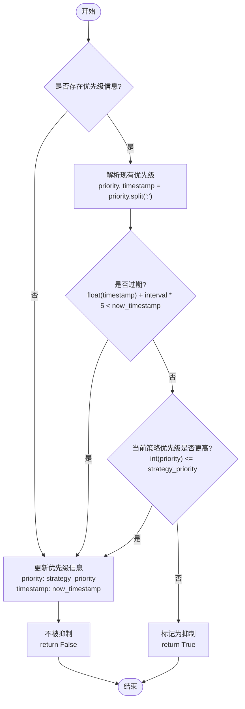
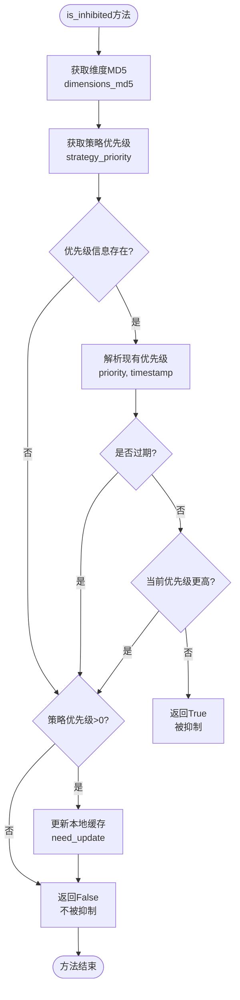
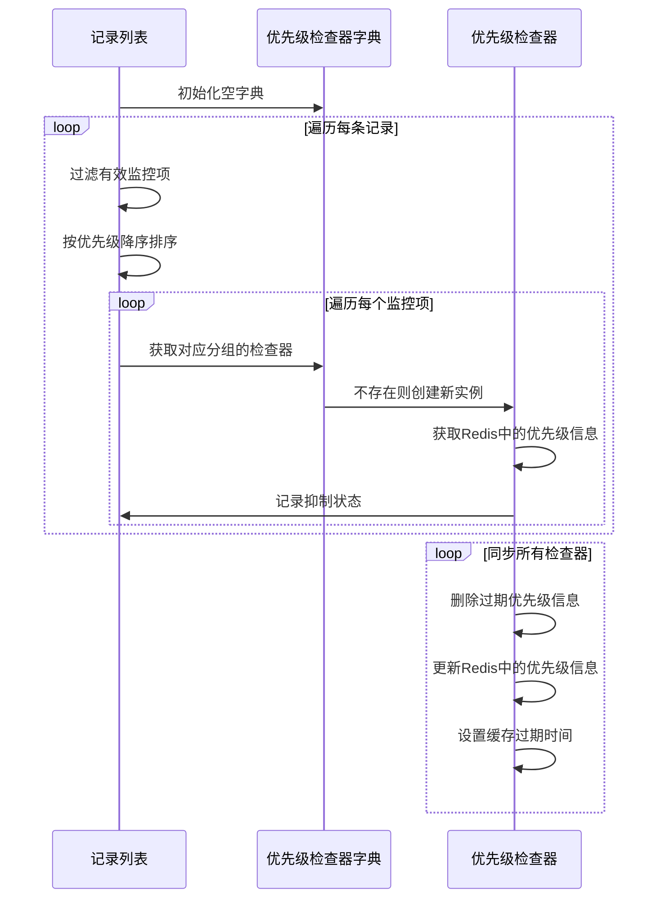
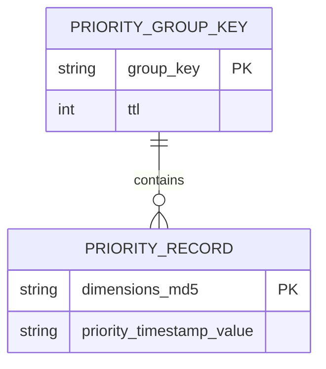
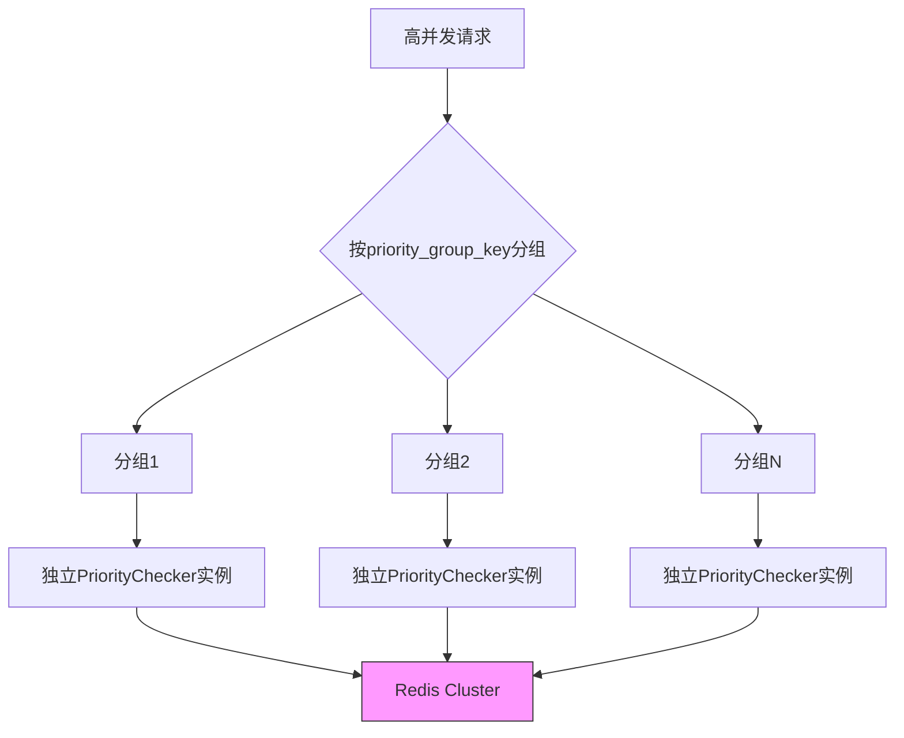

# 解决算法

<cite>
**本文档引用的文件**   
- [priority.py](file://bkmonitor\alarm_backends\service\access\priority.py)
- [strategy.py](file://bkmonitor\bkmonitor\models\strategy.py)
- [key.py](file://bkmonitor\alarm_backends\core\cache\key.py)
- [strategy.py](file://bkmonitor\constants\strategy.py)
</cite>

## 目录
1. [引言](#引言)
2. [核心算法概述](#核心算法概述)
3. [优先级检查器实现](#优先级检查器实现)
4. [冲突解决决策流程](#冲突解决决策流程)
5. [数据结构与模型](#数据结构与模型)
6. [缓存与性能优化](#缓存与性能优化)
7. [算法复杂度分析](#算法复杂度分析)
8. [配置参数与调优建议](#配置参数与调优建议)

## 引言
本文档详细阐述了监控平台中权限冲突解决算法的实现机制。该系统通过优先级检查机制来解决多个监控策略之间的冲突，确保高优先级的告警策略能够优先处理。算法主要基于优先拒绝原则，通过比较策略优先级和时效性来决定数据点的处理方式。系统设计考虑了高并发场景下的性能需求，使用Redis缓存来存储和管理优先级信息，实现了高效的冲突解决能力。

## 核心算法概述
权限冲突解决算法的核心是优先拒绝原则，即当多个策略同时检测到同一数据点异常时，系统会根据策略的优先级来决定最终的处理方式。优先级数值越大，表示优先级越高。算法通过`PriorityChecker`类实现，该类负责检查数据点是否被抑制，并管理优先级信息的更新和同步。



**图源**
- [priority.py](file://bkmonitor\alarm_backends\service\access\priority.py#L48-L80)

**本节来源**
- [priority.py](file://bkmonitor\alarm_backends\service\access\priority.py#L19-L157)

## 优先级检查器实现
`PriorityChecker`类是权限冲突解决算法的核心实现，负责管理特定优先级分组的检查逻辑。

### 初始化与属性
```python
def __init__(self, priority_group_key: str):
    self.priority_group_key = priority_group_key
    self.priority_cache = {}
    self.need_update = {}
    self.need_delete = []
    self.client = key.ACCESS_PRIORITY_KEY.client
    self.cache_key = key.ACCESS_PRIORITY_KEY.get_key(priority_group_key=self.priority_group_key)
    self.cache_ttl = key.ACCESS_PRIORITY_KEY.ttl
```
初始化方法接收`priority_group_key`作为参数，用于区分不同的优先级分组。实例变量包括：
- `priority_cache`: 本地缓存的优先级信息
- `need_update`: 需要更新到Redis的优先级信息
- `need_delete`: 需要从Redis删除的过期优先级信息
- `client`: Redis客户端连接
- `cache_key`: 当前分组的Redis键
- `cache_ttl`: 缓存过期时间

### 优先级检查逻辑
`is_inhibited`方法是核心决策点，判断数据点是否被抑制：



**图源**
- [priority.py](file://bkmonitor\alarm_backends\service\access\priority.py#L65-L80)

**本节来源**
- [priority.py](file://bkmonitor\alarm_backends\service\access\priority.py#L65-L80)

## 冲突解决决策流程
系统的冲突解决决策流程通过`check_records`静态方法实现，处理一批数据记录的冲突。

### 批量处理流程


**图源**
- [priority.py](file://bkmonitor\alarm_backends\service\access\priority.py#L110-L142)

**本节来源**
- [priority.py](file://bkmonitor\alarm_backends\service\access\priority.py#L109-L142)

### 决策规则详解
算法的决策规则基于以下三个核心原则：

1. **优先拒绝原则**：优先级数值越大，优先级越高。当两个策略冲突时，优先级高的策略胜出。
2. **时效优先原则**：即使优先级较低，但如果现有优先级信息已过期（超过`interval * 5`时间），则允许更新。
3. **分组管理原则**：通过`priority_group_key`将策略分组管理，不同分组之间互不影响。

决策逻辑的伪代码如下：
```
IF 无现有优先级信息 THEN
    IF 策略优先级 > 0 THEN
        创建新优先级记录
        RETURN 不被抑制
    ELSE
        RETURN 不被抑制
ELSE
    IF 现有记录已过期 OR 当前策略优先级 >= 现有优先级 THEN
        更新优先级记录
        RETURN 不被抑制
    ELSE
        RETURN 被抑制
```

## 数据结构与模型
权限冲突解决算法依赖于特定的数据结构和模型定义。

### 策略模型定义
在`strategy.py`文件中，`StrategyModel`类定义了策略的核心字段：

```python
class StrategyModel(Model):
    # ... 其他字段 ...
    priority = models.IntegerField("优先级", null=True)
    priority_group_key = models.CharField("优先级分组", max_length=64, default=None, blank=True, null=True)
```
- `priority`: 整数类型，表示策略的优先级，数值越大优先级越高
- `priority_group_key`: 字符串类型，用于将策略分组，相同分组的策略参与优先级比较

### 优先级信息存储格式
优先级信息在Redis中以哈希表（Hash）形式存储，其结构如下：



其中，`priority_timestamp_value`的格式为`"{priority}:{timestamp}"`，例如`"3:1700000000.123"`。

**图源**
- [strategy.py](file://bkmonitor\bkmonitor\models\strategy.py#L400-L420)
- [key.py](file://bkmonitor\alarm_backends\core\cache\key.py#L200-L250)

**本节来源**
- [strategy.py](file://bkmonitor\bkmonitor\models\strategy.py#L400-L420)

## 缓存与性能优化
系统通过Redis缓存机制实现高性能的优先级管理。

### 缓存键定义
在`key.py`文件中，`ACCESS_PRIORITY_KEY`的定义如下：

```python
ACCESS_PRIORITY_KEY = HashKey(
    key_tpl="access.priority.{priority_group_key}",
    field_tpl="{dimensions_md5}",
    ttl=CONST_ONE_HOUR,
    backend="redis_cluster",
)
```
- `key_tpl`: 键模板，包含`priority_group_key`变量
- `field_tpl`: 字段模板，使用维度MD5作为哈希表的字段
- `ttl`: 过期时间为1小时
- `backend`: 使用Redis集群作为存储后端

### 缓存同步机制
`sync_priority`方法负责将内存中的变更同步到Redis：

```python
def sync_priority(self, item: Item):
    interval = item.strategy.get_interval()
    
    # 删除过期的优先级信息
    for dimensions_md5, priority in self.priority_cache.items():
        priority, timestamp = priority.split(":")
        if float(timestamp) + interval * 10 < time.time():
            self.need_delete.append(dimensions_md5)

    # 更新缓存过期时间
    self.client.expire(self.cache_key, self.cache_ttl)

    if self.need_update:
        self.client.hmset(self.cache_key, self.need_update)

    if self.need_delete:
        self.client.hdel(self.cache_key, *self.need_delete)
```

该方法实现了批量操作，减少了Redis网络请求次数，提高了性能。

**图源**
- [key.py](file://bkmonitor\alarm_backends\core\cache\key.py#L300-L350)
- [priority.py](file://bkmonitor\alarm_backends\service\access\priority.py#L145-L157)

**本节来源**
- [key.py](file://bkmonitor\alarm_backends\core\cache\key.py#L300-L350)
- [priority.py](file://bkmonitor\alarm_backends\service\access\priority.py#L145-L157)

## 算法复杂度分析
对权限冲突解决算法进行复杂度分析，评估其性能特征。

### 时间复杂度
- **单次检查**：O(1) - 哈希表查找和比较操作
- **批量检查**：O(n*m*log(m)) 
  - n: 记录数量
  - m: 每条记录的监控项数量
  - log(m): 监控项按优先级排序的时间
- **同步操作**：O(k) - k为需要更新或删除的优先级记录数量

### 空间复杂度
- **内存缓存**：O(p) - p为当前处理的优先级分组数量
- **Redis存储**：O(d) - d为所有维度组合的数量
- **临时存储**：O(u+d) - u为待更新记录数，d为待删除记录数

### 高并发处理能力
系统通过以下机制支持高并发场景：
1. **Redis集群**：使用分布式缓存，支持水平扩展
2. **批量操作**：减少网络往返次数
3. **本地缓存**：减少Redis访问频率
4. **分组隔离**：不同优先级分组并行处理



**图源**
- [priority.py](file://bkmonitor\alarm_backends\service\access\priority.py#L109-L142)

**本节来源**
- [priority.py](file://bkmonitor\alarm_backends\service\access\priority.py#L109-L142)

## 配置参数与调优建议
提供算法的可配置参数和性能调优建议。

### 可配置参数
| 参数 | 位置 | 默认值 | 说明 |
|------|------|--------|------|
| `priority` | 策略配置 | null | 策略优先级，数值越大优先级越高 |
| `priority_group_key` | 策略配置 | null | 优先级分组键，决定哪些策略参与比较 |
| `ttl` | ACCESS_PRIORITY_KEY | 1小时 | Redis缓存过期时间 |
| `interval * 5` | is_inhibited方法 | 动态计算 | 优先级过期判断阈值 |
| `interval * 10` | sync_priority方法 | 动态计算 | 过期优先级删除阈值 |

### 调优建议
1. **合理设置优先级**：建议将关键业务的监控策略设置较高优先级（如5-10），普通策略设置较低优先级（如1-3）。
2. **优化分组策略**：将相关联的策略分配到同一分组，避免无关策略之间的冲突。
3. **调整缓存过期时间**：根据业务需求调整`ttl`值，对于变化频繁的场景可缩短过期时间。
4. **监控Redis性能**：定期检查Redis集群的性能指标，确保缓存系统稳定。
5. **批量处理优化**：在高负载场景下，适当增加批量处理的记录数量，减少函数调用开销。

**本节来源**
- [priority.py](file://bkmonitor\alarm_backends\service\access\priority.py)
- [key.py](file://bkmonitor\alarm_backends\core\cache\key.py)
- [strategy.py](file://bkmonitor\bkmonitor\models\strategy.py)