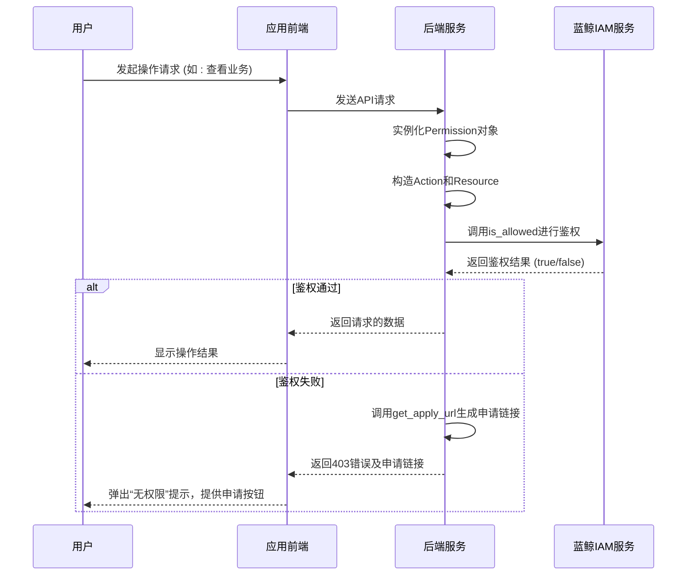
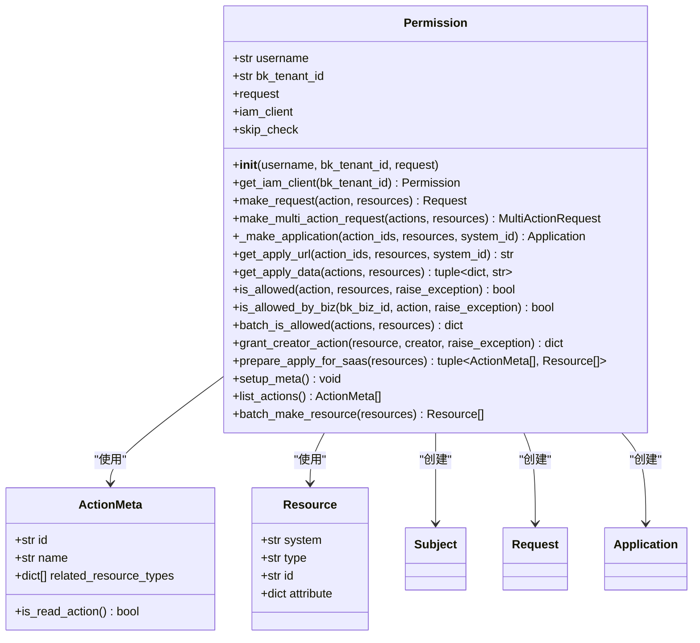
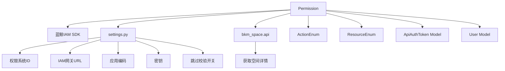

# 分配策略

<cite>
**本文档引用的文件**  
- [permission.py](file://bkmonitor/bkmonitor/iam/permission.py)
- [action.py](file://bkmonitor/bkmonitor/iam/action.py)
- [resource.py](file://bkmonitor/bkmonitor/iam/resource.py)
- [upgrade.py](file://bkmonitor/bkmonitor/iam/upgrade.py)
- [iam.py](file://bkmonitor/core/errors/iam.py)
</cite>

## 目录
1. [引言](#引言)
2. [项目结构](#项目结构)
3. [核心组件](#核心组件)
4. [架构概述](#架构概述)
5. [详细组件分析](#详细组件分析)
6. [依赖分析](#依赖分析)
7. [性能考虑](#性能考虑)
8. [故障排除指南](#故障排除指南)
9. [结论](#结论)

## 引言
本文档全面描述了蓝鲸监控平台（BlueKing - Monitor）中的权限分配策略。系统通过集成蓝鲸权限中心（IAM），实现了基于角色和资源的精细化权限控制。文档深入解析了基于角色的权限分配（RBAC）的实现机制，包括角色定义、权限继承与组合等特性，并说明了权限校验、申请和授权的核心流程。此外，还提供了开发者进行权限扩展和自定义的接口与示例。

## 项目结构
蓝鲸监控平台的权限管理功能主要集中在 `bkmonitor/iam` 模块中。该模块通过封装蓝鲸权限中心（IAM）的API，为上层应用提供统一的权限校验和管理接口。

```mermaid
graph TD
subgraph "权限管理模块"
Permission[Permission<br/>权限校验封装]
Action[ActionEnum<br/>动作枚举]
Resource[ResourceEnum<br/>资源枚举]
Upgrade[IAM权限升级]
Errors[权限错误定义]
end
subgraph "核心依赖"
IAM[蓝鲸IAM SDK]
Settings[系统配置]
SpaceApi[空间API]
end
Permission --> Action : "引用"
Permission --> Resource : "引用"
Permission --> IAM : "调用"
Permission --> Settings : "读取配置"
Upgrade --> Action : "引用"
Upgrade --> Settings : "读取配置"
Errors --> Permission : "抛出异常"
```

**图示来源**
- [permission.py](file://bkmonitor/bkmonitor/iam/permission.py)
- [action.py](file://bkmonitor/bkmonitor/iam/action.py)
- [resource.py](file://bkmonitor/bkmonitor/iam/resource.py)
- [upgrade.py](file://bkmonitor/bkmonitor/iam/upgrade.py)
- [iam.py](file://bkmonitor/core/errors/iam.py)

**本节来源**
- [permission.py](file://bkmonitor/bkmonitor/iam/permission.py)
- [action.py](file://bkmonitor/bkmonitor/iam/action.py)

## 核心组件
权限系统的核心是 `Permission` 类，它封装了与蓝鲸IAM服务的交互。该类负责权限校验、生成权限申请链接、为资源创建者自动授权等关键操作。权限模型基于“动作（Action）”和“资源（Resource）”的二元组，通过 `ActionEnum` 和 `ResourceEnum` 枚举类进行统一管理。

**本节来源**
- [permission.py](file://bkmonitor/bkmonitor/iam/permission.py#L100-L150)
- [action.py](file://bkmonitor/bkmonitor/iam/action.py#L10-L50)
- [resource.py](file://bkmonitor/bkmonitor/iam/resource.py#L10-L50)

## 架构概述
系统的权限架构遵循标准的RBAC（基于角色的访问控制）模型，并与蓝鲸平台的IAM系统深度集成。用户通过其所属角色获得一组预定义的“动作-资源”权限。当用户请求访问受保护的资源时，系统会调用 `Permission` 类的 `is_allowed` 方法进行实时校验。



**图示来源**
- [permission.py](file://bkmonitor/bkmonitor/iam/permission.py#L300-L400)
- [permission.py](file://bkmonitor/bkmonitor/iam/permission.py#L200-L250)

## 详细组件分析

### Permission类分析
`Permission` 类是权限管理的核心，提供了丰富的权限操作接口。

#### 类结构与方法


**图示来源**
- [permission.py](file://bkmonitor/bkmonitor/iam/permission.py#L100-L500)

#### 关键方法解析

**权限校验 (`is_allowed`)**
该方法是权限校验的核心。它首先检查是否需要跳过校验（如后台任务），然后构造一个 `Request` 对象并调用IAM服务的 `is_allowed` 接口。如果校验失败且 `raise_exception` 为 `True`，则会抛出 `PermissionDeniedError` 异常，并附带权限申请链接。

```python
def is_allowed(self, action: ActionMeta | str, resources: list[Resource] = None, raise_exception: bool = False):
    # ... (省略部分代码)
    request = self.make_request(action, resources)
    try:
        result = self.iam_client.is_allowed(request)
    except AuthAPIError as e:
        logger.exception("[IAM AuthAPI Error]: %s", e)
        result = False

    if not result and raise_exception:
        apply_data, apply_url = self.get_apply_data(actions, detail_resources)
        raise PermissionDeniedError(
            context={"action_name": action.name},
            data={"apply_url": apply_url},
            extra={"permission": apply_data},
        )
    return result
```

**权限申请链接生成 (`get_apply_url`)**
此方法根据用户缺少的权限，生成一个跳转到蓝鲸权限中心的申请URL。用户可以通过该链接申请所需权限。

```python
def get_apply_url(
    self, action_ids: list[str], resources: list[Resource] = None, system_id: str = settings.BK_IAM_SYSTEM_ID
):
    application = self._make_application(action_ids, resources, system_id)
    ok, message, url = self.iam_client.get_apply_url(application)
    if not ok:
        logger.error("iam generate apply url fail: %s", message)
        return settings.BK_IAM_SAAS_HOST
    return url
```

**资源创建者授权 (`grant_creator_action`)**
当用户创建一个新资源（如一个监控策略）时，系统会自动调用此方法，将该资源的管理权限授予创建者，确保创建者拥有对自己创建资源的完全控制权。

```python
def grant_creator_action(self, resource: Resource, creator: str = None, raise_exception=False):
    application = {
        "system": resource.system,
        "type": resource.type,
        "id": resource.id,
        "name": resource.attribute.get("name", resource.id) if resource.attribute else resource.id,
        "creator": creator or self.username,
    }
    grant_result = self.iam_client.grant_resource_creator_actions(application)
    return grant_result
```

**本节来源**
- [permission.py](file://bkmonitor/bkmonitor/iam/permission.py#L100-L518)

### 基于角色的权限分配（RBAC）实现
系统通过 `ActionEnum` 枚举类定义了所有可执行的动作（如 `VIEW_BUSINESS`, `MANAGE_STRATEGY`），并通过 `ResourceEnum` 定义了所有可被操作的资源类型（如 `BUSINESS`, `STRATEGY`）。角色的权限本质上是这些动作和资源的集合。

在 `upgrade.py` 文件中，可以看到系统如何为不同角色（如业务运维、开发人员）预设默认权限，并支持通过数据库 `RolePermission` 表进行自定义覆盖，实现了权限的继承和组合。

```python
# 示例：角色权限信息初始化
role_permission_info = settings.DEFAULT_ROLE_PERMISSIONS.copy()
rp_records = RolePermission.objects.filter(biz_id=business.bk_biz_id)
for rp in rp_records:
    if rp.role in role_permission_info:
        role_permission_info[rp.role] = rp.permission
```

**本节来源**
- [action.py](file://bkmonitor/bkmonitor/iam/action.py)
- [resource.py](file://bkmonitor/bkmonitor/iam/resource.py)
- [upgrade.py](file://bkmonitor/bkmonitor/iam/upgrade.py#L30-L80)

## 依赖分析
权限系统依赖于多个外部组件和内部模块。



**图示来源**
- [permission.py](file://bkmonitor/bkmonitor/iam/permission.py#L10-L50)
- [settings.py](file://bkmonitor/settings.py)

## 性能考虑
为了优化性能，系统对读权限的校验结果进行了缓存（`is_allowed_with_cache`），减少了对IAM服务的频繁调用。对于写权限，则不进行缓存以保证安全性。`batch_is_allowed` 方法支持批量权限查询，可以有效减少网络请求次数。

## 故障排除指南
当遇到权限问题时，可参考以下步骤进行排查：

1.  **检查用户角色**：确认用户是否被赋予了执行该操作所需的角色。
2.  **检查权限开关**：确认 `SKIP_IAM_PERMISSION_CHECK` 配置项是否被意外开启。
3.  **查看日志**：检查后端日志中是否有 `[IAM AuthAPI Error]` 或 `[grant_creator_action] Failed!` 等错误信息。
4.  **验证Token**：如果涉及API调用，检查 `ApiAuthToken` 是否存在且有效。
5.  **联系管理员**：如果确认配置无误，引导用户通过系统提供的“申请权限”链接向管理员申请。

**本节来源**
- [permission.py](file://bkmonitor/bkmonitor/iam/permission.py#L350-L380)
- [iam.py](file://bkmonitor/core/errors/iam.py)

## 结论
蓝鲸监控平台的权限分配策略基于成熟的RBAC模型，并通过与蓝鲸IAM系统的深度集成，实现了灵活、安全的权限管理。`Permission` 类作为核心封装，为开发者提供了简洁易用的API。系统支持权限的自动继承、创建者授权和便捷的权限申请流程，极大地提升了用户体验和系统的安全性。开发者在扩展新功能时，应遵循现有模式，定义相应的动作和资源，并通过 `Permission` 类进行权限校验。