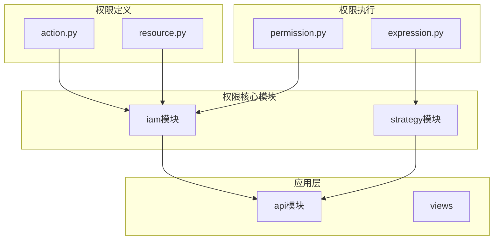
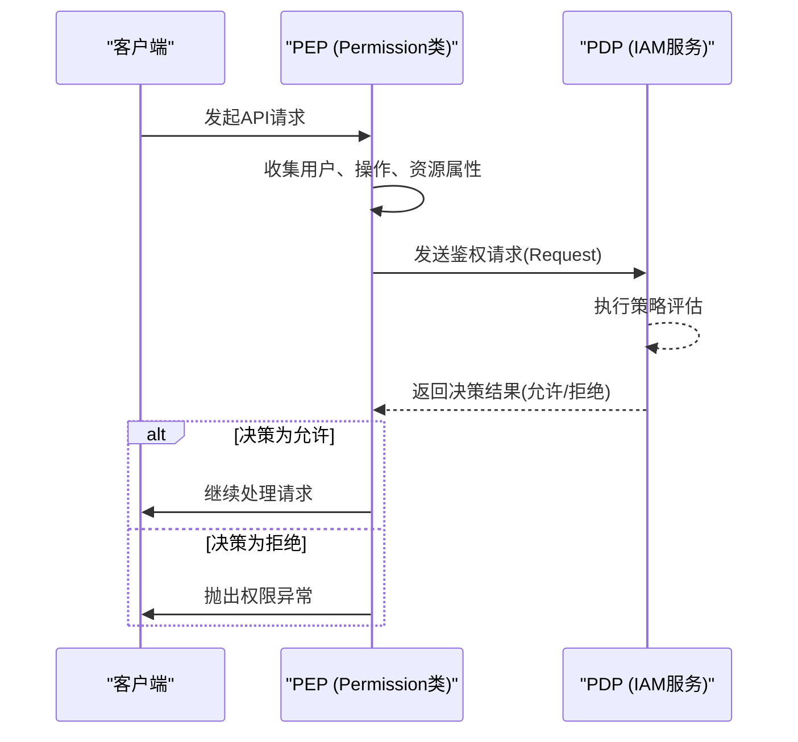
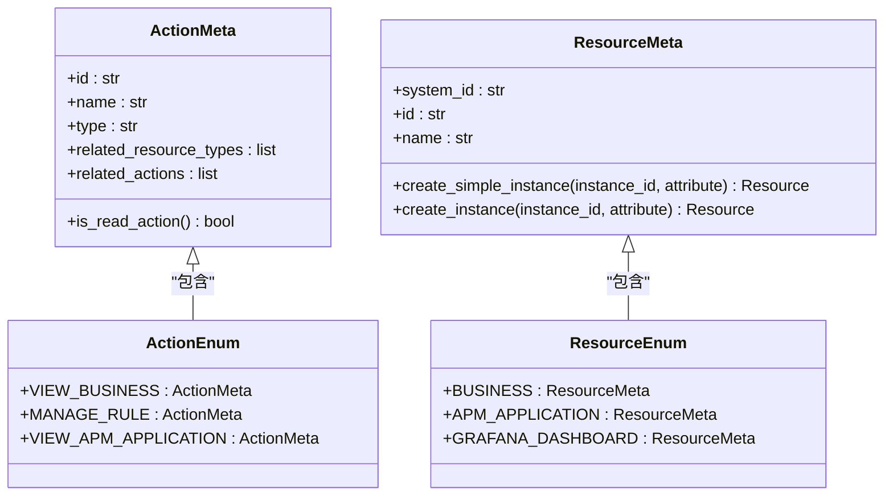
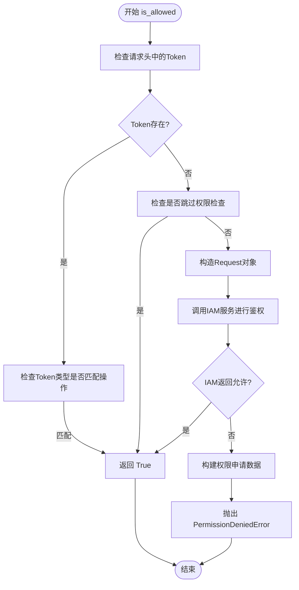
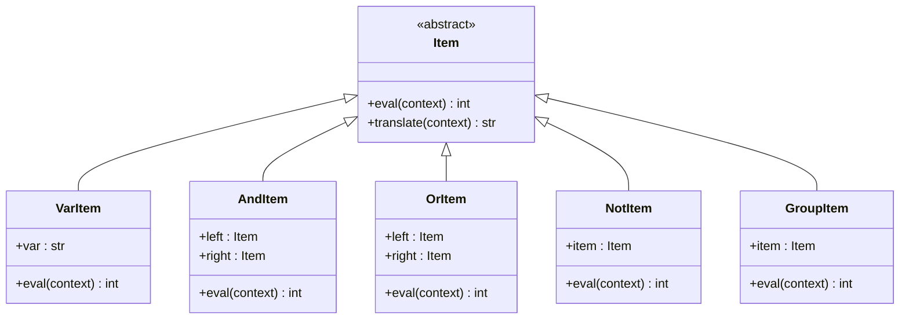
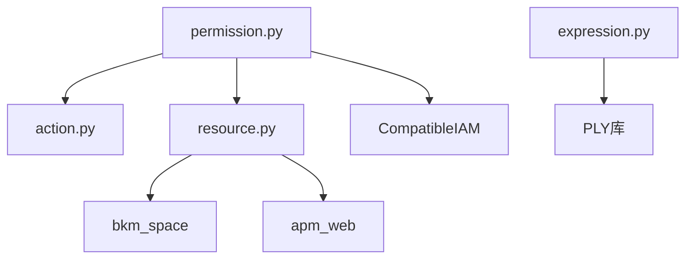

# 基于个体的分配

<cite>
**本文档引用的文件**   
- [permission.py](file://bkmonitor/bkmonitor/iam/permission.py)
- [action.py](file://bkmonitor/bkmonitor/iam/action.py)
- [resource.py](file://bkmonitor/bkmonitor/iam/resource.py)
- [expression.py](file://bkmonitor/bkmonitor/strategy/expression.py)
</cite>

## 目录
1. [简介](#简介)
2. [项目结构](#项目结构)
3. [核心组件](#核心组件)
4. [架构概述](#架构概述)
5. [详细组件分析](#详细组件分析)
6. [依赖分析](#依赖分析)
7. [性能考虑](#性能考虑)
8. [故障排除指南](#故障排除指南)
9. [结论](#结论)

## 简介
本文档全面阐述了蓝鲸监控平台中基于属性的访问控制（ABAC）的实现机制。系统通过将权限决策分解为主体（用户）、操作（Action）、资源（Resource）和环境（Context）四个维度，实现了精细化的权限管理。权限检查的核心逻辑封装在`Permission`类中，它通过与外部IAM（身份与访问管理）服务交互来执行策略决策。操作和资源的定义分别在`action.py`和`resource.py`文件中，它们构成了权限策略的静态模型。策略的动态部分，即条件表达式，则在`strategy`模块中通过自定义的解析器进行处理。整个系统旨在为开发者提供一个灵活、可扩展且高性能的权限分配框架。

## 项目结构
蓝鲸监控平台的代码库采用模块化设计，将不同功能的组件分离到独立的目录中。与权限分配策略最相关的模块是`bkmonitor/iam`，它专门负责身份和访问管理。该模块与`bkmonitor/strategy`模块紧密协作，后者包含了策略表达式的解析逻辑。`api`目录下的各个子模块则通过调用`iam`模块提供的接口来实现具体的权限校验。

**图源**
- [action.py](file://bkmonitor/bkmonitor/iam/action.py)
- [resource.py](file://bkmonitor/bkmonitor/iam/resource.py)
- [permission.py](file://bkmonitor/bkmonitor/iam/permission.py)
- [expression.py](file://bkmonitor/bkmonitor/strategy/expression.py)

**节源**
- [action.py](file://bkmonitor/bkmonitor/iam/action.py)
- [resource.py](file://bkmonitor/bkmonitor/iam/resource.py)
- [permission.py](file://bkmonitor/bkmonitor/iam/permission.py)
- [expression.py](file://bkmonitor/bkmonitor/strategy/expression.py)

## 核心组件
权限系统的核心由三个主要组件构成：操作（Action）、资源（Resource）和权限（Permission）。`Action`类定义了系统中所有可能的用户操作，如“查看业务”或“管理策略”。`Resource`类则定义了这些操作所作用的对象，例如“业务”或“APM应用”。`Permission`类是权限检查的入口，它接收一个操作和一个资源列表，然后向IAM服务发起请求，判断当前用户是否被授权执行该操作。这三个组件共同构成了ABAC模型的基础。

**节源**
- [permission.py](file://bkmonitor/bkmonitor/iam/permission.py#L199-L220)
- [action.py](file://bkmonitor/bkmonitor/iam/action.py#L1-L50)
- [resource.py](file://bkmonitor/bkmonitor/iam/resource.py#L1-L50)

## 架构概述
系统的权限架构遵循经典的策略决策点（PDP）和策略执行点（PEP）模式。`Permission`类扮演PEP的角色，它在业务逻辑的关键节点（如API入口）拦截请求，并收集必要的属性（主体、操作、资源）。然后，它将这些属性打包成一个请求，发送给外部的IAM服务，该服务即为PDP。PDP根据预定义的策略规则库对请求进行评估，并返回“允许”或“拒绝”的决策。`Permission`类根据这个决策结果，决定是放行请求还是抛出权限异常。

**图源**
- [permission.py](file://bkmonitor/bkmonitor/iam/permission.py#L220-L250)
- [action.py](file://bkmonitor/bkmonitor/iam/action.py#L1-L10)

**节源**
- [permission.py](file://bkmonitor/bkmonitor/iam/permission.py#L220-L250)

## 详细组件分析

### 操作与资源定义分析
`Action`和`Resource`类是权限策略的基石。`Action`类通过`ActionEnum`枚举定义了系统中所有可用的操作。每个操作都包含一个唯一的ID、名称、类型（如“view”或“manage”），以及它所关联的资源类型。例如，`VIEW_BUSINESS`操作关联了`SPACE_RESOURCE`资源类型。这建立了操作与资源之间的关系。`Resource`类则通过`ResourceEnum`枚举定义了所有资源类型。每个资源类型都继承自`ResourceMeta`基类，并实现了`create_instance`方法，用于根据实例ID创建带有属性的资源对象。

**图源**
- [action.py](file://bkmonitor/bkmonitor/iam/action.py#L50-L100)
- [resource.py](file://bkmonitor/bkmonitor/iam/resource.py#L50-L100)

**节源**
- [action.py](file://bkmonitor/bkmonitor/iam/action.py#L50-L100)
- [resource.py](file://bkmonitor/bkmonitor/iam/resource.py#L50-L100)

### 权限检查逻辑分析
`Permission`类的`is_allowed`方法是权限检查的核心。该方法首先会检查一些特殊情况，例如是否通过了API令牌认证或是否配置了跳过权限检查。如果这些检查通过，则直接返回`True`。否则，它会调用`make_request`方法，根据传入的操作和资源列表，构造一个符合IAM服务要求的`Request`对象。接着，它会调用`iam_client.is_allowed`方法，将请求发送给PDP。对于读操作，系统会使用带缓存的`is_allowed_with_cache`方法以提高性能。如果PDP返回`False`，`is_allowed`方法会构建一个详细的权限申请数据，并抛出`PermissionDeniedError`异常，引导用户去申请权限。

**图源**
- [permission.py](file://bkmonitor/bkmonitor/iam/permission.py#L250-L300)

**节源**
- [permission.py](file://bkmonitor/bkmonitor/iam/permission.py#L250-L300)

### 条件表达式语言分析
`expression.py`文件实现了一个简单的条件表达式解析器，用于处理策略中的逻辑条件。该解析器基于`PLY`（Python Lex-Yacc）库构建，包含词法分析器（lexer）和语法分析器（parser）。词法分析器将输入的字符串（如`A && (B || C)`）分解成一系列Token（如`VAR`, `AND`, `OR`）。语法分析器则根据预定义的语法规则，将这些Token组合成一个抽象语法树（AST）。AST的节点由`Item`类的子类表示，例如`AndItem`代表逻辑与，`OrItem`代表逻辑或，`VarItem`代表一个变量。通过调用AST根节点的`eval`方法，并传入一个包含变量值的上下文字典，即可计算出整个表达式的最终结果。

**图源**
- [expression.py](file://bkmonitor/bkmonitor/strategy/expression.py#L100-L150)

**节源**
- [expression.py](file://bkmonitor/bkmonitor/strategy/expression.py#L100-L150)

## 依赖分析
权限系统依赖于多个内部和外部组件。在内部，`Permission`类依赖于`action.py`和`resource.py`来获取操作和资源的元数据。`expression.py`依赖于`PLY`库来实现词法和语法分析。在外部，系统严重依赖于一个独立的IAM服务（`CompatibleIAM`）来执行最终的策略评估。此外，`Business`资源的实现依赖于`bkm_space`模块来获取空间信息，而`ApmApplication`资源则依赖于`apm_web`模块的数据库模型。

**图源**
- [permission.py](file://bkmonitor/bkmonitor/iam/permission.py#L1-L50)
- [resource.py](file://bkmonitor/bkmonitor/iam/resource.py#L1-L50)
- [expression.py](file://bkmonitor/bkmonitor/strategy/expression.py#L1-L50)

**节源**
- [permission.py](file://bkmonitor/bkmonitor/iam/permission.py#L1-L50)
- [resource.py](file://bkmonitor/bkmonitor/iam/resource.py#L1-L50)
- [expression.py](file://bkmonitor/bkmonitor/strategy/expression.py#L1-L50)

## 性能考虑
系统在设计时考虑了性能优化。首先，对于频繁的读操作，`Permission`类使用了`is_allowed_with_cache`方法，避免了对IAM服务的重复调用。其次，`ApmApplication`资源的`create_simple_instance`方法使用了`lru_cache_with_ttl`装饰器，对应用的简要信息进行了内存缓存，有效期为60分钟，这显著减少了数据库查询次数。此外，`batch_is_allowed`方法允许一次性检查多个操作和资源的权限，减少了与IAM服务的网络往返次数。

## 故障排除指南
当遇到权限问题时，可以按照以下步骤进行排查：
1.  **检查用户身份**：确认当前登录的用户是否正确。
2.  **检查操作和资源**：确认用户尝试执行的操作（Action）和操作的对象（Resource）是否正确。
3.  **查看权限申请链接**：当`PermissionDeniedError`异常被抛出时，检查其`extra`字段中的`permission`数据，这通常会包含一个`apply_url`，用户可以通过此链接申请所需权限。
4.  **检查IAM服务状态**：确认外部IAM服务是否正常运行，网络连接是否通畅。
5.  **查看日志**：检查`permission.py`中的日志输出，特别是`[IAM AuthAPI Error]`前缀的异常日志，这能提供与IAM服务通信失败的详细信息。

**节源**
- [permission.py](file://bkmonitor/bkmonitor/iam/permission.py#L300-L350)

## 结论
蓝鲸监控平台的基于个体的权限分配策略通过ABAC模型实现了高度灵活和精细的访问控制。系统通过清晰地分离操作、资源和权限检查逻辑，使得权限模型易于理解和维护。与外部IAM服务的集成保证了策略决策的权威性和安全性。同时，通过缓存等机制，系统在保证安全性的前提下也兼顾了性能。开发者可以基于现有的`Action`和`Resource`定义扩展权限体系，并利用`expression.py`的框架来实现更复杂的条件逻辑。